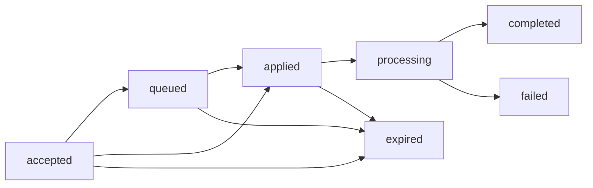

# Queue and Steer Ingress (Proposed v1)

Status: **Proposed** for [issue #71](https://github.com/beeblastco/broods/issues/71).

This decision defines one concurrency contract for direct HTTP, async HTTP,
WebSocket, and channel ingress. It is a contract for later implementation, not a
description of behavior already available.

## Context

Broods currently serializes work with a per-conversation lease. A busy direct
SSE request is rejected with `409`; an async request can be accepted and later
fail as busy. Channel messages use a transactional pending buffer and are
collected into the next turn. The WebSocket gateway permits one active execute
message per socket, and its `cancel` frame only stops gateway-side fetch/read
work—it does not abort the core run.

The v1 goal is to make those concurrency choices explicit and consistent while
preserving current defaults. It is not to add distributed cancellation.

## Decision

### Steering is not interruption

`steer` means **boundary steering**: add accepted input after the current AI SDK
step (including its complete in-flight tool batch) and before the next model
call. It never stops a model call or tool that is already running.

Hard interrupt, abort, and distributed cancellation are separate semantics and
are out of issue #71 v1. They require their own ownership, tool cleanup,
persistence, billing, and terminal-state contract before the public API can
claim that a core run was cancelled. The current gateway-side `cancel` behavior
must not be redefined as core cancellation.

### Public modes

Every ingress surface uses the same four modes:

| Mode       | Busy-conversation behavior                                                                           |
| ---------- | ---------------------------------------------------------------------------------------------------- |
| `reject`   | Do not accept or persist the envelope; return a conflict/error.                                      |
| `followup` | Persist one FIFO envelope that becomes its own turn after earlier work.                              |
| `collect`  | Persist FIFO, then combine all envelopes available at the atomic drain cutoff into one next turn.    |
| `steer`    | Offer the envelope at the next AI SDK step boundary; fall back to `followup` if no boundary remains. |

Defaults stay compatible during the initial rollout:

- direct sync and async HTTP use `reject` when `mode` is omitted;
- channel messages use `collect` when no channel/conversation preference exists;
- WebSocket execute retains direct-like `reject` behavior until the client sends
  an explicit mode.

`collect` is a real public mode, not an undocumented channel optimization.
Collection preserves envelope and event order and records every contributing
event ID even though the model sees one combined turn.

### Transport-neutral ingress envelope

Authentication and transport parsing produce one durable envelope before any
mode-specific coordination:

```ts
interface IngressEnvelope {
  eventId: string;
  conversationKey: string;
  events: ModelMessage[];
  requestedMode: "reject" | "followup" | "collect" | "steer";
  appliedMode?: "followup" | "collect" | "steer";
  appliedToEventId?: string;
  delivery: {
    kind: "http" | "async" | "websocket" | "channel";
    statusUrl?: string;
    connectionId?: string;
    channel?: string;
  };
  status:
    | "accepted"
    | "queued"
    | "applied"
    | "processing"
    | "completed"
    | "failed"
    | "expired";
  idempotency: {
    key: string;
    scope: "account-agent-conversation";
  };
  createdAt: string;
  expiresAt: string;
}
```

The stored record also carries server-derived `accountId` and `agentId`; clients
cannot select or override them. The idempotency identity is the scoped tuple of
account, agent, conversation, and idempotency key. `eventId` remains the public
correlation ID. Repeating the same identity returns the existing envelope/status
and never creates a second turn.

`delivery` contains routing identifiers only. Provider credentials, bearer
tokens, request headers, message payload copies, and other secrets are never
stored as delivery metadata.

### Durable FIFO, bounds, and recovery

Accepted busy ingress is stored as individual FIFO envelopes, not an untyped
array on the lease row. Ordering is by a transactionally assigned conversation
sequence, with `(createdAt, eventId)` only as a diagnostic tie-breaker.

Initial limits are configurable, with conservative defaults of 100 queued
envelopes and 1 MiB of serialized queued events per conversation. Acceptance is
atomic: an envelope is either durably inserted with a status record or rejected.
Overflow returns a visible capacity error (`429` is recommended) and never drops
the oldest or newest item silently.

Queued envelopes expire 15 minutes after acceptance by default, matching the
current conversation-lease window. Status records remain pollable for seven days.
Expiry transitions the envelope to terminal `expired`; it does not simply delete
evidence that accepted work was lost.

After a process crash, the durable lease expires and a coordinator reclaims the
conversation, marks elapsed envelopes `expired`, and resumes the remaining FIFO.
The claimant must use compare-and-set ownership so two recovering workers cannot
apply the same envelope. A failed owner releases or times out its lease; it must
not leave an accepted envelope permanently `accepted`, `queued`, `applied`, or
`processing`.



Every accepted async ingress therefore reaches `completed`, `failed`, or
`expired`. Each status record includes `requestedMode`, the actual `appliedMode`,
and `appliedToEventId`. A `steer` that misses its boundary records
`requestedMode: "steer"`, `appliedMode: "followup"`, and the event ID of the
follow-up turn.

### AI SDK boundary

The only v1 steering injection point is the AI SDK `prepareStep` boundary. The
coordinator checks for steering envelopes after `onStepEnd` has observed all tool
results from the current step and before the next model call is prepared. It
appends the steered events durably, refreshes the next step's messages/system
context, and records the active event ID in `appliedToEventId`.

No injection occurs inside a model stream or between tool calls in a parallel
tool batch. If the current run has finished, reached its step limit, entered an
approval/terminal path, or otherwise has no next model call, the coordinator
atomically converts the envelope to `followup`.

### HTTP and status

An initial direct request may still own its `200 text/event-stream` response. A
second request that explicitly uses `followup`, `collect`, or `steer` while that
run is active does **not** receive a second SSE stream. Once durably accepted it
returns `202 application/json`:

```json
{
  "eventId": "event-2",
  "conversationKey": "conversation-1",
  "status": "queued",
  "requestedMode": "steer",
  "statusUrl": "/status/event-2"
}
```

Steered model output remains on the active SSE stream because it is part of that
run. `followup` and `collect` work is observable through the status URL; it does
not keep the accepting HTTP connection open. Omitted/explicit `reject` retains
the existing busy conflict behavior and creates no accepted status record.

The existing async endpoint uses the same envelope and status lifecycle. Its
`202` means durable acceptance, never merely that an in-process worker was
scheduled.

### WebSocket control frames

While a run is active, the WebSocket protocol adds correlated control input and
status output. The minimum frame shapes are:

```json
{ "type": "control", "requestId": "r2", "eventId": "event-2", "mode": "steer", "events": [] }
{ "type": "ack", "requestId": "r2", "eventId": "event-2", "status": "queued" }
{ "type": "status", "requestId": "r2", "eventId": "event-2", "status": "applied", "appliedMode": "steer", "appliedToEventId": "event-1" }
```

`requestId` correlates socket frames; `eventId` is the durable idempotency/status
identity. ACK is sent only after durable acceptance. Later status frames mirror
the pollable record. Reconnect/attach must be able to resume status and output
without treating a TCP connection as ownership of the run.

True abort/cancel remains separate from these control frames. Closing a socket or
aborting a gateway fetch only detaches that reader in v1.

### Channel commands

Channels add two transport-neutral commands:

- `/steer <text>` submits one `steer` envelope. When the conversation is idle,
  the text is normal input and starts a normal turn.
- `/queue <mode>` sets the conversation's channel ingress preference to one of
  `reject`, `followup`, `collect`, or `steer`; the default remains `collect`.

`/clear` must participate in the same conversation coordinator. The v1 default
is to reject `/clear` with a retry message while a turn or queued ingress exists,
then clear only while holding the conversation lease. It must never delete
history concurrently with an active turn.

### Authorization and tenant isolation

Ingress authorization completes before envelope creation:

- account secrets retain account/agent ownership checks;
- deployment keys retain project, environment, endpoint, and agent scope;
- channel ingress retains provider-native authentication and the configured
  account/agent route;
- gateway control frames inherit the authenticated socket's deployment scope.

The server derives the scoped conversation key and storage identity. A caller
cannot steer by presenting another tenant's raw conversation key, event ID,
status URL, NATS subject, or connection ID. Status reads and idempotent retries
repeat the same authorization checks.

### Payload-free observability

Metrics, logs, and traces may record account/agent IDs, event IDs, a hashed or
encoded conversation identity, requested/applied mode, status, queue depth,
event count, age, boundary latency, fallback reason, and
`appliedToEventId`. They must not record message contents, tool inputs/results,
system prompts, authorization values, channel credentials, delivery secrets, or
raw request headers.

## Implementation sequence

Implement the contract in this dependency order:

1. Durable Convex envelope, FIFO, idempotency, lease, and status primitives.
2. Core conversation coordinator and AI SDK step-boundary steering.
3. Direct/async HTTP behavior, then SDK types/client and OpenAPI.
4. Gateway attach/control plus WebSocket ACK/status frames.
5. Channel `/steer`, `/queue`, and lease-safe `/clear` commands.
6. Cross-transport integration tests and user/operations documentation.

Do not implement [issue #95](https://github.com/beeblastco/broods/issues/95) in
parallel. Its per-subagent WebSocket attach and JetStream lifecycle must first be
made compatible with this decision's attach/control correlation, durable status,
subject ownership, replay, and purge rules. Otherwise the two issues can encode
incompatible meanings for attach, completion, and stream retention.

## Consequences

- Accepted work becomes durable, bounded, observable, and idempotent across all
  transports.
- Steering is predictable because it cannot split a model call or tool batch.
- Existing direct and channel defaults remain stable while clients opt into new
  modes.
- Hard cancellation remains visibly unsupported instead of being approximated by
  disconnecting a gateway reader.
- The implementation requires a coordinator and durable status transitions
  before transport-specific features can ship.

There are no unresolved v1 decision blockers. Queue limits and TTLs are
configuration values, but the defaults above are sufficient for implementation
and can be tuned from production evidence without changing the public contract.
