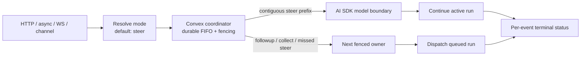

# Queue and Steer Ingress (v1)

Status: **Accepted and implemented** for [issue #71](https://github.com/beeblastco/broods/issues/71).

This decision defines one concurrency contract for direct HTTP, async HTTP,
WebSocket, and channel ingress.

## How to use it

If you only want to _use_ queue and steer, this section is enough; the rest of
the page is the architecture record behind it.

**The one thing to know:** when you send a message to an agent that is already
working, it does not error and it does not silently wait — by default it
**steers**. Your message joins the run in progress at its next natural pause (a
"step boundary," between the model finishing one chunk of work and starting the
next), so the agent keeps everything it has done so far and simply takes your new
instruction into account. If the run has no pause left before it ends, your
message automatically becomes the next turn instead. You never lose a message.

**Send a normal message (steer by default).**

- SDK / HTTP: just send it. On a busy conversation it steers; on an idle one it
  runs immediately. You can be explicit with `mode: "steer"`.
- WebSocket: send a `control` frame while a run is streaming. `mode` is optional
  and defaults to `steer`.
- Channels (Slack, Discord, …): just type. A message sent mid-run steers the run.

**Pile up several messages while it is busy.** Fire off three quick corrections
and they merge into _one_ coherent update rather than three separate turns —
that is the built-in batching of steer (and of `collect`). Order is preserved.

**Queue a message as its own separate turn** instead of joining the live run:

- SDK / HTTP: `mode: "followup"`.
- Channel: `/queue <message>`.

**Stop the run.** Two flavors, pick by how urgent you are:

- Graceful — `/stop` (or `/cancel`) in a channel, or `mode: "followup"`/status
  polling patterns in code. The run halts at its next boundary, finishes the
  in-flight step, settles as stopped, and anything queued behind it starts next.
  A running remote tool is _not_ force-killed.
- Immediate — over WebSocket, send a `cancel` frame (the SDK does this when your
  `AbortSignal` fires, or when you close the socket). This drops the stream now;
  the in-flight step's output is discarded.

**Change the default for a conversation.** In a channel, `/queue reject`,
`/queue followup`, `/queue collect`, or `/queue steer` sets a sticky mode so you
do not have to repeat yourself. (A bare mode word sets the mode; `/queue` with
any other text queues that text as a follow-up.)

**Rule of thumb:** steer when the run is useful but heading the wrong way (you
keep the work); stop when its current output is worthless to you; queue when you
just have more to say and do not need it mid-run.

## Context

Before this change, Broods serialized work with a per-conversation lease. A busy direct
SSE request is rejected with `409`; an async request can be accepted and later
fail as busy. Channel messages use a transactional pending buffer and are
collected into the next turn. The WebSocket gateway permits one active execute
message per socket, and its `cancel` frame only stops gateway-side fetch/read
work—it does not abort the core run.

The v1 goal is to make those concurrency choices explicit and consistent while
the project is still under development. This decision intentionally replaces the
old transport-specific defaults with `steer` everywhere; there is no transition
mode. It does not add distributed cancellation.

## Decision

### Steering is boundary interruption, not abort

`steer` interrupts the active run's current direction at the next safe model
boundary, then continues the same run with the new input. Concretely, it adds
accepted input after the current AI SDK
step (including its complete in-flight tool batch) and before the next model
call. It does not abort a model call or tool that is already running.

Hard interrupt, abort, and distributed cancellation are separate semantics and
are out of issue #71 v1. They require their own ownership, tool cleanup,
persistence, billing, and terminal-state contract before the public API can
claim that a core run was cancelled. The current gateway-side `cancel` behavior
must not be redefined as core cancellation.

### Public modes

Every ingress surface uses the same four modes:

| Mode       | Busy-conversation behavior                                                                           |
| ---------- | ---------------------------------------------------------------------------------------------------- |
| `reject`   | Do not accept or persist the envelope; return a conflict/error.                                      |
| `followup` | Persist one FIFO envelope that becomes its own turn after earlier work.                              |
| `collect`  | Persist FIFO, then combine all envelopes available at the atomic drain cutoff into one next turn.    |
| `steer`    | Offer the envelope at the next AI SDK step boundary; fall back to `followup` if no boundary remains. |

Direct sync HTTP, async HTTP, WebSocket execute/control, and ordinary channel
messages all resolve an omitted mode to `steer`. Callers opt into `reject`,
`followup`, or `collect` explicitly. Channel `/queue <message>` is the explicit
one-message `followup` form.

`collect` is a real public mode, not an undocumented channel optimization.
Collection preserves envelope and event order even though the model sees one
combined turn. Each contributing envelope keeps its own durable status, and the
application relation records the ordered contributor event IDs.

### Transport-neutral ingress envelope

Authentication and transport parsing first produce an in-memory candidate.
Parsing does not persist anything. The conversation coordinator resolves the
explicit or default mode and persists an envelope only when it authorizes
acceptance. A busy `reject` candidate is discarded without an envelope or status
row.

```ts
type IngressMode = "reject" | "followup" | "collect" | "steer";

interface IngressCandidate {
  eventId: string;
  conversationKey: string;
  events: ModelMessage[];
  requestedMode?: IngressMode;
  idempotencyKey: string;
  delivery: {
    kind: "http" | "async" | "websocket" | "channel";
    statusUrl?: string;
    connectionId?: string;
    channel?: string;
  };
}

interface IngressEnvelope extends Omit<IngressCandidate, "requestedMode"> {
  requestedMode: IngressMode;
  applicationId?: string;
  ownerGeneration?: number;
  status:
    | "accepted"
    | "queued"
    | "applied"
    | "processing"
    | "completed"
    | "failed"
    | "expired";
  idempotency: {
    identity: string;
    payloadDigest: string;
  };
  createdAt: string;
  expiresAt: string;
}

interface IngressApplication {
  applicationId: string;
  appliedMode: IngressMode;
  appliedToEventId: string;
  contributingEventIds: string[];
  ownerGeneration: number;
}
```

`requestedMode` on the persisted envelope contains either the client's explicit
selection or the resolved `steer` default.

The stored record also carries server-derived `accountId` and `agentId`; clients
cannot select or override them. One canonical idempotency identity is used on
every transport:

```text
(accountId, agentId, scopedConversationKey, idempotencyKey)
```

Clients may provide `idempotencyKey`; otherwise it defaults to `eventId`.
`eventId` remains the public correlation ID and is not a second idempotency
identity. First acceptance binds the canonical identity to its `eventId`, payload
digest, envelope, and status. A retry with the same identity and digest returns
that existing `eventId` and status; the same identity with a different digest is
a conflict.

The identity binding/tombstone is retained for at least the same seven-day
window as the status row, including after `completed`, `failed`, or `expired`.
Expiry of a queued envelope therefore does not reopen its identity for duplicate
execution. A rejected candidate has no binding because it was never accepted.

`delivery` contains routing identifiers only. Provider credentials, bearer
tokens, request headers, message payload copies, and other secrets are never
stored as delivery metadata.

### Durable FIFO, bounds, and recovery

Accepted busy ingress is stored as individual FIFO envelopes, not an untyped
array on the lease row. Ordering is by a transactionally assigned conversation
sequence, with `(createdAt, eventId)` only as a diagnostic tie-breaker.

`collect` never replaces its source envelopes. At the atomic drain cutoff, the
coordinator creates one `IngressApplication` whose ordered
`contributingEventIds` contains every source `eventId`, and links each envelope
to it. Every source status then transitions independently through
`applied`/`processing` to the same terminal outcome, preserving per-request
polling, replay, and audit provenance.

Steering uses the same ordered grouping rule at a live model boundary: only the
contiguous `steer` prefix at the head of the FIFO is combined and injected. A
`followup` or `collect` ahead of a later steer is never skipped. If the active
run has no next model call, that same contiguous steer prefix becomes one
follow-up application while every contributor retains its own status.

Initial limits are configurable, with conservative defaults of 100 queued
envelopes and 1 MiB of serialized queued events per conversation. Acceptance is
atomic: an envelope is either durably inserted with a status record or rejected.
Overflow returns a visible capacity error (`429` is recommended) and never drops
the oldest or newest item silently.

Queued envelopes expire 15 minutes after acceptance by default, matching the
current conversation-lease window. Status records remain pollable for seven days.
Expiry transitions the envelope to terminal `expired`; it does not simply delete
evidence that accepted work was lost.

Every lease acquisition or recovery atomically increments a monotonic
per-conversation `ownerGeneration` and returns it as a fencing token. The
generation survives lease deletion. The owner must renew the lease, and every
dequeue/application, conversation-history write, status transition, result
commit, and lease release includes the token and fails unless it still matches
the current generation. Stream publication and channel replies revalidate the
same token immediately before the external side effect.

The runtime revalidates the current generation immediately before starting a
tool or externally visible channel reply. Conversation writes, terminal results,
dequeue/application, and releases are transactional fenced mutations. An
external call already in flight when ownership changes cannot be revoked, but
its stale result and follow-on writes are rejected; true remote abort remains
outside v1. Channel/provider delivery remains best-effort and must use the
provider's idempotency metadata when that surface supports it.

After a process crash, maintenance marks elapsed work `expired`. When a new
event arrives on a conversation whose owner lease expired with work still
queued, admission first promotes the oldest queued group to the new owner
generation and schedules it, and the new arrival queues behind it — recovery
preserves FIFO order rather than letting the newcomer jump the queue. Stale
workers cannot apply an envelope or commit outputs after recovery.

Each envelope durably carries its own request execution context — the resolved
agent config (including per-run `model` overrides) and one-turn `system`
messages — and its payload digest covers them. A queued request therefore runs
with exactly its own overrides when it later reaches a boundary, and never
inherits the previous owner's. A failed owner releases or times out its lease without
leaving accepted work permanently `accepted`, `queued`, `applied`, or
`processing`.



Every accepted async ingress therefore reaches `completed`, `failed`, or
`expired`. Each status record includes `requestedMode`, the actual `appliedMode`,
and `appliedToEventId` from its envelope/application record. A `steer` that misses
its boundary records `requestedMode: "steer"`, `appliedMode: "followup"`, and the
event ID of the follow-up turn.

An idle request records its immediately applied policy and its own event ID. An
idle `steer` records `appliedMode: "followup"` because there is no active run to
steer; it starts a normal turn.

### AI SDK boundary

The only v1 steering injection point is the AI SDK `prepareStep` boundary. The
coordinator checks the contiguous FIFO steer prefix after `onStepEnd` has
observed all tool results from the current step and before the next model call is
prepared. It appends those steered events durably, refreshes the next step's
messages/system context, and records the active event ID in `appliedToEventId`.

No injection occurs inside a model stream or between tool calls in a parallel
tool batch. If the current run has finished, reached its step limit, entered an
approval/terminal path, or otherwise has no next model call, the coordinator
atomically converts the envelope to `followup`.

This matches the AI SDK contract: [`prepareStep`](https://ai-sdk.dev/docs/reference/ai-sdk-core/stream-text)
runs before a step and may replace the step's messages, while completed tool
results are included in the messages for the following step. The SDK's
[`onStepFinish`](https://ai-sdk.dev/docs/ai-sdk-core/tools-and-tool-calling#onstepfinish-callback)
fires only after the step's text, tool calls, and tool results are available.

### HTTP and status

An initial direct request may still own its `200 text/event-stream` response. A
second request using `followup`, `collect`, or `steer` (including omitted mode's
`steer` default) while that run is active does **not** receive a second SSE
stream. Once durably accepted it returns `202 application/json`:

```json
{
  "eventId": "event-2",
  "conversationKey": "conversation-1",
  "status": "queued",
  "requestedMode": "steer",
  "statusUrl": "/status/event-2"
}
```

Steered model output remains on the active SSE stream because it is part of that
run. `followup` and `collect` work is observable through the status URL; it does
not keep the accepting HTTP connection open. For direct sync HTTP, omitted
`mode` means `steer`; only explicit `reject` returns the busy conflict without
creating an accepted status record.

Async HTTP uses the same coordinator contract. Omitted `mode` resolves to
`steer`, so a busy request is durably queued for the next boundary rather than
accepted and later failed as busy. Any accepted async request returns `202` only
after durable acceptance; `202` never means merely that an in-process worker was
scheduled.

### WebSocket control frames

While a run is active, the WebSocket protocol adds correlated control input and
status output. The minimum frame shapes are:

```json
{ "type": "control", "requestId": "r2", "eventId": "event-2", "idempotencyKey": "client-op-2", "events": [] }
{ "type": "ack", "requestId": "r2", "eventId": "event-2", "status": "queued" }
{ "type": "status", "requestId": "r2", "eventId": "event-2", "status": "applied", "appliedMode": "steer", "appliedToEventId": "event-1" }
```

Omitted `mode` on `execute` or `control` means `steer`. `requestId` correlates
frames on one socket only. `idempotencyKey` participates
in the canonical identity defined above and defaults to `eventId`; `eventId`
correlates the durable envelope/status. ACK is sent only after durable
acceptance. Later status frames mirror the pollable record.

Convex/core owns admission and status truth. The gateway owns only delivery of
the correlated ACK/status frames: it emits ACK after core returns durable
acceptance and obtains later transitions from the authenticated status route.
JetStream output, an open socket, and gateway polling are never evidence of
acceptance by themselves.

#### Attach and output replay

A reconnecting client attaches to one active event with the last output cursor
it fully processed:

```json
{ "type": "attach", "requestId": "a1", "agentId": "agent-1", "conversationKey": "conversation-1", "eventId": "event-1", "afterCursor": "ws-responses:4:1234" }
{ "type": "attached", "requestId": "a1", "eventId": "event-1", "status": "processing", "replayFromCursor": "ws-responses:4:1235", "replayThroughCursor": "ws-responses:4:1270" }
{ "type": "output", "eventId": "event-1", "cursor": "ws-responses:4:1235", "replay": true, "data": { "type": "text-delta", "text": "..." } }
```

The cursor is opaque to clients. It encodes the JetStream stream generation,
the global `JsMsg.seq`, and a binding to its originating event, so a cursor can
never resume a different event's stream; the publisher-local
`NatsStreamEvent.sequence` is not a resume cursor because it resets for each
publisher. `afterCursor` is exclusive: the first delivered frame has the next
retained JetStream sequence. The client advances its cursor only after it has
processed the complete `output` frame.

The SDK unwraps `output` envelopes before delivery: `onMessage` and `stream()`
receive the inner stream part directly (`message.type === "text-delta"`), and
the optional `onOutput` handler receives the raw envelope for clients that
persist cursors for attach-based resume. The wire protocol above is what a
bare WebSocket client sees.

After authorization, the gateway creates one ordered JetStream consumer starting
at `afterCursor + 1` and snapshots the current high-water mark as
`replayThroughCursor`. Frames through that inclusive boundary carry
`replay: true`; later frames from the same consumer carry `replay: false`. This
single replay-then-tail consumer prevents a gap between replay and live output.
When `afterCursor` is omitted, replay begins at the earliest retained frame for
the target `eventId`. The gateway filters the conversation-scoped stream by the
event ID in the NATS envelope headers.

If the cursor's stream generation is stale, the cursor is bound to a different
event, the cursor sequence is beyond the subject's last retained message (a
future cursor), or the message at the cursor sequence is no longer retained for
the conversation subject (its replay tail may have gaps), attach returns
`replay_unavailable` with the latest durable status and `statusUrl`; it never
silently skips a gap.

A busy WebSocket `execute` that is durably queued (`followup`, `collect`, or
`steer`) receives its ACK and then stays live: the gateway streams the queued
event's output once it reaches a runnable boundary and polls its durable status,
always closing the client stream with a terminal `done` or `error` frame. A bare
ACK is never the final frame. On terminal status, the
conversation output may already have expired, so reconnect returns the terminal
status/result rather than recreating token-by-token output. An attached socket
does not own the run, and status remains pollable for seven days independently
of JetStream's short output-retention window.

There is no manual event- or conversation-level purge in v1. The
conversation-scoped `WS_RESPONSES` subject can contain output for overlapping or
sequential FIFO work, so one terminal event must never erase another event's
replay range. JetStream limits retention automatically by `max_age` (three
minutes) and `max_msgs_per_subject` (2,000); Convex status and idempotency records
remain for seven days and are the durable source of truth after output expires.

True abort/cancel remains separate from these control frames. Closing a socket or
aborting a gateway fetch only detaches that reader in v1.

### Channel commands

Channels use the same coordinator and add transport-neutral commands:

- `/steer <text>` submits one `steer` envelope. When the conversation is idle,
  the text is normal input and starts a normal turn.
- `/queue <text>` submits one explicit `followup` envelope. It never changes a
  sticky conversation mode.
- `/stop` and `/cancel` request that the current owner stop at the next safe model
  boundary. The in-flight model/tool batch completes; the request does not kill
  a remote tool. The owner then settles `failed` with a stopped-by-user reason,
  and queued work is promoted normally under a new fencing generation. The
  settled status carries `stoppedByUser: true`, so a deliberate stop is
  distinguishable from a genuine failure even though both are terminal `failed`.

`/clear` must participate in the same conversation coordinator. The v1 default
is to reject `/clear` with a retry message while a turn or queued ingress exists,
then clear only while holding the conversation lease. It must never delete
history concurrently with an active turn.

### Authorization and tenant isolation

Ingress authorization completes before envelope creation:

- account secrets retain account/agent ownership checks;
- deployment keys retain project, environment, endpoint, and agent scope;
- channel ingress retains provider-native authentication and the configured
  account/agent route;
- gateway control frames inherit the authenticated socket's deployment scope.

The server derives the scoped conversation key and storage identity. A caller
cannot steer by presenting another tenant's raw conversation key, event ID,
status URL, NATS subject, or connection ID. Status reads and idempotent retries
repeat the same authorization checks.

An environment runtime/deployment key is resolved server-side to its account,
project, environment, endpoint, and agent. The HTTP path must match that scope;
WebSocket control and attach inherit the already-authenticated socket scope.
Neither payload can replace the derived account or redirect work to another
deployment.

### Subagents and public status

Steering and boundary stop target exactly one conversation owner. They do not
broadcast into child subagents already dispatched by the parent. Ephemeral and
persistent subagent runs keep their own event/result lifecycle; a persistent
child conversation can be steered only through ingress addressed and authorized
for that child agent/conversation. Stopping the parent waits boundedly for
already-running children to finalize their own status, but does not hard-cancel
them or inject their late result into another parent model step.

With `subagent.streamEvents: true`, a child also publishes model/tool stream
parts on the existing `WS_RESPONSES` subject derived from its authenticated
account, child `agentId`, and returned public `conversationKey`. The
`run_subagent` result's `taskId` is the attach `eventId`, so attach/control
correlation and the event-hash cursor binding remain unchanged. One ordered
consumer replays retained child frames and then tails live output without a
handoff gap. A publisher `done` part is only a delivery marker: the existing
subagent runtime status/result is still the durable terminal truth, including
after the short JetStream retention window expires.

Deployment-key attach authorization is parent-bound. The opaque server-issued
child `taskId` correlates to the parent ingress event, while the exact child
async-result row proves the task was created by the runtime. Core authorizes the
status read only after the child event/conversation scope, durable parent ingress
status, active public parent, and authenticated account/project/environment/
endpoint deployment all match. The gateway then checks the returned conversation
key before selecting the NATS subject. Virtual and predefined private children
therefore remain non-runnable through the public endpoint, and no client-asserted
parent field is trusted.

`IngressStatus` describes durable ingress (`accepted`, `queued`, `applied`,
`processing`, `completed`, `failed`, or `expired`). The public status response
may additionally report `awaiting_approval` from the async execution record and
include `approvals`. `requestedMode` is present for coordinated ingress; it is
optional only for independently owned records such as a subagent result that did
not enter through the public ingress FIFO. A `failed` status caused by `/stop`
also carries `stoppedByUser: true`, letting callers tell a deliberate stop apart
from a fault without adding a separate terminal state.

### Payload-free observability

Metrics, logs, and traces may record account/agent IDs, event IDs, a hashed or
encoded conversation identity, requested/applied mode, status, queue depth,
event count, age, boundary latency, fallback reason, and
`appliedToEventId`. They must not record message contents, tool inputs/results,
system prompts, authorization values, channel credentials, delivery secrets,
idempotency keys/identities, or raw request headers.

## Implementation sequence

The implementation follows this dependency order:

1. Durable Convex envelope, FIFO, idempotency, lease, status, and owner-fencing
   primitives.
2. Core conversation coordinator and AI SDK step-boundary steering.
3. Direct/async HTTP behavior, then SDK types/client and OpenAPI.
4. Gateway attach/control plus WebSocket ACK/status frames.
5. Channel `/steer`, `/queue`, `/stop`/`/cancel`, and lease-safe `/clear`
   commands.
6. Cross-transport integration tests and user/operations documentation.

[Issue #95](https://github.com/beeblastco/broods/issues/95) builds per-subagent
streaming on the same attach/control correlation, durable status, subject
ownership, replay, and retention rules; it does not introduce a second gateway
protocol or terminal-state source.

## Consequences

- Accepted work becomes durable, bounded, observable, and idempotent across all
  transports.
- Steering is predictable because it cannot split a model call or tool batch.
- Direct sync, async, WebSocket, and channel ingress share the `steer` default.
- Busy async omission becomes durable boundary steering; the development
  contract has no transition mode.
- Hard cancellation remains visibly unsupported instead of being approximated by
  disconnecting a gateway reader.
- Transport-specific behavior is layered on the durable coordinator and status
  transitions rather than maintaining separate in-memory queues.

There are no unresolved v1 decision blockers. Queue limits and TTLs are
configuration values, but the defaults above are sufficient for implementation
and can be tuned from production evidence without changing the public contract.
