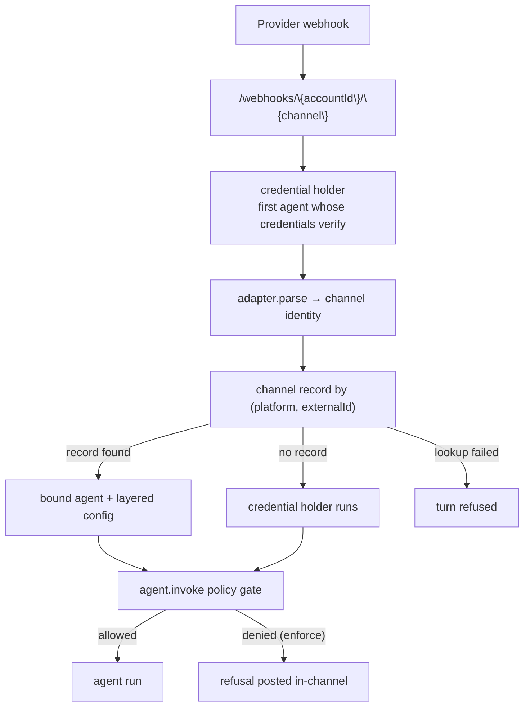

# Channel Records

A channel record is one account-scoped row per real place a team talks — a Slack
channel, a Discord channel, a repository. It binds that place to an agent and
carries the instructions, workspaces, policies and roles scoped to it.

This is different from `config.channels` on an agent, which holds one adapter's
credentials. Credentials say _how to reach Slack_; a channel record says _who
answers in #product-eng, and with what_.

Without a record, one provider app reaches exactly one agent. With records, one
Slack install can drive a different agent in every channel.

## Routing

There is one webhook shape:

```bash
{BROODS_BASE_URL}/webhooks/{accountId}/{channel}
```

The URL names no agent. Whichever of the account's agents holds credentials
that verify the request is the **credential holder**. Its adapter parses the
request and sends the reply, because the reply must come from the app that
received it. The record then decides who runs.

If two agents share one provider app, both verify, and the lower agent id
receives the request — the order is fixed so it cannot vary between requests,
and the run is logged. That tie is what a channel record is for; do not rely on
which agent wins it.



A lookup that finds nothing falls back to the credential holder, so an
unregistered channel behaves exactly as it did before records existed.

A lookup that **fails** is different: the turn is refused rather than run,
because executing without a record's policies and `denyTools` would be an
escalation. The channel path already needs the control plane to admit ingress,
so this costs no availability that is not already lost.

## Layering

A record **narrows and adds**. It never grants capability the agent lacks, so
reading an agent still tells you its ceiling.

| Field            | Effect                                                            |
| ---------------- | ----------------------------------------------------------------- |
| `instructions`   | Appended after the agent's own system prompt                      |
| `workspaces`     | Selects from the agent's own; one it does not attach is ignored   |
| `policyIds`      | Unioned with the agent's                                          |
| `policyMode`     | Enforcement stage here — `audit` watches a rule before it refuses |
| `denyTools`      | Withholds tools here, after the set is built — covers `bash` too  |
| `partition` | Overrides the channel's scope (`channel` or `conversation`)       |
| `threadPolicy`   | Where the reply lands — `always-thread` or `inline` (Slack only)  |
| `sandboxImages`  | Images the agent may stand a sandbox up from for a thread here    |
| `tagRoles`       | Named groups of people, readable from policy as `actorRoles`      |

Provider, model and credentials stay on the agent and are never touched.

A workspace is capability, not configuration: attaching one is what materialises
the sandbox file tools. So a record may only name a workspace the agent already
attaches — it can mount that workspace under a channel-specific name, but a
`workspaceId` the agent does not carry is dropped and logged.

`threadPolicy` decides where the answer appears. `always-thread` opens a thread
on the message that tagged the agent, so the whole exchange stays out of the
channel; `inline` answers in the channel, and threads only when the message
itself arrived in a thread. It applies to Slack alone — every other provider
delivers the reply to the one place the message came from, so there is no
choice to express. Unset, a Slack reply threads in a channel and stays inline
in a DM.

`denyTools` is applied to the finished tool set rather than to `config.tools`,
so it reaches every tool the agent ended up with: built-ins, [custom
tools](../tools.md) by their model-facing name, and sandbox tools such as `bash`
and `read` — the last of which are derived from the attached workspaces and
never appear in `config.tools` at all. Naming a tool the agent does not have is
ignored.

## Creating a record

In code, a channel names the connection it belongs to and the agents that answer in it. `platform` is taken from the connection, so it is never written by hand, and the connection's credentials never follow the channel onto the record.

```ts title="broods/index.ts"
import {
  defineAgent,
  defineSlackChannel,
  defineSlackConnection,
  env,
} from "broods";

export const slackApp = defineSlackConnection({
  botToken: env("SLACK_BOT_TOKEN"),
  signingSecret: env("SLACK_SIGNING_SECRET"),
});

export const nhi = defineAgent({ name: "nhi", connections: [slackApp] });
export const scribe = defineAgent({ name: "scribe" });

export const productEng = defineSlackChannel({
  name: "product-eng",
  connection: slackApp,
  channelId: "C042PRODENG",
  teamId: "T09BEEBLAST",
  agents: [nhi, { agent: scribe, reply: false }],
  instructions: "Escalate billing questions to #finance.",
  threadPolicy: "always-thread",
});
```

Every agent in `agents` runs when a message arrives. `reply: false` runs one with a silenced channel, so it can work without speaking in the room. Omit `agents` entirely and the connection's own agent answers.

Nothing points back at a channel — the connection does not list its channels, and the agent does not either. That is what lets a channel name its own app's agent without a circular reference.

The per-platform id field is named for what the provider calls it: `channelId` for Slack and Discord, `repo` for GitHub, `chatId` for Telegram and Zalo, `conversationId` for Pancake. All of them are stored as `externalId`.

### Through the account API


```ts
import { BroodsAccountClient } from "broods/account";

const client = new BroodsAccountClient();

await client.createChannel({
  platform: "slack",
  externalId: "C042PRODENG",
  workspaceRef: "T09BEEBLAST",
  name: "#product-eng",
  config: {
    agentBindings: [{ agentId: "agent_nhi", isDefault: true }],
    instructions: "Escalate billing questions to #finance.",
    // `agent_nhi` must already attach ws_incidents; this mounts it as "incidents" here.
    workspaces: [{ name: "incidents", workspaceId: "ws_incidents" }],
    workspaceScope: { alias: "eng", level: "conversation" },
    threadPolicy: "always-thread",
    policyIds: ["policy_prod_data"],
    policyMode: "audit",
    tagRoles: [{ roleId: "oncall", actorIds: ["U777", "U778"] }],
  },
});
```

One active record per `(platform, externalId)`; creating a second for the same
place is rejected so the webhook lookup stays unambiguous.

## Access control

Two things become expressible once a record exists.

**Who may tag the agent here.** `agent.invoke` is evaluated before the turn
starts, so a refusal costs nothing and reads like a sentence in the channel
rather than a stack trace. In `audit` mode the same decision is logged and the
turn still runs — that is how a rule is rolled out on a live channel.

**What it may reach here.** `tagRoles` become `actorRoles` on the policy input,
alongside `channelId`, `threadId`, `actorId` and `actorName`. A rule can then
say "production data only in #ops, and only for the on-call group":

```json
{
  "version": 1,
  "rules": [
    {
      "id": "prod-data-ops-only",
      "effect": "deny",
      "actions": ["tool.call"],
      "resources": { "toolNames": ["query_prod_db"] },
      "conditions": [
        { "attribute": "actorRoles", "operator": "notIn", "value": ["oncall"] }
      ]
    }
  ]
}
```

See the `AgentPolicyDocument` schema in the [API Reference](/api-reference) for
the full policy contract and the attributes a condition may read.
