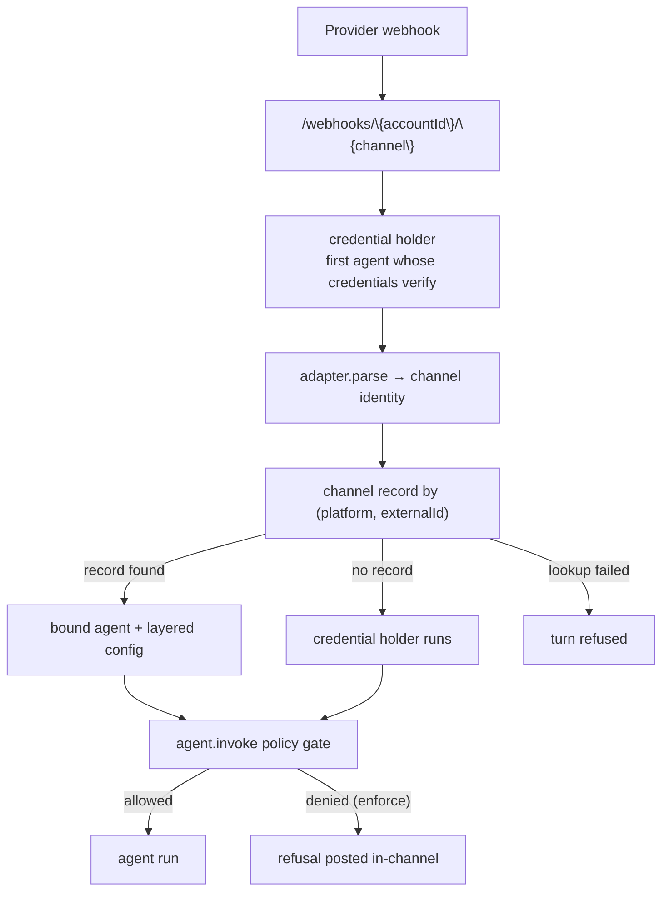

# Channel Records

A channel record is one account-scoped row per real place a team talks — a Slack
channel, a Discord channel, a repository. It binds that place to an agent and
carries the instructions, workspaces, policies and roles scoped to it.

This is different from `config.channels` on an agent, which holds one adapter's
credentials. Credentials say _how to reach Slack_; a channel record says _who
answers in #product-eng, and with what_.

Without a record, one provider app reaches exactly one agent. With records, one
Slack install can drive a different agent in every channel.

## Routing

Two webhook shapes are supported:

```bash
{BROODS_BASE_URL}/webhooks/{accountId}/{agentId}/{channel}   # agent pinned in the URL
{BROODS_BASE_URL}/webhooks/{accountId}/{channel}             # channel record chooses the agent
```

On the account-scoped path, whichever of the account's agents holds credentials
that verify the request is the **credential holder**. Its adapter parses the
request and sends the reply, because the reply must come from the app that
received it. The record then decides who runs.



Both paths honour records, and a lookup that finds nothing falls back — to the
agent named in the URL on the agent-scoped path, or to the credential holder on
the account-scoped one. An unregistered channel therefore behaves exactly as it
did before records existed.

A lookup that **fails** is different: the turn is refused rather than run,
because executing without a record's policies and `denyTools` would be an
escalation. The channel path already needs the control plane to admit ingress,
so this costs no availability that is not already lost.

## Layering

A record **narrows and adds**. It never grants capability the agent lacks, so
reading an agent still tells you its ceiling.

| Field            | Effect                                                            |
| ---------------- | ----------------------------------------------------------------- |
| `instructions`   | Appended after the agent's own system prompt                      |
| `workspaces`     | Unioned; the agent's own ref wins on a mount-name clash           |
| `policyIds`      | Unioned with the agent's                                          |
| `policyMode`     | Enforcement stage here — `audit` watches a rule before it refuses |
| `denyTools`      | Withholds tools here, after the set is built — covers `bash` too  |
| `workspaceScope` | Overrides the channel's scope (`channel` or `conversation`)       |
| `threadPolicy`   | `always-thread` or `inline`                                       |
| `sandboxImages`  | Images the agent may stand a sandbox up from for a thread here    |
| `tagRoles`       | Named groups of people, readable from policy as `actorRoles`      |

Provider, model and credentials stay on the agent and are never touched.

`denyTools` is applied to the finished tool set rather than to `config.tools`,
so it can withhold sandbox tools such as `bash` and `read` — which are derived
from the attached workspaces and never appear in `config.tools`. Naming a tool
the agent does not have is ignored.

## Creating a record

```ts
import { BroodsAccountClient } from "broods/account";

const client = new BroodsAccountClient();

await client.createChannel({
  platform: "slack",
  externalId: "C042PRODENG",
  workspaceRef: "T09BEEBLAST",
  name: "#product-eng",
  config: {
    agentBindings: [{ agentId: "agent_nhi", isDefault: true }],
    instructions: "Escalate billing questions to #finance.",
    workspaces: [{ name: "incidents", workspaceId: "ws_incidents" }],
    workspaceScope: { alias: "eng", level: "conversation" },
    threadPolicy: "always-thread",
    policyIds: ["policy_prod_data"],
    policyMode: "audit",
    tagRoles: [{ roleId: "oncall", actorIds: ["U777", "U778"] }],
  },
});
```

One active record per `(platform, externalId)`; creating a second for the same
place is rejected so the webhook lookup stays unambiguous.

## Access control

Two things become expressible once a record exists.

**Who may tag the agent here.** `agent.invoke` is evaluated before the turn
starts, so a refusal costs nothing and reads like a sentence in the channel
rather than a stack trace. In `audit` mode the same decision is logged and the
turn still runs — that is how a rule is rolled out on a live channel.

**What it may reach here.** `tagRoles` become `actorRoles` on the policy input,
alongside `channelId`, `threadId`, `actorId` and `actorName`. A rule can then
say "production data only in #ops, and only for the on-call group":

```json
{
  "version": 1,
  "rules": [
    {
      "id": "prod-data-ops-only",
      "effect": "deny",
      "actions": ["tool.call"],
      "resources": { "toolNames": ["query_prod_db"] },
      "conditions": [
        { "attribute": "actorRoles", "operator": "notIn", "value": ["oncall"] }
      ]
    }
  ]
}
```

See the `AgentPolicyDocument` schema in the [API Reference](/api-reference) for
the full policy contract and the attributes a condition may read.
