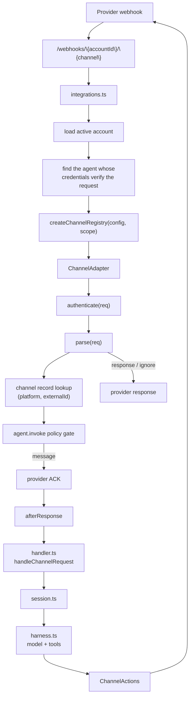
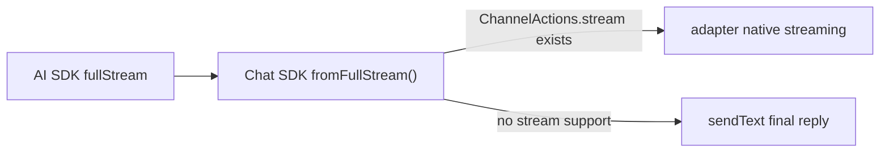

# Channels Reference

Channels are communication integrations such as Telegram, GitHub, Slack, Discord, Pancake, and Zalo. They translate provider webhooks into the shared agent input shape, then send replies through a channel-specific `ChannelActions` implementation.

Slack, Telegram, Discord, and GitHub are built on the Chat SDK adapter packages:

- [`@chat-adapter/slack`](https://www.npmjs.com/package/@chat-adapter/slack)
- [`@chat-adapter/telegram`](https://www.npmjs.com/package/@chat-adapter/telegram)
- [`@chat-adapter/discord`](https://www.npmjs.com/package/@chat-adapter/discord)
- [`@chat-adapter/github`](https://www.npmjs.com/package/@chat-adapter/github)

Use the Chat SDK docs for provider capability details: [Platform Adapters](https://chat-sdk.dev/docs/platform-adapters), [Markdown](https://chat-sdk.dev/docs/api/markdown), [Streaming](https://chat-sdk.dev/docs/streaming), and [Slash Commands](https://chat-sdk.dev/docs/slash-commands). Pancake and Zalo are Broods-native adapters because Chat SDK does not provide those providers.

Customers interact with the provider bot, app, or webhook. They do not receive account secrets. There is one webhook URL, per account and channel:

```bash
{BROODS_BASE_URL}/webhooks/{accountId}/{channel}
```

## Agent Channel Tools

Channel tools are automatic; do not add them to `config.tools`.

| Tool             | Use                                              |
| ---------------- | ------------------------------------------------ |
| `send-message`   | Message another session                          |
| `send-images`    | Send images, from workspace files or public URLs |
| `send-files`     | Send workspace documents                         |
| `send-sticker`   | Send a sticker                                   |
| `send-reactions` | React to a message                               |

`send-message` targets an existing conversation key and runs that session as a follow-up. The other tools appear only when the current channel supports them. `denyTools` can hide any of them.

`send-images` takes `file_paths` for images in an attached workspace, or `urls` for ones already published on the web. `file_paths` appears only when the agent has a workspace attached. Pass a whole set in one call; the channel decides how to group it.

`send-files` takes `file_paths`, a list of workspace documents, and is for anything that is not a picture: PDFs, spreadsheets, text files. Pictures go through `send-images`, because a picture the recipient sees inline and a file they download are different messages.

Sending files requires an attached workspace. A file leaves as a sealed `/media/{ticket}` link minted per workspace and account, and a file written in a bare agent sandbox has no such address, so there is nothing to hand the provider. An agent with `sandbox` but no `workspaces` therefore gets no `send-files` at all, and its `send-images` accepts `urls` only. The harness logs a warning naming that cause when it happens, so a run that improvises is traceable to the missing workspace rather than to the model.

The two split at the channel boundary, not in the prompt. A provider declares what it can do by implementing `sendImages` or `sendFiles`, the model only ever names workspace paths, and the adapter spends the batch the way its provider wants. A caption rides the first message only.

Providers disagree on more than grouping: some fetch a URL you hand them, others accept only an upload. The adapter hides that, and a workspace attachment carries both a sealed link and a reader, so each provider takes whichever it needs and the bytes are read only when one actually uploads.

| Channel  | Pictures                          | Documents                        | Batch                       |
| -------- | --------------------------------- | -------------------------------- | --------------------------- |
| Telegram | fetches the URL                   | fetches the URL                  | album of 2-10, then another |
| Slack    | Block Kit image blocks            | uploads bytes (`files.uploadV2`) | one message, one upload     |
| Discord  | uploads bytes                     | uploads bytes                    | one multipart message       |
| Pancake  | uploads bytes (`upload_contents`) | uploads bytes                    | one per message             |
| Zalo     | fetches the URL                   | none                             | one per message             |
| GitHub   | none                              | none                             | text links only             |

Where a provider has no document endpoint at all — Zalo is `sendMessage`, `sendPhoto`, `sendSticker`, `sendChatAction` and nothing else — `send-files` posts the same sealed links as text for the recipient to open, and says so in its tool result so the model does not send them twice.

`send-images` degrades rather than fails. If the channel has no picture endpoint, or accepts the batch and rejects it, the pictures go out through the `send-files` path instead — as documents where the provider has them, as download links where it does not. The reason for the rejection is logged, not shown to the recipient. A channel with neither endpoint does not get the tool at all, since a bare link is what `send-files` is already for.

Chat providers fetch the picture themselves rather than accepting an upload, and they do not all keep a copy: Zalo stores the URL and re-fetches it every time a viewer opens the photo. A workspace file is therefore handed over as a durable `/media/{ticket}` link served by core, not as a presigned S3 URL that would leave a broken image in chat history once it expired. Storage stays private, the sealed ticket is the only credential, and rotating `SERVICE_AUTH_SECRET` revokes every link ever issued.

## Inbound Attachments

Media arriving on a channel is the mirror of the same path. A picture, document,
voice note, video or sticker sent to the agent is read once while the turn runs,
stored in the agent's default workspace under `.inbox/`, and handed to the model
as the same durable `/media/{ticket}` link the outbound tools mint. Nothing is
inlined as base64: the conversation is persisted as JSON, so a link is what
still resolves when the turn is replayed months later.

Parsing never downloads. The webhook is acknowledged first, and only then is the
provider read — a download during parse would hold the provider's connection
open for the length of a video. Each provider's own authentication is used:
Telegram resolves a file id through `getFile` and signs the download with the
bot token, and Slack sends a bearer header, with the host checked before the
token is attached and the auth stripped if a redirect leaves Slack.

| Channel  | Inbound media                                                              |
| -------- | -------------------------------------------------------------------------- |
| Telegram | photos, video, audio, voice notes, documents, video notes, static stickers |
| Slack    | every file on a message, including voice clips                             |
| Discord  | uploads, voice messages, stickers                                          |
| Pancake  | photos and videos                                                          |
| Zalo     | photos, stickers, voice notes                                              |
| GitHub   | none — an image pasted into a comment stays a markdown URL in its text     |

What reaches the model depends on what the provider will read. Pictures always
go over as pictures. Anything else — a PDF, a voice note, a video — goes over as
a native part only where the configured model provider accepts that media type,
and otherwise arrives as a saved workspace file the agent opens with `read` or
`bash`. That keeps a voice note a transcription job rather than a turn the
provider refuses outright. Every message carrying attachments also gets one
short note listing what arrived and where it was stored.

Limits are enforced twice, on the declared size and again on the bytes actually
read: 6 MB for a picture and 25 MB for anything else, the same ceiling the media
route serves at, and at most ten attachments per message. The media type comes
from the bytes rather than the provider's claim — Telegram calls every photo a
JPEG, and Discord labels a voice message `application/ogg` — except where the
sniff only identifies a container, since a `.docx` really is a zip. An
attachment that cannot be read becomes a line of text saying so, so one failed
download costs a picture rather than the message.

An agent with no workspace attached still sees its attachments for the turn they
arrive in, but nothing is stored and the note says so.

The URL names no agent. Whichever of the account's agents holds credentials
that verify the request receives it — that agent's adapter parses the request
and sends the reply, because the reply must come from the app the provider
called. A [channel record](channel-records.md) then binds one real place — a
Slack channel, a Discord channel, a repository — to the agent that should
answer there, so one provider app can drive a different agent per channel. With
no record, the agent whose credentials verified the request answers.

## Runtime Flow



Webhook handling is split deliberately:

- [`src/harness/integrations.ts`](https://github.com/beeblastco/broods/blob/dev/apps/core/src/harness/integrations.ts) owns routing, account/agent lookup, adapter selection, provider ACKs, and normalized channel events.
- [`src/harness/handler.ts`](https://github.com/beeblastco/broods/blob/dev/apps/core/src/harness/handler.ts) owns session setup, command dispatch, agent execution, and final reply handling.
- [`src/shared/channels.ts`](https://github.com/beeblastco/broods/blob/dev/apps/core/src/shared/channels.ts) owns the shared channel contracts.
- `src/shared/<channel>-channel.ts` owns provider-specific authentication, parsing, formatting, and reply API calls.

---

## Supported Channels

| Channel    | Runtime adapter                                                                                                            | Chat SDK package                                                                 | Required config                                                                        | Documentation                   |
| ---------- | -------------------------------------------------------------------------------------------------------------------------- | -------------------------------------------------------------------------------- | -------------------------------------------------------------------------------------- | ------------------------------- |
| `telegram` | [`src/shared/telegram-channel.ts`](https://github.com/beeblastco/broods/blob/dev/apps/core/src/shared/telegram-channel.ts) | [`@chat-adapter/telegram`](https://www.npmjs.com/package/@chat-adapter/telegram) | `botToken`, `webhookSecret` (+ optional `botUsername` for @-mention gating)            | [Telegram Details](telegram.md) |
| `github`   | [`src/shared/github-channel.ts`](https://github.com/beeblastco/broods/blob/dev/apps/core/src/shared/github-channel.ts)     | [`@chat-adapter/github`](https://www.npmjs.com/package/@chat-adapter/github)     | `webhookSecret`, `appId`, `privateKey` (+ optional `botUserName` for @-mention gating) | [GitHub Details](github.md)     |
| `slack`    | [`src/shared/slack-channel.ts`](https://github.com/beeblastco/broods/blob/dev/apps/core/src/shared/slack-channel.ts)       | [`@chat-adapter/slack`](https://www.npmjs.com/package/@chat-adapter/slack)       | `botToken`, `signingSecret`                                                            | [Slack Details](slack.md)       |
| `discord`  | [`src/shared/discord-channel.ts`](https://github.com/beeblastco/broods/blob/dev/apps/core/src/shared/discord-channel.ts)   | [`@chat-adapter/discord`](https://www.npmjs.com/package/@chat-adapter/discord)   | `botToken`, `publicKey`                                                                | [Discord Details](discord.md)   |
| `pancake`  | [`src/shared/pancake-channel.ts`](https://github.com/beeblastco/broods/blob/dev/apps/core/src/shared/pancake-channel.ts)   | Broods-native                                                                    | `pageId`, `pageAccessToken`, `webhookSecret`                                           | [Pancake Details](pancake.md)   |
| `zalo`     | [`src/shared/zalo-channel.ts`](https://github.com/beeblastco/broods/blob/dev/apps/core/src/shared/zalo-channel.ts)         | Broods-native                                                                    | `botToken`, `webhookSecret`                                                            | [Zalo Details](zalo.md)         |

---

## Code-First Configuration

The CLI SDK exposes one constructor per provider. Attach the resulting definitions to one agent; an agent may receive from multiple channel types, while one channel definition cannot be shared by multiple agents.

```ts
import {
  defineAgent,
  defineGitHubChannel,
  defineGitHubConnection,
  defineSlackChannel,
  defineSlackConnection,
  env,
} from "broods";

export const github = defineGitHubConnection({
  appId: env("GITHUB_APP_ID"),
  privateKey: env("GITHUB_PRIVATE_KEY"),
  webhookSecret: env("GITHUB_WEBHOOK_SECRET"),
});

export const slack = defineSlackConnection({
  botToken: env("SLACK_BOT_TOKEN"),
  signingSecret: env("SLACK_SIGNING_SECRET"),
});

export const platform = defineGitHubChannel({
  name: "platform",
  connection: github,
  repo: "owner/repo",
});

export const productEng = defineSlackChannel({
  name: "product-eng",
  connection: slack,
  channelId: "C042PRODENG",
});

export const support = defineAgent({
  name: "support",
  connections: [github, slack],
});
```

A connection answers in the rooms declared against it and nowhere else. One that declares none fails `broods dev` rather than going quiet in production, so set `allowedChannelIds: ["*"]` when you really do mean everywhere. Naming ids in `allowedChannelIds` adds rooms on top of the declared channels, which is worth doing only for a room that needs no rules of its own. `allowedUserIds` narrows the same way by sender, and takes `["*"]` for everyone.

`broods dev` lowers the list to the runtime's keyed `config.channels` shape, syncs referenced environment values, generates `api.channels`, and prints each provider webhook URL. Code-first agent definitions must use connection constructors; keyed channel objects are rejected.

Runnable examples live under `packages/demos/channel-*`. Provider registration is explicit: Telegram, Zalo, and Discord demos include a `register` command; other providers use their administration console.

---

## Shared Channel Behavior

Every channel gets these behaviors from the shared pipeline, not from the adapter:

- **Bot commands** — command-capable channels (Slack, Discord, and Telegram) route supported `/command` input through [`src/shared/commands.ts`](https://github.com/beeblastco/broods/blob/dev/apps/core/src/shared/commands.ts) instead of the agent: `/new` and `/clear` clear the conversation context, and `/help` lists commands. GitHub, Pancake, and Zalo treat slash-looking message text as agent input.
- **Typing + reaction** — an accepted message immediately triggers a fire-and-forget typing indicator and a reaction where the channel supports it. Telegram and Slack reaction emoji are configurable; GitHub uses 👀; Pancake/Zalo are no-op.
- **Tool approval auto-deny** — tools configured with `needsApproval` are automatically denied on channel turns with the reason `Tool approval is only supported through the direct API.`
- **Error replies** — if processing fails, the channel receives `Error: <message>` as the reply.
- **Per-channel config scoping** — a webhook run only sees its own channel's config; other channels' credentials are stripped from the runtime agent config.
- **Deferred replies** — when a turn finishes in the background (detached async tools or sandbox jobs), the final result is pushed back into the originating chat once it settles.
- **Trace links** — channel replies omit the dashboard trace link by default. Set `trace: "enabled"` on a channel definition to include links, without affecting trace collection.
- **Channel records** — a run may be re-targeted to the agent a [channel record](channel-records.md) binds, with that record's instructions, workspaces and policies layered on.
- **Tag gating** — when a policy denies `agent.invoke`, the refusal is posted in-channel and the turn never starts.

---

## Reply Streaming

Channel replies use Chat SDK adapter streaming by default when the channel adapter exposes `stream()`. Slack uses Chat SDK's native Slack streaming API, Telegram private chats use Chat SDK rich draft previews before persisting the final response, and GitHub uses Chat SDK's buffered Markdown comment streaming. Discord uses Chat SDK's final-message adapter methods because its adapter does not expose native streaming yet. Channels without SDK streaming support send one final `sendText` reply.



The provider adapter owns the streaming method and fallback behavior.

Channel markdown formatting is delegated to the Chat SDK adapters for Slack, Telegram, Discord, and GitHub, including Slack response-url text conversion and Telegram MarkdownV2 rendering. See Chat SDK [Markdown](https://chat-sdk.dev/docs/api/markdown) for the cross-platform formatting model. Pancake and Zalo keep their provider-specific text handling because Chat SDK does not cover those providers.

---

## Channel Contract

Each channel implements `ChannelAdapter` from [`src/shared/channels.ts`](https://github.com/beeblastco/broods/blob/dev/apps/core/src/shared/channels.ts):

| Method              | Purpose                                                                   |
| ------------------- | ------------------------------------------------------------------------- |
| `name`              | Stable URL segment and config key, such as `telegram`                     |
| `canHandle(req)`    | Quick provider-shape check, usually based on headers                      |
| `authenticate(req)` | Provider-native signature or secret verification                          |
| `parse(req)`        | Converts the webhook into `message`, `ignore`, or direct `response`       |
| `actions(msg)`      | Returns reply, typing, and reaction actions scoped to the inbound message |

`parse()` returns one of three outcomes:

| Result     | Meaning                                                                    |
| ---------- | -------------------------------------------------------------------------- |
| `message`  | Continue into the agent loop after sending `ack` or a default `200`        |
| `ignore`   | Stop without running the agent, usually for unsupported events             |
| `response` | Return a provider-specific response immediately, such as a challenge reply |

The normalized `InboundMessage` contains:

- `eventId`: provider delivery/message ID used for deduplication
- `conversationKey`: provider thread/chat/channel key used for persisted conversation state
- `channelName`: adapter name
- `content`: Vercel AI SDK `UserContent`
- `identity`: provider-neutral `ChannelIdentity` — `workspaceRef`, `channelId`, `threadId`, `userId`, `userName`. This is the part channel lookup and policy read.
- `source`: provider metadata needed for commands, replies, or diagnostics. Stays opaque because it carries reply-routing secrets such as interaction tokens and response URLs.

`integrations.ts` scopes `eventId` and `conversationKey` with `accountId` and `agentId` before the session sees them.

---

## Add a Channel

1. Add config types to [`src/shared/domain/agent-config.ts`](https://github.com/beeblastco/broods/blob/dev/apps/core/src/shared/domain/agent-config.ts).
2. Validate the new `config.channels.<channel>` fields in `normalizeChannelsConfig()`.
3. Create `src/shared/<channel>-channel.ts`.
4. Implement `ChannelAdapter`.
5. Use a Chat SDK adapter when the provider is supported; keep provider-specific reply formatting and send logic inside the channel module only for unsupported providers or Broods-specific event normalization.
6. Import the channel factory in [`src/harness/integrations.ts`](https://github.com/beeblastco/broods/blob/dev/apps/core/src/harness/integrations.ts).
7. Add `create<Channel>ChannelFromConfig()` and include it in `createChannelRegistry()`.
8. Document the webhook URL as `/webhooks/{accountId}/{channel}`.
9. Update the SDK constructor, [API Reference](/api-reference), and focused tests/examples when the public config changes.

Do not hardcode channel-specific behavior in commands, shared handlers, or the core agent loop. Commands receive only the channel-agnostic `ChannelActions` interface.

---

## Adapter Skeleton

```ts
/**
 * Example channel adapter implemented as a ChannelAdapter.
 * Keep Example auth, message normalization, and reply actions here.
 */

import type { ChannelAdapter, ChannelParseResult } from "./channels.ts";

export function createExampleChannel(
  token: string,
  webhookSecret: string,
): ChannelAdapter {
  return {
    name: "example",

    canHandle(req) {
      return "x-example-delivery" in req.headers;
    },

    authenticate(req) {
      return req.headers["x-example-secret"] === webhookSecret;
    },

    parse(req): ChannelParseResult {
      const body = JSON.parse(req.body) as {
        id: string;
        threadId: string;
        text?: string;
      };

      if (!body.text) {
        return { kind: "ignore", response: { statusCode: 200 } };
      }

      return {
        kind: "message",
        ack: { statusCode: 200 },
        message: {
          eventId: body.id,
          conversationKey: body.threadId,
          channelName: "example",
          content: [{ type: "text", text: body.text }],
          source: body as Record<string, unknown>,
        },
      };
    },

    actions(msg) {
      return {
        sendText: async (text) => {
          await fetch("https://api.example.com/messages", {
            method: "POST",
            headers: {
              Authorization: `Bearer ${token}`,
              "Content-Type": "application/json",
            },
            body: JSON.stringify({
              threadId: msg.conversationKey,
              text,
            }),
          });
        },
        sendTyping: async () => {},
        reactToMessage: async () => {},
      };
    },
  };
}
```

---

## Channel Rules

- Verify provider signatures or webhook secrets before parsing user-controlled payloads deeply.
- Return a provider ACK quickly; long-running model work should happen in `afterResponse`.
- Use stable provider IDs for `eventId` so duplicate deliveries are deduped.
- Use thread/chat/channel IDs for `conversationKey` so follow-up messages preserve context.
- Put provider-specific Markdown or HTML formatting in the channel module.
- Keep `ChannelActions` methods resilient; failed typing or reaction calls should not fail the whole turn.
- Keep approval-dependent tools off channel-only agents unless a direct API client will resume the approval flow.
