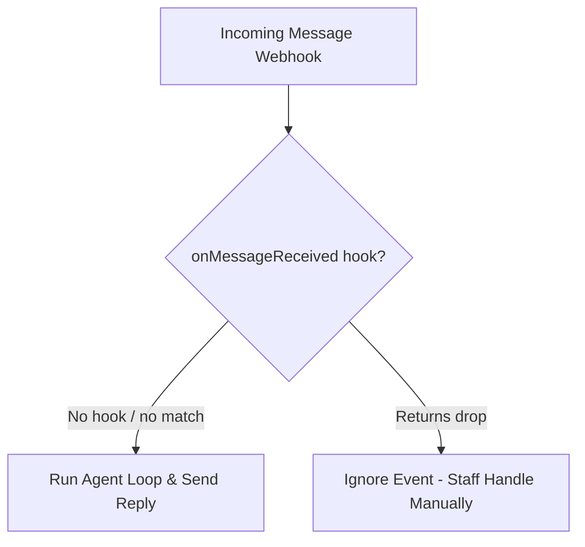

# Pancake

Pancake is an omni-channel customer service and inbox management platform. The Pancake channel adapter allows your agent to handle messages (`INBOX`) and post/page comments (`COMMENT`) directly from Pancake.

## Configuration

Define a Pancake channel with `definePancakeChannel` and attach it to an agent:

```ts title="broods/index.ts"
import { defineAgent, definePancakeChannel, env } from "broods";

export const pancake = definePancakeChannel({
  pageId: env.PANCAKE_PAGE_ID,
  pageAccessToken: env.PANCAKE_PAGE_ACCESS_TOKEN,
  webhookSecret: env.PANCAKE_WEBHOOK_SECRET,
  senderId: env.PANCAKE_SENDER_ID,
});

export const myAgent = defineAgent({
  name: "my-agent",
  config: {
    channels: [pancake],
  },
});
```

### Configuration Fields

- `pageId` (Required): The unique ID of the Pancake page.
- `pageAccessToken` (Required): The access token generated within Pancake to authorize API calls.
- `webhookSecret` (Required): A random value you generate. Pancake does not sign its webhooks, so the secret rides on the webhook URL instead and every request is checked against it.
- `senderId` (Optional): The ID of the staff/user in Pancake who sends the replies. If set, responses sent by the agent will appear as sent by this user.

Register the webhook URL in Pancake with the secret as a query parameter — requests without a matching `secret` are rejected with `401`:

```text
https://<agent-service-url>/webhooks/<accountId>/<agentId>/pancake?secret=<webhookSecret>
```

---

## Human Handoff (skipping tagged conversations)

The channel adapter stays generic: it does not decide which conversations to skip. Instead, every inbound message carries the conversation's Pancake tag IDs on `event.source.tagIds`, and you filter in a [`onMessageReceived` code hook](../hooks.md) — so the policy is yours to own and change.

When staff take over a conversation in Pancake, add a tag; the hook drops the message and the agent stays quiet:

```ts title="broods/index.ts"
export const myAgent = defineAgent({
  name: "my-agent",
  config: {
    channels: [pancake],
    hooks: {
      // Drop inbound messages on conversations a human has taken over. `event`
      // is discriminated on `channel`, so after narrowing `event.source` is the
      // strongly-typed Pancake source (with `tagIds`).
      onMessageReceived: (ctx, event) => {
        if (event.channel !== "pancake") return undefined;
        const handoffTagIds = ["order-tag", "pending-tag"];
        const tagIds = event.source.tagIds ?? [];

        return tagIds.some((tagId) => handoffTagIds.includes(tagId))
          ? { drop: true }
          : undefined;
      },
    },
  },
});
```



Remove the tag in Pancake to return the conversation to auto mode; the next customer message runs the agent again. Hooks run in the hardened V8 isolate and must be self-contained (no imports or closure variables), so inline the tag IDs rather than reading them from a closure or env var.
