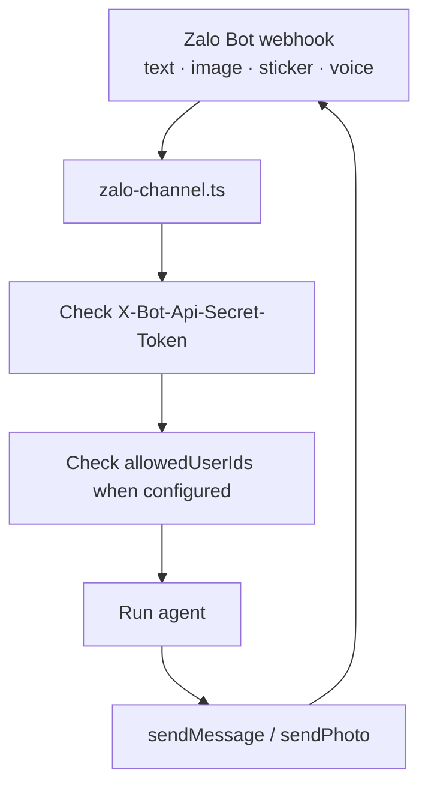

# Zalo

Zalo integration allows your agent to answer direct text messages through the official Zalo Bot API.

## Configuration

Define a Zalo channel with `defineZaloChannel` and attach it to an agent:

```ts title="broods/index.ts"
import { defineAgent, defineZaloChannel, env } from "broods";

export const zalo = defineZaloChannel({
  botToken: env("ZALO_BOT_TOKEN"),
  webhookSecret: env("ZALO_WEBHOOK_SECRET"),
});

export const myAgent = defineAgent({
  name: "my-agent",
  channels: [zalo],
});
```

- `botToken` (Required): Bot token from Zalo Bot Platform.
- `webhookSecret` (Required): Secret sent by Zalo in `X-Bot-Api-Secret-Token`. Must be 8 to 256 characters.
- `allowedUserIds` (Optional): Zalo user IDs allowed to trigger the agent. When omitted or empty, any user can send the agent a private text message.

## Webhook

Register the agent-scoped webhook URL with Zalo:

```bash
curl "https://bot-api.zaloplatforms.com/bot<YOUR_ZALO_BOT_TOKEN>/setWebhook" \
  -H "Content-Type: application/json" \
  -d '{
    "url": "'"$BROODS_BASE_URL"'/webhooks/<ACCOUNT_ID>/<AGENT_ID>/zalo",
    "secret_token": "YOUR_WEBHOOK_SECRET"
  }'
```

## Supported Behavior



- Direct text messages are supported.
- Inbound pictures (`message.image.received`), stickers (`message.sticker.received`), and voice notes (`message.voice.received`) reach the agent as attachments. Zalo hosts each one as a URL, so the agent receives the link, not the bytes — the picture and the sticker as an image, the voice note as an audio file. An image caption arrives as the text of the same message.
- The configured model must accept that input: send a picture to a text-only model and the run fails on the provider's error. A voice note whose URL carries no recognizable audio extension is passed along as a plain link instead, so the turn survives.
- Zalo has no inbound document or video event. Anything else the user sends arrives as `message.unsupported.received` and is ignored, along with group messages and bot-originated messages. When `allowedUserIds` is configured, senders outside the list are also ignored.
- Outbound replies are split into 2000-character chunks for the Zalo Bot API text limit.
- Typing indicators use `sendChatAction`.
- Outbound images use `sendPhoto`. Zalo fetches the picture itself, so the image must be an absolute `http(s)` URL that Zalo can reach — a local path, a `data:` URL, or a private link is rejected. An optional caption is truncated to 2000 characters.
- Reactions are not supported by the official Zalo Bot API adapter.
