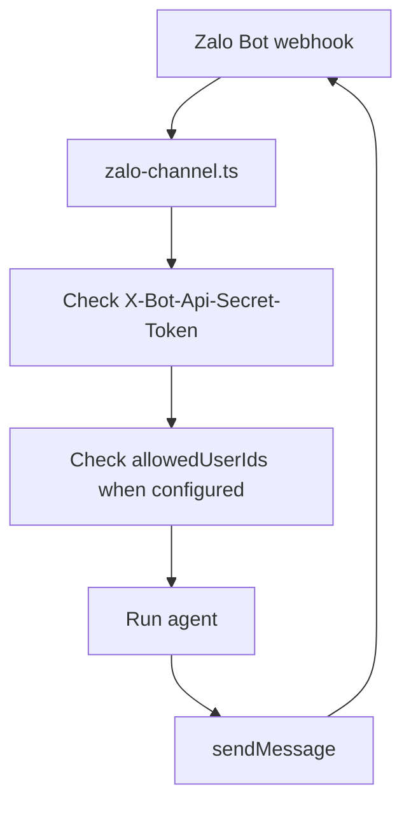

# Zalo

Zalo integration allows your agent to answer direct text messages through the official Zalo Bot API.

## Configuration

Define a Zalo channel with `defineZaloChannel` and attach it to an agent:

```ts title="broods/index.ts"
import { defineAgent, defineZaloChannel, env } from "broods";

export const zalo = defineZaloChannel({
  botToken: env("ZALO_BOT_TOKEN"),
  webhookSecret: env("ZALO_WEBHOOK_SECRET"),
});

export const myAgent = defineAgent({
  name: "my-agent",
  channels: [zalo],
});
```

- `botToken` (Required): Bot token from Zalo Bot Platform.
- `webhookSecret` (Required): Secret sent by Zalo in `X-Bot-Api-Secret-Token`. Must be 8 to 256 characters.
- `allowedUserIds` (Optional): Zalo user IDs allowed to trigger the agent. When omitted or empty, any user can send the agent a private text message.

## Webhook

Register the webhook URL `broods dev` printed for the stage. The URL never names
an agent: the credentials that verify the request choose which agent receives.

Production takes the bare form:

```bash
curl "https://bot-api.zaloplatforms.com/bot<YOUR_ZALO_BOT_TOKEN>/setWebhook" \
  -H "Content-Type: application/json" \
  -d '{
    "url": "'"$BROODS_BASE_URL"'/webhooks/<ACCOUNT_ID>/zalo",
    "secret_token": "YOUR_WEBHOOK_SECRET"
  }'
```

A stage other than production is registered through its own endpoint id, so two
stages sharing one bot never receive each other's messages:

```text
{BROODS_BASE_URL}/webhooks/<ACCOUNT_ID>/dev/<ENDPOINT_ID>/zalo
```

Zalo stores one webhook URL per bot, so registering a stage URL moves that bot's
traffic to that stage. Give each developer their own bot to run both at once.

## Supported Behavior



- Direct text messages are supported.
- Outbound replies are split into 2000-character chunks for the Zalo Bot API text limit.
- Typing indicators use `sendChatAction`.
- Group messages, media, stickers, unsupported message types, and bot-originated messages are ignored. When `allowedUserIds` is configured, senders outside the list are also ignored.
- Reactions are not supported by the official Zalo Bot API adapter.
