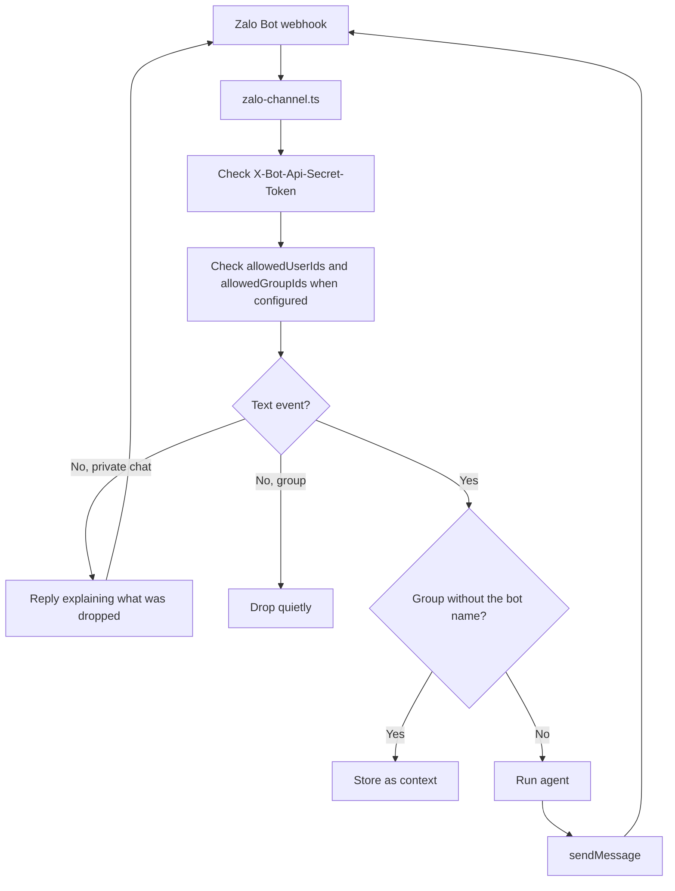

# Zalo

Zalo integration allows your agent to answer text messages in private chats and groups through the official Zalo Bot API.

## Configuration

Define a Zalo channel with `defineZaloChannel` and attach it to an agent:

```ts title="broods/index.ts"
import { defineAgent, defineZaloChannel, env } from "broods";

export const zalo = defineZaloChannel({
  botToken: env("ZALO_BOT_TOKEN"),
  webhookSecret: env("ZALO_WEBHOOK_SECRET"),
});

export const myAgent = defineAgent({
  name: "my-agent",
  channels: [zalo],
});
```

- `botToken` (Required): Bot token from Zalo Bot Platform.
- `webhookSecret` (Required): Secret sent by Zalo in `X-Bot-Api-Secret-Token`. Must be 8 to 256 characters.
- `allowedUserIds` (Optional): Zalo user IDs allowed to trigger the agent. When omitted or empty, any user can send the agent a text message. Applies to private chats and groups alike.
- `allowedGroupIds` (Optional): Zalo group chat IDs the agent answers in. When omitted or empty, the agent answers in any group it belongs to. Private chats are unaffected.
- `botName` (Optional): Name the agent answers to in group chats. Group messages that do not contain it are stored as context instead of running the agent, and the name is stripped from the text the agent sees. When omitted, every group message runs the agent.

## Group Chats

Group support is beta on the Zalo side, and a bot cannot always be added to a group. Verify that in your Zalo Bot Platform settings before debugging anything here.

Zalo sends no mention metadata, so a group mention can only be recognised in the message text. That is what `botName` is for:

```ts title="broods/index.ts"
export const zalo = defineZaloChannel({
  botToken: env("ZALO_BOT_TOKEN"),
  webhookSecret: env("ZALO_WEBHOOK_SECRET"),
  botName: "Brood",
  allowedGroupIds: ["1234567890"],
});
```

With `botName` set, `@Brood what is on the calendar?` runs the agent and it receives `what is on the calendar?`. Everything else said in the group is kept as conversation context, so a later mention still sees what the room discussed. Leave `botName` unset and the agent answers every group message.

Each chat is its own conversation, keyed by chat ID, so a group and a private chat with the same person never share history. A group chat ID is also the external ID for a channel record, so a record can bind one group to a different agent.

## Webhook

Register the agent-scoped webhook URL with Zalo:

```bash
curl "https://bot-api.zaloplatforms.com/bot<YOUR_ZALO_BOT_TOKEN>/setWebhook" \
  -H "Content-Type: application/json" \
  -d '{
    "url": "'"$BROODS_BASE_URL"'/webhooks/<ACCOUNT_ID>/<AGENT_ID>/zalo",
    "secret_token": "YOUR_WEBHOOK_SECRET"
  }'
```

## Supported Behavior



- Text messages in private chats and groups are supported.
- Outbound replies are split into 2000-character chunks for the Zalo Bot API text limit.
- Typing indicators use `sendChatAction`.
- Media, stickers, voice, and messages Zalo marks unsupported do not run the agent. In a private chat the sender gets a short reply saying so rather than silence. In a group they are dropped quietly, because most of what a group posts was never addressed to the agent.
- Bot-originated messages are ignored, as are senders outside `allowedUserIds` and groups outside `allowedGroupIds`.
- Reactions are not supported by the official Zalo Bot API adapter.

### Links Never Arrive

Zalo does not deliver a message containing a URL to a bot. It sends `message.unsupported.received` with every content field stripped, so the address is not in the webhook at all and the Bot API has no way to fetch it afterward. Surrounding the link with words does not help.

The adapter answers these by asking the sender to paste the address as plain text. Nothing else is recoverable.
