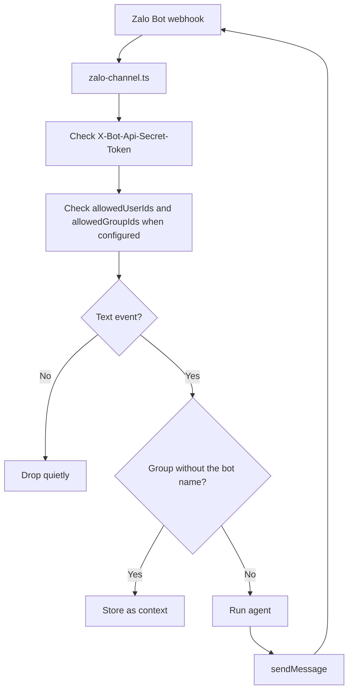

# Zalo

Zalo integration allows your agent to answer text messages in private chats and groups through the official Zalo Bot API.

## Configuration

Define a Zalo channel with `defineZaloChannel` and attach it to an agent:

```ts title="broods/index.ts"
import { defineAgent, defineZaloChannel, env } from "broods";

export const zalo = defineZaloChannel({
  botToken: env("ZALO_BOT_TOKEN"),
  webhookSecret: env("ZALO_WEBHOOK_SECRET"),
});

export const myAgent = defineAgent({
  name: "my-agent",
  channels: [zalo],
});
```

- `botToken` (Required): Bot token from Zalo Bot Platform.
- `webhookSecret` (Required): Secret sent by Zalo in `X-Bot-Api-Secret-Token`. Must be 8 to 256 characters.
- `allowedUserIds` (Optional): Zalo user IDs allowed to trigger the agent. When omitted or empty, any user can send the agent a text message. Applies to private chats and groups alike.
- `allowedGroupIds` (Optional): Zalo group chat IDs the agent answers in. When omitted or empty, the agent answers in any group it belongs to. Private chats are unaffected.

## Group Chats

Group support is an [internal Zalo Bot Platform experiment](https://bot.zapps.me/docs/build-bot-interaction-with-group/) and may not be available for every bot. Verify that the Bot Creator shows **Invite Bot to Group** before debugging the Broods configuration.

Zalo controls which group messages reach the bot. A member must either type `@` and select the bot from Zalo's mention picker, or reply directly to a message the bot previously sent. Broods runs the agent for either event; it does not match the bot's display name in message text.

```ts title="broods/index.ts"
export const zalo = defineZaloChannel({
  botToken: env("ZALO_BOT_TOKEN"),
  webhookSecret: env("ZALO_WEBHOOK_SECRET"),
  allowedGroupIds: ["1234567890"],
});
```

Each chat is its own conversation, keyed by chat ID, so a group and a private chat with the same person never share history. A group chat ID is also the external ID for a channel record, so a record can bind one group to a different agent.

## Webhook

Register the agent-scoped webhook URL with Zalo:

```bash
curl "https://bot-api.zaloplatforms.com/bot<YOUR_ZALO_BOT_TOKEN>/setWebhook" \
  -H "Content-Type: application/json" \
  -d '{
    "url": "'"$BROODS_BASE_URL"'/webhooks/<ACCOUNT_ID>/<AGENT_ID>/zalo",
    "secret_token": "YOUR_WEBHOOK_SECRET"
  }'
```

## Supported Behavior



- Text messages in private chats and groups are supported.
- Outbound replies are split into 2000-character chunks for the Zalo Bot API text limit.
- Typing indicators use `sendChatAction`.
- Media, stickers, voice, and messages Zalo marks unsupported are ignored and do not run the agent.
- Bot-originated messages are ignored, as are senders outside `allowedUserIds` and groups outside `allowedGroupIds`.
- Reactions are not supported by the official Zalo Bot API adapter.

### Links Never Arrive

Zalo does not deliver a message containing a URL to a bot. It sends `message.unsupported.received` with every content field stripped, so the address is not in the webhook at all and the Bot API has no way to fetch it afterward. Surrounding the link with words does not help.

These messages are ignored because nothing is recoverable from the webhook.
