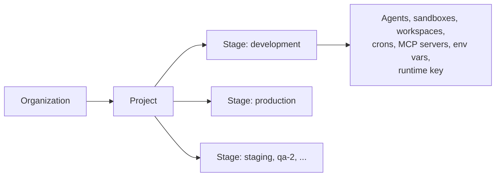
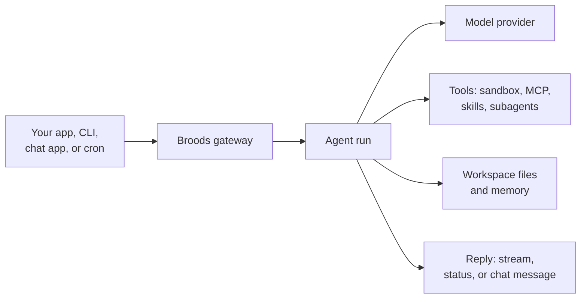

# Concepts

Every other page assumes the ideas on this one. Read it once after the [Quickstart](quickstart.md).

## Where things live

| Level        | What it is                                                                                                                                  | Managed with                              |
| ------------ | ------------------------------------------------------------------------------------------------------------------------------------------- | ----------------------------------------- |
| Organization | Your team. Members read, admins and owners change things. Billing and the account secret live here.                                         | Dashboard, `broods org`                   |
| Project      | One product or repo. Groups its stages.                                                                                                     | `broods dev` creates it, `broods project` |
| Stage        | A deploy target inside a project, such as `development` or `production`. Each has its own resources, environment variables and runtime key. | `broods stage`, `--stage`                 |

`broods dev` syncs to `development`. `broods deploy` syncs to `production`, or to the `stages.deploy` stage you set with `defineBroods`. Clone a stage with `broods stage create staging --from development`. See [Deploying](guides/deploying.md).

## Resources

You declare resources in a `broods/` folder with `define*` helpers. The CLI compiles them, syncs them to a stage, and generates typed references in `broods/_generated/`.

| Resource   | Helper                       | What it does                                                 | Guide                                          |
| ---------- | ---------------------------- | ------------------------------------------------------------ | ---------------------------------------------- |
| Agent      | `defineAgent`                | A model, a prompt, and everything the model may use          | [Agents](guides/agents.md)                     |
| Sandbox    | `defineSandbox`              | A Linux machine where the agent runs `bash`, Python and Node | [Sandboxes](guides/sandboxes/index.md)         |
| Workspace  | `defineWorkspace`            | Persistent files and memory, mounted into a sandbox          | [Workspaces](guides/workspaces.md)             |
| MCP server | `defineMcp`                  | External tools the agent can call                            | [Tools](guides/tools.md)                       |
| Skill      | `defineSkill`                | Instructions and scripts the agent loads only when needed    | [Skills](guides/skills.md)                     |
| Connection | `defineSlackConnection`, ... | Credentials for one chat app install                         | [Channels](channels/index.md)                  |
| Channel    | `defineSlackChannel`, ...    | One room where the agent answers, with its own rules         | [Channel records](channels/channel-records.md) |
| Policy     | `definePolicy`               | Rules for which tools, files and subagents the agent may use | [Policies](guides/policies.md)                 |
| Cron job   | `defineCron`                 | A scheduled run                                              | [Scheduling](guides/scheduling.md)             |

Secrets never go in these files. `env("NAME")` is a reference that the server resolves from the stage's encrypted environment variables. See [Deploying](guides/deploying.md#secrets-and-environment-variables).

## A run

Every request to an agent is a run on a conversation.

- A conversation is identified by a `conversationKey`. Runs on the same key share history. Channels derive the key from the chat or thread, so each Slack thread is its own conversation.
- A run streams back over SSE or WebSocket, or runs in the background and you poll it.
- One conversation runs one turn at a time. A message sent while it is busy steers the running turn by default. See [Conversations](guides/conversations.md).
- Each model step can call tools. Some tools need approval first, depending on the sandbox `permissionMode` or the tool's `needsApproval`.

## Credentials

Use the narrowest credential that works. The three you meet first:

| Credential        | Prefix      | Who holds it                   | What it can do                                                       |
| ----------------- | ----------- | ------------------------------ | -------------------------------------------------------------------- |
| Stage runtime key | `fp_agent_` | Your app or frontend           | Run agents with `publicAccess: true` in its own stage. Nothing else. |
| Account secret    | `fp_acct_`  | Your backend, kept secret      | The whole config plane, to create agents, crons and files at runtime |
| CLI login         | `fp_cli_`   | `broods login` on your machine | Everything the CLI does, for org owners and admins                   |

`broods dev` and `broods deploy` write the runtime key to `.env.local` as `BROODS_API_KEY`. The account secret is shown once, when your organization is provisioned. Rotate it under Org Settings, API Access. Deploy keys, role sessions and stage tickets are in [Security](guides/security.md).

## Config plane and runtime

Two kinds of API sit behind the same URL.

- The runtime runs agents through `POST /v1/runs`, the WebSocket and channel webhooks. `BroodsClient` calls it with the runtime key.
- The config plane manages resources through `/v1/agents`, `/v1/crons`, `/v1/workspaces` and the rest. `broods dev` calls it. So does `BroodsAccountClient` when your app creates an agent per customer at runtime.

The code in `broods/` and the config plane describe the same resources. Anything you can declare, you can also create through the API.
