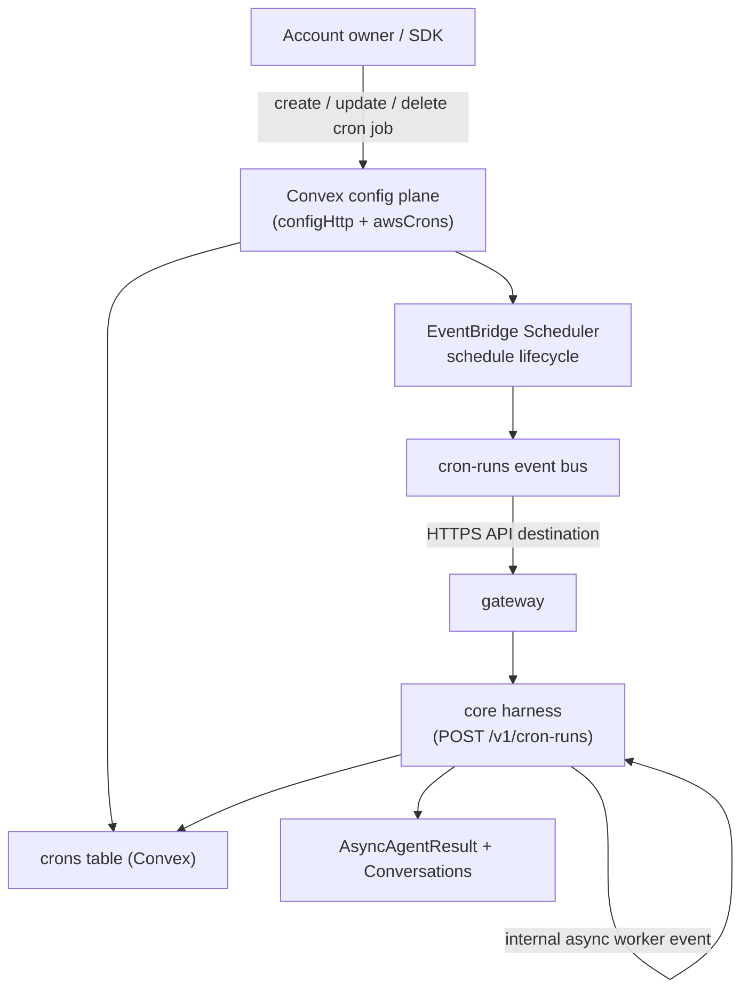

# Cron Jobs

Cron jobs start account agents on a schedule. Cron CRUD lives in the Convex config plane (`/v1/crons` is forwarded there by the gateway); execution stays in the core harness, invoked by EventBridge Scheduler.



## Model

Cron jobs store the selected agent and the run payload directly. The payload mirrors the agent run input: provide a single `input` string (wrapped into one user message) or a full `events` model-message list — exactly one of the two. The stored canonical form is always `events`.

```json
{
  "agentId": "agent_maintainer",
  "conversationKey": "cron:daily-maintenance",
  "input": "Run daily maintenance."
}
```

This keeps the add-on small. Developers who need custom workflow code can deploy their own Lambda, worker, or scheduler and call the existing direct/async API.

### Conversation Binding

`conversationKey` decides which conversation the run continues in, and with it where the answer goes:

- **A live channel session** — a key such as `slack:T123:C456` that an agent already ran in. The cron resumes that exact session, reuses the config it stored (channel-record instructions and deny lists included), and its final text is delivered back to that channel.
- **Anything else**, including the `cron:<cronId>` default — its own direct conversation. The result is readable through the async status API; nothing is pushed anywhere.

A cron never reaches a conversation belonging to another account or agent, and a run that arrives while the conversation is mid-turn is skipped and recorded as a failed run rather than interleaved.

### What A Fired Run Sees

The stored instructions arrive as a user turn that nobody typed, so the runtime frames them before the model reads them: the first user message is prefixed with the task name, the schedule and its timezone, the instant the scheduler fired, when the task was set up, whether it fires again, and the fact that nobody is sitting in the conversation waiting on a reply. The instructions themselves are passed through untouched. Its trace root is `agent.cron`, not `agent.task`, and the log line for the dispatch carries `dispatchLagMs` — how long the Scheduler → event bus → API destination → gateway hops took, so a late answer can be attributed to the pipeline or to the run itself.

A fired run carries **no scheduling tools at all** — not `schedule`, `update_schedule`, `list_schedules`, or `cancel_schedule` — however the agent is configured. A model reading its own stored instructions takes them for a fresh request, so every one of those tools is a way for it to act on the schedule it is currently running. A subagent dispatched by a fired run inherits the same restriction. Scheduling stays with the turns a person actually asked for.

## Code-First Configuration

Define cron jobs as resources alongside your agents:

```ts title="broods/index.ts"
import { defineAgent, defineCron, env } from "broods";

export const maintainer = defineAgent({
  name: "maintainer",
  provider: { openai: { apiKey: env("OPENAI_API_KEY") } },
  model: { provider: "openai", modelId: "gpt-5.5" },
  agent: { system: "You are a maintenance assistant." },
});

export const dailyMaintenance = defineCron({
  name: "daily-maintenance",
  agent: maintainer,
  conversationKey: "cron:daily-maintenance",
  input: "Run daily maintenance.",
  scheduleExpression: "cron(0 8 * * ? *)",
  timezone: "Europe/Amsterdam",
});
```

Use `events` instead of `input` for multimodal or multi-message payloads:

```ts
export const weeklyDigest = defineCron({
  name: "weekly-digest",
  agent: maintainer,
  events: [
    {
      role: "user",
      content: [{ type: "text", text: "Summarize this week." }],
    },
  ],
  scheduleExpression: "cron(0 9 ? * MON *)",
  timezone: "Europe/Amsterdam",
});
```

## Account API

Create a cron job directly via the account API:

```bash
curl -X POST "$BROODS_BASE_URL/v1/crons" \
  -H "Authorization: Bearer $ACCOUNT_SECRET" \
  -H "Content-Type: application/json" \
  -d '{
    "name": "Daily maintenance",
    "agentId": "agent_maintainer",
    "conversationKey": "cron:daily-maintenance",
    "input": "Run daily maintenance.",
    "scheduleExpression": "cron(0 8 * * ? *)",
    "timezone": "Europe/Amsterdam"
  }'
```

Supported schedule expressions are AWS EventBridge Scheduler expressions: `cron(...)`, `rate(...)`, and `at(...)`. The cron form is `cron(minutes hours day-of-month month day-of-week year)` — one of day-of-month / day-of-week must be `?`.

| Cadence                 | Expression                |
| ----------------------- | ------------------------- |
| Every hour              | `rate(1 hour)`            |
| Every Monday 09:00      | `cron(0 9 ? * MON *)`     |
| 1st of each month 08:00 | `cron(0 8 1 * ? *)`       |
| Yearly, Jan 1 09:00     | `cron(0 9 1 1 ? *)`       |
| Once, at a fixed time   | `at(2027-01-01T09:00:00)` |

A one-time `at(...)` job is **self-deleting**: EventBridge drops the schedule as soon as it has fired, and the runtime deletes the cron job and its run history once that single run settles. `GET /v1/crons/{cronId}` returns 404 from then on, so read the result through the conversation or the async status API rather than the job. Recurring jobs are never deleted on their own.

`timezone` maps to EventBridge Scheduler `ScheduleExpressionTimezone`. When omitted, schedules are evaluated in UTC. Use an IANA timezone such as `Europe/Amsterdam` when account owners expect local wall-clock time. It controls schedule evaluation, and the fired run is told which timezone its schedule was read in — it never changes how the agent itself is configured.

Pause a job:

```bash
curl -X PATCH "$BROODS_BASE_URL/v1/crons/$CRON_ID" \
  -H "Authorization: Bearer $ACCOUNT_SECRET" \
  -H "Content-Type: application/json" \
  -d '{ "status": "paused" }'
```

Delete a job, and its run history with it:

```bash
curl -X DELETE "$BROODS_BASE_URL/v1/crons/$CRON_ID" \
  -H "Authorization: Bearer $ACCOUNT_SECRET"
```

List jobs with `GET /v1/crons` or fetch one with `GET /v1/crons/{cronId}`. Responses include the run state: `status`, `lastInvokedAt`, `lastStatus`, and `lastError`. Paused jobs are skipped at invoke time.

## Agent-Scheduled Tasks

An agent can manage its own scheduled work with three tools. They are off by default — a scheduled task starts billable runs long after the turn that asked for it — and turn on together, per agent:

```ts title="broods/index.ts"
export const support = defineAgent({
  name: "support",
  provider: { openai: { apiKey: env("OPENAI_API_KEY") } },
  model: { provider: "openai", modelId: "gpt-5.5" },
  scheduler: { enabled: true },
});
```

| Tool              | Input                                                                   | What it does                                                               |
| ----------------- | ----------------------------------------------------------------------- | -------------------------------------------------------------------------- |
| `schedule`        | `name`, `instructions`, `schedule`, `timezone?`                         | Creates a cron job for this agent, bound to the calling conversation       |
| `list_schedules`  | —                                                                       | Every job owned by this agent, with its schedule, status, and conversation |
| `update_schedule` | `cronId`, `name?`, `instructions?`, `schedule?`, `timezone?`, `status?` | Changes one of this agent's jobs in place, including pausing and resuming  |
| `cancel_schedule` | `cronId`                                                                | Deletes one of this agent's jobs, run history included                     |

These are normal cron jobs through the same config plane — visible on the dashboard scheduler page and manageable through `/v1/crons` like any other. Two things `schedule` fixes for the model:

- **The agent is always itself.** A scheduled task cannot be pointed at another agent, and `list`/`update`/`cancel` reach only that agent's own jobs.
- **The conversation is always the calling one.** The cron stores the conversation key of the session the tool ran in, so an agent asked in Slack to summarize every morning answers in that Slack conversation. See [Conversation Binding](#conversation-binding).

Both recurring and one-time schedules are accepted, so "every weekday at 9" and "remind me on Friday" are the same tool. A one-time task disappears by itself once it has run; a recurring one lives until it is cancelled. `list_schedules` is what the model should read before answering "what have you got scheduled" — its own memory of the conversation is not the source of truth.

`update_schedule` changes only the fields it is given, so "make that 10am instead" retimes a job without restating its instructions. Setting `status` to `paused` stops a job firing while keeping it and its history; `active` resumes it. That is the difference from `cancel_schedule`, which is permanent.

Instructions are the one field `update_schedule` will not change from anywhere. A job answers in the conversation that created it, so rewriting its instructions from a second conversation would put text of the model's choosing into a conversation the current turn is not in — which `schedule` itself cannot do, since it always binds to the calling conversation. Renaming, retiming and pausing carry no such content and work from any conversation; an instruction rewrite has to come from the one the job answers in. `list_schedules` reports each job's `conversationKey` so the model can tell which that is.

Turning the scheduler on also gives the agent a clock: one `<scheduler>` system message per run carrying the current UTC instant, so "8:45 tonight" resolves against a real time instead of a guessed date. A schedule counts as set only once the tool has returned, and `list_schedules` — not the conversation — is what is actually pending.

Withhold any of them from one channel with `denyTools: ["cancel_schedule"]` (or the other names) on that channel record.

## SDK and Dynamic Creation

Cron jobs are not limited to declarative `defineCron` resources synced by `broods dev` — clients can create, update, and delete them at runtime through the SDK, which calls the same account API (so EventBridge Scheduler stays in sync):

```ts
import { BroodsClient } from "broods";
import { api } from "./broods/_generated/api";

const client = new BroodsClient();

await client.createCron({
  name: "Weekly digest",
  agent: api.agents.support,
  input: "Summarize this week's tickets.",
  scheduleExpression: "cron(0 9 ? * MON *)",
  timezone: "Europe/Amsterdam",
});
```

Pass `events: [...]` instead of `input` for multimodal or multi-message payloads.
