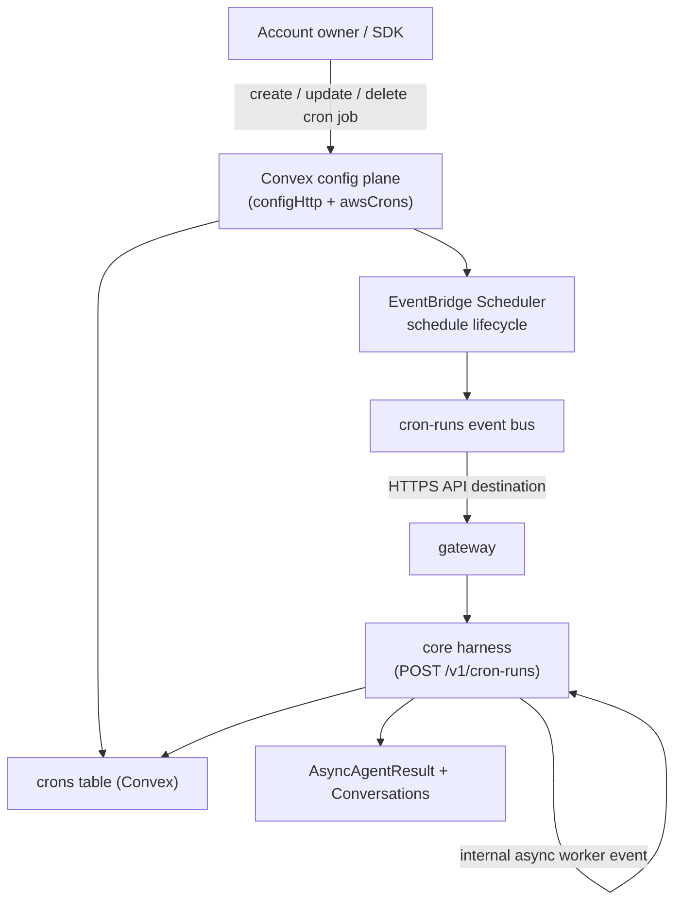

# Cron Jobs

Cron jobs start account agents on a schedule. Cron CRUD lives in the Convex config plane (`/v1/crons` is forwarded there by the gateway); execution stays in the core harness, invoked by EventBridge Scheduler.



## Model

Cron jobs store the selected agent and the run payload directly. The payload mirrors the agent run input: provide a single `input` string (wrapped into one user message) or a full `events` model-message list — exactly one of the two. The stored canonical form is always `events`.

```json
{
  "agentId": "agent_maintainer",
  "conversationKey": "cron:daily-maintenance",
  "input": "Run daily maintenance."
}
```

This keeps the add-on small. Developers who need custom workflow code can deploy their own Lambda, worker, or scheduler and call the existing direct/async API.

### Conversation Binding

`conversationKey` decides which conversation the run continues in, and with it where the answer goes:

- **A live channel session** — a key such as `slack:T123:C456` that an agent already ran in. The cron resumes that exact session, reuses the config it stored (channel-record instructions and deny lists included), and its final text is delivered back to that channel.
- **Anything else**, including the `cron:<cronId>` default — its own direct conversation. The result is readable through the async status API; nothing is pushed anywhere.

A cron never reaches a conversation belonging to another account or agent, and a run that arrives while the conversation is mid-turn is skipped and recorded as a failed run rather than interleaved.

## Code-First Configuration

Define cron jobs as resources alongside your agents:

```ts title="broods/index.ts"
import { defineAgent, defineCron, env } from "broods";

export const maintainer = defineAgent({
  name: "maintainer",
  provider: { openai: { apiKey: env("OPENAI_API_KEY") } },
  model: { provider: "openai", modelId: "gpt-5.5" },
  agent: { system: "You are a maintenance assistant." },
});

export const dailyMaintenance = defineCron({
  name: "daily-maintenance",
  agent: maintainer,
  conversationKey: "cron:daily-maintenance",
  input: "Run daily maintenance.",
  scheduleExpression: "cron(0 8 * * ? *)",
  timezone: "Europe/Amsterdam",
});
```

Use `events` instead of `input` for multimodal or multi-message payloads:

```ts
export const weeklyDigest = defineCron({
  name: "weekly-digest",
  agent: maintainer,
  events: [
    {
      role: "user",
      content: [{ type: "text", text: "Summarize this week." }],
    },
  ],
  scheduleExpression: "cron(0 9 ? * MON *)",
  timezone: "Europe/Amsterdam",
});
```

## Account API

Create a cron job directly via the account API:

```bash
curl -X POST "$BROODS_BASE_URL/v1/crons" \
  -H "Authorization: Bearer $ACCOUNT_SECRET" \
  -H "Content-Type: application/json" \
  -d '{
    "name": "Daily maintenance",
    "agentId": "agent_maintainer",
    "conversationKey": "cron:daily-maintenance",
    "input": "Run daily maintenance.",
    "scheduleExpression": "cron(0 8 * * ? *)",
    "timezone": "Europe/Amsterdam"
  }'
```

Supported schedule expressions are AWS EventBridge Scheduler expressions: `cron(...)`, `rate(...)`, and `at(...)`. The cron form is `cron(minutes hours day-of-month month day-of-week year)` — one of day-of-month / day-of-week must be `?`.

| Cadence                 | Expression                |
| ----------------------- | ------------------------- |
| Every hour              | `rate(1 hour)`            |
| Every Monday 09:00      | `cron(0 9 ? * MON *)`     |
| 1st of each month 08:00 | `cron(0 8 1 * ? *)`       |
| Yearly, Jan 1 09:00     | `cron(0 9 1 1 ? *)`       |
| Once, at a fixed time   | `at(2027-01-01T09:00:00)` |

`timezone` maps to EventBridge Scheduler `ScheduleExpressionTimezone`. When omitted, schedules are evaluated in UTC. Use an IANA timezone such as `Europe/Amsterdam` when account owners expect local wall-clock time. This only controls schedule evaluation; it is not injected into the agent prompt.

Pause a job:

```bash
curl -X PATCH "$BROODS_BASE_URL/v1/crons/$CRON_ID" \
  -H "Authorization: Bearer $ACCOUNT_SECRET" \
  -H "Content-Type: application/json" \
  -d '{ "status": "paused" }'
```

Delete a job:

```bash
curl -X DELETE "$BROODS_BASE_URL/v1/crons/$CRON_ID" \
  -H "Authorization: Bearer $ACCOUNT_SECRET"
```

List jobs with `GET /v1/crons` or fetch one with `GET /v1/crons/{cronId}`. Responses include the run state: `status`, `lastInvokedAt`, `lastStatus`, and `lastError`. Paused jobs are skipped at invoke time.

## Agent-Scheduled Tasks

An agent can schedule its own recurring work with the `schedule_task` tool. It is off by default — a scheduled task starts billable runs long after the turn that asked for it — and turns on per agent:

```ts title="broods/index.ts"
export const support = defineAgent({
  name: "support",
  provider: { openai: { apiKey: env("OPENAI_API_KEY") } },
  model: { provider: "openai", modelId: "gpt-5.5" },
  scheduler: { enabled: true },
});
```

The tool takes `name`, `instructions`, `schedule`, and an optional `timezone`, and creates a normal cron job through the same config plane — visible on the dashboard scheduler page and manageable through `/v1/crons` like any other. Two things it fixes for the model:

- **The agent is always itself.** A scheduled task cannot be pointed at another agent.
- **The conversation is always the calling one.** The cron stores the conversation key of the session the tool ran in, so an agent asked in Slack to summarize every morning answers in that Slack conversation. See [Conversation Binding](#conversation-binding).

Only recurring `cron(...)` and `rate(...)` expressions are accepted. A one-time `at(...)` schedule is refused: EventBridge keeps a fired one-time schedule until something deletes it, and no runtime path reclaims it.

The tool creates tasks and nothing else. Pausing and deleting stay with the account owner, on the dashboard or through the account API, so an agent cannot quietly cancel work someone else scheduled. Withhold the tool from one channel with `denyTools: ["schedule_task"]` on that channel record.

## SDK and Dynamic Creation

Cron jobs are not limited to declarative `defineCron` resources synced by `broods dev` — clients can create, update, and delete them at runtime through the SDK, which calls the same account API (so EventBridge Scheduler stays in sync):

```ts
import { BroodsClient } from "broods";
import { api } from "./broods/_generated/api";

const client = new BroodsClient();

await client.createCron({
  name: "Weekly digest",
  agent: api.agents.support,
  input: "Summarize this week's tickets.",
  scheduleExpression: "cron(0 9 ? * MON *)",
  timezone: "Europe/Amsterdam",
});
```

Pass `events: [...]` instead of `input` for multimodal or multi-message payloads.
