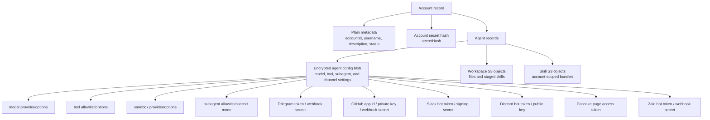
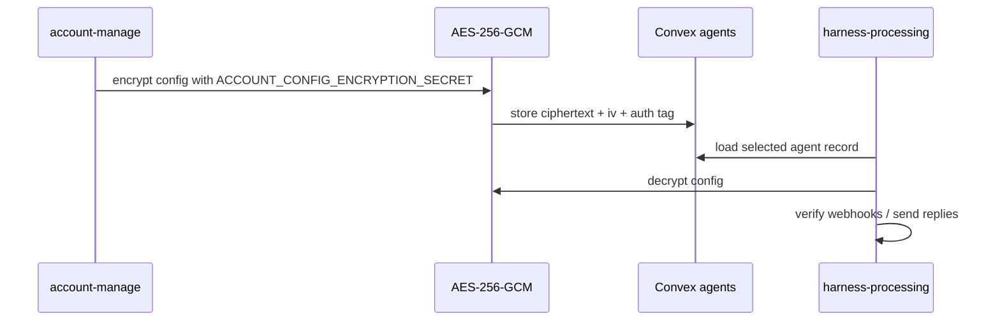

# Data Security

This is an experiment product, so the security model is simple by design. It avoids storing provider secrets as plain JSON in Convex, but it is not a final production-grade secrets system.

## What Is Stored



The account API secret is never stored directly. It is returned once on create or rotation, then only `secretHash` is stored.

Provider credentials and account-specific runtime options must be usable at runtime, so they cannot be hashed. They are stored inside encrypted account-owned agent config. Normal account and agent responses recursively redact secret-like field names such as `token`, `secret`, `privateKey`, and `apiKey`, including inside tool config.

Workspace files, skill bundles, and uploaded tool bundles are stored as account-scoped S3 objects (workspace, skills, and tool-bundles buckets). The buckets block public access and use a deny-by-default bucket policy that allows only the project runtime roles, the scoped sandbox mount-s3 role, the MicroVM build/execution roles, and deployment roles for the active stage.

## How Config Encryption Works



Current implementation:

- AES-256-GCM encrypts the config before Convex write.
- `ACCOUNT_CONFIG_ENCRYPTION_SECRET` comes from SST secrets.
- Convex stores encrypted config, not readable provider credentials.
- The core runtime decrypts config only when it needs selected agent runtime settings.

## API Responses

Normal account responses redact secret-like fields:

```text
********
```

If a client sends `********` back in a patch, the existing real secret is preserved.

## Untrusted Custom Tool Execution

Account-uploaded tool bundles are untrusted code and never run in the core process. They execute by runtime tier:

- **Isolate tier** (pure-compute / fetch-only bundles): a V8 `isolated-vm` isolate in a Node child of the core. No filesystem, no npm/native imports, and network only through an SSRF-guarded `fetch` (private and metadata ranges blocked, resolved addresses pinned against DNS rebinding).
- **Sandbox tier** (node/npm/native bundles): the platform tool-runner Lambda — a plain Node.js function that runs each bundle in a per-invocation child process with a scrubbed environment (no `AWS_*`/execution-role credentials) and a fresh `TMPDIR`. The child boundary prevents user code from reading the function's credentials or leaking state into the next (cross-tenant) warm invocation. The function runs outside a VPC, so tool egress is open internet; the bundle arrives inline in the invoke payload, so the function holds no S3 or data-plane access.

Bundles are size-capped (1 MB) and time-bounded, and both tiers surface results over the same NDJSON frame protocol.

## Why Keep It This Way

This keeps the product easy to run and change:

- No extra Secrets Manager objects per account.
- No KMS decrypt call on every config read.
- Account metadata and agent runtime config stay in Convex without per-provider secret resources.
- Good enough for an experiment product.

## Limits

- `ACCOUNT_CONFIG_ENCRYPTION_SECRET` must be protected.
- Any runtime with the encryption secret and table access can decrypt config.
- Key rotation needs a migration.
- This protects against accidental table-read exposure, not compromised application code.
- Third-party sandbox providers such as E2B, Daytona, and Vercel run outside the AWS Lambda sandbox boundary. Configure them with isolated mounts, minimal environment variables, provider-side egress controls, and no account/provider secrets unless a workload explicitly needs them. Daytona S3 mounts receive short-lived credentials from the dedicated `sandbox-s3mount` IAM role, scoped to the workspace's own key prefix — never the harness runtime's credentials.
