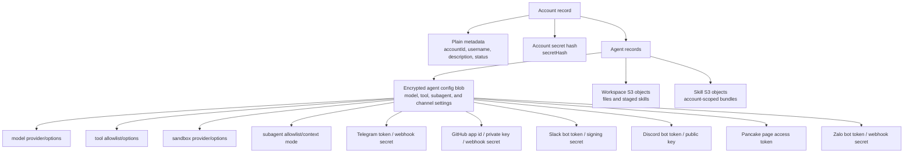
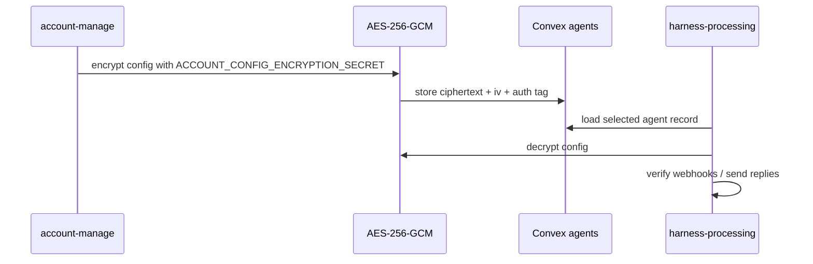

# Data Security

This is an experiment product, so the security model is simple by design. It avoids storing provider secrets as plain JSON in Convex, but it is not a final production-grade secrets system.

## What Is Stored


```mermaid
flowchart TD
  Account["Account record"] --> Meta["Plain metadata<br/>accountId, username, description, status"]
  Account --> Hash["Account secret hash<br/>secretHash"]
  Account --> Agent["Agent records"]
  Agent --> Config["Encrypted agent config blob<br/>model, tool, subagent, and channel settings"]
  Agent --> Workspace["Workspace S3 objects<br/>files and staged skills"]
  Agent --> Skills["Skill S3 objects<br/>account-scoped bundles"]

  Config --> Model["model provider/options"]
  Config --> Tools["tool allowlist/options"]
  Config --> Sandbox["sandbox provider/options"]
  Config --> Subagents["subagent allowlist/context mode"]
  Config --> Telegram["Telegram token / webhook secret"]
  Config --> GitHub["GitHub app id / private key / webhook secret"]
  Config --> Slack["Slack bot token / signing secret"]
  Config --> Discord["Discord bot token / public key"]
  Config --> Pancake["Pancake page access token"]
  Config --> Zalo["Zalo bot token / webhook secret"]
```

The account API secret is never stored directly. It is returned once on create or rotation, then only `secretHash` is stored.

Provider credentials and account-specific runtime options must be usable at runtime, so they cannot be hashed. They are stored inside encrypted account-owned agent config. Normal account and agent responses recursively redact secret-like field names such as `token`, `secret`, `privateKey`, and `apiKey`, including inside tool config.

Workspace files, skill bundles, and uploaded hook and hosted MCP server bundles are stored as account-scoped S3 objects (workspace, skills, and tool-bundles buckets). The buckets block public access and use a deny-by-default bucket policy that allows only the project runtime roles, the scoped sandbox mount-s3 role, the MicroVM build/execution roles, and deployment roles for the active stage.

## How Config Encryption Works


```mermaid
sequenceDiagram
  participant API as account-manage
  participant Crypto as AES-256-GCM
  participant CVX as Convex agents
  participant Harness as harness-processing

  API->>Crypto: encrypt config with ACCOUNT_CONFIG_ENCRYPTION_SECRET
  Crypto->>CVX: store ciphertext + iv + auth tag
  Harness->>CVX: load selected agent record
  Harness->>Crypto: decrypt config
  Harness->>Harness: verify webhooks / send replies
```

Current implementation:

- AES-256-GCM encrypts the config before Convex write.
- `ACCOUNT_CONFIG_ENCRYPTION_SECRET` comes from SST secrets.
- Convex stores encrypted config, not readable provider credentials.
- The core runtime decrypts config only when it needs selected agent runtime settings.

## API Responses

Normal account responses redact secret-like fields:

```text
********
```

If a client sends `********` back in a patch, the existing real secret is preserved.

## Who Can See What

Dashboard access follows the org membership row, never who created a project.
A member who is removed or demoted loses access on their next request, and a
`broods login` token stops resolving the moment its user is no longer an org
owner or admin.

Two roles, one rule: **a member reads, an admin writes.** Every dashboard
mutation, every sandbox control and every direct MCP tool call requires the
admin or owner role; members see the same screens read-only and get an
explicit "org admin" error if they try to change anything. Finer roles come
later.

| Operation                                                               | Member | Admin / owner |
| ----------------------------------------------------------------------- | ------ | ------------- |
| Read agents, stages, canvas, files, logs, traces, usage                 | yes    | yes           |
| Test an agent in the dashboard chat                                     | yes    | yes           |
| Create or edit agents, the canvas, workspace files, MCP servers         | no     | yes           |
| Reveal, set or delete an environment variable                           | no     | yes           |
| Reveal or rotate the stage runtime key (`fp_agent_…`)                   | no     | yes           |
| Create, clone or promote a stage; create or delete a project            | no     | yes           |
| Add, toggle or remove agent webhooks; scheduled jobs                    | no     | yes           |
| Exec, open a terminal in, snapshot, suspend or terminate a sandbox      | no     | yes           |
| Call an MCP tool from the explorer; create or revoke deploy keys; roles | no     | yes           |

Members stream logs and drive the test chat with a **stage session ticket**
(`fp_dts_…`): a one-hour credential the config plane signs for the stage, which
core accepts exactly like the runtime key until it expires. The runtime key
itself never reaches a member's browser. Webhook signing secrets are write-only:
the dashboard reports whether one is set and never returns the value.

A stage-scoped deploy key syncs its own stage only. Skills, hooks and cron jobs
are account-wide by name, so a manifest that names one another stage manages is
refused instead of replacing it, and `prune` never deletes another stage's rows.
A deploy key can set and list environment variables but never read a value
back: `broods env get` needs a `broods login` token or the org secret.

`broods login` binds the one-time code to the CLI process with PKCE (S256), so
a code caught by another local listener cannot be exchanged.

## Untrusted Hosted MCP Server Execution

Account-uploaded hosted MCP server bundles are untrusted code and never run in the core process. They execute on the platform tool-runner Lambda — a plain Node.js function that runs each bundle in a child process with a scrubbed environment and a fresh per-invocation `TMPDIR`. The child is a containment layer, not a trust boundary: it runs as the same OS user as the function, so server code can read the function's own environment. The protections that do hold are that this function's execution role grants nothing but CloudWatch Logs, that the bundle is imported from memory and never written to disk, and that a child is only ever handed calls for the one `accountId + sha256` it was spawned for — a different tenant or a changed bundle always gets a fresh process, and the retiring child is reaped as a process group so nothing it spawned survives it. Treat anything the function can reach as reachable by tenant code. The function runs outside a VPC, so egress is open internet; the bundle arrives via a short-lived pre-signed URL, so the function holds no S3 or data-plane access.

The child is kept warm for repeat calls of the same account's same bundle, which cuts repeat-call latency to a floor independent of bundle size. Reuse is bounded (a max-invocation count and an idle TTL) and a timeout, a rejected payload, or an unhandled rejection retires the child immediately; a request whose handler throws fails only that request. What reuse deliberately gives up is a clean process per call _within one tenant's bundle_: module-level state the bundle hoists (memoized clients, counters, pools) persists across its own calls — matching how any long-lived MCP server behaves — while `HOME`/`TMPDIR` are re-pointed at a fresh scratch dir on every invocation. One invocation carries a batch of that tenant's parallel calls, which run concurrently in the child and share that scratch dir.

Bundles are size-capped (50 MB; 10 MB when inlined in the request body) and time-bounded, and their sha256 is checked on every invoke.

Inline [code hooks](hooks.md) are the other untrusted-code tier: a V8 `isolated-vm` isolate in a Node child of the core. No filesystem, no npm/native imports, and network only through an SSRF-guarded `fetch` (private and metadata ranges blocked, resolved addresses pinned against DNS rebinding).

## Why Keep It This Way

This keeps the product easy to run and change:

- No extra Secrets Manager objects per account.
- No KMS decrypt call on every config read.
- Account metadata and agent runtime config stay in Convex without per-provider secret resources.
- Good enough for an experiment product.

## Limits

- `ACCOUNT_CONFIG_ENCRYPTION_SECRET` must be protected.
- Any runtime with the encryption secret and table access can decrypt config.
- Key rotation needs a migration.
- This protects against accidental table-read exposure, not compromised application code.
- Third-party sandbox providers such as E2B, Daytona, and Vercel run outside the AWS Lambda sandbox boundary. Configure them with isolated mounts, minimal environment variables, provider-side egress controls, and no account/provider secrets unless a workload explicitly needs them. Daytona S3 mounts receive short-lived credentials from the dedicated `sandbox-s3mount` IAM role, scoped to the workspace's own key prefix — never the harness runtime's credentials.
