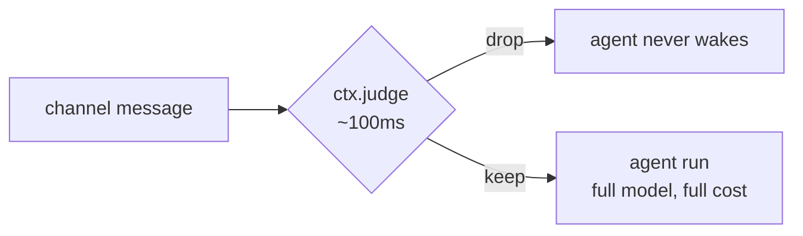

# Judge (Proposal)

:::warning Not implemented

This is a design note, not shipped behavior. No `judge` config key exists, `ctx.judge` is not on the hook context, and nothing in core resolves an evaluation model. The page records a proposed surface and the decisions behind it so the shape can be argued with before any of it is built.

:::

## The gap

Broods makes three kinds of runtime model call, and none of them is a decision. Every classify, route, gate, or rank today is either the full agent model spending a turn in its tool loop, or a regex.

That leaves the cheap middle empty. Dropping an obvious spam message costs a whole agent run. Deciding which of four agents should answer costs a whole agent run. Scoring a tool result before it goes back into context costs a whole agent run, or it does not happen.

## What Jev is

Jev is TypeSafe AI's System One model. It answers a question instead of writing text. No tokens stream back, and the response is a calibrated number. Roughly 100ms per call.

It replaces nothing the agent model does. It fills the tier below it.

| Question type | Criteria                          | Answer                               |
| ------------- | --------------------------------- | ------------------------------------ |
| `boolean`     | one statement                     | `probability`, 0 to 1                |
| `choice`      | up to 255 labeled options         | `choice`, plus the full distribution |
| `score`       | an ordered rubric, 2 to 10 levels | `score`, fractional                  |

Questions in one request evaluate independently and in parallel, so asking five things costs about what asking one costs. That matters for the shape of the API below: batch the questions, do not chain the calls.

The Vercel AI SDK already ships this kind of call as `experimental_evaluate` against an `EvaluationModelV4` provider, and `ai` plus `@ai-sdk/gateway` are already installed in `apps/core`. The Gateway route needs no new dependency.

## Configuring it

One block, shaped like `config.model`, resolved the same way.

```ts
import { defineAgent } from "broods";

export const agent = defineAgent({
  name: "guarded-agent",
  model: { provider: "minimax", modelId: "MiniMax-M3" },
  judge: {
    provider: "typesafe",
    modelId: "jev-1",
    apiKey: "${TYPESAFE_AI_API_KEY}",
  },
});
```

Set it once on the account and every agent inherits it. Set it on an agent only when that agent needs a different model or a different key. `${ENV_REF}` resolves at sync time, the same as every other credential.

Agent config **replaces** the account default, it does not merge into it. A half-merged credential, a new `baseURL` still carrying the old key, fails in a way nobody finds until production.

There is no separate `judges` table and no judge id to reference. A table that exists to hold one row is not worth its CRUD.

## Calling it

In a hook, `judge` arrives on `ctx` next to `fetch`. It has to. The isolate rejects bare imports, so hook code cannot `import { experimental_evaluate } from "ai"` itself. Core holds the model and the key, and bridges one function across, exactly as it does for `ctx.fetch`.

```ts
hooks: {
  onMessageReceived: async (ctx, event) => {
    const { answers } = await ctx.judge({
      state: event.text,
      questions: {
        spam: { type: "boolean", criteria: "Is this spam or an automated promotion?" },
      },
    });

    return answers.spam.probability > 0.9 ? { drop: true } : undefined;
  },
}
```

Several questions, one round trip:

```ts
const { answers } = await ctx.judge({
  state: event.text,
  questions: {
    spam: { type: "boolean", criteria: "Is this spam?" },
    language: {
      type: "choice",
      criteria: { en: "English", vi: "Vietnamese", other: "Anything else" },
    },
    urgency: {
      type: "score",
      criteria: {
        1: "Can wait days",
        3: "Should be handled today",
        5: "Needs an answer now",
      },
    },
  },
});
```



## Tighten, never loosen

A judge answer may narrow what the agent does. It may never grant capability the agent did not already have. This is the same rule a [channel record](../channels/channel-records.md) follows, and it exists for the same reason: `state` is attacker-controlled text, and Jev is a classifier, not a guard. It does not treat its input as hostile, so a message that argues with the criteria can move the number.

| Allowed                       | Refused                            |
| ----------------------------- | ---------------------------------- |
| `drop` a message              | un-drop one the policy dropped     |
| `deny` a tool call            | allow a tool the policy denies     |
| lower a confidence or a score | approve an action awaiting a human |
| route to a narrower agent     | widen a subagent's visibility      |

Bounded that way, a manipulated answer costs availability at worst. The agent declines something it would have done. It never does something it could not.

Hooks are best effort by design: one that throws or times out is skipped, and the run continues unmutated. A judge deny inherits that, so it is a filter, not a control. Anything that must hold belongs in [an enforced policy](../resources.md#policies), which fails closed.

## Where it fires

Judge is available wherever `ctx` is, so every hook in [Code Hooks](../hooks.md) can call it. What the answer is allowed to change is whatever that hook could already change.

| Hook                                    | Useful judge question                              |
| --------------------------------------- | -------------------------------------------------- |
| `onMessageReceived`                     | is this worth waking the agent for                 |
| `onMessageSending`                      | does this reply leak something it should not       |
| `onStart`                               | which of these skills matter for this conversation |
| `onToolCall`                            | does this argument look destructive                |
| `onToolResult`                          | is this result relevant enough to keep in context  |
| `onSubagentFinish`                      | did the child actually answer the question         |
| `onStepFinish`, `onError`, `onApproval` | observe only, so judge can log or alert, not steer |

**There is no sandbox hook and no connection hook.** `AGENT_HOOK_EVENT_NAMES` has twelve entries and none of them covers sandbox lifecycle or a channel connection opening. Sandbox startup lives in core's account handler; connections live in the forwarders. Judging either means adding hook events first, which is its own piece of work and not assumed here.

## Open decisions

| Question            | Options                                            | Leaning                                                                                                             |
| ------------------- | -------------------------------------------------- | ------------------------------------------------------------------------------------------------------------------- |
| Judge timeout       | fixed in core, or configurable per agent           | fixed. A judge slower than the decision it saves is a bug, not a setting                                            |
| Failure shape       | throw like `ctx.fetch`, or return `null`           | `null`. Tighten-only means a missing answer is just "do not tighten", and every call site would wrap a throw anyway |
| Per-run call budget | none, or a cap like the byte caps                  | none until a use case shows a loop calling it per token                                                             |
| Retries             | 0, or the SDK default                              | 0. A retry costs more than the decision is worth                                                                    |
| Observability       | new spans, or reuse the model-call span attributes | reuse, and record `response.modelId` so a model swap is visible in history                                          |

## Before this gets built

The design has no use case attached to it yet, which is why it reads as abstract. One named path, end to end, with a measured baseline from `bench/`, decides whether any of this is worth building. Shadow mode against those baselines is the cheap way to find out: run the judge, record what it would have decided, change nothing.

Prior research and the interactive mock:

- [Research note](https://1a54sy0dz3ze.postplan.dev)
- [Interface mock](https://a3qum5xjgq9x.postplan.dev)
