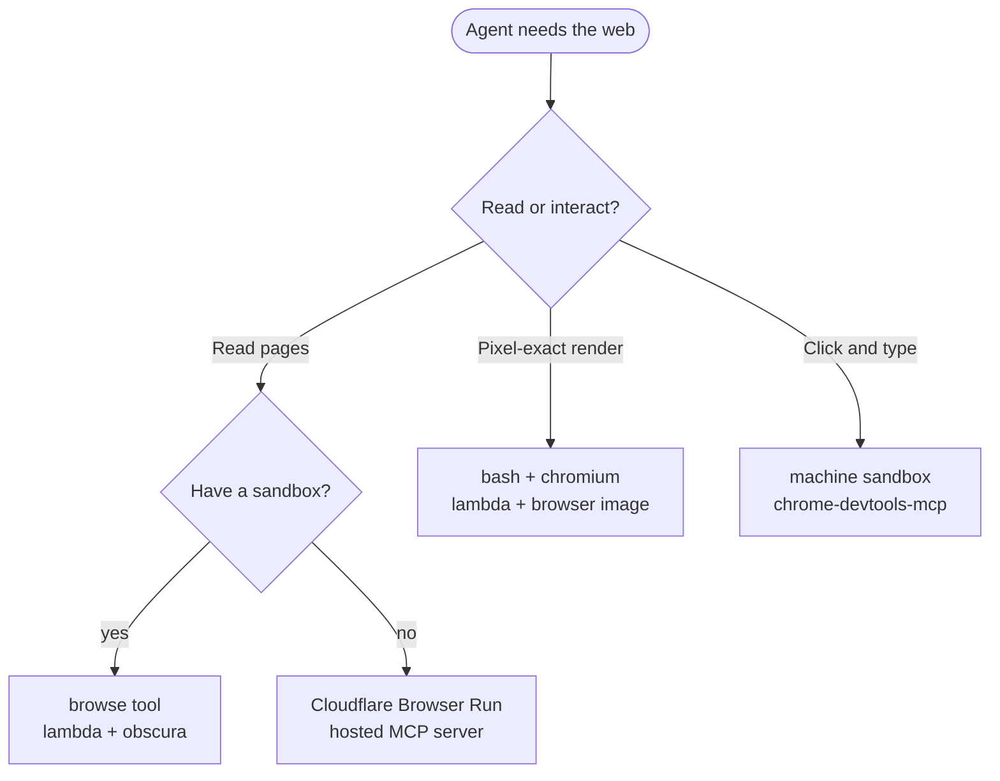
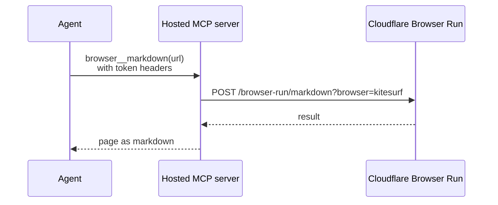

# Web browsing

Broods gives an agent a browser in one of four ways. Pick by what the agent has to do on the page:

| Route                                             | Runs on                                                       | Gives the agent                            |
| ------------------------------------------------- | ------------------------------------------------------------- | ------------------------------------------ |
| [`browse` tool](#the-browse-tool)                 | A `lambda` sandbox with `image: "obscura"`, or a machine      | Markdown, text, links, `eval`, screenshots |
| [Chromium through `bash`](#browser-images)        | A `lambda` sandbox with `image: "browser"`                    | Pixel-exact screenshots, heavy JavaScript  |
| [Cloudflare Browser Run](#cloudflare-browser-run) | A hosted MCP server calling Cloudflare. No sandbox needed     | Markdown, HTML and links through Kitesurf  |
| [Full CDP on your machine](#other-routes)         | A [machine sandbox](machine.md) running `chrome-devtools-mcp` | Clicks, typing, multi-step sessions        |



## The `browse` tool

`browse` opens a public web page in [Obscura](https://github.com/h4ckf0r0day/obscura), a headless browser on the agent's first sandbox, and returns it to the model. Turn it on with `browser` and give the agent a sandbox with the Obscura image and internet access:

```ts title="broods/index.ts"
import { defineAgent, defineSandbox, defineWorkspace } from "broods";

export const web = defineSandbox({
  name: "web",
  provider: "lambda",
  image: "obscura",
  network: { mode: "allow-all" },
});

export const workspace = defineWorkspace({
  name: "workspace",
  storage: { provider: "s3" },
});

export const researcher = defineAgent({
  name: "researcher",
  sandboxes: [web], // the first sandbox runs browse
  workspaces: [workspace], // screenshots are saved here
  browser: { enabled: true },
});
```

| `mode`               | Returns                                                                                 |
| -------------------- | --------------------------------------------------------------------------------------- |
| `markdown` (default) | The rendered page as markdown, usually 3 to 17x smaller than its HTML                   |
| `text`               | Plain text                                                                              |
| `links`              | Every link on the page, one per line                                                    |
| `eval`               | The result of a JavaScript expression run in the page, passed as `script`               |
| `screenshot`         | An image of the viewport, saved under `.broods/browse/` so `send-images` can send it on |

- The first sandbox must be `lambda` with `image: "obscura"` and `network.mode: "allow-all"`, or a [machine](machine.md) with `obscura` installed. Anything else fails the run with a message saying what to change.
- `screenshot` needs a workspace on that sandbox. The image reaches the model on the turn it was taken, when it is 6 MB or less. Later turns keep the file path.
- Private and internal addresses are refused, even when the sandbox sets `OBSCURA_ALLOW_PRIVATE_NETWORK`. Layout can differ from Chrome on JavaScript-heavy pages.
- Reading needs no approval. `eval` runs the model's own JavaScript in the page, so it asks like `bash` unless the sandbox uses `permissionMode: "bypass"`.

## Browser images

On `lambda`, `image` boots a platform image with a browser. The agent drives it through `bash`.

| `image`   | Adds                                                                                                      | Use it for                                                       |
| --------- | --------------------------------------------------------------------------------------------------------- | ---------------------------------------------------------------- |
| `obscura` | [Obscura](https://github.com/h4ckf0r0day/obscura), about 77 MB: page to markdown, text, links, screenshot | Reading the web. Markdown is 3 to 17x smaller than a page's HTML |
| `browser` | Headless Chromium as `chromium`, about 770 MB                                                             | Screenshots that must match Chrome, heavy JavaScript apps        |

```ts
export const web = defineSandbox({
  name: "web",
  provider: "lambda",
  image: "obscura",
  network: { mode: "allow-all" },
});
```

- The agent runs `obscura fetch https://example.com --dump markdown --quiet`. Obscura refuses private and link-local addresses unless passed `--allow-private-network`.
- A persistent sandbox can keep `obscura mcp` running between calls as a stdio MCP server, so a browser session carries over. See [Run a server in a sandbox](../tools.md#run-a-server-in-a-sandbox).
- A snapshot of one of these sandboxes keeps its image variant. See [Images](index.md#images).

## Cloudflare Browser Run

[Kitesurf](https://blog.cloudflare.com/kitesurf/) is Cloudflare's lightweight browser for agents, served by Browser Run. A [hosted MCP server](../tools.md#host-your-own-server-on-broods) that calls Browser Run's quick actions gives an agent a browser without a sandbox.



Install the MCP server SDK and zod, then store your Cloudflare account ID, an API token with the **Browser Rendering - Edit** permission, and your model key on the stage:

```bash
bun add @modelcontextprotocol/server zod
broods env set CLOUDFLARE_ACCOUNT_ID --stage production
broods env set CLOUDFLARE_API_TOKEN --stage production
broods env set GOOGLE_API_KEY --stage production
```

Define the server and attach it to an agent:

```ts title="broods/index.ts"
import {
  createMcpHandler,
  McpServer,
  type CallToolResult,
} from "@modelcontextprotocol/server";
import { defineAgent, defineMcp, env } from "broods";
import { z } from "zod";

const BROWSER_RUN_URL = "https://api.cloudflare.com/client/v4/accounts";
const MARKDOWN_RESPONSE = z.object({ result: z.string() });

export const browser = defineMcp({
  name: "browser",
  description: "Cloudflare Browser Run on Kitesurf.",
  handler: createMcpHandler(({ requestInfo }): McpServer => {
    const server = new McpServer({ name: "kitesurf", version: "1.0.0" });
    server.registerTool(
      "markdown",
      {
        description: "Open a URL and return the page as Markdown.",
        inputSchema: z.object({ url: z.url() }),
      },
      async ({ url }): Promise<CallToolResult> => {
        const response = await quickAction(requestInfo, "markdown", {
          url: url,
        });
        const { result } = MARKDOWN_RESPONSE.parse(await response.json());

        return { content: [{ type: "text", text: result }] };
      },
    );

    return server;
  }),
});

export const researcher = defineAgent({
  name: "researcher",
  agent: { system: "Use the browser tools to read web pages." },
  provider: { google: { apiKey: env("GOOGLE_API_KEY") } },
  model: { provider: "google", modelId: "gemini-3-flash" },
  mcp: {
    [browser.name]: {
      enabled: true,
      // Set on the agent entry so the ${NAME} refs resolve at sync.
      headers: {
        Authorization: "Bearer ${CLOUDFLARE_API_TOKEN}",
        "X-Cloudflare-Account-Id": "${CLOUDFLARE_ACCOUNT_ID}",
      },
    },
  },
});

// Calls one Browser Run quick action on Kitesurf with the headers the agent sent.
async function quickAction(
  request: Request | undefined,
  action: string,
  body: Record<string, unknown>,
): Promise<Response> {
  const accountId = request?.headers.get("x-cloudflare-account-id");
  const authorization = request?.headers.get("authorization");
  if (!accountId || !authorization) {
    throw new Error("missing Cloudflare account ID or token header");
  }
  const response = await fetch(
    `${BROWSER_RUN_URL}/${accountId}/browser-run/${action}?browser=kitesurf`,
    {
      method: "POST",
      headers: {
        Authorization: authorization,
        "Content-Type": "application/json",
      },
      body: JSON.stringify(body),
    },
  );
  if (!response.ok) {
    throw new Error(
      `Browser Run ${action} failed: ${response.status} ${await response.text()}`,
    );
  }

  return response;
}
```

Run `broods deploy`. The agent gets `browser__markdown`. Add other quick actions the same way:

| Quick action | Request body            | Response                   |
| ------------ | ----------------------- | -------------------------- |
| `markdown`   | `{ url }` or `{ html }` | `{ success, result }` JSON |
| `content`    | `{ url }`               | `{ success, result }` HTML |
| `links`      | `{ url }`               | `{ success, result }` URLs |

- Secrets reach a hosted server only as request headers. It has no `process.env`.
- Calls from one model step share a 30 second deadline and 16 MB of output.
- Only text results reach the model. An image, such as a `screenshot` quick action, arrives as `[image content (image/png) omitted]`.
- Drop `?browser=kitesurf` to run the same actions on Browser Run's default Chromium.

## Other routes

| Route                    | Setup                                                                                                                                                      | Gives you                           |
| ------------------------ | ---------------------------------------------------------------------------------------------------------------------------------------------------------- | ----------------------------------- |
| Cloudflare's MCP server  | `defineMcp` with `url: "https://browser.mcp.cloudflare.com/mcp"`, and `Authorization: "Bearer ${CLOUDFLARE_API_TOKEN}"` in the agent's `mcp` entry headers | Markdown, no Kitesurf flag          |
| Full CDP on your machine | `chrome-devtools-mcp` pointed at the Kitesurf DevTools WebSocket, run through a [machine sandbox](machine.md)                                              | Clicks, typing, multi-step sessions |

:::note Unverified

- Cloudflare's MCP server: stateless transport support not confirmed.
- Hosted MCP server: egress to `api.cloudflare.com` not tested.

:::
