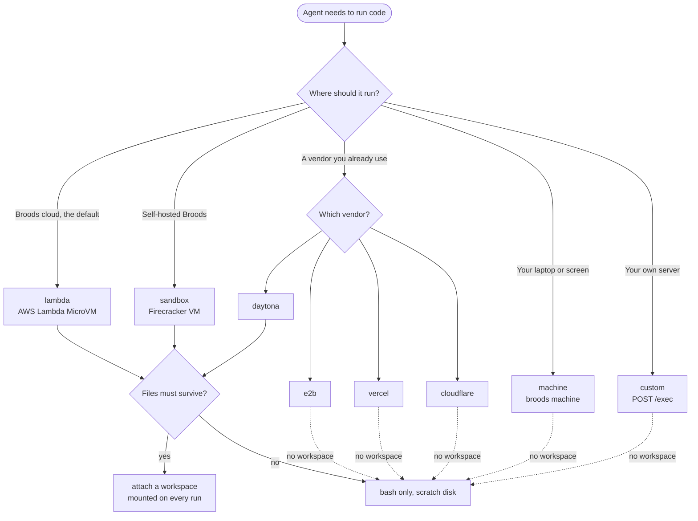
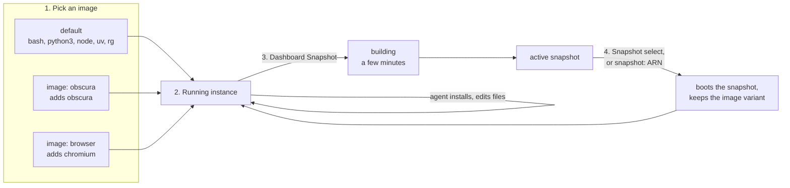

# Sandboxes

A sandbox is a Linux machine where your agent runs code. It gives the agent a `bash` tool with real `bash`, `python3` and `node` on the PATH, and, together with a [workspace](../workspaces.md), the file tools `read`, `write`, `edit`, `glob` and `grep`. An agent that only talks and calls APIs does not need one. Add a sandbox when the agent should run scripts, process files, install packages or drive a computer.

```ts title="broods/index.ts"
import { defineAgent, defineSandbox, env } from "broods";

export const box = defineSandbox({
  name: "box",
  provider: "lambda",
  network: { mode: "deny-all" },
  permissionMode: "ask",
  timeout: 60,
});

export const myAgent = defineAgent({
  name: "my-agent",
  provider: { openai: { apiKey: env("OPENAI_API_KEY") } },
  model: { provider: "openai", modelId: "gpt-5.5" },
  sandboxes: [box],
});
```

Only `provider` is required. Without a workspace every `bash` call gets a fresh machine, so nothing survives between calls. Attach a workspace for files that persist, or make the sandbox [persistent](persistent.md) to keep installed packages and running processes.

## Providers

| Provider     | What it is                   | Workspace mount | Persistent            | Background jobs         | Network enforcement            |
| ------------ | ---------------------------- | --------------- | --------------------- | ----------------------- | ------------------------------ |
| `sandbox`    | Broods-hosted Firecracker VM | yes             | yes, pause and resume | yes, with logs and stop | all modes, domain + CIDR lists |
| `lambda`     | AWS Lambda MicroVM           | yes             | yes, 8 h max per VM   | yes, with logs and stop | `allow-all` or no internet     |
| `daytona`    | Daytona sandbox              | yes             | yes, native auto-stop | yes, with logs and stop | all modes, CIDR lists only     |
| `e2b`        | E2B template                 | no              | yes, pause on timeout | yes, no logs or stop    | `allow-all` only               |
| `vercel`     | Vercel Sandbox               | no              | yes, named sandbox    | yes, with logs and stop | all modes, domain + CIDR lists |
| `cloudflare` | Cloudflare Container         | no              | yes, while warm       | no                      | `allow-all` or no internet     |
| `machine`    | Your own computer            | no              | no                    | no                      | `allow-all` only               |
| `custom`     | Your own server over HTTP    | no              | no                    | no                      | `allow-all` only               |

Pick by where the code should run, then by whether files must outlive a call:



`lambda` is the provider a sandbox gets when the API or the dashboard creates one without naming it. `sandbox` is not on the hosted service yet. Attaching a workspace to an `e2b`, `vercel`, `cloudflare`, `machine` or `custom` sandbox is rejected rather than falling back to provider storage. Setup, options and quirks per provider are on [Providers](providers.md), and `cloudflare` has [Cloudflare Containers](cloudflare.md). The `machine` provider has its own page, [Your computer](machine.md), and so does `custom`, [Your own server](custom.md).

## Configuration

| Field                  | Default                | What it does                                                                                                      |
| ---------------------- | ---------------------- | ----------------------------------------------------------------------------------------------------------------- |
| `provider`             | `lambda`               | Compute backend, from the table above                                                                             |
| `fallbackProvider`     | none                   | Ephemeral only. Where a run goes when `provider` is out of capacity. Cannot be `machine` or `custom`              |
| `size`                 | provider default       | Compute footprint on `sandbox` and `cloudflare`, ignored elsewhere, see [Sizes](#sizes)                           |
| `image`                | none                   | `lambda` only. `obscura` or `browser` boots a platform image with a headless browser, see [Images](#images)       |
| `snapshot`             | provider default       | Image or snapshot to boot from, in the provider's format, see [Images](#images)                                   |
| `network`              | `{ mode: "deny-all" }` | Outbound access, see [Network](#network)                                                                          |
| `permissionMode`       | `ask`                  | Which tool calls need approval, see below                                                                         |
| `runtimes`             | all                    | Advisory list of `bash`, `python`, `node`. The tool rejects obvious other runtimes. Not a security boundary       |
| `timeout`              | 30                     | Seconds per call. Maximum 600                                                                                     |
| `outputLimitBytes`     | 65536                  | Output kept per call. Maximum 262144                                                                              |
| `envVars`              | none                   | Variables injected into every run. Accepts `env("NAME")`. Encrypted at rest                                       |
| `options`              | none                   | Provider-specific settings, see [Providers](providers.md). On `lambda`, only `workspaceRoot` and `reservationKey` |
| `persistent`           | `false`                | Reserve a long-lived machine, see [Persistent sandboxes](persistent.md)                                           |
| `lifecycle`            | none                   | `idleTimeoutSeconds`, `maxLifetimeSeconds`. Needs `persistent: true`                                              |
| `onCreate`, `onResume` | none                   | Setup commands. Need `persistent: true`, not supported on `e2b`                                                   |

`envVars` cannot override the runtime's reserved names. Those are `PATH`, `HOME`, `LD_*`, `NODE_OPTIONS`, `PYTHONPATH`, `BASH_ENV`, `ENV`, `PROMPT_COMMAND`, the background-job slots and the run identity `BROODS_RUN_TOKEN`, `BROODS_AGENT_ID`, `BROODS_ACCOUNT_ID`, `BROODS_BASE_URL`. Those entries are dropped. The host environment, including any cloud credentials, never reaches a run.

Every command that blocks also receives that run identity: `BROODS_RUN_TOKEN` is a short-lived bearer that reads this agent's runs, `BROODS_AGENT_ID` and `BROODS_ACCOUNT_ID` say who it is, and `BROODS_BASE_URL` is the API base when the deployment publishes one. See [Calling the API from a sandbox](../../reference/http-api.md#calling-the-api-from-a-sandbox).

A call that blocks is capped at 600 seconds on every provider. Background jobs are not bound by the call timeout.

### Permission mode

| Mode     | `read`, `glob`, `grep` | `write`, `edit` | `bash` |
| -------- | ---------------------- | --------------- | ------ |
| `ask`    | auto                   | ask             | ask    |
| `edit`   | auto                   | auto            | ask    |
| `bypass` | auto                   | auto            | auto   |

Approval requests go to the caller over the direct API or WebSocket. Channels cannot answer an approval, so a tool that needs one is denied on a channel turn. Use `bypass` or `edit` for sandboxes that serve channel agents.

### Network

| Mode         | Meaning                                                                   |
| ------------ | ------------------------------------------------------------------------- |
| `allow-all`  | Outbound internet allowed                                                 |
| `deny-all`   | No outbound internet                                                      |
| `restricted` | Only `allowDomains` and `allowCidrs`, where the provider can enforce them |

```ts
network: {
  mode: "restricted",
  allowDomains: ["api.example.com"],
  allowCidrs: ["10.0.0.0/8"],
},
```

| Provider     | `allow-all` | `deny-all` | `restricted`                                                 |
| ------------ | ----------- | ---------- | ------------------------------------------------------------ |
| `sandbox`    | allowed     | denied     | domain and CIDR allowlist                                    |
| `lambda`     | allowed     | denied     | same as `deny-all`. Allowlists are rejected at validation    |
| `daytona`    | allowed     | denied     | CIDR allowlist only. Domain lists are ignored with a warning |
| `vercel`     | allowed     | denied     | domain and CIDR allowlist                                    |
| `cloudflare` | allowed     | denied     | rejected                                                     |
| `e2b`        | allowed     | rejected   | rejected                                                     |
| `machine`    | allowed     | rejected   | rejected                                                     |
| `custom`     | allowed     | rejected   | rejected                                                     |

A provider that cannot enforce a mode rejects the config instead of quietly granting more access. Background jobs report back to the platform over the network, so under `deny-all` a job still runs but its result has to be polled. See [Persistent sandboxes](persistent.md#background-jobs).

## Sizes

| Size     | vCPU | Memory | Disk  | Tier          |
| -------- | ---- | ------ | ----- | ------------- |
| `tiny`   | 0.25 | 0.5 GB | 8 GB  | free          |
| `xsmall` | 0.5  | 1 GB   | 8 GB  | free, default |
| `small`  | 1    | 2 GB   | 8 GB  | paid          |
| `medium` | 2    | 4 GB   | 16 GB | paid          |
| `large`  | 4    | 8 GB   | 32 GB | paid          |

`size` sizes the machine on `sandbox` and `cloudflare` only. Every other provider sizes its machines its own way. The dashboard shows a size only when it is known to be true: the provider reported it, or Broods set it itself. Anything else shows as `?`, never a guess; hover it to see why.

| Provider     | What `size` does                                                                             | Size the dashboard shows                                                      |
| ------------ | -------------------------------------------------------------------------------------------- | ----------------------------------------------------------------------------- |
| `sandbox`    | Creates the VM at that size, `tiny` rounded up to 0.5 vCPU                                   | The resources the VM was created with                                         |
| `cloudflare` | Starts the nearest instance type: `tiny` and `xsmall` `standard-1`, then `standard-2` to `4` | That instance type: 0.5 vCPU, 4 GB, 8 GB up to 4 vCPU, 12 GB, 20 GB           |
| `lambda`     | Nothing                                                                                      | 4 vCPU, 8 GB, 8 GB disk: the MicroVM's ceiling, every MicroVM the same        |
| `daytona`    | Nothing, the snapshot and Daytona's defaults size it                                         | vCPU, memory and disk Daytona reports                                         |
| `e2b`        | Nothing, the template sizes it                                                               | vCPU and memory E2B reports. Disk is `?`, E2B does not report it              |
| `vercel`     | Nothing, Vercel sizes it                                                                     | vCPU and memory Vercel reports. Disk is `?`, Vercel does not report it        |
| `machine`    | Rejected                                                                                     | CPUs, memory and home disk of your computer, as `broods machine` reports them |
| `custom`     | Rejected                                                                                     | No instance row: Broods cannot see your server's hardware                     |

When a sandbox's size is not known, the whole size shows as `?`. Daytona reports on every use, so its `?` clears the next time the sandbox runs, as does a `lambda` or `cloudflare` sandbox recorded before Broods verified sizes. Vercel's clears once Vercel reports a size. Broods reads an `e2b` size, and workdir fixes a `sandbox` size, only when the sandbox is created, so an older or unread one stays `?` until it is recreated.

On the managed service, sandbox time on platform credentials counts at the machine's size when Broods knows it, and at the size derived from the config when it shows `?`, except on `lambda`: a MicroVM counts at its 1 vCPU / 2 GB baseline, plus the vCPU and memory it bursts above that while in use, see [Persistent sandboxes](persistent.md). A `machine` sandbox, and one on your own provider credentials, does not count.

## Images

Set `snapshot` to boot a prebuilt image instead of the provider default. Bake heavy toolchains into an image once rather than installing them on every cold start. It is the one field for this on every provider, and each provider reads it in its own format.

| Provider     | `snapshot` names                                                      | The Snapshot action saves                                                                             |
| ------------ | --------------------------------------------------------------------- | ----------------------------------------------------------------------------------------------------- |
| `sandbox`    | a workdir image                                                       | the running instance                                                                                  |
| `lambda`     | a MicroVM image ARN, in the default image's AWS account and region    | every file changed since the machine started, built as a new image in a few minutes                   |
| `daytona`    | a Daytona snapshot                                                    | the sandbox filesystem, as a Daytona snapshot                                                         |
| `e2b`        | an E2B template or snapshot                                           | the sandbox, as an E2B snapshot. E2B pauses it while it captures                                      |
| `vercel`     | a Vercel image, such as `vercel/sandbox/python:3.14`, or a `snap_` id | the sandbox, as a Vercel snapshot that does not expire. Vercel stops it, and its next call resumes it |
| `cloudflare` | rejected. The bridge Worker's image sets the machine                  | not available                                                                                         |

The Snapshot action runs on a running instance of a persistent sandbox and saves it under a name you pick. Any sandbox of the same provider in the account can then pin it, with the Snapshot select on its node or `snapshot` in code. On `lambda`, workspace files stay in the workspace, and deleted files are not carried over.

A snapshot boots only on the provider that made it. A MicroVM image, a workdir image, a Daytona snapshot, an E2B template and a Vercel snapshot are different formats held by different clouds, and none of them imports another, so there is no snapshot that moves between providers. Put setup you need everywhere in `onCreate`, or bake it into each provider's image. Daytona, E2B and Vercel keep snapshots in the provider account behind the sandbox's credentials, so only a sandbox using the same credentials can boot one. Broods does not delete them, so remove ones you no longer need in the provider console.

On `daytona`, `options.image` builds the sandbox from a Docker image when it is created, instead of booting a snapshot. Set one or the other.

On `lambda`, a snapshot starts from a running instance and comes back as the image the next machine boots:



The dashboard Snapshots view shows which image each running instance booted from.

On `lambda`, `image` picks a platform image with a browser by name. With `snapshot` set too, the machine boots the snapshot and `image` names the variant it was built from, so a snapshot of an Obscura sandbox keeps `browse` working. The dashboard sets it when you pick the snapshot. `image` cannot be combined with `fallbackProvider`.

```ts
export const web = defineSandbox({
  name: "web",
  provider: "lambda",
  image: "obscura",
  network: { mode: "allow-all" },
});
```

| `image`   | Adds                                                                                                      | Use it for                                                       |
| --------- | --------------------------------------------------------------------------------------------------------- | ---------------------------------------------------------------- |
| `obscura` | [Obscura](https://github.com/h4ckf0r0day/obscura), about 77 MB: page to markdown, text, links, screenshot | Reading the web. Markdown is 3 to 17x smaller than a page's HTML |
| `browser` | Headless Chromium as `chromium`, about 770 MB                                                             | Screenshots that must match Chrome, heavy JavaScript apps        |

The agent then runs `obscura fetch https://example.com --dump markdown --quiet` through `bash`. Obscura refuses private and link-local addresses unless passed `--allow-private-network`.

A persistent `lambda` sandbox can also run a stdio MCP server from its image, such as `obscura mcp`, and keep it alive between calls. See [Run a server in a sandbox](../tools.md#run-a-server-in-a-sandbox).

## More than one sandbox

An agent lists its sandboxes in `sandboxes`. The first one is the default. `bash` without a workspace runs there, a workspace without its own sandbox mounts it, and a [harness](../agents.md) runs on it. Add more when one agent needs a second kind of machine, such as a browser image or a deny-all box.

```ts
export const myAgent = defineAgent({
  name: "my-agent",
  sandboxes: [general, offline], // general is the default
});
```

The model reaches a later sandbox by passing its name to `bash`, here `sandbox: "offline"`. The file tools never run there, and no workspace is mounted, so nothing written there reaches durable storage. A named sandbox wins over a `workspace` passed in the same call. A `machine` sandbox anywhere in the list also gives the agent a `computer` tool. Each sandbox may appear once, and only the first may also back a workspace.

## What the model sees

With a workspace, `bash` starts in the workspace directory and file tools take relative paths. Tell the model to use relative paths such as `analysis.json` or `src/index.ts`. Provider mount paths belong in logs, not prompts.

```text
write  notes/a.txt          # creates parent folders
read   notes/a.txt          # numbered lines
edit   notes/a.txt          # exact, unique string replacement
glob   **/*.py              # newest first
grep   TODO                 # ripgrep
bash   python3 notes/run.py
```

Without a workspace only `bash` exists and each call is a new machine, so write and run in one command:

```bash
cat <<'EOF' > /tmp/run.py
print("ok")
EOF
python3 /tmp/run.py
```

`bash` also takes `pty: true` for programs that refuse to run without a terminal. The output then merges stderr into stdout and ends lines with CRLF, so leave it off when you need byte-exact output.

`bash` returns stdout and stderr as text. Output is truncated at `outputLimitBytes`.

## Examples

| Demo                                                                                                                        | Shows                                  |
| --------------------------------------------------------------------------------------------------------------------------- | -------------------------------------- |
| [`sandbox`](https://github.com/beeblastco/broods/tree/dev/packages/demos/sandbox)                                           | Stateless bash on `sandbox`            |
| [`sandbox-lambda`](https://github.com/beeblastco/broods/tree/dev/packages/demos/sandbox-lambda)                             | Stateless bash on `lambda`             |
| [`sandbox-workspace`](https://github.com/beeblastco/broods/tree/dev/packages/demos/sandbox-workspace)                       | File tools on a workspace              |
| [`sandbox-workspace-persistent`](https://github.com/beeblastco/broods/tree/dev/packages/demos/sandbox-workspace-persistent) | Persistent sandbox and background jobs |
| [`sandbox-multiple`](https://github.com/beeblastco/broods/tree/dev/packages/demos/sandbox-multiple)                         | A default sandbox plus a deny-all one  |

How executors, mounts and credentials work inside the platform is covered in [Sandbox internals](../../internals/sandboxes.md).
