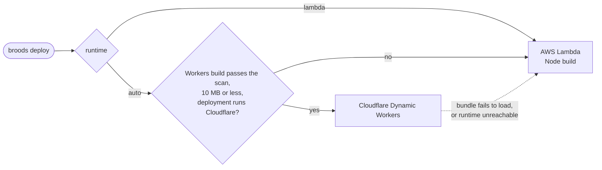

# Tools

An agent gets tools from four places:

| Source                | How you enable it                | Examples                                                    |
| --------------------- | -------------------------------- | ----------------------------------------------------------- |
| Your model provider   | `tools` on the agent             | `googleSearch`, OpenAI `webSearch`, Anthropic `computerUse` |
| MCP servers           | `defineMcp` + `mcp` on the agent | Any MCP server, yours or a vendor's                         |
| Sandboxes, workspaces | `sandboxes`, `workspaces`        | `bash`, `read`, `write`, `edit`, `glob`, `grep`             |
| Broods features       | the matching agent setting       | `browse`, `load_skill`, `run_subagent`, `schedule`          |

This page covers the first two, approvals, and the built-in tools. Sandbox tools are in [Sandboxes](sandboxes/index.md).

## Provider tools

Import the tool from the provider's AI SDK package and pass it in, keyed by the name the provider uses:

```ts title="broods/index.ts"
import { google } from "@ai-sdk/google";
import { defineAgent, env } from "broods";

export const researcher = defineAgent({
  name: "researcher",
  provider: { google: { apiKey: env("GOOGLE_API_KEY") } },
  model: { provider: "google", modelId: "gemini-3-flash" },
  tools: {
    googleSearch: google.tools.googleSearch({ searchTypes: { webSearch: {} } }),
    urlContext: { ...google.tools.urlContext({}), needsApproval: true },
  },
});
```

The provider runs these tools itself during the model call. Available names depend on `model.provider`. Google has `googleSearch`, `urlContext`, `googleMaps`, `codeExecution`, `fileSearch` and `enterpriseWebSearch`. OpenAI has `webSearch`, `codeInterpreter` and `fileSearch`. Anthropic has `computerUse`, `bash`, `textEditor` and `webSearch`. A name the provider does not have fails the run and lists the names it does have.

A tool that your code would execute, such as the Tavily AI SDK package, cannot go in `tools`, because a function does not survive sync. Put it behind an MCP server.

## MCP servers

Broods connects to any MCP server that speaks the stateless Streamable HTTP transport. Tools show up as `<server>__<tool>`, for example `search__query`. A result with an image, such as a screenshot, reaches the model as an image the model can look at: a PNG, JPEG, GIF or WebP no wider or taller than 8000 pixels, up to 8 images and 6 MB per result. Any other image, and other non-text blocks, are named in the text.

### Connect a server

```ts title="broods/index.ts"
import { defineAgent, defineMcp } from "broods";

export const search = defineMcp({
  name: "search",
  url: "https://mcp.example.com/mcp",
  headers: { Authorization: "Bearer ${SEARCH_TOKEN}" },
  allowedTools: ["query"], // optional, omit to allow all
});

export const agent = defineAgent({
  name: "assistant",
  mcp: { [search.name]: { enabled: true, needsApproval: false } },
});
```

Rules:

- `name` is 1 to 32 lowercase letters, digits or hyphens, starts with a letter, and is unique per stage.
- The URL must be public. Private, loopback, link-local and metadata addresses are refused, and so are redirects. For a server on `localhost` or your network, run it on your computer with the [machine sandbox](sandboxes/machine.md).
- Credential headers such as `Authorization` or `X-Api-Key` must name an environment variable inside a plain string, `"Bearer ${SEARCH_TOKEN}"`. Inline secrets are rejected. A template literal around `env()` sends `[object Object]`.
- Reads show a header's value only while it is `${NAME}` refs. Any other value reads back as `********`, since a sync stores refs resolved. Sending `********` back keeps the stored value.
- Every agent that connects the server gets its headers and `oauth`, and an agent's own value wins. Header names compare case-insensitively. `broods dev` pushes the named variables from `.env.local`, and a sync is refused while one has no value on the stage.
- Removing `headers` or `allowedTools` from `defineMcp` removes them from the server on the next sync.
- Tool lists are cached for the time the server's listing allows. Server-pushed list changes are not supported.
- Every request carries `X-Broods-Agent-Id` (the calling agent) and, when the requester is known, `X-Broods-Principal` (base64url JSON of the delegation chain: who asked, then each agent that delegated, the caller last; ids and kinds only, no display names). A server can authorize per agent on them. Hosted servers read the same headers off the `Request` they are handed. Both names are reserved: a configured header of either name, in any case, is dropped. Tool lists are shared across agents, so authorize in the call, not by hiding tools from the list.

### Servers with expiring OAuth tokens

Some servers, such as Google's Workspace MCP endpoints, only accept short-lived access tokens. Give `oauth` instead of an Authorization header, and Broods mints, caches and refreshes the tokens:

```ts
export const gmail = defineMcp({
  name: "gmail",
  url: "https://gmailmcp.googleapis.com/mcp/v1",
  oauth: {
    clientId: "1234.apps.googleusercontent.com",
    clientSecret: env("GMAIL_CLIENT_SECRET"),
    refreshToken: env("GMAIL_REFRESH_TOKEN"),
    // tokenUrl defaults to https://oauth2.googleapis.com/token
  },
});

export const assistant = defineAgent({
  name: "assistant",
  // the CLI copies the server's oauth here, where the secrets resolve
  mcp: { [gmail.name]: { enabled: true } },
});
```

Both the server URL and `tokenUrl` must be `https`.

### Host your own server on Broods

Write the server in the same file and Broods runs it for you:

```ts
import { defineMcp } from "broods";
import { createMcpHandler, McpServer } from "@modelcontextprotocol/server";

export const greeter = defineMcp({
  name: "greeter",
  handler: createMcpHandler(() => {
    const server = new McpServer({ name: "greeter", version: "1.0.0" });
    // server.registerTool(...)
    return server;
  }),
});
```

Install `@modelcontextprotocol/server` in your project. The CLI bundles the file, checks that the handler loads, and uploads it on sync.

- The factory must build a new server on every call. Calls from one model step run at the same time, and a shared instance breaks.
- Bundles are capped at 50 MB. The calls from one model step to one server run as a batch, and the batch shares a 30 second deadline and 16 MB of output.
- Hosted servers run outside the Broods core: in a Workers isolate per bundle, or one Lambda child process per bundle. Accounts can share a warm runner environment today, so keep secrets out of module-level state. The first call after an idle period is a cold start.
- Module-level state, such as a memoized client, survives between calls of the same bundle.
- By default (`runtime: "auto"`) Broods runs a server on Cloudflare Dynamic Workers when its bundle can run there, and on AWS Lambda otherwise. See [Where a hosted server runs](#where-a-hosted-server-runs).

See the runnable [`mcp-connect` demo](https://github.com/beeblastco/broods/tree/dev/packages/demos/mcp-connect), and [Cloudflare Browser Run](sandboxes/browsing.md#cloudflare-browser-run) for a worked hosted server.

#### Where a hosted server runs



| Runtime    | Picked when                                                       | Bundle cap         | Per call                      |
| ---------- | ----------------------------------------------------------------- | ------------------ | ----------------------------- |
| Cloudflare | `auto`, and the bundle builds for Workers and needs nothing below | 10 MB, sent inline | 30 s, 5 s CPU, 50 subrequests |
| Lambda     | `lambda`, or anything else                                        | 50 MB              | 30 s shared by the batch      |

For a server that mostly does `fetch` calls and JSON, Workers costs about a quarter of Lambda per call and starts in milliseconds. Both runtimes take up to 6 MiB in and 16 MiB out per batch, and both bill one request per batch plus its wall time. The Compute panel shows no CPU figure for Cloudflare calls.

A server goes to Lambda when it uses:

- Node builtins (`node:child_process`, `node:fs`, ...), `require()`, `process`, `Buffer`, `__dirname`, native modules or a filesystem.
- `eval` or `new Function`, which Workers forbid.

The CLI tries a Workers build first (browser and `workerd` package exports) and ships it when it passes the same static scan Broods runs on every upload. The scan leans toward Lambda.

- If the bundle fails to load on Cloudflare, or the runtime cannot be reached, nothing has run yet, so that batch runs on Lambda and logs a warning. Any other runtime error fails the call. A call that started on Cloudflare is never retried, because a tool may already have acted.
- A server that loads on Workers but fails while serving a call stays there until its code changes.
- Each agent's copy of a server runs in its own isolate with no bindings and no platform secrets. Pass credentials through `headers` with `${NAME}` refs, as on Lambda.
- Outbound `fetch` reaches the public internet. Raw TCP sockets (`connect()`) are not available.
- A self-hosted Broods runs every server on Lambda until it deploys the Cloudflare runtime, see [Self-hosting](../internals/self-hosting.md#cloudflare-mcp-runtime-optional). How the runtimes work is in [Tools and MCP internals](../internals/tools-and-mcp.md#hosted-servers).

### Run a server on your computer

A server in your `.mcp.json`, such as a Blender or filesystem server, can run on your machine and serve cloud agents. Name the machine sandbox instead of a URL. See [Machine](sandboxes/machine.md).

### Run a server in a sandbox

A stdio server installed in a sandbox image can run inside a persistent `lambda` sandbox. Name the sandbox and give the server's `command`:

```ts
export const web = defineSandbox({
  name: "web",
  provider: "lambda",
  image: "obscura",
  persistent: true,
  network: { mode: "allow-all" },
});
export const obscura = defineMcp({
  name: "obscura",
  sandbox: web,
  command: ["obscura", "mcp"],
});
export const researcher = defineAgent({
  name: "researcher",
  sandboxes: [web],
  mcp: { obscura: { enabled: true } },
});
```

- The sandbox must be `persistent: true` and listed in the agent's `sandboxes`.
- The server starts on the first call and keeps running for as long as the reserved sandbox lives, so its state, such as a browser session, carries over between calls and runs.
- `command` is required on a `lambda` sandbox. A machine sandbox ignores it and uses its own `.mcp.json`.
- The tool listing is cached for a few minutes, and refetched sooner when the server or its sandbox changes, so most runs do not start the sandbox just to list tools. A listing with nothing cached starts it.
- The server shares the VM that `bash` uses on that sandbox, including its workspace, and sees the sandbox's env vars. Changing them restarts the server.
- A call times out after the sandbox's `timeout`, or 120 seconds when the sandbox sets none.
- The MCP explorer in the dashboard runs the server on the VM of an agent that uses it on that sandbox (a running one first), and starts a VM of its own only when no agent uses it there. A sandbox that pins `options.reservationKey` shares one VM with the explorer and every agent.

## Approvals

`needsApproval: true` on a provider tool or an MCP entry pauses the run before the tool executes. Sandbox tools follow the sandbox `permissionMode` instead.

| Where the run came from | What happens                                                                      |
| ----------------------- | --------------------------------------------------------------------------------- |
| SSE or `broods run`     | The stream sends an approval request. Resume with a `tool-approval-response`.     |
| Background run          | Status becomes `awaiting_approval` with an `approvals` list.                      |
| Channel                 | The tool is denied with "Tool approval is only supported through the direct API." |

Keep approval off for agents that only live in channels. Approval also breaks subagents that inherit it. See [Subagents](subagents.md).

## Asking the user

`ask_questions` lets the agent ask one to three multiple-choice questions and keep working. It is on automatically for channel and WebSocket runs, which have somewhere to post the question and resume. Plain HTTP runs, cron runs and subagents do not get it.

Each question has an `id`, a short `header`, the `question`, and two to four `options`. Every question also takes the person's own typed answer, so the agent never needs an "Other" option. With `blocking: false`, the default, the agent keeps working and the answer arrives later. With `blocking: true` the turn ends and the answer resumes it. Unanswered questions expire after `timeoutSeconds`, one day by default, between 30 seconds and 7 days.

| Where       | The question appears as                  | The user answers by                                                                            |
| ----------- | ---------------------------------------- | ---------------------------------------------------------------------------------------------- |
| Telegram    | inline buttons                           | tapping a button                                                                               |
| Slack       | numbered text with buttons               | clicking a button, or replying like any other chat                                             |
| Other chats | numbered text                            | replying with the number, the label, or free text. The reply answers the oldest open question. |
| Any client  | status `awaiting_input` with `questions` | posting `answers: [{ statusId, answers: { <id>: [labels] } }]` to `/v1/runs` with no `events`  |
| WebSocket   | a `question-request` frame               | an `execute` frame carrying `answers`                                                          |

## Web browsing

`browser: { enabled: true }` gives the agent `browse`, which reads a page as markdown, text or links, runs JavaScript in it, or screenshots it, on a sandbox with the Obscura image. See [Web browsing](sandboxes/browsing.md), which also covers Chromium images and Cloudflare Browser Run.

## Background tools

`async_status` appears on its own when the agent can start background work, through a workspace on a persistent sandbox or a tool marked `async: true`. The model uses it to check, tail or stop that work. See [Persistent sandboxes](sandboxes/persistent.md).

## Other built-in tools

| Tool                                                                      | Enabled by                          | Guide                                         |
| ------------------------------------------------------------------------- | ----------------------------------- | --------------------------------------------- |
| `browse`                                                                  | `browser`                           | [Web browsing](sandboxes/browsing.md)         |
| `load_skill`                                                              | `skills`                            | [Skills](skills.md)                           |
| `run_subagent`, `get_subagent_status`, `update_subagent`, `stop_subagent` | `subagent`                          | [Subagents](subagents.md)                     |
| `ask_parent`                                                              | the run being a persistent subagent | [Subagents](subagents.md)                     |
| `schedule`, `list_schedules`, `update_schedule`, `cancel_schedule`        | `scheduler`                         | [Scheduling](scheduling.md)                   |
| `memory_save`                                                             | a workspace with a sandbox          | [Memory and sessions](memory-and-sessions.md) |
| `send-message`, `send-images`, `send-files`, `send-update`, ...           | channel turns                       | [Channels](../channels/index.md)              |
| `computer`                                                                | a machine sandbox with `--computer` | [Machine](sandboxes/machine.md)               |

Withhold any tool in one channel with `denyTools` on its [channel record](../channels/channel-records.md), or everywhere with a [policy](policies.md).
