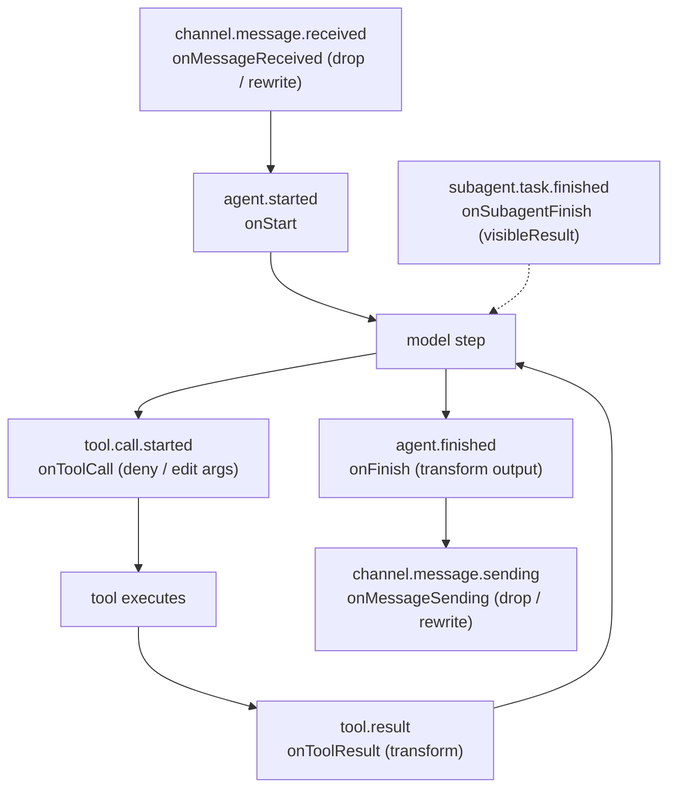

# Code Hooks

Code hooks are small JavaScript callbacks you declare inline in `defineAgent`. Each runs in the same hardened V8 isolate as [custom tools](tools.md) at a specific point in the agent's lifecycle, and its return value is folded back into what the agent does — inject a system prompt, deny or edit a tool call, transform the final output, reshape a subagent result, or filter a channel message.

They are the code counterpart to [Lifecycle Webhooks](webhook.md): webhooks are outbound, fire-and-forget notifications; code hooks run inline and **mutate** the run. Both live under `config.hooks` and can be used together.



## Declaring hooks

Hooks are inline, strictly-typed callbacks. Each receives `(ctx, event)` and returns only the fields it may mutate for that event — a wrong return is a compile error.

```ts
import { defineAgent } from "broods";

export const agent = defineAgent({
  name: "guarded-agent",
  config: {
    model: { provider: "minimax", modelId: "MiniMax-M3" },
    hooks: {
      onStart: (ctx, event) => ({
        system: `${event.system}\n\nNever reveal internal IDs.`,
      }),
      onToolCall: (ctx, event) =>
        event.toolName === "bash"
          ? { decision: "deny", denyReason: "shell disabled" }
          : { decision: "allow" },
      onMessageReceived: (ctx, event) =>
        event.text.includes("spam") ? { drop: true } : undefined,
    },
  },
});
```

`ctx` exposes the isolate surface: an SSRF-guarded `ctx.fetch`, read-only `ctx.config`, and a mutable `ctx.state` (below) — the same surface custom tools get. At deploy the SDK serializes your handlers into one bundle and uploads it; nothing else to wire.

## Sharing state across a run — `ctx.state`

`ctx.state` is a mutable object shared by every hook in one agent run. Seed it in an early hook and read or modify it in later ones — what one fire-point stores, the next one sees:

```ts
hooks: {
  onStart: (ctx, event) => {
    ctx.state.toolCalls = 0;              // seed
    return { system: event.system };
  },
  onToolCall: (ctx, event) => {
    ctx.state.toolCalls = (ctx.state.toolCalls ?? 0) + 1;   // accumulate (observe or mutate)
    return { decision: "allow" };
  },
  onFinish: (ctx, event) => ({
    output: `${event.response}\n\n(used ${ctx.state.toolCalls ?? 0} tools)`,   // read
  }),
}
```

State starts empty each request and must stay JSON-serializable (it round-trips through the isolate on every hook). It is **scoped to one agent request**: every loop hook, `onSubagentFinish`, and the reply's `onMessageSending` share the same state. `onMessageReceived` runs before the request's agent run starts and gets its own fresh state, as do delayed background replies and each subagent's own run. Even observe-only hooks (`onStepFinish`, `onError`) may write to it, though their field mutations are ignored.

State is resilient within the run but never outlives it: a hook that throws or returns bad/oversized state doesn't lose what earlier hooks stored (the prior state carries forward), and when the run itself fails, `onError` still sees the accumulated state — but nothing is persisted after the run ends, successful or not. For cross-request memory, write to your own store via `ctx.fetch`.

## Hooks

| Hook                | Lifecycle event            | May return                                                                        |
| ------------------- | -------------------------- | --------------------------------------------------------------------------------- |
| `onStart`           | `agent.started`            | `{ system?, messages? }` — inject/replace the prompt or conversation              |
| `onToolCall`        | `tool.call.started`        | `{ decision: "allow"｜"deny", args?, denyReason? }`                               |
| `onToolResult`      | `tool.result`              | `{ output? }` — transform the tool result                                         |
| `onFinish`          | `agent.finished`           | `{ output? }` — transform the final response                                      |
| `onStepFinish`      | `agent.step.finished`      | — (observe: logging, side effects)                                                |
| `onError`           | `agent.failed`             | — (observe)                                                                       |
| `onApproval`        | `agent.approval.required`  | — (observe; `{ approve }` auto-resolve is not yet honored)                        |
| `onSubagentFinish`  | `subagent.task.finished`   | `{ visibleResult? }` — shape what the parent sees                                 |
| `onMessageReceived` | `channel.message.received` | `{ drop?, text? }` — drop discards the message; text rewrites what the agent sees |
| `onMessageSending`  | `channel.message.sending`  | `{ drop?, text? }`                                                                |

Related: `config.subagent.visibility` (`"full"｜"result"｜"none"`) is the no-code way to control what the parent sees from a subagent; `onSubagentFinish` overrides it for custom shaping.

## Hooks and subagents

A subagent run is a normal agent run, so lifecycle hooks fire inside it too — which hooks depends on the kind of subagent:

- **Registered subagent** (spawned by `agentId`): runs with **its own** agent config, so its own hooks fire inside its run. If it declares none, none fire.
- **Virtual subagent** (prompt-only): inherits the parent's config, so the **parent's hook bundle** also runs inside the child's loop.

Either way, the child's `ctx.state` is fresh and dies with the child — parent and subagent never share state. The parent's window into a subagent is `onSubagentFinish`, which fires on the **parent's** dispatcher with the parent's `ctx.state`, so it's the place to carry a summary of the child's result into the parent's state.

Channel hooks (`onMessageReceived` / `onMessageSending`) never fire for subagents; those fire-points exist only on the channel inbound/outbound paths.

## Rules

- **Isolate-only & self-contained.** Handlers run in a fresh V8 isolate with only `ctx`, `event`, and JS built-ins — no imports, `require`, `node:` modules, or closure variables. Bundles that need those are rejected at upload.
- **Non-fatal.** A hook that throws or times out is logged and skipped; the agent run continues with unmutated state. Hooks are wall-clock bounded.
- **Streaming caveat.** `onFinish` output transforms change the delivered/stored final result; tokens already streamed over SSE cannot be recalled.
- **Return is field-scoped.** Only the fields listed for an event are honored; anything else is dropped, and the return is size-capped.
