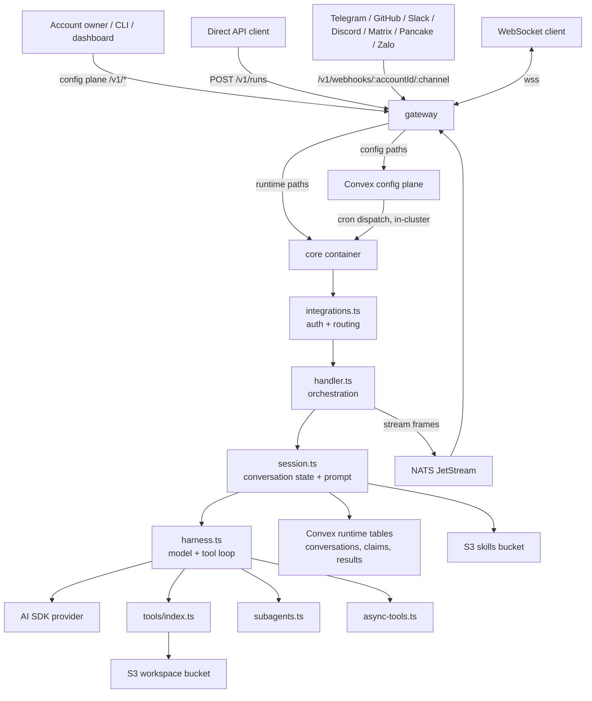
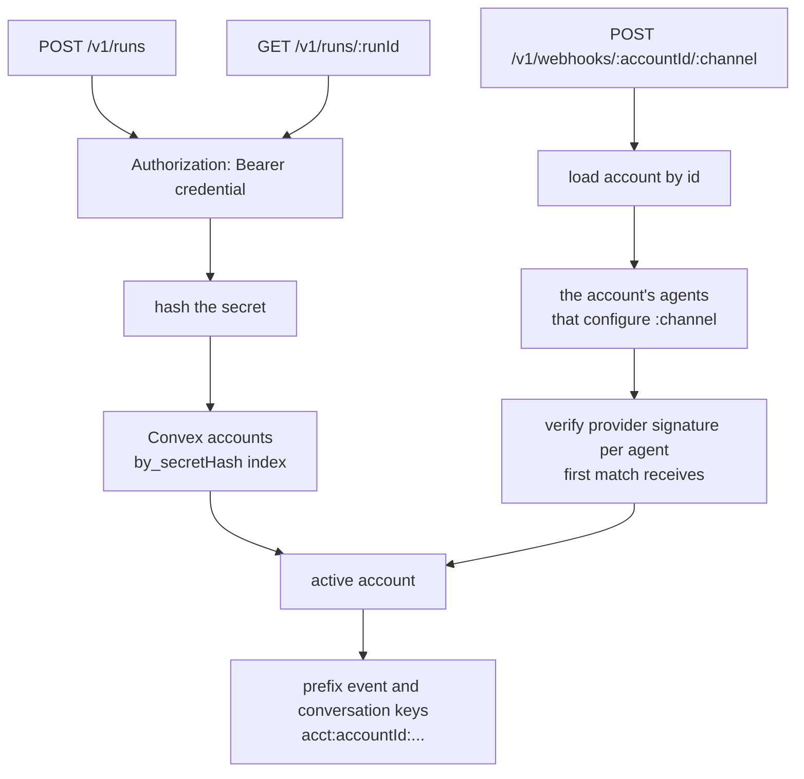
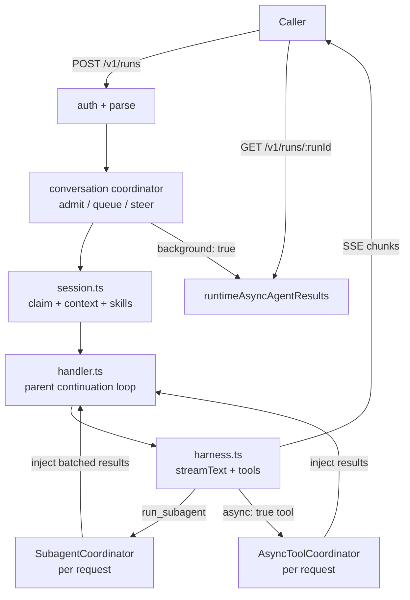
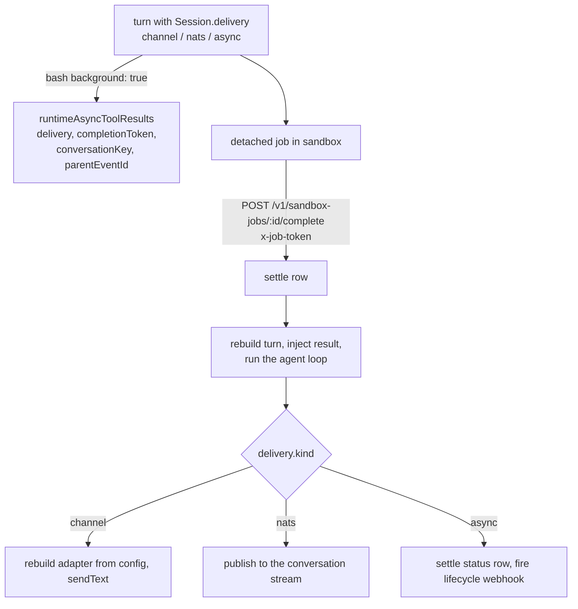
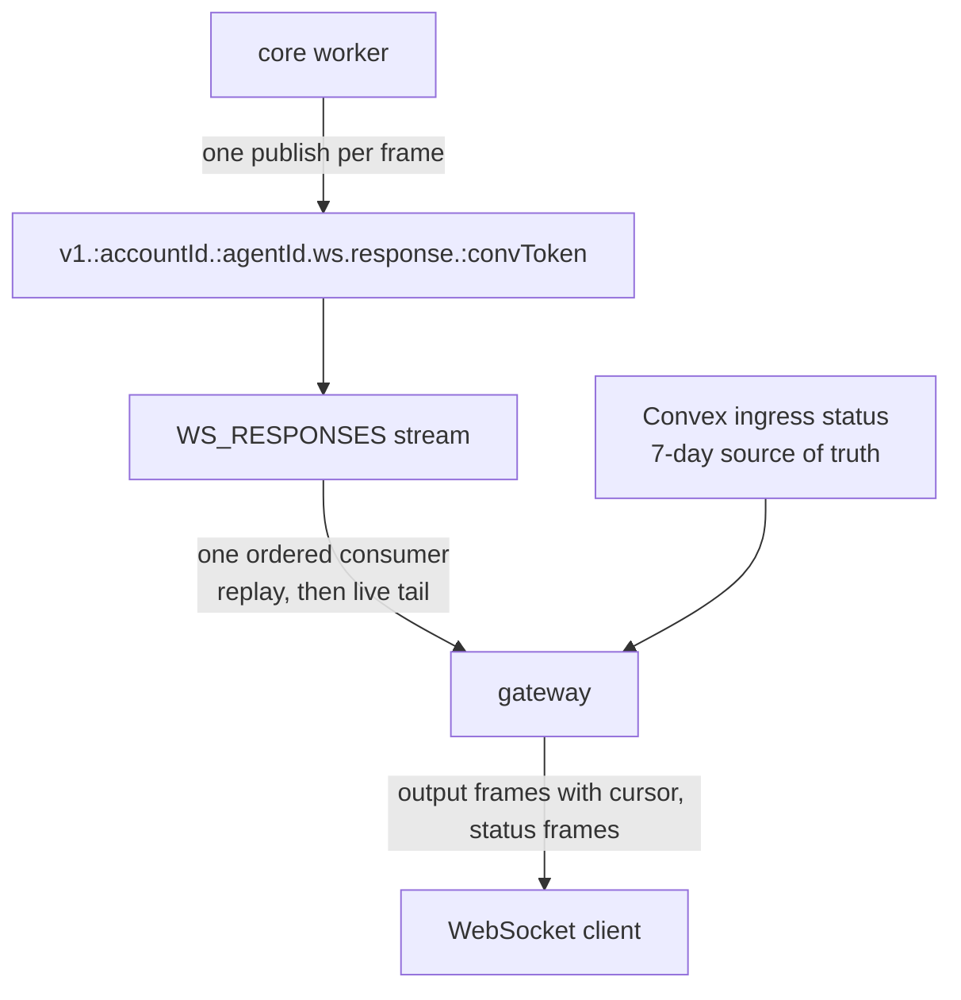

# Architecture

This page follows a request from the gateway to the agent loop and back, and lists where every record is stored. Read it before changing core, the gateway or the Convex runtime tables. Paths are relative to `apps/core/` unless they name another workspace.

## Runtime layer

Core is one Bun container (`src/server.ts`). It turns each HTTP request into a transport-neutral `CoreRequest`, routes it by path to the account handler or the harness handler, and streams the Web `Response` back through the gateway.

- SST provisions the AWS data plane and IAM. The container itself is deployed from the infra repo.
- Handlers take a `CoreRequest` and return a Web `Response`.
- `ctx.waitUntil(...)` lets a channel webhook acknowledge the provider at once and keep working after the response.

## High-level view

The gateway splits config-plane paths from core paths, so account, agent, skill, cron and file CRUD go to Convex and never touch core. Core reads config from Convex with a deploy key (`ConvexHttpClient`).

## Account routing

Every runtime request resolves an account and one of its agents before any agent work begins. `integrations.ts` resolves the account once, loads the selected agent, and passes the runtime config down to `handler.ts` and `session.ts` so the turn does no further lookups. That runtime projection keeps model, tool, workspace and skills config but strips channel credentials before the agent loop.

Credentials that reach runtime routes:

- The account secret (`fp_acct_`), full tenant access.
- A stage runtime key (`fp_agent_`), scoped server-side to one account, project, stage and endpoint. A request body cannot redirect it.
- A role session (`fp_sts_`), bounded by the role's policy. See [security](security.md).
- A dashboard stage session ticket (`fp_dts_`), fifteen minutes, signed by Convex with `STAGE_TICKET_SECRET`.
- The service token. A request with `SERVICE_AUTH_SECRET` plus an `X-Account-Id` header acts for that account. Only Convex uses it, and only on core's in-cluster address. Core refuses it on any request that came through the gateway. See [operations](operations.md#service-token-rules).

Root provider webhooks are not accepted. A webhook URL names the account and the channel, never an agent. The credentials that verify the request pick the receiving agent, and a [channel record](../channels/channel-records.md) can then re-target the run. A non-production stage has its own URL form, `/v1/webhooks/{accountId}/dev/{endpointId}/{channel}`, delivered only to that stage.

## Account management

`POST /v1/accounts` with the `AdminAccountSecret` creates an account and returns its secret once; only `secretHash` is stored. Hosted onboarding does not use this path: the dashboard creates accounts through the Convex config plane against a WorkOS organization.

Secret-like fields in agent config are redacted as `********` on reads. Sending `********` back in a patch keeps the stored value. `PATCH` deep-merges `config`, and `null` deletes a key.

Deleting an account runs account-scoped cleanup first: runtime rows whose keys start with `acct:{accountId}:`, the account's workspace namespaces in S3, and reserved sandboxes.

## Direct and async runs

`POST /v1/runs` is the single runtime entry point. Without `background` it streams the turn as SSE. With `background: true` it answers `202` with a `runId` once the run is durably accepted, and the caller polls `GET /v1/runs/{runId}`. A busy conversation follows the [queue and steer](queue-and-steer.md) contract in both cases.

Background runs start an in-process worker, capped by `MAX_INPROCESS_WORKERS`. Subagents and built-in async tools run inside that request or worker; there are no child worker processes. MCP tools are synchronous request/response. See [subagents](subagents.md) and [tools and MCP](tools-and-mcp.md).

`ENABLE_DIRECT_API` in core's container env gates `POST /v1/runs`. It defaults to `true`; set it to `false` and the route answers `404`. Channel webhooks, cron runs and internal workers keep working either way.

## Deferred delivery

A detached sandbox job can outlive the request that launched it, so its result has to find its way back to wherever the turn came from. The turn carries a small delivery descriptor, `Session.delivery`, and the job persists it. No live connection state has to survive.

- A channel delivery stores `{ channelName, source }`, the routing payload only. Channel credentials are decrypted from agent config again at delivery time.
- The completion endpoint is authenticated by the per-job token minted at launch. No account secret is stored with the job or enters the sandbox.
- Resuming reuses the async-tool continuation path. See `bash.tool.ts`, `handler.ts` (`continueAfterAsyncToolSettlement`, `pushReplyToChannel`) and `integrations.ts` (`sendChannelReply`).

## WebSocket streaming over NATS JetStream

Core publishes streaming output to a conversation-scoped JetStream subject, and the gateway relays it to WebSocket clients. Because the stream is keyed by conversation and not by socket, a client that drops can reconnect on a fresh socket and replay what it missed, including a background job result that arrived after the original socket closed.

`convToken` is `base64url(publicConversationKey)`, one NATS-safe token.

- Replay is best-effort and status is durable. Core publishes without a per-frame PubAck, so a transient NATS failure can drop a frame before JetStream stores it. When the output a client needs was never stored or has aged out, the client falls back to the Convex status and result.
- Retention is `max_age` of about 3 minutes and `max_msgs_per_subject` of 2,000. There is no manual purge: sequential FIFO work shares a subject, so one event's completion must not erase another's replay range.
- Each publish carries `Nats-Msg-Id` (`eventId:sequence`), and the stream's roughly 2 minute `duplicate_window` collapses retries.
- `RESPONSE_STREAM_STORAGE` is `File` by default. `Memory` is cheaper but lost on restart. `ensureResponseStream` syncs the mutable retention knobs onto an existing stream. HA `replicas: 3` triples storage.
- `connectNats` in `src/shared/nats.ts` picks the transport from `NATS_URL`: `wss://` or `ws://` uses `nats.ws` for out-of-cluster callers, `nats://` or `tls://` uses core TCP for in-cluster callers. `NATS_TOKEN` carries token auth.
- `connectionId` is only a routing label on headers. Overlapping turns on one conversation share the subject and are grouped by `headers.eventId`.
- `ENABLE_WEBSOCKET=true` plus `NATS_URL` are required for `nats-worker` invocations. With WebSocket off, the direct API is SSE-only and NATS config is ignored.

The cluster NATS runs JetStream with a WebSocket listener behind Traefik at `wss://nats.beeblast.co` (token auth from the `nats-auth` secret) and a file-backed PVC. Core `4222` stays cluster-internal. For production durability, enable JetStream clustering.

Attach, cursors and control frames are specified in [queue and steer](queue-and-steer.md#attach-and-output-replay).

## Sandbox and workspace resolution

Sandboxes and workspaces are independent account-scoped records referenced from agent config by id. `resolveAgentRuntime` in `src/shared/workspaces.ts` resolves them before the loop:

- The first id in `config.sandboxes` is the default sandbox. A workspace can pin its own with `workspaces[].sandbox`. Later ids are `bash` targets by name, and `computer` targets when they are machines.
- Each workspace's effective sandbox decides its tools: the full file tool set when present, read-only `read` and `glob` when absent.
- `permissionMode` is resolved per call from the selected workspace's sandbox.
- A workspace namespace is `hash(accountId:workspaceId)`, so agents that reference one `workspaceId` share files.

Every sandbox tool compiles to one `run` against the provider. See [sandboxes](sandboxes.md) and [storage](storage.md).

## Storage boundaries

Every stage keeps config and runtime state in Convex (`packages/convex/schema.ts`). S3 holds bytes.

| Store                                                      | Holds                                                                          |
| ---------------------------------------------------------- | ------------------------------------------------------------------------------ |
| Convex `accounts`                                          | Account metadata and `secretHash`                                              |
| Convex agents                                              | Encrypted agent config                                                         |
| Convex `sandboxConfigs`, `workspaceConfigs`                | Account-scoped records referenced by id                                        |
| Convex `mcp`                                               | Registered MCP servers, external and hosted                                    |
| Convex `crons`                                             | Scheduled runs, written in the same transaction as their schedule              |
| Convex `runtimeConversationEvents`                         | Normalized model messages by scoped `conversationKey`                          |
| Convex `runtimeClaims`                                     | Event dedup markers and conversation leases                                    |
| Convex `runtimeAsyncAgentResults`                          | Background runs and subagent state for `GET /v1/runs/{runId}`                  |
| Convex `runtimeAsyncToolResults`, `runtimeAsyncToolGroups` | Async tool state, detached group fan-in, delivery metadata, structured outputs |
| Convex `sandboxReservations`, `sandboxInstances`           | Reserved sandbox ids for persistent providers                                  |
| Convex `configAuditEvents`                                 | Config mutations, read by the dashboard Audit Logs tab                         |
| S3 workspace bucket (`FILESYSTEM_BUCKET_NAME`)             | Workspace files by namespace, staged skills                                    |
| S3 skills bucket                                           | Skill bundles under `<accountId>/<skill-name>`                                 |
| S3 tool-bundles bucket                                     | Code hook bundles and hosted MCP bundles under `account-mcp/`                  |

Built-in tools run inline in the core process. Hosted MCP bundles run on the mcp-runner Lambda. Inline code hooks run in a V8 isolate in a Node child of core. See [security](security.md).
