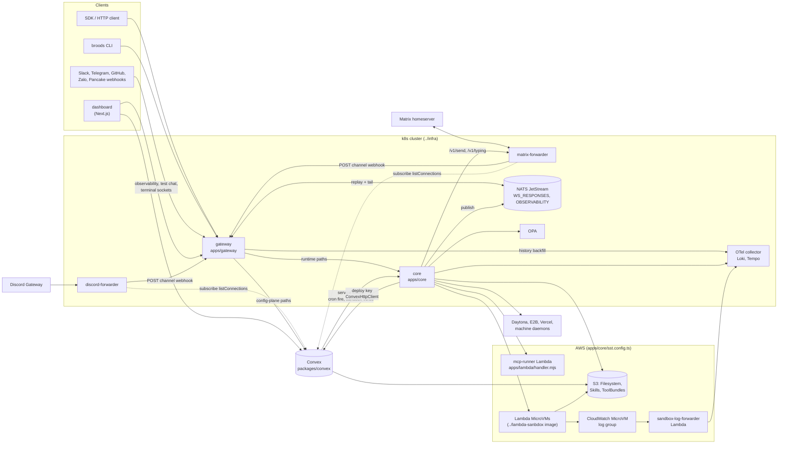
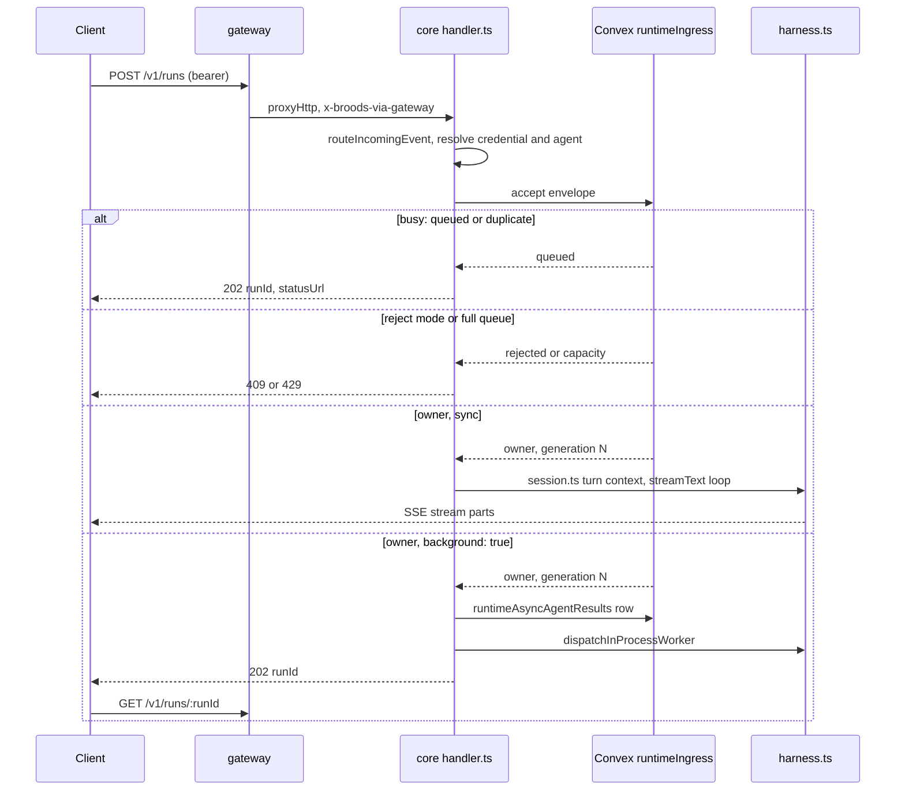
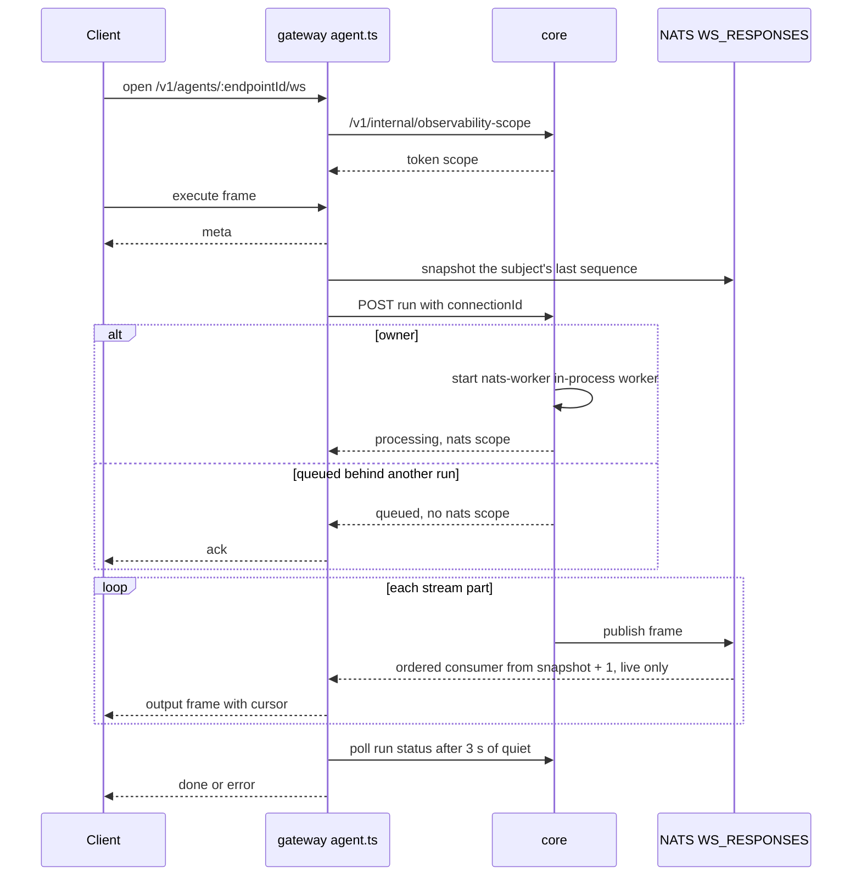
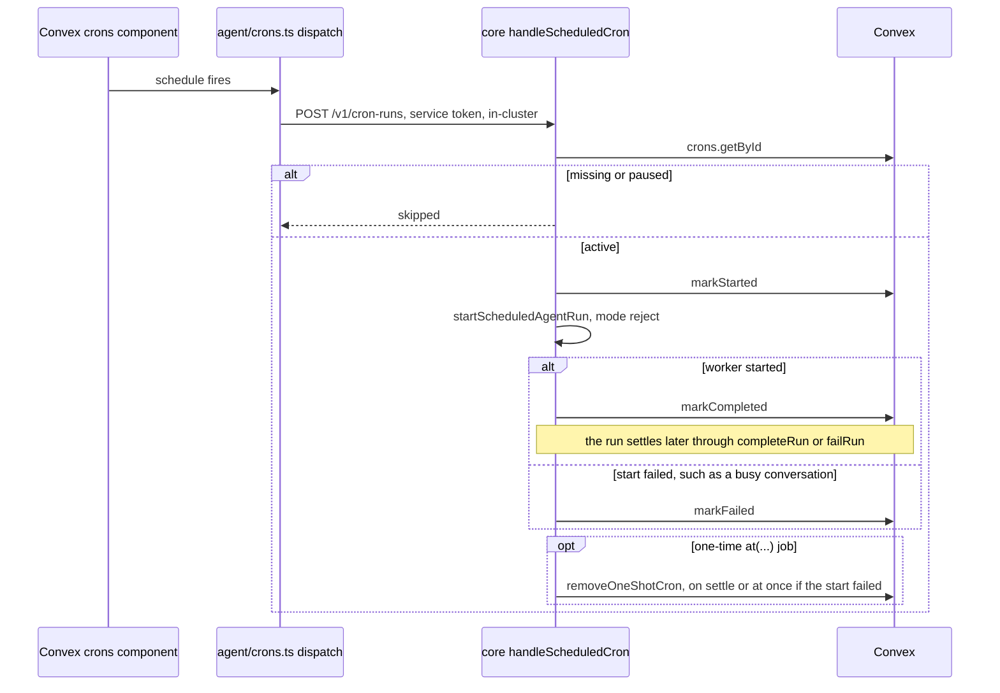
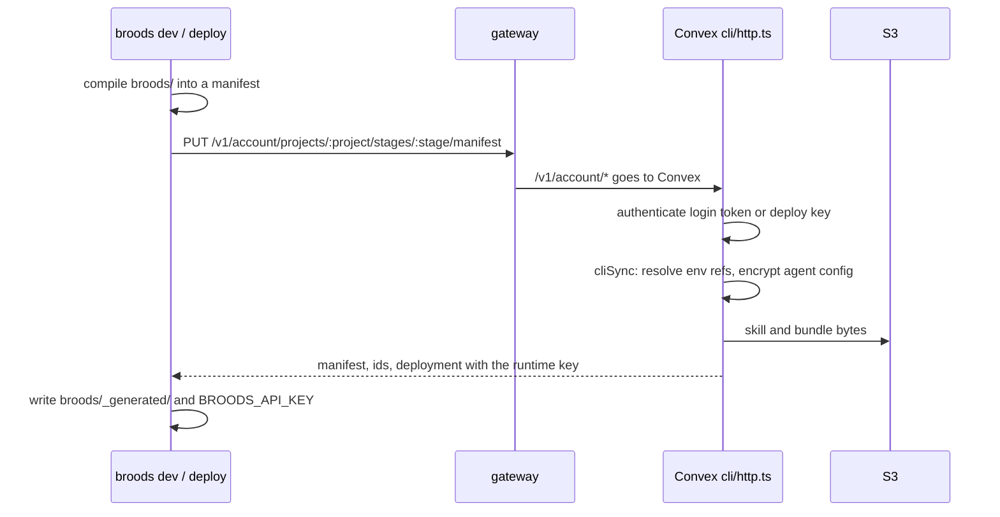
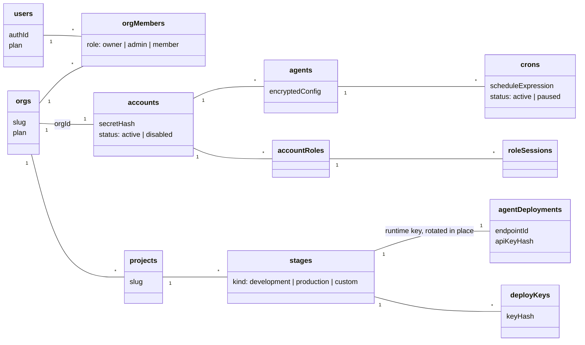

# Architecture

How the deployables fit together, how each kind of request moves through them, who checks which credential, and where every record lives. Read it before changing the gateway, core, or the Convex runtime tables. Paths are relative to the repo root.

## The system

| Deployable                              | Runs as                                    | Job                                                                                                                                              |
| --------------------------------------- | ------------------------------------------ | ------------------------------------------------------------------------------------------------------------------------------------------------ |
| `apps/gateway`                          | Bun pod, `src/main.ts`                     | The only public door. Splits HTTP by path between Convex and core, terminates four WebSocket kinds, rate-limits auth failures and upgrades.      |
| `apps/core`                             | Bun pod, `src/server.ts`                   | Runs agents: runtime API, channel webhooks, cron runs, async and subagent work, sandbox lifecycle verbs, hosted MCP invokes, the machine socket. |
| `packages/convex`                       | Convex deployment                          | Config plane (HTTP actions under `/v1/...`), CLI sync, every table, the crons component, WorkOS auth, Stripe.                                    |
| `apps/dashboard`                        | Next.js                                    | Reads and writes Convex as a WorkOS user. Opens gateway sockets for logs, traces, the test chat and sandbox terminals.                           |
| `apps/discord-forwarder`                | Bun pod, single replica                    | One Discord Gateway socket per bot token, forwards `MESSAGE_CREATE` to the channel webhook.                                                      |
| `apps/matrix-forwarder`                 | Bun pod, single replica, persistent volume | One `/sync` long-poll per access token, decrypts inbound messages, encrypts core's replies.                                                      |
| `apps/lambda/handler.mjs`               | AWS Lambda (SST)                           | Hosted MCP runner: one invoke per batch of calls, bundle run in a child process.                                                                 |
| `apps/lambda/sandbox-log-forwarder.mjs` | AWS Lambda (SST)                           | Ships MicroVM guest stdout from CloudWatch to the OTel collector with tenant labels.                                                             |

SST in `apps/core/sst.config.ts` owns only AWS resources. Those are the three S3 buckets, MicroVM artifacts bucket and roles, the MicroVM log group and forwarder, the sandbox VPC and S3 endpoint, the `sandbox-s3mount` role, the sandbox ECR repo, the mcp-runner function, the `core-runtime` IAM user, and the role Convex assumes for S3. The pods, NATS, OPA and the collector are deployed from the sibling `../infra` repo.

## Request paths

### Direct run over HTTP

1. The client sends `POST /v1/runs`, or the scoped `POST /v1/projects/:p/stages/:s/agents/:endpointId`, with a bearer credential.
2. The gateway sees a non-config `/v1/` path and proxies it to core (`apps/gateway/src/upstream.ts` `proxyHttp`), stripping `Host` and stamping `x-broods-via-gateway`.
3. `apps/core/src/server.ts` routes it to the harness handler. `routeIncomingEvent` in `src/harness/integrations.ts` resolves the credential (`src/shared/auth.ts`), loads the agent, and applies the public-access and run-override rules for a runtime key.
4. `src/harness/handler.ts` admits the request through the conversation coordinator in `src/harness/ingress.ts` and Convex `runtimeIngress.ts`. A busy conversation queues or steers per [queue and steer](queue-and-steer.md).
5. `src/harness/session.ts` persists the incoming events, loads history and builds the turn context. Dedup already happened at admission, on the ingress identity. `src/harness/harness.ts` runs the AI SDK `streamText` loop with tools from `src/harness/tools/index.ts`.
6. Without `background`, the response is the SSE stream. With `background: true`, core stores a `runtimeAsyncAgentResults` row, answers `202` with a `runId`, and runs the turn on an in-process worker. `dispatchInProcessWorker` starts it, capped by `MAX_INPROCESS_WORKERS`, default 8. The client polls `GET /v1/runs/:runId`.

`ENABLE_DIRECT_API` gates these routes and defaults to `true`.

### WebSocket run

1. The client opens `/v1/agents/:endpointId/ws` or the scoped form. The credential rides the `Sec-WebSocket-Protocol` header.
2. The gateway asks core for the token's scope (`/v1/internal/observability-scope`) and refuses an endpoint outside it. Attach never reaches the core run path, so this is the door check.
3. On `execute` or `control`, the gateway posts the run to the same core path with a `connectionId` (`apps/gateway/src/agent.ts`). Core admits it and answers JSON instead of an SSE stream. An owner run carries its NATS scope. A queued one does not, and the gateway sends `ack`.
4. Core runs the turn as a `nats-worker` in-process worker and publishes each stream part to `WS_RESPONSES`.
5. The gateway snapshots the subject before the POST and reads it with one ordered consumer from the next sequence, so every frame is live, and relays `output` frames with a cursor. Replay first, then tail, is the `attach` path. It polls the run status route in parallel and always closes with a terminal frame.

`ENABLE_WEBSOCKET=true` and `NATS_URL` are required for the worker path.

### Channel webhook

The sequence, with what the provider ACK waits on, is in [channels](channels.md#runtime-flow).

1. The provider posts to `/v1/webhooks/:accountId/:channel`, or `/v1/webhooks/:accountId/dev/:endpointId/:channel` for a non-production stage. Discord messages and all Matrix traffic come from the two forwarders, which post to the same URL.
2. The gateway proxies to core. `integrations.ts` loads the account and finds the credential holder, the agent whose channel credentials verify the request. On the bare URL, when two agents verify, the lowest agent id wins. A stage URL that resolves to no agent is a `404`.
3. The holder's adapter (`src/shared/<channel>-channel.ts`) authenticates and parses the request into an `InboundMessage`.
4. The `channelRecords` row for `(platform, externalId)` decides which agent runs and layers its instructions, workspaces, policies and `denyTools` (`applyChannelRecord`). A failed lookup refuses the turn.
5. The `agent.invoke` policy gate runs. `handleChannelRequest` admits the message: it deduplicates it and queues it in Convex. The provider gets its ack once admission finishes or after `CHANNEL_ACK_BUDGET_MS` (2 s), whichever comes first, so a provider retry never races an admitted message. The turn then runs on the same bounded worker pool as async and WebSocket runs, and replies through the adapter's `ChannelActions`. Matrix replies go to the matrix-forwarder's `/v1/send`, since only it holds the room keys.

### Cron fire

1. A schedule in the Convex crons component fires `packages/convex/agent/crons.ts` `dispatch`.
2. The action posts `{ kind: "cron", accountId, cronId, scheduledTime }` to core's in-cluster address (`BROODS_ACCOUNT_MANAGE_URL`) at `/v1/cron-runs` with the service token. The gateway answers `404` on that path.
3. `handleScheduledCron` in `handler.ts` loads the job, skips it if paused, marks it started, and starts the run. A conversation key that names a live channel session resumes it and replies there.
4. A one-time `at(...)` job is deleted when its run settles, or at once when the run fails to start.

### Config-plane call

1. A client calls a config path such as `/v1/agents`, `/v1/crons`, `/v1/workspaces/:id/files` or `/v1/account`. `isConfigHttpPath` in `apps/gateway/src/routes.ts` is method-aware and decides; everything else under `/v1/` goes to core.
2. The gateway proxies to `BROODS_CONFIG_URL`, the Convex HTTP router in `packages/convex/http.ts`, with handlers in `config/http.ts` and `config/routes/*`.
3. The config plane authenticates the bearer, checks role policy for a role session, runs the mutation, and writes a `configAuditEvents` row.
4. Sandbox lifecycle verbs (`/v1/sandboxes/:id/suspend`, `resume`, `terminate`, `snapshot`, `refresh`, `exec`, `terminal`) and account creation and deletion are the exceptions. They reach core's account handler (`src/accounts/handler.ts`, `routesToAccountManage`). The dashboard reaches them through Convex actions that call core with the service token (`packages/convex/model/serviceBridge.ts`).

### CLI sync

1. `broods dev` or `broods deploy` compiles `broods/` into a manifest (`packages/broods/src/manifest.ts`). Hosted MCP handlers and code hooks are bundled here.
2. The CLI sends `PUT /v1/account/projects/:project/stages/:stage/manifest` with a login token or deploy key. The gateway routes `/v1/account/*` to Convex, where `packages/convex/cli/http.ts` authenticates and `cliSync` applies it.
3. The sync resolves `${NAME}` env refs into encrypted agent config, writes agents, sandboxes, workspaces, MCP rows, policies, channel records and crons, uploads skill and bundle bytes to S3, large ones through upload grants, and creates the stage runtime key if the stage has none.
4. The CLI writes `broods/_generated/` and `BROODS_API_KEY`.

## Credentials

| Credential           | Prefix       | Verified by                                                                                      | Scope                                                                   |
| -------------------- | ------------ | ------------------------------------------------------------------------------------------------ | ----------------------------------------------------------------------- |
| Stage runtime key    | `fp_agent_`  | core, `agentDeployments` hash lookup in `src/shared/auth.ts`; the gateway checks WebSocket scope | One account, project, stage and endpoint set. Public agents only.       |
| Stage session ticket | `fp_dts_`    | core, `openStageSessionTicket` with `STAGE_TICKET_SECRET`; Convex signs it                       | Same as a runtime key for 15 minutes, without the embeddable-key limits |
| Account secret       | `fp_acct_`   | core (`accounts` by secret hash) and the Convex config plane                                     | The whole account                                                       |
| Role session         | `fp_sts_`    | core and the config plane, `roleSessions` hash lookup, then the role's policy per request        | What the role allows, up to 12 hours                                    |
| CLI login            | `fp_cli_`    | Convex `cli/http.ts`, re-checked against org membership                                          | Org owner or admin, CLI routes                                          |
| Deploy key           | `fp_deploy_` | Convex `cli/http.ts`                                                                             | One project and stage, CLI sync routes                                  |
| Admin secret         | none         | core, `ADMIN_ACCOUNT_SECRET`                                                                     | Account creation on self-hosted deployments                             |
| Service token        | none         | core, `isServiceToken`, only with `X-Account-Id` and only when `x-broods-via-gateway` is absent  | Convex acting for one account, in-cluster only                          |
| Terminal ticket      | sealed       | gateway, `TERMINAL_TICKET_SECRET`; core seals it                                                 | One sandbox terminal, about 2 minutes                                   |
| Per-job token        | none         | core, stored on the `runtimeAsyncToolResults` row                                                | One background job's completion callback                                |

Channel webhooks use each provider's own signature or secret, checked by the adapter. The gateway holds no credential except `TERMINAL_TICKET_SECRET` and never holds the service token. Service secret rotation is in [operations](operations.md).

## Where state lives

### Tenancy model

An org is the billing and login unit, and its account is the tenant every runtime row keys on. Projects and stages scope config, keys and deployments below it.

The doc id of `accounts` is the `accountId` every other table carries. Config rows such as `mcp`, `sandboxConfigs` and `workspaceConfigs` also hold `projectId` and `stageId`. Sandbox and workspace rows the account REST API creates leave both unset and are shared across stages.

### Convex tables

| Group                 | Tables                                                                                                                                                                                                                                                |
| --------------------- | ----------------------------------------------------------------------------------------------------------------------------------------------------------------------------------------------------------------------------------------------------- |
| Identity and tenancy  | `users`, `orgs`, `orgMembers`, `accounts`                                                                                                                                                                                                             |
| Projects and access   | `projects`, `stages`, `agentDeployments` (runtime keys), `deployKeys`, `cliAuthCodes`, `cliTokens`, `accountRoles`, `roleSessions`                                                                                                                    |
| Resource config       | `agents` (encrypted config), `agentConfigs` and `canvasLayouts` (dashboard canvas), `agentRuntimeSecrets`, `sandboxConfigs`, `workspaceConfigs`, `mcp`, `accountHooks`, `agentPolicies`, `channelRecords`, `channelEndpoints`, `cliExternalResources` |
| Environment variables | `environmentVariables` (per stage), `accountEnvVars`, `environmentVariableReveals`                                                                                                                                                                    |
| Schedules             | `crons`, `cronRuns`, plus the crons component's own tables                                                                                                                                                                                            |
| Runtime               | `runtimeConversationEvents`, `runtimeHarnessSessions`, `runtimeClaims`, `runtimeConversationCoordinators`, `runtimeIngressEnvelopes`, `runtimeIngressApplications`, `runtimeAsyncAgentResults`, `runtimeAsyncToolResults`, `runtimeAsyncToolGroups`   |
| Sandboxes             | `sandboxReservations`, `sandboxInstances`, `sandboxSnapshots`, `sandboxAuditEvents`, `machineConnections`                                                                                                                                             |
| Workspace files       | `workspaceFiles`, `workspaceDownloadTokens`, `uploadGrants`                                                                                                                                                                                           |
| Audit and usage       | `configAuditEvents`, `configHttpAuthFailures`, `taskUsage`, `usageRollups`                                                                                                                                                                            |

`packages/convex/schema.ts` is the source of truth. Core reaches Convex with `ConvexHttpClient` and the deploy key (`apps/core/src/shared/convex/client.ts`). `channelEndpoints` holds each connection's encrypted bot token so the forwarders' `listConnections` subscription reads one small table.

### Bytes and streams

| Store                                      | Holds                                                                             |
| ------------------------------------------ | --------------------------------------------------------------------------------- |
| S3 `Filesystem` (`FILESYSTEM_BUCKET_NAME`) | Workspace files under `<namespace>/`, staged skills, the channel attachment store |
| S3 `Skills`                                | Skill bundles under `<accountId>/<skill-name>`                                    |
| S3 `ToolBundles`                           | Code hook bundles and hosted MCP bundles under `account-mcp/`                     |
| NATS `WS_RESPONSES`                        | Agent stream parts per conversation, about 3 minutes, for WebSocket replay        |
| NATS `OBSERVABILITY`                       | Live logs and spans per stage, about 2 hours, for dashboard replay                |
| Loki and Tempo                             | Long-term logs and traces, via the OTel collector                                 |
| Matrix forwarder volume                    | Each Matrix account's crypto store and sync token                                 |

## Async and deferred work

Everything a run starts runs inside core's process. Subagents are in-process child loops, async tools wait in the request or worker, and background runs are in-process workers. There are no separate worker deployments. Hosted MCP calls go to the Lambda. Code hooks run in a pooled Node child with a V8 isolate, in `src/harness/isolate`.

A detached sandbox job outlives its request. Its result comes back through a delivery descriptor stored with the job:

1. `bash` with `background: true` writes a `runtimeAsyncToolResults` row with the turn's `delivery` and a per-job token. The delivery is `channel` with the routing `source`, `nats` with the connection, or `async`.
2. The job posts `POST /v1/sandbox-jobs/:resultId/complete` with `x-job-token` when it exits. A wrong token reads as `404`.
3. Core settles the row, rebuilds the turn from `parentEventId` and `conversationKey`, injects the result, and runs the loop again (`continueAfterAsyncToolSettlement`).
4. The follow-up goes back to its origin, as a channel `sendText` with credentials decrypted again from agent config, a publish to `WS_RESPONSES`, or a settled status row plus the lifecycle webhook.

The sandbox needs egress to `PUBLIC_BASE_URL` for step 2. Without it the job still runs and `async_status` polling still works.

## WebSocket and JetStream contract

- Core publishes each frame once to `v1.<accountId>.<agentId>.ws.response.<convToken>`, where `convToken` is `base64url` of the public conversation key. Publishing has no per-frame ack, so replay is best effort.
- Retention is `max_age` of about 3 minutes and 2,000 messages per subject. There is no manual purge, because sequential work shares one subject.
- `Nats-Msg-Id` (`eventId:sequence`) and a 2 minute duplicate window collapse retries.
- Cursors are opaque, bound to one event, and exclusive. A cursor the stream can no longer serve gets `replay_unavailable` and the durable status.
- Convex ingress status is the source of truth for acceptance and terminal state for 7 days. JetStream only carries output.
- `connectNats` in `apps/core/src/shared/nats.ts` picks the client from the `NATS_URL` scheme: `nats://` or `tls://` for core TCP, `ws://` or `wss://` for WebSocket. NATS is in-cluster only. No ingress exposes it, and core and the gateway dial `nats://` on the cluster service.
- Core publishes every run's stream, its logs and its spans over one shared connection that reconnects forever (`apps/core/src/harness/nats-publisher.ts`).
- A frame larger than the server's `max_payload`, 1 MB by default, goes out as the same `type` with `truncated: true` and `originalBytes` and no payload, so a `done` still ends the stream. The full result is on the run status.

Frames, attach and control are specified in [queue and steer](queue-and-steer.md). Logs and traces take the same NATS path on `OBSERVABILITY`, described in [observability](observability.md).

## Related pages

- [Sandboxes](sandboxes.md) and [storage](storage.md) for how tools reach compute and files.
- [Channels](channels.md), [tools and MCP](tools-and-mcp.md) and [subagents](subagents.md) for each harness subsystem.
- [Security](security.md) for encryption, redaction and untrusted code tiers.
