# Architecture

How each kind of request moves through the deployables, how a run moves through its states, and where every record lives. The service and deployment diagrams are on the [overview](index.md). Paths are relative to the repo root.

## The system

Traefik is the only public door. `apps/edge/src/routes.ts` is the route table, in priority order, and `verification/Broods/Gateway.lean` models it. The first router that matches wins; trailing slashes are stripped first.

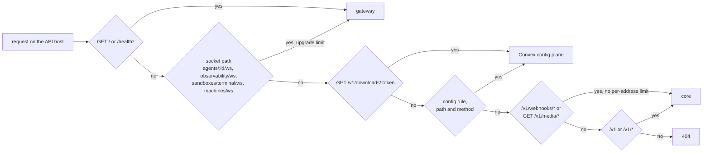
```mermaid
flowchart LR
  Req["request on the API host"] --> H{"GET / or /healthz"}
  H -->|"yes"| GW["gateway"]
  H -->|"no"| S{"socket path<br/>agents/:id/ws, observability/ws,<br/>sandboxes/terminal/ws, machines/ws"}
  S -->|"yes, upgrade limit"| GW
  S -->|"no"| D{"GET /v1/downloads/:token"}
  D -->|"yes"| CVX["Convex config plane"]
  D -->|"no"| C{"config rule,<br/>path and method"}
  C -->|"yes"| CVX
  C -->|"no"| W{"/v1/webhooks/* or<br/>GET /v1/media/*"}
  W -->|"yes, no per-address limit"| Core["core"]
  W -->|"no"| V{"/v1 or /v1/*"}
  V -->|"yes"| Core
  V -->|"no"| X["404"]
```

- Config rules are method-aware. A method miss falls through to core, so `DELETE /v1/account` reaches core while `GET /v1/account` reaches Convex.
- Every router stamps `x-broods-via-gateway` and strips `X-Account-Id`. Core and the config plane refuse the service token on a stamped request, so in-cluster paths such as `/v1/cron-runs` need no special route.
- Core has no host of its own. `apps/core/src/server.ts` routes by path: `/healthz`, media, the account verbs (`routesToAccountManage`), then the harness handler.

## Request paths

### Direct run over HTTP

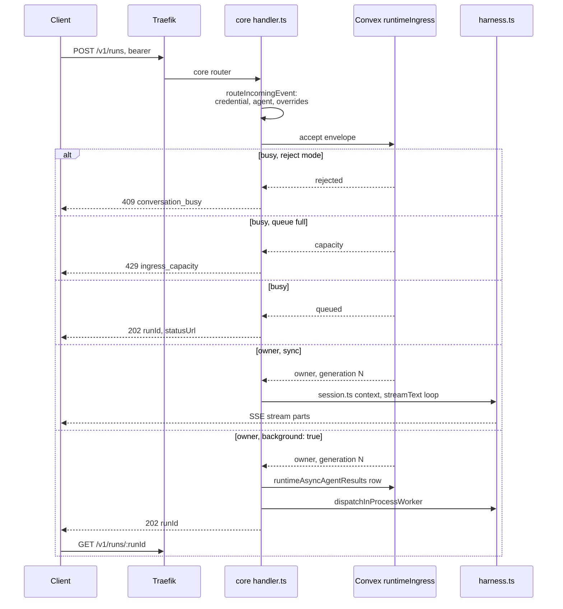
```mermaid
sequenceDiagram
  participant C as Client
  participant T as Traefik
  participant H as core handler.ts
  participant X as Convex runtimeIngress
  participant R as harness.ts
  C->>T: POST /v1/runs, bearer
  T->>H: core router
  H->>H: routeIncomingEvent:<br/>credential, agent, overrides
  H->>X: accept envelope
  alt busy, reject mode
    X-->>H: rejected
    H-->>C: 409 conversation_busy
  else busy, queue full
    X-->>H: capacity
    H-->>C: 429 ingress_capacity
  else busy
    X-->>H: queued
    H-->>C: 202 runId, statusUrl
  else owner, sync
    X-->>H: owner, generation N
    H->>R: session.ts context, streamText loop
    R-->>C: SSE stream parts
  else owner, background: true
    X-->>H: owner, generation N
    H->>X: runtimeAsyncAgentResults row
    H->>R: dispatchInProcessWorker
    H-->>C: 202 runId
    C->>T: GET /v1/runs/:runId
  end
```

- Also `POST /v1/projects/:p/stages/:s/agents/:endpointId`. `ENABLE_DIRECT_API` gates both, default `true`.
- A duplicate idempotency key answers with the first admission's run id. The same key with a different payload is `409 idempotency_conflict`.
- In-process workers are capped by `MAX_INPROCESS_WORKERS`, default 8. Queue modes: [queue and steer](queue-and-steer.md).

### WebSocket run

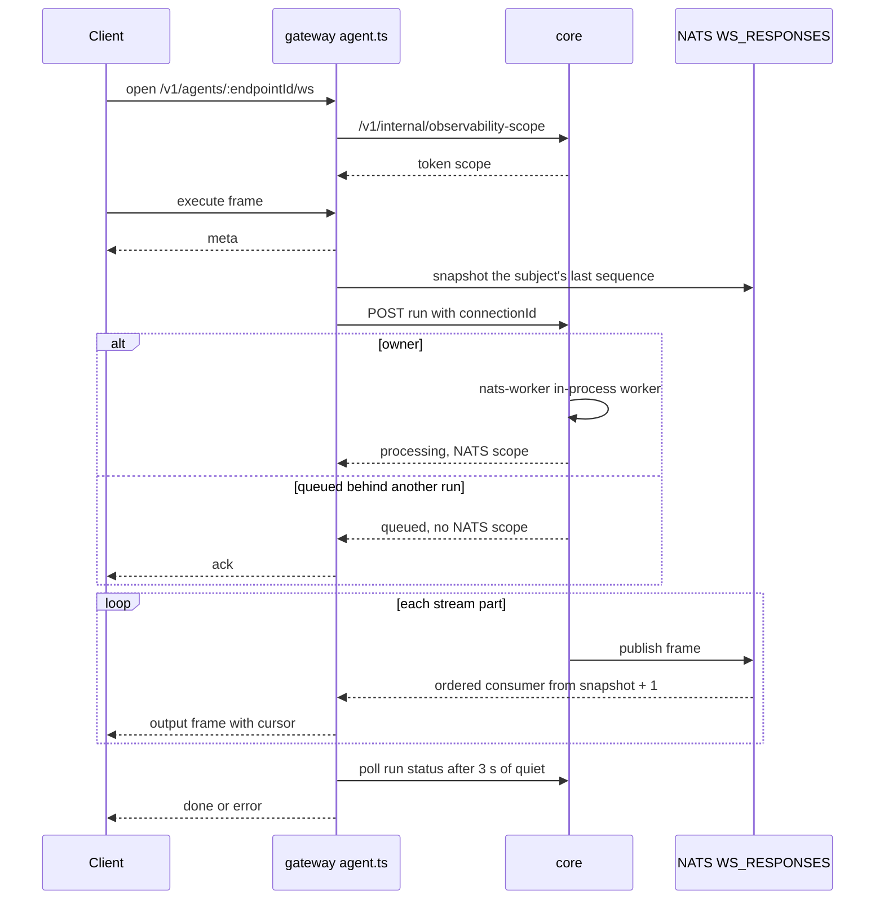
```mermaid
sequenceDiagram
  participant C as Client
  participant G as gateway agent.ts
  participant H as core
  participant N as NATS WS_RESPONSES
  C->>G: open /v1/agents/:endpointId/ws
  G->>H: /v1/internal/observability-scope
  H-->>G: token scope
  C->>G: execute frame
  G-->>C: meta
  G->>N: snapshot the subject's last sequence
  G->>H: POST run with connectionId
  alt owner
    H->>H: nats-worker in-process worker
    H-->>G: processing, NATS scope
  else queued behind another run
    H-->>G: queued, no NATS scope
    G-->>C: ack
  end
  loop each stream part
    H->>N: publish frame
    N-->>G: ordered consumer from snapshot + 1
    G-->>C: output frame with cursor
  end
  G->>H: poll run status after 3 s of quiet
  G-->>C: done or error
```

- The credential rides `Sec-WebSocket-Protocol`. The scope lookup is the door check; attach never reaches the core run path.
- Needs `ENABLE_WEBSOCKET=true` and `NATS_URL`. Attach, replay and control frames: [queue and steer](queue-and-steer.md).

### Channel webhook

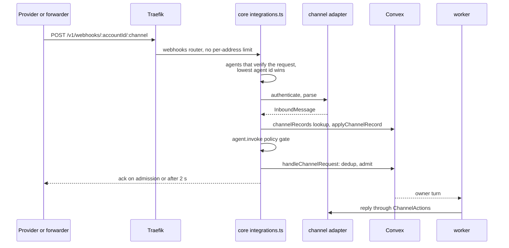
```mermaid
sequenceDiagram
  participant P as Provider or forwarder
  participant T as Traefik
  participant I as core integrations.ts
  participant A as channel adapter
  participant X as Convex
  participant W as worker
  P->>T: POST /v1/webhooks/:accountId/:channel
  T->>I: webhooks router, no per-address limit
  I->>I: agents that verify the request,<br/>lowest agent id wins
  I->>A: authenticate, parse
  A-->>I: InboundMessage
  I->>X: channelRecords lookup, applyChannelRecord
  I->>I: agent.invoke policy gate
  I->>X: handleChannelRequest: dedup, admit
  I-->>P: ack on admission or after 2 s
  X-->>W: owner turn
  W->>A: reply through ChannelActions
```

- Stage URL: `/v1/webhooks/:accountId/dev/:endpointId/:channel`. One that resolves to no agent is `404`.
- Discord messages and all Matrix traffic come from the two forwarders, posting to the same URL. Matrix replies go back through the matrix-forwarder's `/v1/send`, since only it holds the room keys.
- Unsigned requests are answered from an agent listing cached up to 10 seconds; a request that verifies lists again uncached. Detail: [channels](channels.md).

### Cron fire

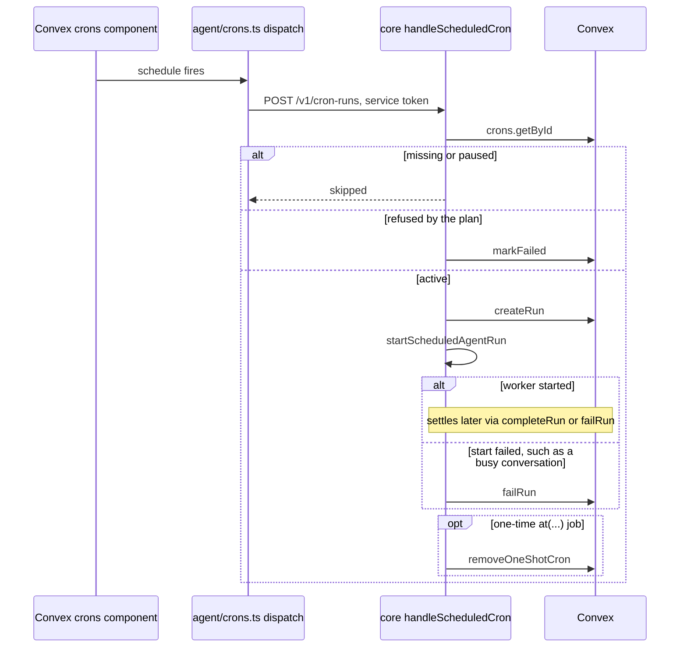
```mermaid
sequenceDiagram
  participant S as Convex crons component
  participant D as agent/crons.ts dispatch
  participant H as core handleScheduledCron
  participant X as Convex
  S->>D: schedule fires
  D->>H: POST /v1/cron-runs, service token
  H->>X: crons.getById
  alt missing or paused
    H-->>D: skipped
  else refused by the plan
    H->>X: markFailed
  else active
    H->>X: createRun
    H->>H: startScheduledAgentRun
    alt worker started
      Note over H,X: settles later via completeRun or failRun
    else start failed, such as a busy conversation
      H->>X: failRun
    end
    opt one-time at(...) job
      H->>X: removeOneShotCron
    end
  end
```

- `dispatch` posts to core's in-cluster `BROODS_ACCOUNT_MANAGE_URL`. From outside, the stamped header makes the service token invalid and core answers `401`.
- The job's `lastStatus` follows its latest run row, so a late older run cannot overwrite a newer one (`verification/Broods/Cron.lean`).
- A conversation key that names a live channel session resumes it and replies there.

### Config-plane call

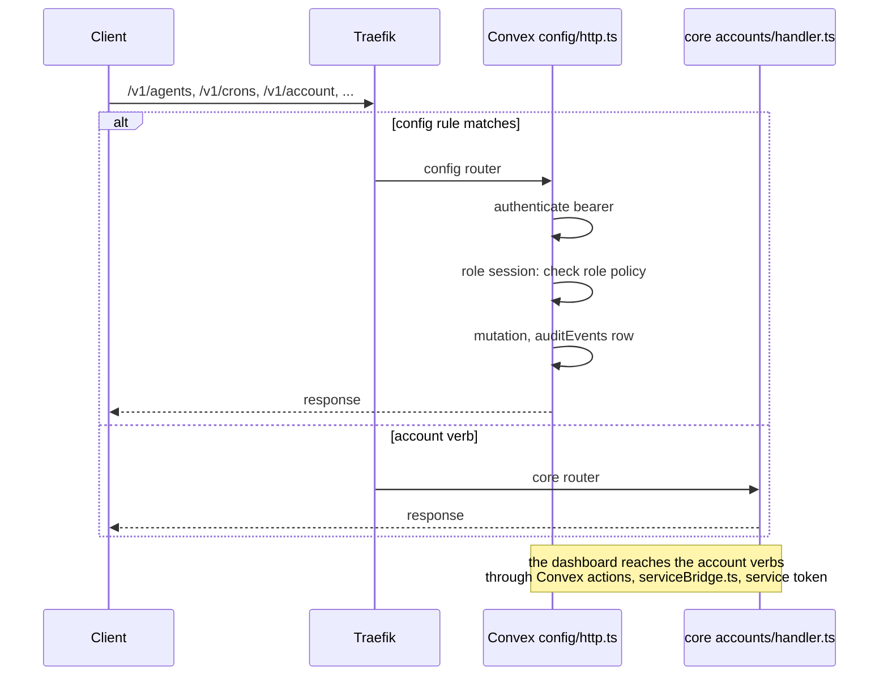
```mermaid
sequenceDiagram
  participant C as Client
  participant T as Traefik
  participant V as Convex config/http.ts
  participant K as core accounts/handler.ts
  C->>T: /v1/agents, /v1/crons, /v1/account, ...
  alt config rule matches
    T->>V: config router
    V->>V: authenticate bearer
    V->>V: role session: check role policy
    V->>V: mutation, auditEvents row
    V-->>C: response
  else account verb
    T->>K: core router
    K-->>C: response
  end
  Note over V,K: the dashboard reaches the account verbs<br/>through Convex actions, serviceBridge.ts, service token
```

- Account verbs on core: `POST /v1/accounts`, `DELETE /v1/accounts/:id`, `DELETE /v1/account`, and `POST /v1/sandboxes/:id/` with `suspend`, `resume`, `terminate`, `snapshot`, `refresh`, `exec` or `terminal`.
- Handlers live in `packages/convex/config/routes/*`. Role management needs the account key.

### CLI sync

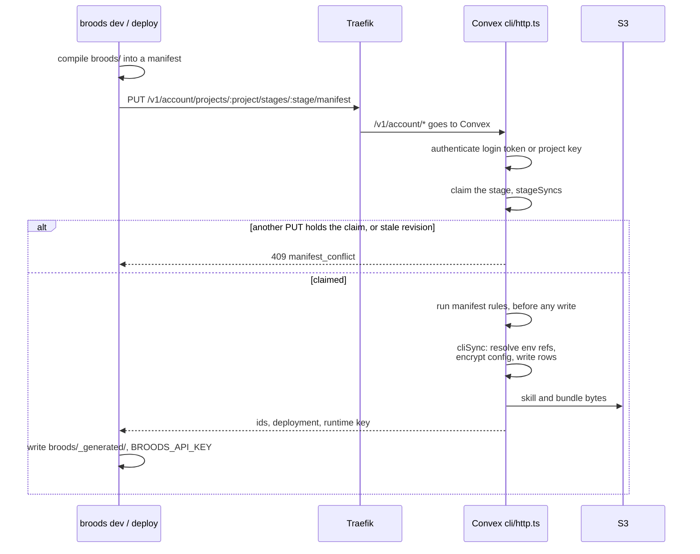
```mermaid
sequenceDiagram
  participant CLI as broods dev / deploy
  participant T as Traefik
  participant V as Convex cli/http.ts
  participant S as S3
  CLI->>CLI: compile broods/ into a manifest
  CLI->>T: PUT /v1/account/projects/:project/stages/:stage/manifest
  T->>V: /v1/account/* goes to Convex
  V->>V: authenticate login token or project key
  V->>V: claim the stage, stageSyncs
  alt another PUT holds the claim, or stale revision
    V-->>CLI: 409 manifest_conflict
  else claimed
    V->>V: run manifest rules, before any write
    V->>V: cliSync: resolve env refs,<br/>encrypt config, write rows
    V->>S: skill and bundle bytes
    V-->>CLI: ids, deployment, runtime key
    CLI->>CLI: write broods/_generated/, BROODS_API_KEY
  end
```

- `broods dev` sends the revision it read; `broods deploy` sends none and replaces the last completed sync.
- The claim is released in `finally`; an abandoned claim expires after 45 minutes.
- `verification/Broods/Sync*.lean` proves the next diff after a sync is deletes only and that overlapping PUTs are refused.

## Run lifecycle

A run is one `runtimeIngressEnvelopes` row, the record behind `GET /v1/runs/:runId`. `packages/convex/runtimeIngress.ts` moves it; `verification/Broods/Ingress.lean` proves every step moves forward and terminal states stay terminal.

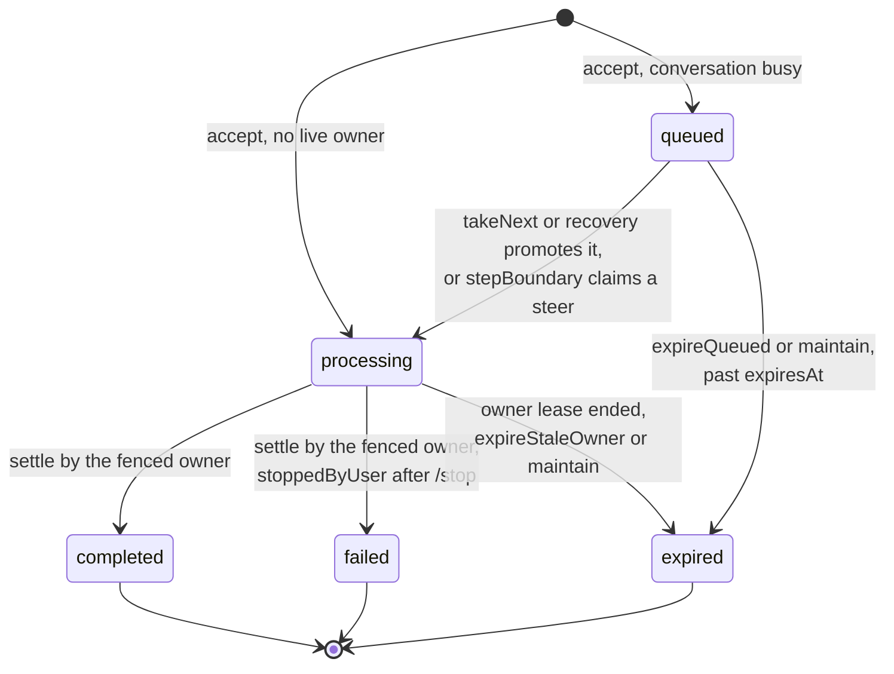
```mermaid
stateDiagram-v2
  [*] --> processing: accept, no live owner
  [*] --> queued: accept, conversation busy
  queued --> processing: takeNext or recovery promotes it,<br/>or stepBoundary claims a steer
  queued --> expired: expireQueued or maintain,<br/>past expiresAt
  processing --> completed: settle by the fenced owner
  processing --> failed: settle by the fenced owner,<br/>stoppedByUser after /stop
  processing --> expired: owner lease ended,<br/>expireStaleOwner or maintain
  completed --> [*]
  failed --> [*]
  expired --> [*]
```

- Admission outcomes that write no row: `rejected` (409), `capacity` (429), `conflict` (409), `duplicate` (the first run's id) and `not_running` (a late control).
- Every owner write is fenced by owner event, generation and a live lease. `/stop` sets `stopRequestedGeneration`; the next step boundary stops and claims nothing.
- `maintain` extends `expiresAt` instead of expiring a run its owner still holds.
- The public status type also has `accepted` and `applied`; no row is stored with them.
- Status rows are kept 7 days. The polling row of an async run (`runtimeAsyncAgentResults`: `processing`, `awaitingApproval`, `awaitingInput`, `completed`, `failed`) settles in the same `settle` mutation (`verification/Broods/AsyncResults.lean`).

## Credentials

| Credential           | Prefix  | Checked by                                                      |
| -------------------- | ------- | --------------------------------------------------------------- |
| Runtime key          | `bsk_`  | core (`src/shared/auth.ts`); the gateway checks WebSocket scope |
| Stage session ticket | `bdts_` | core, `STAGE_TICKET_SECRET`; Convex signs it, 15 minutes        |
| Account key          | `bask_` | core and the config plane                                       |
| Role session         | `bsts_` | core and the config plane, then the role's policy, up to 12 h   |
| CLI login            | `bcli_` | Convex `cli/http.ts`                                            |
| Project key          | `bpdk_` | Convex `cli/http.ts`                                            |
| Admin secret         | none    | core, `ADMIN_ACCOUNT_SECRET`, self-hosted account creation      |
| Service token        | none    | core, only with `X-Account-Id` and no `x-broods-via-gateway`    |
| Terminal ticket      | sealed  | gateway, `TERMINAL_TICKET_SECRET`; core seals it                |
| Per-job token        | none    | core, against the `runtimeAsyncToolResults` row                 |

Channel webhooks use each provider's own signature, checked by the adapter. The gateway holds only `TERMINAL_TICKET_SECRET`, never the service token. Scopes, resolution order and rotation: [security](security.md) and [operations](operations.md).

## Where state lives

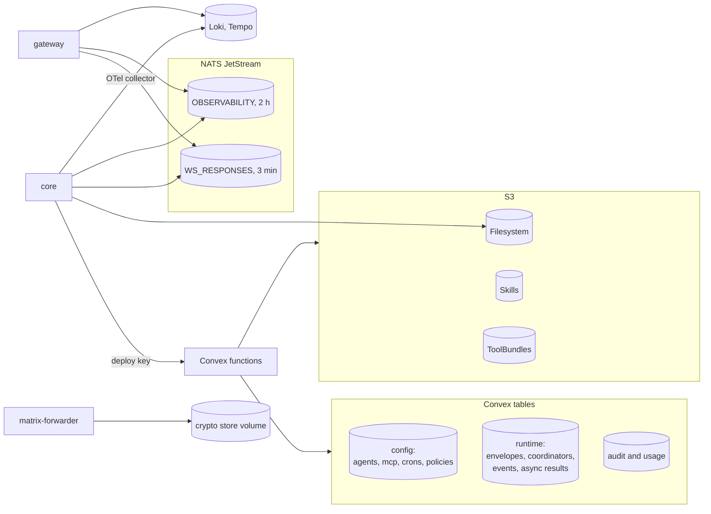
```mermaid
flowchart LR
  Core["core"]
  CVX["Convex functions"]
  GW["gateway"]
  MF["matrix-forwarder"]

  subgraph Tables["Convex tables"]
    Cfg[("config:<br/>agents, mcp, crons, policies")]
    Run[("runtime:<br/>envelopes, coordinators,<br/>events, async results")]
    Aud[("audit and usage")]
  end

  subgraph Buckets["S3"]
    FS[("Filesystem")]
    SK[("Skills")]
    TB[("ToolBundles")]
  end

  subgraph JS["NATS JetStream"]
    WSR[("WS_RESPONSES, 3 min")]
    OBS[("OBSERVABILITY, 2 h")]
  end

  LT[("Loki, Tempo")]
  Vol[("crypto store volume")]

  CVX --> Tables
  CVX --> Buckets
  Core -->|"deploy key"| CVX
  Core --> FS
  Core --> WSR
  Core --> OBS
  Core -->|"OTel collector"| LT
  GW --> WSR
  GW --> OBS
  GW --> LT
  MF --> Vol
```

| Store                   | Holds                                                                    | Lifetime                            |
| ----------------------- | ------------------------------------------------------------------------ | ----------------------------------- |
| Convex tables           | Config, runtime state, audit, usage. `packages/convex/schema.ts`         | Durable; run status 7 days          |
| S3 `Filesystem`         | Workspace files under `<namespace>/`, staged skills, channel attachments | Durable                             |
| S3 `Skills`             | Skill bundles under `<accountId>/<skill-name>`                           | Durable                             |
| S3 `ToolBundles`        | Code hook and hosted MCP bundles under `account-mcp/`                    | Durable; R2 copy expires in 30 days |
| NATS `WS_RESPONSES`     | Agent stream parts per conversation, for WebSocket replay                | 3 minutes, 2,000 per subject        |
| NATS `OBSERVABILITY`    | Live logs and spans per stage, for dashboard replay                      | 2 hours                             |
| Loki, Tempo             | Long-term logs and traces, via the OTel collector                        | Per collector config                |
| Matrix forwarder volume | Each Matrix account's crypto store and sync token                        | Durable                             |

Core reaches Convex with `ConvexHttpClient` and the deploy key (`apps/core/src/shared/convex/client.ts`). Byte layout: [storage](storage.md).

### Tenancy model

An org is the billing and login unit; its account is the tenant every runtime row keys on. Projects and stages scope config, keys and deployments.

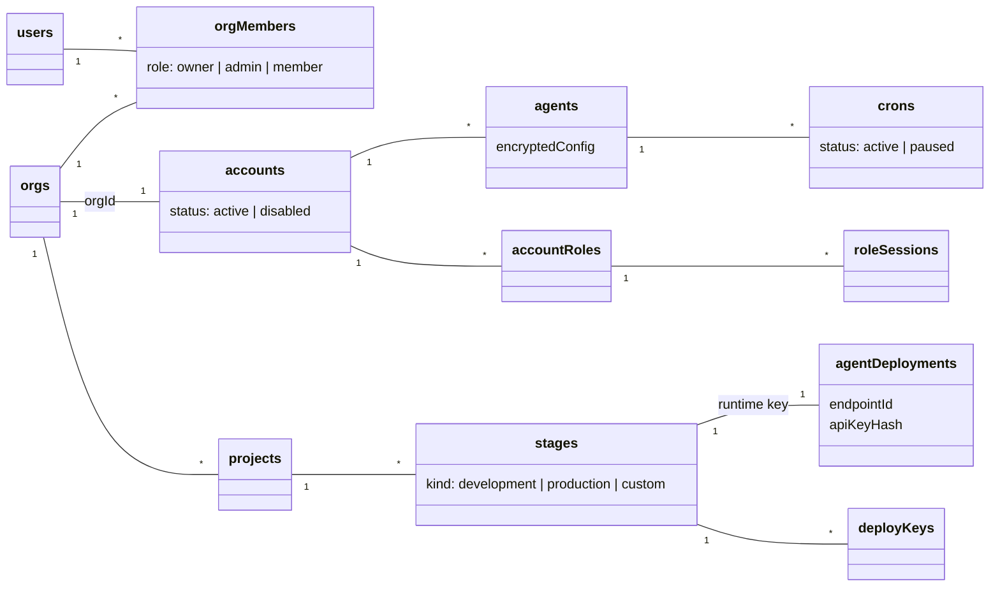
```mermaid
classDiagram
  direction LR
  class users
  class orgs
  class orgMembers {
    role: owner | admin | member
  }
  class accounts {
    status: active | disabled
  }
  class projects
  class stages {
    kind: development | production | custom
  }
  class agentDeployments {
    endpointId
    apiKeyHash
  }
  class deployKeys
  class agents {
    encryptedConfig
  }
  class crons {
    status: active | paused
  }
  class accountRoles
  class roleSessions

  users "1" -- "*" orgMembers
  orgs "1" -- "*" orgMembers
  orgs "1" -- "1" accounts : orgId
  orgs "1" -- "*" projects
  projects "1" -- "*" stages
  stages "1" -- "1" agentDeployments : runtime key
  stages "1" -- "*" deployKeys
  accounts "1" -- "*" agents
  agents "1" -- "*" crons
  accounts "1" -- "*" accountRoles
  accountRoles "1" -- "*" roleSessions
```

Config rows such as `mcp`, `sandboxConfigs` and `workspaceConfigs` also carry `projectId` and `stageId`. Rows the account REST API creates leave both unset and are shared across stages.

### Convex tables

| Group                 | Tables                                                                                                                                                                                                                      |
| --------------------- | --------------------------------------------------------------------------------------------------------------------------------------------------------------------------------------------------------------------------- |
| Identity and tenancy  | `users`, `orgs`, `orgMembers`, `orgRoles`, `accounts`, `accountKeys`                                                                                                                                                        |
| Projects and access   | `projects`, `stages`, `stageSyncs`, `agentDeployments`, `deployKeys`, `cliAuthCodes`, `cliTokens`, `accountRoles`, `roleSessions`, `permissions`                                                                            |
| Resource config       | `agents`, `agentConfigs`, `canvasLayouts`, `agentRuntimeSecrets`, `sandboxConfigs`, `workspaceConfigs`, `mcp`, `accountHooks`, `agentPolicies`, `channelRecords`, `channelEndpoints`, `connections`, `cliExternalResources` |
| Environment variables | `environmentVariables`, `accountEnvVars`, `environmentVariableReveals`                                                                                                                                                      |
| Schedules             | `crons`, `cronRuns`, plus the crons component's own tables                                                                                                                                                                  |
| Runtime               | `runtimeConversationEvents`, `runtimeHarnessSessions`, `runtimeClaims`, `runtimeConversationCoordinators`, `runtimeIngressEnvelopes`, `runtimeIngressApplications`, `runtimeAsyncAgentResults`, `runtimeAsyncToolResults`   |
| Sandboxes             | `sandboxReservations`, `sandboxInstances`, `sandboxSnapshots`, `sandboxAuditEvents`, `machineConnections`                                                                                                                   |
| Workspace files       | `workspaceFiles`, `workspaceDownloadTokens`, `uploadGrants`                                                                                                                                                                 |
| Audit and usage       | `auditEvents`, `auditChainHeads`, `auditSinks`, `configHttpAuthFailures`, `taskUsage`, `usageRollups`, `usageMeters`, `usageDays`, `usageWrites`                                                                            |

## Async and deferred work

Everything a run starts stays in core's process: subagents are child loops, background runs are in-process workers, code hooks run in a pooled V8 isolate (`src/harness/isolate`). There are no worker deployments. Hosted MCP calls go to the Workers runtime or the Lambda ([tools and MCP](tools-and-mcp.md)).

A detached sandbox job outlives its request:

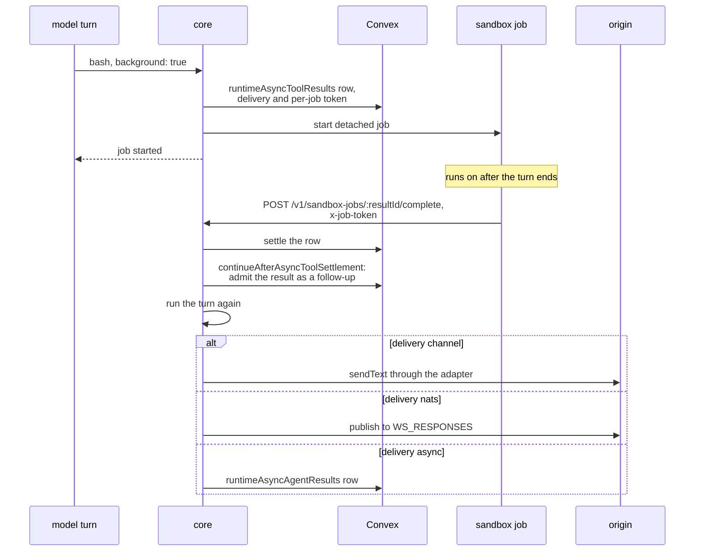
```mermaid
sequenceDiagram
  participant M as model turn
  participant H as core
  participant X as Convex
  participant J as sandbox job
  participant O as origin
  M->>H: bash, background: true
  H->>X: runtimeAsyncToolResults row,<br/>delivery and per-job token
  H->>J: start detached job
  H-->>M: job started
  Note over J: runs on after the turn ends
  J->>H: POST /v1/sandbox-jobs/:resultId/complete,<br/>x-job-token
  H->>X: settle the row
  H->>X: continueAfterAsyncToolSettlement:<br/>admit the result as a follow-up
  H->>H: run the turn again
  alt delivery channel
    H->>O: sendText through the adapter
  else delivery nats
    H->>O: publish to WS_RESPONSES
  else delivery async
    H->>X: runtimeAsyncAgentResults row
  end
```

- A wrong or missing token reads as `404`, so the route is not a token oracle. A settled row answers `409`.
- The callback needs `PUBLIC_BASE_URL` and egress to it. Without the URL, a sandbox with job controls falls back to `async_status` polling and any other refuses the background job.

## WebSocket and JetStream contract

- Subject: `v1.<accountId>.<agentId>.ws.response.<convToken>`, `convToken` the `base64url` public conversation key. One publish per frame, no per-frame ack, so replay is best effort.
- `Nats-Msg-Id` (`eventId:sequence`) and a 2 minute duplicate window collapse retries.
- Cursors are opaque, bound to one event, and exclusive. A cursor the stream can no longer serve gets `replay_unavailable` and the durable status.
- Convex ingress status is the truth for acceptance and terminal state. JetStream only carries output.
- A frame over the server's `max_payload` goes out with `truncated: true`, `originalBytes` and no payload, so `done` still ends the stream.
- NATS is in-cluster only. `connectNats` in `apps/core/src/shared/nats.ts` picks TCP for `nats://` or `tls://` and WebSocket for `ws://` or `wss://`. Core shares one reconnecting connection for every stream, log and span (`apps/core/src/harness/nats-publisher.ts`).

Frames and attach: [queue and steer](queue-and-steer.md). Logs and traces on `OBSERVABILITY`: [observability](observability.md).

## Related pages

- [Sandboxes](sandboxes.md) and [storage](storage.md) for compute and files.
- [Channels](channels.md), [tools and MCP](tools-and-mcp.md) and [subagents](subagents.md) for each harness subsystem.
- [Security](security.md) for encryption, redaction and untrusted code tiers.
