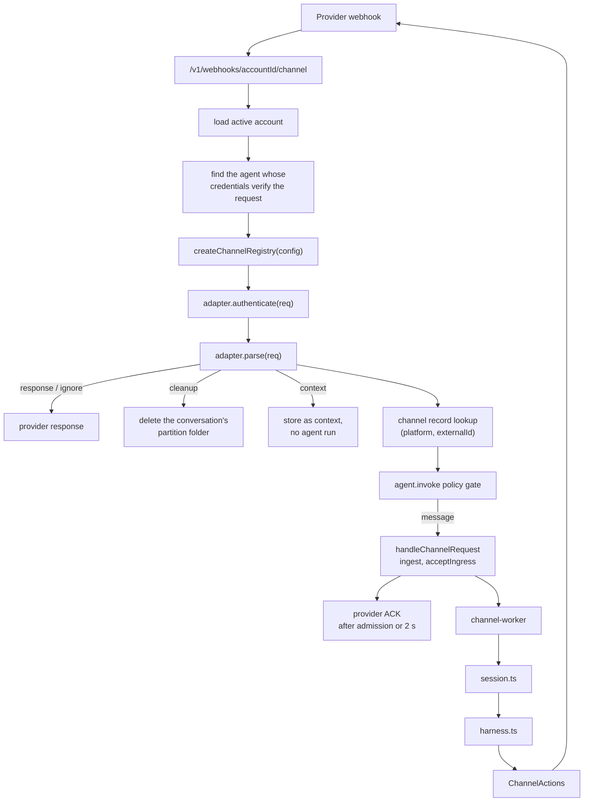
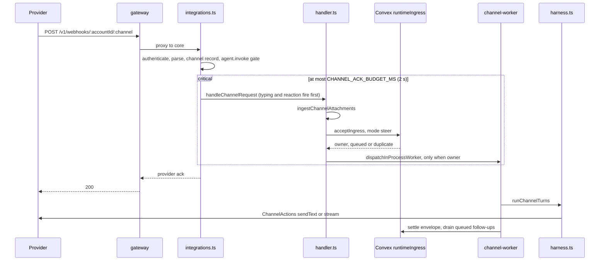
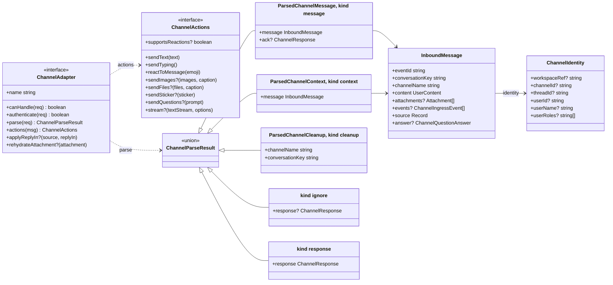
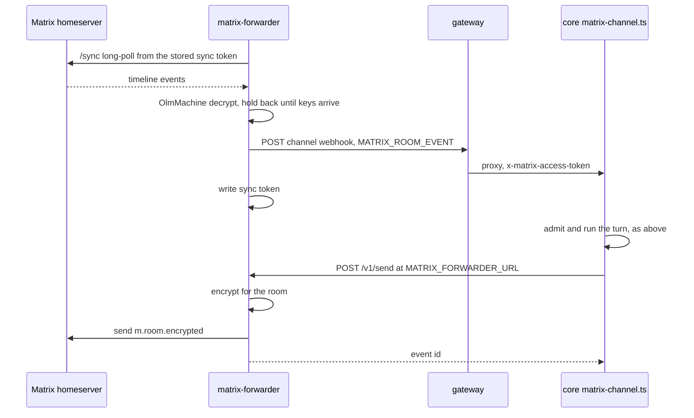

# Channels

This page covers how core turns a provider webhook into an agent run and sends the reply back. It covers the adapter contract, the runtime flow, attachment handling, and how to add a provider. Per-provider setup for users is under [Channels](../channels/index.md). Paths are relative to `apps/core/`.

## File map

| File                              | Owns                                                                                                |
| --------------------------------- | --------------------------------------------------------------------------------------------------- |
| `src/harness/integrations.ts`     | Routing, account and agent lookup, adapter selection (`createChannelRegistry`), provider ACKs       |
| `src/harness/handler.ts`          | Session setup, command dispatch, agent execution, final reply                                       |
| `src/shared/channels.ts`          | The shared contracts: `ChannelAdapter`, `ChannelActions`, `InboundMessage`                          |
| `src/shared/<channel>-channel.ts` | Provider auth, parsing, formatting and reply calls                                                  |
| `src/shared/matrix-wire.ts`       | The wire shapes core and `apps/matrix-forwarder` share. No imports, so the forwarder can bundle it. |
| `src/shared/commands.ts`          | `/new` and `/clear`, `/compact`, `/steer`, `/stop` and `/cancel`, `/queue`, `/help`                 |
| `src/harness/channel-media.ts`    | Inbound attachment download, storage and model hand-off                                             |
| `src/shared/media-ticket.ts`      | Sealed `/v1/media/{ticket}` links                                                                   |

Slack, Telegram, Discord and GitHub build on the Chat SDK adapters (`@chat-adapter/slack`, `/telegram`, `/discord`, `/github`). Matrix, Pancake and Zalo are Broods-native because Chat SDK does not cover them. Two providers need a process that holds a connection open, covered under [Forwarders](#forwarders).

Webhooks arrive at `/v1/webhooks/{accountId}/{channel}` for the production stage and `/v1/webhooks/{accountId}/dev/{endpointId}/{channel}` for any other stage, so two stages sharing one bot never receive each other's traffic.

## Runtime flow



`handleChannelWebhook` in `integrations.ts` runs the steps in that order. The ACK waits for attachment ingest, admission, dedup and a durable queue entry in Convex, for at most `CHANNEL_ACK_BUDGET_MS` (2 s). That stays under Slack's and Discord's 3 s retry limit, and a retry never races an admitted message. Model work starts on the `MAX_INPROCESS_WORKERS` pool once admission makes this message the conversation's owner.

One message over time. The `critical` block is what the ACK waits on:



A `queued` or `duplicate` outcome returns without a worker. The current owner drains the queued envelope on its own worker slot when its turn settles.

If two agents hold credentials that verify the same request, the lower agent id receives it, compared with `localeCompare`. The order is fixed so it cannot vary between requests. A channel record is how users resolve that tie.

A record lookup that finds nothing falls back to the credential holder. A lookup that fails refuses the turn and posts "I can't reach my channel configuration right now", because running without the record's policies and `denyTools` would be an escalation. The channel path already needs the control plane to admit ingress, so this costs no availability that is not already lost. A `context` message whose lookup fails is dropped with a warning.

`integrations.ts` scopes `eventId` and `conversationKey` with `accountId` and `agentId` before the session sees them. A webhook run only sees its own channel's config; core strips other channels' credentials from the runtime agent config.

## Adapter contract

Each provider implements `ChannelAdapter` from `src/shared/channels.ts`. The types it produces and consumes:



| Member                   | Purpose                                                                                  |
| ------------------------ | ---------------------------------------------------------------------------------------- |
| `name`                   | Stable URL segment and config key, such as `telegram`                                    |
| `canHandle(req)`         | Quick provider-shape check, usually on headers                                           |
| `authenticate(req)`      | Provider-native signature or secret check                                                |
| `parse(req)`             | Turns the webhook into one of the results below. May be async.                           |
| `actions(msg)`           | Reply, typing and reaction actions scoped to the inbound message                         |
| `applyReplyIn?(...)`     | Rewrites reply routing for a record's `replyIn`. Only Slack implements it.               |
| `rehydrateAttachment?()` | Rebuilds an attachment reader from stored metadata so a later turn can download it again |

`parse()` outcomes:

| Result     | Meaning                                                                                                                                                                                                  |
| ---------- | -------------------------------------------------------------------------------------------------------------------------------------------------------------------------------------------------------- |
| `message`  | Continue into the agent loop after sending `ack` or a default `200`                                                                                                                                      |
| `context`  | Store the message as conversation context without running the agent. Slack, Discord, Telegram and Matrix return it for messages that do not address the bot, so a later mention sees what the room said. |
| `cleanup`  | Delete the conversation's partition folder (`cleanupChannelPartitions`). GitHub returns it when an issue or PR closes.                                                                                   |
| `ignore`   | Stop without running the agent, usually an unsupported event                                                                                                                                             |
| `response` | Return a provider-specific response at once, such as a challenge reply                                                                                                                                   |

`ChannelActions` in `channels.ts` has `sendText`, `sendTyping` and `reactToMessage`, plus optional `sendImages`, `sendFiles`, `sendSticker`, `sendQuestions`, `stream` and a `supportsReactions` flag. A provider declares a capability by implementing the method. The model-facing tools in `src/harness/tools/channel.tool.ts` follow that.

| Tool             | Registers when                                                                                                                                    |
| ---------------- | ------------------------------------------------------------------------------------------------------------------------------------------------- |
| `send-message`   | the run has a session dispatcher and the agent config has at least one channel. Not tied to the current turn being a channel turn                 |
| `send-update`    | always on a channel turn, since every provider can post text                                                                                      |
| `send-images`    | `sendImages` or `sendFiles` exists                                                                                                                |
| `send-files`     | a workspace is attached. Without `sendFiles` it posts sealed links as text.                                                                       |
| `send-sticker`   | `sendSticker` exists                                                                                                                              |
| `send-reactions` | `supportsReactions` is `true`. Telegram and Matrix always, Slack, Discord and GitHub when the inbound message id is known, never Pancake or Zalo. |

The normalized `InboundMessage`:

- `eventId` is the provider delivery or message id, used for dedup.
- `conversationKey` is the provider thread, chat or channel key.
- `channelName` is the adapter name.
- `content` is AI SDK `UserContent`.
- `attachments` are named attachments with an adapter-owned `fetchData` reader. They hold no bytes yet.
- `events` holds optional extra model messages, such as a one-turn system message that must not persist.
- `identity` is the provider-neutral `ChannelIdentity` with `workspaceRef`, `channelId`, `threadId`, `userId`, `userName`, and `userRoles` filled from the channel record. Record lookup and policy read it.
- `source` is opaque provider metadata for commands and replies. It stays opaque because it carries reply-routing secrets such as interaction tokens and response URLs.
- `answer` is set when the message is a click on an `ask_questions` button.

## Shared pipeline behavior

Adapters do not implement these; the shared pipeline does:

- Commands. Slack, Discord, Matrix, Telegram and Zalo route `/command` input through `commands.ts` instead of the agent. GitHub and Pancake treat slash text as agent input.
- Typing and reaction are fire-and-forget. A failed typing or reaction call never fails the turn.
- Tools with `needsApproval` are denied on channel turns with `Tool approval is only supported through the direct API.` (`handler.ts`).
- A failed turn replies with `formatChannelErrorText()`, a `⚠️` line with the error simplified, so a quota error reads "Usage limit reached..." and a 429 reads "The model is busy right now...". Policy refusals use the same format.
- Deferred replies. A turn that finishes in the background pushes its result back through `sendChannelReply()`, which rebuilds the adapter from the agent config and the stored `source`, and runs the `onMessageSending` hook first. See [architecture](architecture.md).
- Trace links are omitted unless the connection sets `trace: "enabled"`.
- When a policy denies `agent.invoke`, core posts the refusal in-channel and the turn never starts.

## Reply streaming

Three adapters implement `stream()`. Slack uses Chat SDK's native Slack streaming API. Telegram private chats use rich draft previews through `fromFullStream()` and then persist the final response. GitHub buffers text and posts one Markdown comment. Discord, Matrix, Pancake and Zalo have no `stream()` and send one final `sendText` reply.

Slack, Telegram, Discord and GitHub delegate Markdown formatting to their Chat SDK adapters. Pancake and Zalo keep provider-specific text handling.

## Outbound files and images

The model only ever names workspace paths or public URLs. The adapter decides how the provider takes them:

| Channel  | Pictures                          | Documents                        | Batch                   |
| -------- | --------------------------------- | -------------------------------- | ----------------------- |
| Telegram | fetches the URL                   | fetches the URL                  | album of 2 to 10        |
| Slack    | Block Kit image blocks            | uploads bytes (`files.uploadV2`) | one message, one upload |
| Discord  | uploads bytes                     | uploads bytes                    | one multipart message   |
| Matrix   | uploads bytes                     | uploads bytes                    | one per message         |
| Pancake  | uploads bytes (`upload_contents`) | uploads bytes                    | one per message         |
| Zalo     | fetches the URL                   | none                             | one per message         |
| GitHub   | none                              | none                             | text links only         |

A workspace attachment carries both a sealed link and a reader, so fetch-style providers take the link and upload-style providers read the bytes only at upload time. A caption rides the first message only.

A workspace file leaves as a durable `/v1/media/{ticket}` link served by core, not a presigned S3 URL. Some providers re-fetch on every view, and Zalo stores the URL itself, so an expiring URL would leave broken images in chat history. Storage stays private, and the sealed ticket is the only credential. The ticket is minted per workspace and account. Dropping a value from `MEDIA_TICKET_SECRET` revokes every link sealed with it.

`send-images` degrades rather than fails. With no picture endpoint, or a rejected batch, pictures go out through the `send-files` path, as documents or as download links. Core logs the rejection reason and does not show it to the recipient. Where a provider has no document endpoint, `send-files` posts the links as text and says so in its tool result so the model does not send them twice. An agent with no workspace gets no `send-files`, and its `send-images` takes `urls` only. The harness logs a warning naming the cause.

## Inbound attachments

- Parsing never downloads. `ingestChannelAttachments` reads media after parse, just before admission, so a queued turn still carries it. The ACK waits at most 2 s for that, so a video download never holds the provider's connection open. Each adapter uses the provider's own auth. Telegram resolves a file id through `getFile` and signs with the bot token. Slack sends a bearer header, checks the host before attaching the token, and strips auth if a redirect leaves Slack.
- With a workspace attached, each attachment is read once and written twice, to the agent's default workspace under `media/` for its own tools, and to the attachment store, a prefix of the managed bucket that no sandbox mounts. The model gets a `/v1/media/{ticket}` link to the attachment-store copy, so it survives the agent tidying its workspace. Nothing is inlined as base64, because the conversation is stored as JSON and a link still resolves when the turn replays later. Deleting the account deletes the store.
- With no workspace, nothing is stored. The bytes reach the model on the turn they arrive, and the message keeps a reference to the channel's own copy so a later turn re-reads it with the channel's credentials. The channel then decides how long media works. A Telegram file id lasts, and a Discord link expires within a day.
- Core checks limits twice, on the declared size and on the bytes read. The limits are 6 MB for a picture, 25 MB for anything else, at most ten attachments per message. The media type is sniffed from the bytes, not taken from the provider, except when the sniff only identifies a container, since a `.docx` is a zip. An unreadable attachment becomes a line of text saying so.
- Pictures go to the model as pictures. PDFs, audio and video go as native parts only where the model provider accepts that exact type, and otherwise as a saved file. Every message with attachments gets one note listing what arrived and where.
- `src/harness/transcribe.ts` transcribes audio the model cannot hear on the way in, with the account's own provider. It uses `whisper-1` on OpenAI, `whisper-large-v3-turbo` on Groq, `voxtral-mini-latest` on Mistral. Google and Vertex get the recording itself. `config.model.transcriptionModelId` overrides the model. Transcription fails fast rather than retrying, and the note says whether the provider was busy, refused the file, or the account has no speech-to-text.

## Forwarders

Two providers do not deliver ordinary messages to a webhook, so a separate single-replica deployment holds the connection and POSTs to the channel webhook. Both read connections from every config plane listed in `BROODS_CONFIG_PLANES` and keep one connection per credential, fanning each event out to every plane's webhook, so the same bot on dev and prod is never connected twice. Neither filters anything. Which message runs the agent is core's decision.

| Forwarder                | Why it exists                                                                                | What it POSTs                                                                                                                                                  | Core calls back                                                                                                      |
| ------------------------ | -------------------------------------------------------------------------------------------- | -------------------------------------------------------------------------------------------------------------------------------------------------------------- | -------------------------------------------------------------------------------------------------------------------- |
| `apps/discord-forwarder` | Discord sends regular messages only over a Gateway WebSocket                                 | `{ "type": "GATEWAY_MESSAGE_CREATE", "data": ... }` with the bot token in `x-discord-gateway-token`                                                            | nothing. Replies use the Discord REST API.                                                                           |
| `apps/matrix-forwarder`  | Matrix has no webhooks. A client long-polls `/sync`. The forwarder also holds the E2EE keys. | `{ "type": "MATRIX_ROOM_EVENT", "encrypted", "event", "roomId", "senderName", "userId" }`, already decrypted, with the access token in `x-matrix-access-token` | `POST /v1/send` and `POST /v1/typing` at `MATRIX_FORWARDER_URL`, because only the forwarder can encrypt for the room |

A Matrix message and its reply make one round trip through the forwarder:



Media skips the forwarder. The attachment key rides the decrypted event, so core downloads, decrypts, encrypts and uploads files against the homeserver itself.

Core's Discord adapter takes both the interaction webhook and the forwarded shape on one URL and tells them apart by the `x-discord-gateway-token` header.

A deployment without the Discord forwarder can post the events itself. Send each Discord `MESSAGE_CREATE` event unmodified, wrapped as below, with the bot token in `x-discord-gateway-token`:

```json
{
  "type": "GATEWAY_MESSAGE_CREATE",
  "data": { "...": "MESSAGE_CREATE payload" }
}
```

An absent `author.bot` means a human, as Discord sends it. For a message inside a thread, add `thread: { "id": ..., "parent_id": ... }` to `data`, because Discord sets `channel_id` to the thread and omits its parent. Without it the conversation keys under the thread id as if it were a channel, `/new` in that thread disagrees, and allow lists that name the parent channel reject it. Matrix replies carry the `app.broods.bot` marker (`MATRIX_BOT_MARKER`), so core never answers its own events on a personal account. Deployment constraints for both are in [operations](operations.md), and each app's `AGENTS.md` lists its failure modes.

## Add a channel

1. Add the config type to `src/shared/domain/agent-config.ts`.
2. Validate the new `config.channels.<channel>` fields in `normalizeChannelsConfig()` in `packages/convex/model/agentRules.ts`.
3. Create `src/shared/<channel>-channel.ts` implementing `ChannelAdapter`. Use a Chat SDK adapter when one exists. Keep provider formatting and send logic in this module only for providers Chat SDK does not cover. Fill `identity` so records and policies can match the room and sender.
4. In `src/harness/integrations.ts`, add `create<Channel>ChannelFromConfig()` and include it in `createChannelRegistry()`.
5. In `packages/broods/src/resources.ts`, add the name to `ChannelType`, the connection and channel input types, and the `define<Channel>Connection` and `define<Channel>Channel` constructors. `packages/broods/src/client.ts` also lists channel names for the webhook URL helpers.
6. If the provider cannot call a webhook, add a forwarder like the two above rather than polling from core.
7. Update the [API reference](/api-reference), the user docs under `channels/`, a `packages/demos/channel-*` demo, and focused tests.

Never hardcode channel-specific behavior in commands, shared handlers or the agent loop. Commands receive only `ChannelActions`.

### Adapter skeleton

```ts
import type { ChannelAdapter, ChannelParseResult } from "./channels.ts";

export function createExampleChannel(
  token: string,
  webhookSecret: string,
): ChannelAdapter {
  return {
    name: "example",

    canHandle(req) {
      return "x-example-delivery" in req.headers;
    },

    authenticate(req) {
      return req.headers["x-example-secret"] === webhookSecret;
    },

    parse(req): ChannelParseResult {
      const body = JSON.parse(req.body) as {
        id: string;
        threadId: string;
        text?: string;
      };

      if (!body.text) {
        return { kind: "ignore", response: { statusCode: 200 } };
      }

      return {
        kind: "message",
        ack: { statusCode: 200 },
        message: {
          eventId: body.id,
          conversationKey: body.threadId,
          channelName: "example",
          content: [{ type: "text", text: body.text }],
          source: body as Record<string, unknown>,
        },
      };
    },

    actions(msg) {
      return {
        sendText: async (text) => {
          await fetch("https://api.example.com/messages", {
            method: "POST",
            headers: {
              Authorization: `Bearer ${token}`,
              "Content-Type": "application/json",
            },
            body: JSON.stringify({ threadId: msg.conversationKey, text: text }),
          });
        },
        sendTyping: async () => {},
        reactToMessage: async () => {},
      };
    },
  };
}
```

### Rules

- Verify signatures or webhook secrets before parsing user-controlled payloads deeply.
- ACK within the 2 s admission budget. Model work belongs after the ACK.
- Use stable provider ids for `eventId` so duplicate deliveries dedup.
- Use thread, chat or channel ids for `conversationKey` so follow-ups keep context.
- Never download attachments during `parse`.
- A provider `apiUrl` override must be a public `https` URL, checked when the channel is saved, because core sends the token to it.
