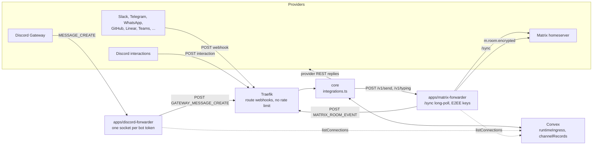
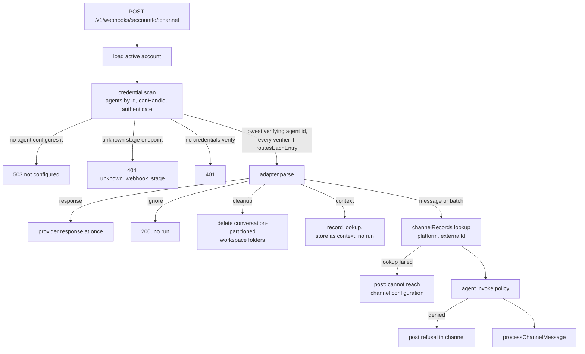
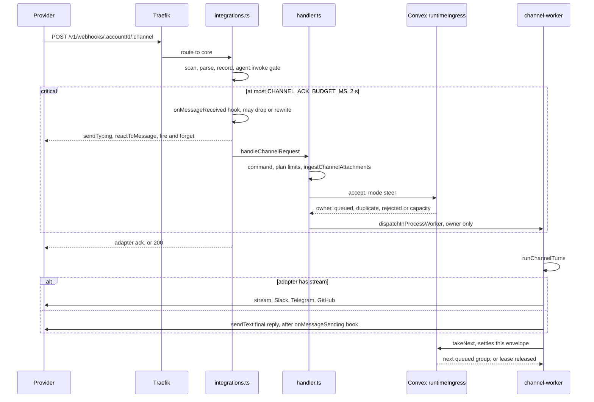
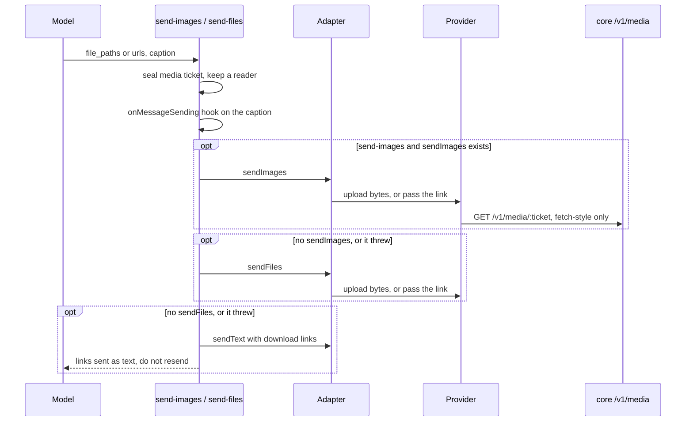
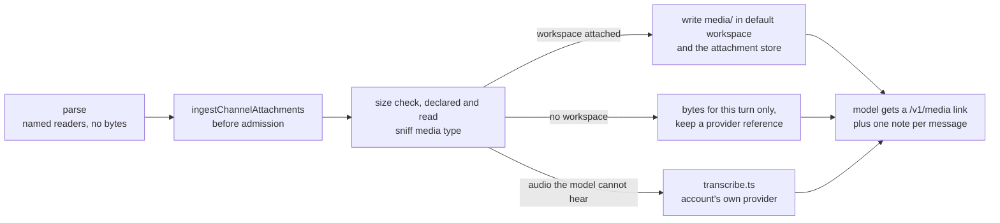
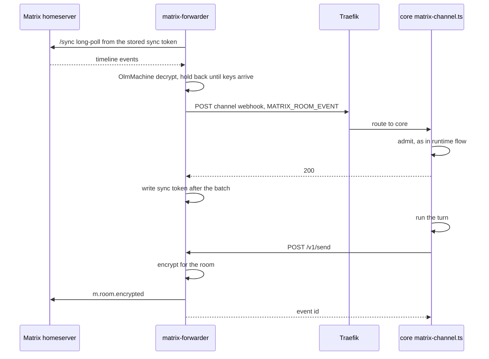

# Channels

How core turns a provider webhook into an agent run and sends the reply back. Per-provider setup for users is under [Channels](../channels/index.md). Paths are relative to `apps/core/`.

## File map

| File                                | Owns                                                                                         |
| ----------------------------------- | -------------------------------------------------------------------------------------------- |
| `src/harness/integrations.ts`       | Webhook routing, the credential scan, record lookup, policy gate, provider ACK               |
| `src/harness/handler.ts`            | `handleChannelRequest` admission, `runChannelTurns` on the worker pool, final reply          |
| `src/shared/channels.ts`            | The contracts: `ChannelAdapter`, `ChannelActions`, `InboundMessage`                          |
| `src/shared/<channel>-channel.ts`   | Provider auth, parsing, formatting and reply calls                                           |
| `src/shared/matrix-wire.ts`         | Wire shapes shared with `apps/matrix-forwarder`. No imports, so the forwarder can bundle it. |
| `src/shared/commands.ts`            | `/new` and `/clear`, `/compact`, `/steer`, `/stop` and `/cancel`, `/queue`, `/help`          |
| `src/harness/tools/channel.tool.ts` | The model-facing `send-*` tools                                                              |
| `src/harness/channel-media.ts`      | Inbound attachment download, storage and model hand-off                                      |
| `src/shared/media-ticket.ts`        | Sealed `/v1/media/{ticket}` links                                                            |

Slack, Telegram, Discord, GitHub, Linear, WhatsApp, Teams, Google Chat, Twilio, Messenger and Instagram use Chat SDK adapters (`@chat-adapter/*`) as transport only: verify, parse, post. Core never creates a `Chat` instance and builds a fresh adapter per request, so nothing kept in Chat state survives. That is why Linear takes a personal API key only (OAuth tokens are refreshed and cached in Chat state). Messenger and Instagram share Meta webhook handling in `meta-channel.ts`. Matrix, Pancake and Zalo are Broods-native.

## Inbound paths


```mermaid
flowchart LR
  subgraph providers["Providers"]
    Hook["Slack, Telegram, WhatsApp,<br/>GitHub, Linear, Teams, ..."]
    DInt["Discord interactions"]
    DGw["Discord Gateway"]
    HS["Matrix homeserver"]
  end
  DF["apps/discord-forwarder<br/>one socket per bot token"]
  MF["apps/matrix-forwarder<br/>/sync long-poll, E2EE keys"]
  T["Traefik<br/>route webhooks, no rate limit"]
  C["core<br/>integrations.ts"]
  CX["Convex<br/>runtimeIngress, channelRecords"]

  Hook -->|"POST webhook"| T
  DInt -->|"POST interaction"| T
  DGw -->|"MESSAGE_CREATE"| DF
  DF -->|"POST GATEWAY_MESSAGE_CREATE"| T
  MF -->|"/sync"| HS
  MF -->|"POST MATRIX_ROOM_EVENT"| T
  T --> C
  C <--> CX
  DF -.->|"listConnections"| CX
  MF -.->|"listConnections"| CX
  C -->|"provider REST replies"| providers
  C -->|"POST /v1/send, /v1/typing"| MF
  MF -->|"m.room.encrypted"| HS
```

Webhook URLs are `/v1/webhooks/{accountId}/{channel}` for the production stage and `/v1/webhooks/{accountId}/dev/{endpointId}/{channel}` for any other stage, so two stages sharing one bot never see each other's traffic. The URL names no agent. Traefik (`apps/edge/src/routes.ts`) sends the path straight to core with no per-address limit, because providers post from shared egress addresses.

A GET with no query string answers `{"status":"ok"}` so a provider console sees the URL live. A GET with a query string is a subscription handshake and goes through the same scan as a delivery. WhatsApp checks `hub.verify_token` in `authenticate` and echoes `hub.challenge` from `parse`. A GET no channel claims, such as Pancake's `?secret=` URL, still answers `ok`.

## Runtime flow

Which agent gets a delivery, and what `parse` decides:


```mermaid
flowchart TD
  In["POST /v1/webhooks/:accountId/:channel"] --> Acc["load active account"]
  Acc --> Scan["credential scan<br/>agents by id, canHandle, authenticate"]
  Scan -->|"no agent configures it"| E503["503 not configured"]
  Scan -->|"unknown stage endpoint"| E404["404 unknown_webhook_stage"]
  Scan -->|"no credentials verify"| E401["401"]
  Scan -->|"lowest verifying agent id,<br/>every verifier if routesEachEntry"| Parse["adapter.parse"]
  Parse -->|"response"| Resp["provider response at once"]
  Parse -->|"ignore"| Ign["200, no run"]
  Parse -->|"cleanup"| Clean["delete conversation-partitioned<br/>workspace folders"]
  Parse -->|"context"| Ctx["record lookup,<br/>store as context, no run"]
  Parse -->|"message or batch"| Rec["channelRecords lookup<br/>platform, externalId"]
  Rec -->|"lookup failed"| Down["post: cannot reach<br/>channel configuration"]
  Rec --> Gate["agent.invoke policy"]
  Gate -->|"denied"| Deny["post refusal in channel"]
  Gate --> Admit["processChannelMessage"]
```

- Ties between agents that verify the same request go to the lowest agent id (`localeCompare`), so the choice never varies. A channel record is how users resolve that tie. WhatsApp, Messenger and Instagram set `routesEachEntry`: every verifier gets the delivery and keeps only its own entries.
- A record lookup that finds nothing falls back to the credential holder. One that fails refuses the turn, since running without the record's policies and `denyTools` would be an escalation. A `context` message whose lookup fails is dropped with a warning.
- `eventId` and `conversationKey` are scoped with `accountId` and `agentId` before the session sees them. A run only sees its own channel's config; core strips other channels' credentials.

One message, from webhook to reply. The `critical` block is what the provider ACK waits on:


```mermaid
sequenceDiagram
  participant P as Provider
  participant T as Traefik
  participant I as integrations.ts
  participant H as handler.ts
  participant CX as Convex runtimeIngress
  participant W as channel-worker

  P->>T: POST /v1/webhooks/:accountId/:channel
  T->>I: route to core
  I->>I: scan, parse, record, agent.invoke gate
  critical at most CHANNEL_ACK_BUDGET_MS, 2 s
    I->>I: onMessageReceived hook, may drop or rewrite
    I-->>P: sendTyping, reactToMessage, fire and forget
    I->>H: handleChannelRequest
    H->>H: command, plan limits, ingestChannelAttachments
    H->>CX: accept, mode steer
    CX-->>H: owner, queued, duplicate, rejected or capacity
    H->>W: dispatchInProcessWorker, owner only
  end
  I-->>P: adapter ack, or 200
  W->>W: runChannelTurns
  alt adapter has stream
    W->>P: stream, Slack, Telegram, GitHub
  else
    W->>P: sendText final reply, after onMessageSending hook
  end
  W->>CX: takeNext, settles this envelope
  CX-->>W: next queued group, or lease released
```

The 2 s budget stays under Slack's and Discord's 3 s retry limit, so a provider retry never races an admitted message. Whatever is still admitting when the budget runs out carries on after the ACK. A `queued` or `duplicate` outcome starts no worker: the current owner drains the queue on its own worker slot (`runChannelTurns` loops on `takeNext`). Busy-conversation rules are in [queue and steer](queue-and-steer.md). Model work runs on the `MAX_INPROCESS_WORKERS` pool shared with async and WebSocket runs.

## Adapter contract

Each provider implements `ChannelAdapter` from `src/shared/channels.ts`:

| `ChannelAdapter` member  | Purpose                                                                           |
| ------------------------ | --------------------------------------------------------------------------------- |
| `name`                   | URL segment and config key, such as `telegram`                                    |
| `routesEachEntry?`       | Hand the delivery to every verifying agent (Meta batches)                         |
| `canHandle(req)`         | Quick provider-shape check, usually on headers                                    |
| `authenticate(req)`      | Provider-native signature or secret check                                         |
| `parse(req)`             | One `ChannelParseResult`, below. May be async. Never downloads.                   |
| `actions(msg)`           | `ChannelActions` scoped to the inbound message                                    |
| `applyReplyIn?()`        | Rewrites reply routing for a record's `replyIn`. Only Slack implements it.        |
| `rehydrateAttachment?()` | Rebuilds an attachment reader from stored metadata so a later turn can re-read it |

| `parse()` kind | Meaning                                                                                                        |
| -------------- | -------------------------------------------------------------------------------------------------------------- |
| `message`      | Run the agent, after sending `ack` or a default `200`                                                          |
| `context`      | Store as conversation context, no run. Slack, Discord, Telegram and Matrix use it for messages not to the bot. |
| `batch`        | Several `message` or `context` results from one POST, admitted in order under one ACK budget (Meta batching)   |
| `cleanup`      | Delete the conversation's partition folders. GitHub returns it when an issue or PR closes.                     |
| `ignore`       | Stop without a run, usually an unsupported event                                                               |
| `response`     | Answer the provider at once, such as a challenge reply                                                         |

`InboundMessage` carries `eventId` (provider id, used for dedup), `conversationKey` (thread, chat or channel), `channelName`, `content` (AI SDK `UserContent`), `attachments` (named readers, no bytes yet), `events` (extra model messages such as a one-turn system message), `identity` (`ChannelIdentity`: `workspaceRef`, `channelId`, `threadId`, `userId`, `userName`, `userRoles`), `source` (opaque reply routing, which can hold interaction tokens) and `answer` (an `ask_questions` button click).

`ChannelActions` requires `sendText`, `sendTyping` and `reactToMessage`. A provider declares more by implementing them, and the tools follow:

| Tool             | Registers when                                                                               |
| ---------------- | -------------------------------------------------------------------------------------------- |
| `send-message`   | the run has a session dispatcher and the agent has at least one channel, channel turn or not |
| `send-update`    | always on a channel turn                                                                     |
| `send-images`    | `sendImages` or `sendFiles` exists                                                           |
| `send-files`     | a workspace is attached                                                                      |
| `send-sticker`   | `sendSticker` exists                                                                         |
| `send-reactions` | `supportsReactions` is `true`                                                                |

Only Slack, Telegram and GitHub implement `stream()` (GitHub buffers and posts one comment). Every other channel sends one final `sendText`.

## Shared pipeline behavior

Adapters do not implement these:

- Commands. Channels in `INLINE_COMMAND_CHANNELS` (Discord, Google Chat, Instagram, Matrix, Messenger, Slack, Teams, Telegram, Twilio, WhatsApp, Zalo) route `/command` text through `commands.ts`. GitHub, Linear and Pancake pass it to the agent.
- Typing and reaction never fail the turn.
- Tools with `needsApproval` are denied on channel turns.
- A failed turn replies with `formatChannelErrorText()`: the provider's reason, secrets redacted, plus the step that fixes it. `sendChannelFailure()` adds a Retry button where `sendReplyButtons` exists (Telegram), or `Reply "retry"` text.
- A turn that finishes in the background replies through `sendChannelReply()`, which rebuilds the adapter from config and the stored `source` and runs `onMessageSending` first. See [architecture](architecture.md).
- Trace links are omitted unless the connection sets `trace: "enabled"`.

## Outbound files and images

The model names workspace paths or public URLs. The tool seals each workspace file into a durable `/v1/media/{ticket}` link and keeps a reader beside it, then falls down a ladder:


```mermaid
sequenceDiagram
  participant M as Model
  participant Tool as send-images / send-files
  participant A as Adapter
  participant P as Provider
  participant C as core /v1/media

  M->>Tool: file_paths or urls, caption
  Tool->>Tool: seal media ticket, keep a reader
  Tool->>Tool: onMessageSending hook on the caption
  opt send-images and sendImages exists
    Tool->>A: sendImages
    A->>P: upload bytes, or pass the link
    P->>C: GET /v1/media/:ticket, fetch-style only
  end
  opt no sendImages, or it threw
    Tool->>A: sendFiles
    A->>P: upload bytes, or pass the link
  end
  opt no sendFiles, or it threw
    Tool->>A: sendText with download links
    Tool-->>M: links sent as text, do not resend
  end
```

| Channel                                       | Pictures                          | Documents                         | Batch                   |
| --------------------------------------------- | --------------------------------- | --------------------------------- | ----------------------- |
| Telegram                                      | fetches the URL                   | fetches the URL                   | album of 2 to 10        |
| Slack                                         | Block Kit image blocks            | uploads bytes (`files.uploadV2`)  | one message, one upload |
| Discord                                       | uploads bytes                     | uploads bytes                     | one multipart message   |
| Matrix                                        | uploads bytes                     | uploads bytes                     | one per message         |
| Pancake                                       | uploads bytes (`upload_contents`) | uploads bytes                     | one per message         |
| Zalo                                          | fetches the URL                   | none                              | one per message         |
| WhatsApp                                      | uploads bytes, or links a URL     | uploads bytes, or links a URL     | one per message         |
| Instagram                                     | uploads bytes, or fetches the URL | uploads bytes, or fetches the URL | one per message         |
| Twilio                                        | fetches the URL (MMS)             | none                              | one per message         |
| Teams, Google Chat, Messenger, GitHub, Linear | none                              | none                              | text links only         |

The link has no expiry because some providers re-fetch on every view, and Zalo stores the URL itself. Storage stays private and the sealed ticket is the only credential. Dropping a value from `MEDIA_TICKET_SECRET` revokes every link sealed with it. A caption rides the first message only. Rejection reasons go to the log, not the chat.

## Inbound attachments


```mermaid
flowchart LR
  Parse["parse<br/>named readers, no bytes"] --> Ingest["ingestChannelAttachments<br/>before admission"]
  Ingest --> Check["size check, declared and read<br/>sniff media type"]
  Check -->|"workspace attached"| Two["write media/ in default workspace<br/>and the attachment store"]
  Check -->|"no workspace"| Ref["bytes for this turn only,<br/>keep a provider reference"]
  Two --> Model["model gets a /v1/media link<br/>plus one note per message"]
  Ref --> Model
  Check -->|"audio the model cannot hear"| Tx["transcribe.ts<br/>account's own provider"]
  Tx --> Model
```

- Download happens after parse and before admission, so a queued turn still carries its media. Each adapter uses the provider's own auth, and Slack and Teams only send their token to their own hosts.
- The attachment store is a managed-bucket prefix no sandbox mounts, so the link survives the agent tidying its workspace. Nothing is inlined as base64. Deleting the account deletes the store.
- Without a workspace, a later turn re-reads the provider's copy, so the provider decides how long media works (a Telegram file id lasts, a Discord link expires within a day).
- Limits: 6 MB per picture, 25 MB otherwise, ten attachments per message (`src/shared/media-types.ts`, `channel-media.ts`). An unreadable attachment becomes a line of text.
- Transcription fails fast at ingest, and the note says whether the provider was busy, refused the file, or has no speech-to-text. `config.model.transcriptionModelId` overrides the default.

## Forwarders

Discord sends regular messages only over a Gateway socket, and Matrix has no webhooks, so each has a single-replica deployment that holds the connection and POSTs to the channel webhook. Both read connections from every plane in `BROODS_CONFIG_PLANES`, keep one connection per credential, and fan each event out to every webhook that credential serves. Neither filters: which message runs is core's decision.

| Forwarder                | POSTs                                                                                     | Header                    | Core calls back                                         |
| ------------------------ | ----------------------------------------------------------------------------------------- | ------------------------- | ------------------------------------------------------- |
| `apps/discord-forwarder` | `{ "type": "GATEWAY_MESSAGE_CREATE", "data": ... }`                                       | `x-discord-gateway-token` | nothing, replies use Discord REST                       |
| `apps/matrix-forwarder`  | `{ "type": "MATRIX_ROOM_EVENT", "encrypted", "event", "roomId", "senderName", "userId" }` | `x-matrix-access-token`   | `POST /v1/send`, `/v1/typing` at `MATRIX_FORWARDER_URL` |

A Matrix message and its reply:


```mermaid
sequenceDiagram
  participant HS as Matrix homeserver
  participant F as matrix-forwarder
  participant T as Traefik
  participant C as core matrix-channel.ts

  F->>HS: /sync long-poll from the stored sync token
  HS-->>F: timeline events
  F->>F: OlmMachine decrypt, hold back until keys arrive
  F->>T: POST channel webhook, MATRIX_ROOM_EVENT
  T->>C: route to core
  C->>C: admit, as in runtime flow
  C-->>F: 200
  F->>F: write sync token after the batch
  C->>C: run the turn
  C->>F: POST /v1/send
  F->>F: encrypt for the room
  F->>HS: m.room.encrypted
  F-->>C: event id
```

Media skips the forwarder: the attachment key rides the decrypted event, so core downloads, decrypts, encrypts and uploads against the homeserver itself. Replies carry the `app.broods.bot` marker (`MATRIX_BOT_MARKER`) so core never answers its own events.

Core's Discord adapter takes interactions and forwarded messages on one URL and tells them apart by `x-discord-gateway-token`. A deployment without the forwarder can post `MESSAGE_CREATE` events itself in the same wrapper. An absent `author.bot` means a human. For a thread message add `thread: { "id": ..., "parent_id": ... }` to `data`, because Discord sets `channel_id` to the thread and omits the parent. Deployment constraints are in [operations](operations.md), and each app's `AGENTS.md` lists its failure modes.

## Add a channel

1. Add the config type to `src/shared/domain/agent-config.ts`.
2. Validate `config.channels.<channel>` in `normalizeChannelsConfig()` in `packages/convex/model/agentRules.ts`.
3. Create `src/shared/<channel>-channel.ts` implementing `ChannelAdapter`. Use a Chat SDK adapter when one exists. Fill `identity` so records and policies can match.
4. Add `create<Channel>ChannelFromConfig()` to `createChannelRegistry()` in `src/harness/integrations.ts`.
5. In `packages/broods/src/resources.ts`, add the name to `ChannelType`, the input types, and `define<Channel>Connection` and `define<Channel>Channel`. `packages/broods/src/client.ts` lists channel names for the webhook URL helpers.
6. If the provider cannot call a webhook, add a forwarder rather than polling from core.
7. Update the [API reference](/api-reference), the user docs under `channels/`, a `packages/demos/channel-*` demo, and focused tests.

Never hardcode channel behavior in commands, shared handlers or the agent loop. Commands receive only `ChannelActions`.

### Adapter skeleton

```ts
import type { ChannelAdapter, ChannelParseResult } from "./channels.ts";

export function createExampleChannel(
  token: string,
  webhookSecret: string,
): ChannelAdapter {
  return {
    name: "example",

    canHandle(req) {
      return "x-example-delivery" in req.headers;
    },

    authenticate(req) {
      return req.headers["x-example-secret"] === webhookSecret;
    },

    parse(req): ChannelParseResult {
      const body = JSON.parse(req.body) as {
        id: string;
        threadId: string;
        text?: string;
      };

      if (!body.text) {
        return { kind: "ignore", response: { statusCode: 200 } };
      }

      return {
        kind: "message",
        ack: { statusCode: 200 },
        message: {
          eventId: body.id,
          conversationKey: body.threadId,
          channelName: "example",
          content: [{ type: "text", text: body.text }],
          source: body as Record<string, unknown>,
        },
      };
    },

    actions(msg) {
      return {
        sendText: async (text) => {
          await fetch("https://api.example.com/messages", {
            method: "POST",
            headers: {
              Authorization: `Bearer ${token}`,
              "Content-Type": "application/json",
            },
            body: JSON.stringify({ threadId: msg.conversationKey, text: text }),
          });
        },
        sendTyping: async () => {},
        reactToMessage: async () => {},
      };
    },
  };
}
```

### Rules

- Verify signatures or secrets before parsing user-controlled payloads deeply.
- Use stable provider ids for `eventId` so redeliveries dedup, and thread or chat ids for `conversationKey` so follow-ups keep context.
- Never download attachments in `parse`.
- A provider `apiUrl` override must be a public `https` URL, checked when the channel is saved, because core sends the token to it.
