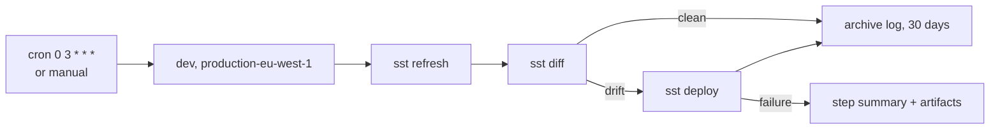

# CI/CD

This page covers the GitHub Actions workflows: what runs on a pull request, how code reaches dev and production, how the SDK is published, and the nightly drift reconcile. It is for contributors and operators.

## Branch flow

- Work lands on `dev` through pull requests. Pushing to `dev` deploys the `dev` stage.
- `main` is protected and moves only by fast-forward from `dev`, through the "Promote dev to main" workflow (Actions tab, one click). It waits for dev's required checks, fast-forwards `main`, then dispatches the production workflows: Convex first, then the rest in parallel. Pushes made with `GITHUB_TOKEN` do not fire `on: push` workflows, which is why promote dispatches them explicitly.
- Do not deploy by hand unless asked. Push to `dev` and let CI/CD do it.

## Workflows

| Workflow                                                                                                                       | Runs on                                                  | Does                                                                                                                                                          |
| ------------------------------------------------------------------------------------------------------------------------------ | -------------------------------------------------------- | ------------------------------------------------------------------------------------------------------------------------------------------------------------- |
| `ci.yaml`                                                                                                                      | every pull request, non-main pushes                      | Validates core, SDK and Convex types, gateway and dashboard. `validate` and `app-surfaces` are required checks on `dev`, so pull requests have no path filter |
| `deploy.yaml`                                                                                                                  | pushes to `dev` and `main`, manual with a `stage`        | SST deploy of the data plane. Skips docs-only, dashboard-only and markdown-only changes                                                                       |
| `deploy-convex.yaml`                                                                                                           | pushes to `dev` and `main` touching `packages/convex`    | Deploys the Convex schema and functions on their own                                                                                                          |
| `build-core.yaml`, `build-gateway.yaml`, `build-dashboard.yaml`, `build-discord-forwarder.yaml`, `build-matrix-forwarder.yaml` | pushes to `dev` and `main`                               | Build and push images, then roll the pods through `rollout.yaml`                                                                                              |
| `rollout.yaml`                                                                                                                 | called by the build workflows                            | Dispatches the infra repo workflow that rolls a pod. A build alone deploys nothing                                                                            |
| `check-broods-sdk.yaml`                                                                                                        | PRs and non-main pushes touching the SDK                 | Typecheck, test, build and dry-run pack, so sources, tests and env files cannot slip into the tarball                                                         |
| `publish-npm.yaml`                                                                                                             | `main` pushes touching the SDK, and last step of promote | Publishes `packages/broods` through npm Trusted Publishing when the version is new                                                                            |
| `deploy-docs.yaml`                                                                                                             | `main` pushes touching `apps/docs`                       | Builds this site and syncs it to S3 and CloudFront (`DOCS_S3_BUCKET`, `DOCS_DOMAIN`)                                                                          |
| `drift-cleanup.yaml`                                                                                                           | daily at 03:00 UTC, manual                               | `sst refresh` and `sst diff` per stage, deploy on drift                                                                                                       |
| `e2e-dashboard.yaml`, `opa-policy-check.yaml`, `codeql.yml`, `dependency-watch.yaml`                                           | as configured                                            | Dashboard end-to-end tests, OPA policy checks, CodeQL, dependency watch                                                                                       |

## Deploy stages

| Branch | Stage                                            | Notes                                                         |
| ------ | ------------------------------------------------ | ------------------------------------------------------------- |
| `dev`  | `dev`, in `DEV_AWS_REGION` (default `eu-west-1`) | Re-validates before deploying. Uses the dev Convex deployment |
| `main` | `production-eu-west-1`                           | Skips re-validation. Uses the production Convex deployment    |

Production deploys only to `eu-west-1`, where the production Convex database also lives. `us-east-1` and `ap-southeast-1` are planned production regions and stay disabled until a reviewed rollout promotes them. MicroVM prerequisites are skipped in `ap-southeast-1`.

## Required secrets and variables

The deploy workflow needs these repository secrets:

- `CONVEX_URL`, `CONVEX_DEPLOY_KEY`
- `OTEL_EXPORTER_OTLP_HEADERS`, to deploy the sandbox log forwarder

And these repository variables: `AWS_ROLE_ARN`, `AWS_ACCOUNT_ID`, `PROJECT_NAME`, `PROJECT_OWNER_EMAIL`, and optionally `DEV_AWS_REGION`.

Runtime secrets for the containers are not GitHub secrets. They live in the infra repo's release files and the Convex env. See [self-hosting](self-hosting.md#core-container-env).

The npm publish workflow must be a Trusted Publisher for the `broods` package: GitHub Actions, organization `beeblastco`, repository `broods`, workflow `publish-npm.yaml`. Do not commit `.npmrc` files or npm tokens.

## SDK versioning

Nobody hand-edits the SDK `version`, and nothing commits it. `publish-npm.yaml` derives it at publish time from conventional-commit subjects since the last `broods-v*` tag: `!` or `BREAKING CHANGE` bumps minor while on `0.x`, `feat:` bumps minor, anything else patches. Write real conventional subjects, because the subject line is the release note. The publish skips when nothing releasable changed or the derived version is already on npm. See `packages/broods/AGENTS.md`.

## Drift cleanup

`drift-cleanup.yaml` reconciles drift between `sst.config.ts` and the live stack every night, so resources whose code was removed (orphan NAT gateways, unused log groups, old Lambdas) cannot keep charging.

- Each stage is pinned to the branch that feeds it: `dev` reconciles from `dev`, and every `production-*` stage from `main`. Without the pin, the nightly run would deploy dev's HEAD to production and bypass the promote gate. This pin is the real safety control.
- Production reconciles run in the GitHub `production` environment. That environment has no required reviewers today, so the gate is advisory until reviewers are added.
- Each run uploads the refresh and diff log as `drift-plan-{stage}`, and puts the first 200 lines of a non-empty diff in the step summary.
- It only catches resources tracked in Pulumi state. Anything created outside SST, such as a hand-run `aws ec2` command, needs manual cleanup.

A new stage must be added to the matrix, or drift cleanup never sees it.

## Channel setup

Deploys create no demo accounts and register no provider webhooks. Channel agents are declared in code and synced with `broods dev` or `broods deploy`. The `packages/demos/channel-*` demos show provider registration.
