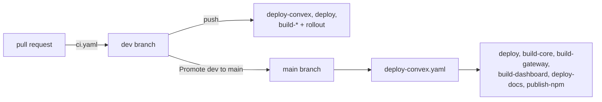
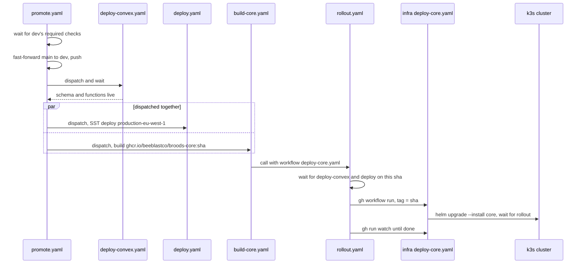

# CI/CD

This page lists every GitHub Actions workflow in `.github/workflows/`, with what triggers it, what it does, and what it needs. It is for contributors and operators.

## Branch flow

- Work lands on `dev` through pull requests. A push to `dev` deploys the dev stage, meaning Convex, the AWS data plane, and every changed container image.
- `main` is protected and only moves by fast-forward from `dev`, through the one-click "Promote dev to main" workflow in the Actions tab. Nothing is merged into `main` directly.
- Promote waits for dev's required checks, fast-forwards `main`, then dispatches the production workflows. Pushes made with `GITHUB_TOKEN` do not fire `on: push` workflows, which is why promote dispatches them itself.
- Do not deploy by hand unless asked. Push to `dev` and let the workflows do it.

## Workflows

| Workflow                       | Trigger                                                                                                                 | What it does                                                                                                                                                                                                                                                                                                                           |
| ------------------------------ | ----------------------------------------------------------------------------------------------------------------------- | -------------------------------------------------------------------------------------------------------------------------------------------------------------------------------------------------------------------------------------------------------------------------------------------------------------------------------------- |
| `ci.yaml`                      | every pull request; pushes to any branch but `main`, except docs and markdown only                                      | `validate`: lint, format check, `bun run check`, unit tests with the isolate runner, core build. `secrets-scan`: gitleaks over new commits. `performance`: CPU benchmarks against `bench/baselines.json`. `app-surfaces`: check and test gateway, both forwarders, Convex and dashboard, dashboard bundle budget and Playwright suites |
| `check-broods-sdk.yaml`        | pull requests and non-`main` pushes touching `packages/broods`, root package files or the npm workflows                 | Job `sdk-package`: typecheck, test, build and dry-run pack of the SDK, so tests and env files cannot reach the tarball                                                                                                                                                                                                                 |
| `codeql.yml`                   | pushes and pull requests to `dev` and `main`; Tuesdays 17:35 UTC                                                        | CodeQL analysis                                                                                                                                                                                                                                                                                                                        |
| `deploy-convex.yaml`           | pushes to `dev` or `main` touching `packages/convex`; manual                                                            | `convex deploy` of schema and functions. `main` refuses a key that is not `prod:`, or a self-hosted URL other than `https://convex-api.broods.app`                                                                                                                                                                                     |
| `deploy.yaml`                  | pushes to `dev` or `main`, except docs, dashboard and markdown only; manual with a `stage` input                        | SST deploy of the AWS data plane from `apps/core`. `dev` re-runs check, test and build first; `main` trusts PR CI. Clears a stale SST lock, retries a failed deploy 3 times, 15 s apart                                                                                                                                                |
| `build-core.yaml`              | pushes to `dev` or `main` touching `apps/core`, `packages/convex` or root package files; manual                         | Builds `ghcr.io/beeblastco/broods-core`, then rolls `deploy-core-dev.yaml` or `deploy-core.yaml` in infra after `deploy-convex` and `deploy` succeed for the same sha                                                                                                                                                                  |
| `build-gateway.yaml`           | pushes to `dev` or `main` touching `apps/gateway` or root package files; manual                                         | Builds `broods-gateway` after its check and tests, rolls `deploy-gateway-dev.yaml` or `deploy-gateway.yaml`. No prerequisite gate                                                                                                                                                                                                      |
| `build-dashboard.yaml`         | pushes to `dev` or `main` touching `apps/dashboard`, `packages/broods`, `packages/convex` or root package files; manual | Builds `broods-dashboard` with `NEXT_PUBLIC_*` build args from the environment, rolls `deploy-dashboard-dev.yaml` or `deploy-dashboard.yaml` after `deploy-convex`                                                                                                                                                                     |
| `build-discord-forwarder.yaml` | pushes to `dev` or `main` touching the forwarder or the core and Convex files it imports; manual                        | Builds `broods-discord-forwarder`. Rolls `deploy-discord-forwarder.yaml` from `main` only, or on a manual run with `rollout` ticked                                                                                                                                                                                                    |
| `build-matrix-forwarder.yaml`  | pushes to `dev` or `main` touching the forwarder, the Discord modules it imports, or its core and Convex files; manual  | Builds `broods-matrix-forwarder`. Rolls `deploy-matrix-forwarder.yaml` from `main` only, or on a manual run with `rollout` ticked                                                                                                                                                                                                      |
| `rollout.yaml`                 | called by the build workflows                                                                                           | Waits for the listed prerequisite workflows of the same sha, then dispatches the infra repo workflow and watches it. 40 minute budget                                                                                                                                                                                                  |
| `e2e-dashboard.yaml`           | after "Build Dashboard Image" succeeds on `dev` or `main`; manual with `base_url`                                       | Signed-in Playwright suites against the deployed dashboard                                                                                                                                                                                                                                                                             |
| `opa-policy-check.yaml`        | pushes to `dev` or `main` touching the rego or its cases; daily 06:17 UTC; manual                                       | Checks `apps/core/opa/broods_authz.rego`, that the deployed OPA serves that exact rego, and that it decides `scripts/opa-decision-cases.ts` as expected                                                                                                                                                                                |
| `deploy-docs.yaml`             | pushes to `main` touching `apps/docs`; manual                                                                           | Builds this site with a hoisted install, syncs it to `DOCS_S3_BUCKET` and invalidates the CloudFront distribution for `DOCS_DOMAIN`                                                                                                                                                                                                    |
| `publish-npm.yaml`             | pushes to `main` touching the SDK or root package files; manual; dispatched by promote                                  | Publishes `packages/broods` through npm Trusted Publishing when the derived version is new, tags `broods-v*` and cuts a GitHub release                                                                                                                                                                                                 |
| `drift-cleanup.yaml`           | daily 03:00 UTC; manual                                                                                                 | `sst refresh` and `sst diff` per stage, deploy on drift. See below                                                                                                                                                                                                                                                                     |
| `dependency-watch.yaml`        | Mondays 06:00 UTC; manual                                                                                               | Reports AI SDK family and esbuild releases into one rolling issue labelled `dependency-watch`                                                                                                                                                                                                                                          |
| `promote.yaml`                 | manual only                                                                                                             | "Promote dev to main". Described above                                                                                                                                                                                                                                                                                                 |

`validate`, `app-surfaces` and the other required checks on `dev` report on every pull request, so `ci.yaml` has no path filter on `pull_request`. A filtered workflow would never report and a docs-only pull request would wait forever.

Promote dispatches `deploy-convex.yaml` first and waits for it, then `deploy.yaml`, `build-core.yaml`, `build-gateway.yaml`, `build-dashboard.yaml`, `build-discord-forwarder.yaml`, `build-matrix-forwarder.yaml`, `deploy-docs.yaml` and `publish-npm.yaml` in parallel. Each forwarder is one release serving every config plane, prod included, so a `dev` push only builds and tests it and promote is what rolls it. To try a forwarder change first, run its build workflow on the branch with `rollout` ticked. That serves prod traffic too.

## Rollouts

A green image build deploys nothing by itself. The pods live in a k3s cluster owned by the `beeblastco/infra` repo. `rollout.yaml` dispatches that repo's workflow with the image tag, which is the commit sha, and watches the run.

- Core waits for `deploy-convex.yaml` and `deploy.yaml` on the same sha, so its image never reaches the cluster ahead of the schema or data plane it expects. The dashboard waits for `deploy-convex.yaml`.
- A prerequisite that did not run for the sha is skipped. One that fails, or has not finished in 20 minutes, stops the rollout.
- Images are tagged with the commit sha, plus a floating `dev` or `main` tag on those branches.

A promote, followed through to the core pod:

Gateway, dashboard, docs, npm and both forwarders are dispatched in the same parallel step. Only core and the dashboard gate their rollout on prerequisites.

## Deploy stages

| Source                      | SST stage              | Region                                | GitHub environment |
| --------------------------- | ---------------------- | ------------------------------------- | ------------------ |
| push to `dev`               | `dev`                  | `DEV_AWS_REGION`, default `eu-west-1` | `development`      |
| push to `main`              | `production-eu-west-1` | `eu-west-1`                           | `production`       |
| manual, `stage: production` | `production-eu-west-1` | `eu-west-1`                           | `production`       |
| manual, other stage         | that stage             | `DEV_AWS_REGION`                      | `development`      |

Production deploys only to `eu-west-1`. `production_targets()` in `deploy.yaml` lists it alone. `microvmPrereqsEnabled` in `sst.config.ts` skips the MicroVM prerequisites in `ap-southeast-1`.

`deploy.yaml` also handles the regional sandbox image. When a target's `SANDBOX_IMAGE_READY_*` variable is `true` and the region's ECR repo has no `latest-arm64` image, it runs one deploy without sandbox functions to create the repo, copies the image from `SANDBOX_IMAGE_SOURCE_REGION` with `crane`, then deploys again.

## Secrets and variables

Environment-scoped values resolve from `development` or `production` by branch.

| Name                                                                                                  | Kind              | Used by                                                                                  |
| ----------------------------------------------------------------------------------------------------- | ----------------- | ---------------------------------------------------------------------------------------- |
| `AWS_ROLE_ARN`, `AWS_ACCOUNT_ID`, `PROJECT_NAME`, `PROJECT_OWNER_EMAIL`                               | variable          | `ci`, `deploy`, `drift-cleanup`; docs uses the role only                                 |
| `DEV_AWS_REGION`                                                                                      | variable          | `ci`, `deploy`                                                                           |
| `CONVEX_URL`, `CONVEX_DEPLOY_KEY`                                                                     | secret, per env   | `deploy`, `drift-cleanup`, `deploy-convex`                                               |
| `CONVEX_SELF_HOSTED_URL`, `CONVEX_SELF_HOSTED_ADMIN_KEY`                                              | secret, per env   | `deploy-convex`, instead of a deploy key                                                 |
| `OTEL_EXPORTER_OTLP_HEADERS`                                                                          | secret            | `deploy`, `drift-cleanup`. Unset skips the sandbox log forwarder                         |
| `SANDBOX_IMAGE_READY_DEV`, `SANDBOX_IMAGE_READY_PRODUCTION[_<REGION>]`, `SANDBOX_IMAGE_SOURCE_REGION` | variable          | `deploy`                                                                                 |
| `INFRA_DISPATCH_TOKEN`                                                                                | secret            | every build workflow. Fine-grained PAT on `beeblastco/infra` with Actions read and write |
| `NEXT_PUBLIC_CONVEX_URL`, `NEXT_PUBLIC_WORKOS_REDIRECT_URI`, `NEXT_PUBLIC_BROODS_BASE_URL`            | variable, per env | `build-dashboard`, `ci`                                                                  |
| `WORKOS_API_KEY`, `WORKOS_CLIENT_ID`, `WORKOS_COOKIE_PASSWORD`                                        | secret            | `ci` dashboard build and browser tests                                                   |
| `DASHBOARD_E2E_EMAIL`, `DASHBOARD_E2E_PASSWORD`, `DASHBOARD_E2E_PROJECT_ID`                           | secret, variable  | `ci`, `e2e-dashboard`                                                                    |
| `OPA_BASE_URL`, `OPA_API_TOKEN`                                                                       | variable, secret  | `opa-policy-check`                                                                       |
| `DOCS_S3_BUCKET`, `DOCS_DOMAIN`, `DOCS_AWS_REGION`                                                    | variable          | `deploy-docs`                                                                            |
| `ACCOUNT_*`                                                                                           | secret, variable  | `deploy` still exports these, but no step in it or `sst.config.ts` reads them            |

Runtime secrets for the containers are not GitHub secrets. They live in k8s secrets referenced by the infra repo's release files, and in the Convex deployment env. See [self-hosting](self-hosting.md).

The npm package is published through Trusted Publishing, configured for GitHub Actions, organization `beeblastco`, repository `broods` and workflow `publish-npm.yaml`. Do not commit `.npmrc` files or npm tokens.

## SDK versioning

Nobody hand-edits the SDK `version`, and nothing commits it. `publish-npm.yaml` runs `scripts/next-version.ts`, which reads the conventional-commit subjects since the newest `broods-v*` tag. `!` or `BREAKING CHANGE` bumps minor while on `0.x`, `feat:` bumps minor, anything else bumps patch. The subject line is the release note, so write real conventional subjects. The publish is skipped when nothing releasable changed or the version is already on npm. See `packages/broods/AGENTS.md`.

## Drift cleanup

`drift-cleanup.yaml` reconciles each stage against `sst.config.ts` every night, so resources whose code was removed stop charging.

| Stage                  | Checked out from | Environment   |
| ---------------------- | ---------------- | ------------- |
| `dev`                  | `dev`            | `development` |
| `production-eu-west-1` | `main`           | `production`  |

- Each stage runs `sst refresh`, then `sst diff`. A diff line starting with `+`, `-` or `~` counts as drift, and the job clears a stale lock and runs `sst deploy`. A diff that exits non-zero is also treated as drift.
- The `ref` pin is the real safety control. Without it the nightly run would deploy dev's HEAD to production and skip promote.
- The `production` environment has no required reviewers today, so it adds no human gate.
- Refresh and diff logs upload as `drift-plan-{stage}` and are kept 30 days. A non-empty diff's first 200 lines go into the step summary.
- It sees only resources in Pulumi state. Anything created outside SST needs manual cleanup.
- `SANDBOX_IMAGE_READY_*` is not passed, so drift cleanup never bootstraps sandbox images.

A new stage must be added to the matrix, or drift cleanup never reconciles it.
