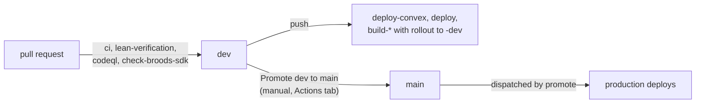
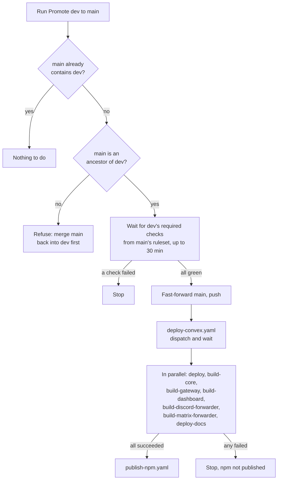
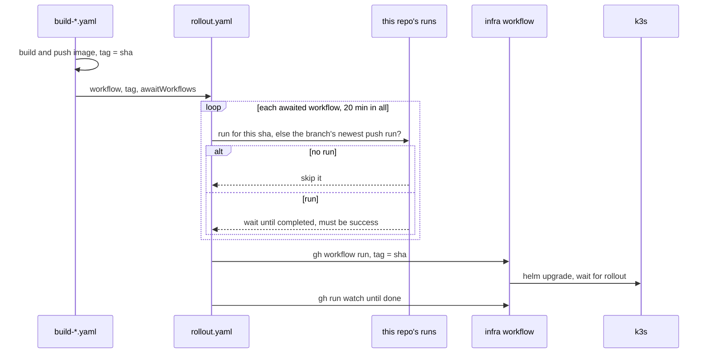
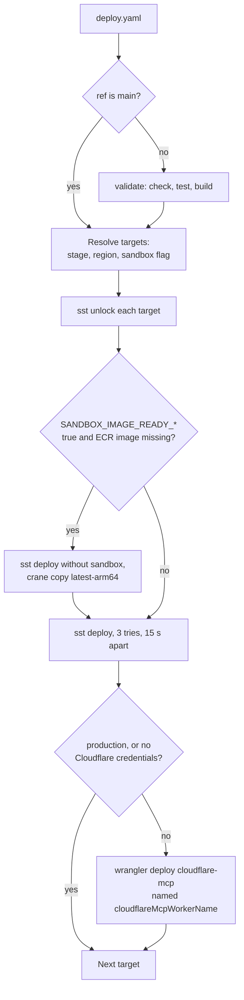
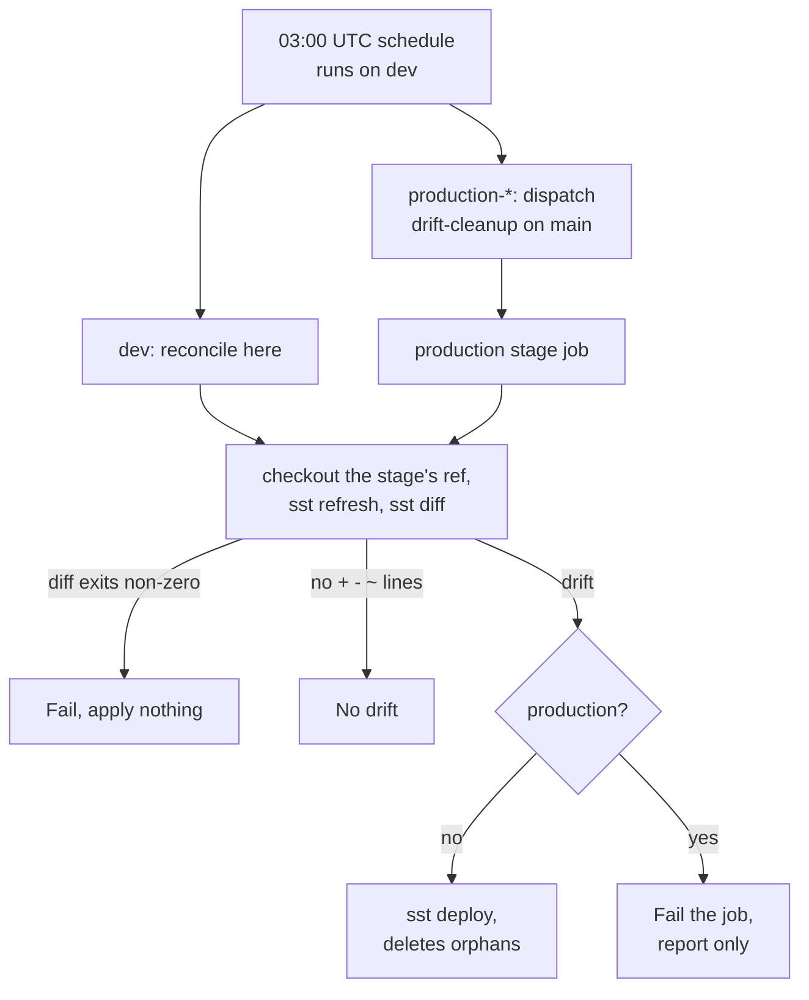

# CI/CD

Every GitHub Actions workflow in `.github/workflows/`, what fires it and what it ships. For contributors and operators.

## Branch flow

```mermaid
flowchart LR
  PR["pull request"] -->|"ci, lean-verification,<br/>codeql, check-broods-sdk"| Dev["dev"]
  Dev -->|push| DevWF["deploy-convex, deploy,<br/>build-* with rollout to -dev"]
  Dev -->|"Promote dev to main<br/>(manual, Actions tab)"| Main["main"]
  Main -->|dispatched by promote| ProdWF["production deploys"]
```

- Work lands on `dev` through pull requests. Do not deploy by hand; push to `dev` and let the workflows run.
- `main` is protected and only moves by fast-forward from `dev`, through `promote.yaml`.
- The promote push uses `GITHUB_TOKEN`, which fires no `on: push` workflow, so promote dispatches each production workflow itself.
- `ci.yaml` and `lean-verification.yaml` have no path filter on `pull_request`, so a docs-only pull request still gets every required check.

## Promote

```mermaid
flowchart TD
  A[Run Promote dev to main] --> B{"main already<br/>contains dev?"}
  B -->|yes| Z[Nothing to do]
  B -->|no| C{"main is an<br/>ancestor of dev?"}
  C -->|no| X["Refuse: merge main<br/>back into dev first"]
  C -->|yes| D["Wait for dev's required checks<br/>from main's ruleset, up to 30 min"]
  D -->|a check failed| X2[Stop]
  D -->|all green| E[Fast-forward main, push]
  E --> F["deploy-convex.yaml<br/>dispatch and wait"]
  F --> G["In parallel: deploy, build-core,<br/>build-gateway, build-dashboard,<br/>build-discord-forwarder,<br/>build-matrix-forwarder, deploy-docs"]
  G -->|all succeeded| H[publish-npm.yaml]
  G -->|any failed| X3["Stop, npm not published"]
```

Convex goes first so no service runs ahead of the schema it calls. npm goes last so `npm i broods` never pulls a client ahead of the backend.

## Workflows

| Workflow                       | Trigger                                                                           | What it does                                                                                                                                   |
| ------------------------------ | --------------------------------------------------------------------------------- | ---------------------------------------------------------------------------------------------------------------------------------------------- |
| `ci.yaml`                      | every pull request; pushes to `dev`                                               | `validate` (lint, format, types, unit tests, build), `secrets-scan` (gitleaks), `performance`, `app-surfaces`. PRs only: `local-stack`, `docs` |
| `lean-verification.yaml`       | every pull request; pushes to `dev`; manual                                       | `bun run verification:test`, then `lake build` of the models in `verification/`                                                                |
| `check-broods-sdk.yaml`        | PRs and `dev` pushes touching the SDK, demos, root package files or npm workflows | Typecheck, test, build and dry-run pack of the SDK                                                                                             |
| `codeql.yml`                   | pushes and PRs to `dev` and `main`; Tuesdays 17:35 UTC                            | CodeQL analysis                                                                                                                                |
| `deploy-convex.yaml`           | `dev` or `main` pushes touching `packages/convex`; manual                         | `convex deploy`. `main` refuses a non-`prod:` key, or a self-hosted URL other than `https://convex-api.broods.app`                             |
| `deploy.yaml`                  | `dev` or `main` pushes, except docs, dashboard and markdown only; manual          | SST deploy of the AWS data plane, then the Cloudflare MCP Worker. See [deploy pipeline](#deploy-pipeline)                                      |
| `build-core.yaml`              | `dev` or `main` pushes touching core, Convex or root package files; manual        | Build `broods-core`, roll it after `deploy-convex` and `deploy`                                                                                |
| `build-gateway.yaml`           | `dev` or `main` pushes touching the gateway or files it imports; manual           | Check, test, build `broods-gateway`, roll it                                                                                                   |
| `build-dashboard.yaml`         | `dev` or `main` pushes touching dashboard, SDK or Convex; manual                  | Build `broods-dashboard` with `NEXT_PUBLIC_*` args, roll it after `deploy-convex`                                                              |
| `build-discord-forwarder.yaml` | `dev` or `main` pushes touching the forwarder or files it imports; manual         | Build `broods-discord-forwarder`. Rolls from `main`, or a manual run with `rollout` ticked                                                     |
| `build-matrix-forwarder.yaml`  | same, for the Matrix forwarder and the Discord modules it imports                 | Build `broods-matrix-forwarder`. Same rollout rule                                                                                             |
| `rollout.yaml`                 | called by the build workflows                                                     | See [rollouts](#rollouts)                                                                                                                      |
| `e2e-dashboard.yaml`           | after "Build Dashboard Image" succeeds on `dev` or `main`; manual                 | Signed-in Playwright suites against the deployed dashboard                                                                                     |
| `opa-policy-check.yaml`        | `dev` or `main` pushes touching the rego or its cases; daily 06:17 UTC            | Checks `broods_authz.rego` parses, the deployed OPA serves the same rego, and decides `scripts/opa-decision-cases.ts` as expected              |
| `deploy-docs.yaml`             | `main` pushes touching `apps/docs`; manual                                        | Build this site, sync to `DOCS_S3_BUCKET`, invalidate CloudFront                                                                               |
| `publish-npm.yaml`             | `main` pushes touching the SDK or root package files; manual; promote             | Publish `packages/broods` by npm Trusted Publishing when the version is new, tag `broods-v*`, cut a release                                    |
| `drift-cleanup.yaml`           | daily 03:00 UTC; manual                                                           | See [drift cleanup](#drift-cleanup)                                                                                                            |
| `dependency-watch.yaml`        | Mondays 06:00 UTC; manual                                                         | Reports AI SDK family and esbuild releases into one rolling issue                                                                              |
| `promote.yaml`                 | manual only                                                                       | See [promote](#promote)                                                                                                                        |

Each forwarder is one release serving every config plane, prod included, so a `dev` push only builds and tests it. To try a forwarder change first, run its build workflow on the branch with `rollout` ticked; that serves prod traffic too.

## Lean verification

The Lean models in `verification/Broods/` cover selected gateway routing, run lifecycle, async result, cron and manifest sync contracts. They do not prove the whole product, nor that the models match the TypeScript. Change a mirrored implementation and update the model in the same PR.

## Rollouts

A green image build deploys nothing by itself. The pods live in a k3s cluster owned by `beeblastco/infra`.

```mermaid
sequenceDiagram
  participant B as build-*.yaml
  participant R as rollout.yaml
  participant GH as this repo's runs
  participant I as infra workflow
  participant K as k3s

  B->>B: build and push image, tag = sha
  B->>R: workflow, tag, awaitWorkflows
  loop each awaited workflow, 20 min in all
    R->>GH: run for this sha, else the branch's newest push run?
    alt no run
      GH-->>R: skip it
    else run
      GH-->>R: wait until completed, must be success
    end
  end
  R->>I: gh workflow run, tag = sha
  I->>K: helm upgrade, wait for rollout
  R->>I: gh run watch until done
```

| Image             | Infra workflow, `dev` / `main`                         | Waits for                           |
| ----------------- | ------------------------------------------------------ | ----------------------------------- |
| core              | `deploy-core-dev.yaml` / `deploy-core.yaml`            | `deploy-convex.yaml`, `deploy.yaml` |
| gateway           | `deploy-gateway-dev.yaml` / `deploy-gateway.yaml`      | nothing                             |
| dashboard         | `deploy-dashboard-dev.yaml` / `deploy-dashboard.yaml`  | `deploy-convex.yaml`                |
| discord-forwarder | `deploy-discord-forwarder.yaml`, `main` or ticked only | nothing                             |
| matrix-forwarder  | `deploy-matrix-forwarder.yaml`, `main` or ticked only  | nothing                             |

- A commit that did not trigger an awaited workflow is judged by the branch's newest push run of it, so a failing backend deploy blocks every image behind it.
- Images are `ghcr.io/beeblastco/broods-*`, tagged with the commit sha plus a floating `dev` or `main` tag.
- The rollout job has a 40 minute budget: 20 for prerequisites, 20 for the roll. It needs `INFRA_DISPATCH_TOKEN`.

## Deploy pipeline

```mermaid
flowchart TD
  A["deploy.yaml"] --> B{"ref is main?"}
  B -->|no| V["validate: check, test, build"]
  B -->|yes| T
  V --> T["Resolve targets:<br/>stage, region, sandbox flag"]
  T --> L["sst unlock each target"]
  L --> S{"SANDBOX_IMAGE_READY_*<br/>true and ECR image missing?"}
  S -->|yes| S1["sst deploy without sandbox,<br/>crane copy latest-arm64"]
  S1 --> D
  S -->|no| D["sst deploy, 3 tries, 15 s apart"]
  D --> W{"production, or no<br/>Cloudflare credentials?"}
  W -->|yes| Done[Next target]
  W -->|no| M["wrangler deploy cloudflare-mcp<br/>named cloudflareMcpWorkerName"]
  M --> Done
```

| Source                      | SST stage              | Region                                | GitHub environment |
| --------------------------- | ---------------------- | ------------------------------------- | ------------------ |
| push to `dev`               | `dev`                  | `DEV_AWS_REGION`, default `eu-west-1` | `development`      |
| push to `main`              | `production-eu-west-1` | `eu-west-1`                           | `production`       |
| manual, `stage: production` | `production-eu-west-1` | `eu-west-1`                           | `production`       |
| manual, other stage         | that stage             | `DEV_AWS_REGION`                      | `development`      |

- Production stages deploy only from `main`. `production_targets()` in `deploy.yaml` lists `eu-west-1` alone. `microvmPrereqsEnabled` in `sst.config.ts` skips the MicroVM pieces in `ap-southeast-1`.
- The deploy job shares the `sst-<stage>` concurrency group with drift cleanup, so the two never touch a stage at once.
- The [Cloudflare MCP runtime](../guides/tools.md#where-a-hosted-server-runs) step creates the `broods-mcp-bundles` R2 bucket if missing, sets its 30-day expiry and sets `BUNDLE_ORIGIN` to the stage's tool-bundles bucket. It ships code only; the infra repo writes the shared key to the Worker's `MCP_API_KEY` and core's `CLOUDFLARE_MCP_API_KEY`. A failure only warns.

## Secrets and variables

Environment-scoped values resolve from `development` or `production` by branch.

| Name                                                                                                  | Kind                      | Used by                                                                              |
| ----------------------------------------------------------------------------------------------------- | ------------------------- | ------------------------------------------------------------------------------------ |
| `AWS_ROLE_ARN`                                                                                        | variable                  | `deploy`, `drift-cleanup`, `deploy-docs`                                             |
| `AWS_ACCOUNT_ID`, `PROJECT_NAME`, `PROJECT_OWNER_EMAIL`                                               | variable                  | `ci`, `deploy`, `drift-cleanup`                                                      |
| `DEV_AWS_REGION`                                                                                      | variable                  | `ci`, `deploy`                                                                       |
| `CONVEX_URL`, `CONVEX_DEPLOY_KEY`                                                                     | secret, per env           | `deploy`, `drift-cleanup`; the key also `deploy-convex`                              |
| `CONVEX_SELF_HOSTED_URL`, `CONVEX_SELF_HOSTED_ADMIN_KEY`                                              | secret, per env           | `deploy-convex`, instead of a deploy key                                             |
| `OTEL_EXPORTER_OTLP_HEADERS`                                                                          | secret                    | `deploy`, `drift-cleanup`. Unset skips the sandbox log forwarder                     |
| `SANDBOX_IMAGE_READY_DEV`, `SANDBOX_IMAGE_READY_PRODUCTION[_<REGION>]`, `SANDBOX_IMAGE_SOURCE_REGION` | variable                  | `deploy`; the readiness flags also `drift-cleanup`                                   |
| `CLOUDFLARE_API_TOKEN`, `CLOUDFLARE_ACCOUNT_ID`                                                       | secret, variable, per env | `deploy`. Unset skips the Cloudflare MCP Worker                                      |
| `INFRA_DISPATCH_TOKEN`                                                                                | secret                    | every build workflow. Fine-grained PAT on `beeblastco/infra`, Actions read and write |
| `NEXT_PUBLIC_CONVEX_URL`, `NEXT_PUBLIC_WORKOS_REDIRECT_URI`, `NEXT_PUBLIC_BROODS_BASE_URL`            | variable, per env         | `build-dashboard`; the Convex URL also `ci`                                          |
| `WORKOS_API_KEY`, `WORKOS_CLIENT_ID`, `WORKOS_COOKIE_PASSWORD`                                        | secret                    | `ci` signed-in dashboard tests                                                       |
| `DASHBOARD_E2E_EMAIL`, `DASHBOARD_E2E_PASSWORD`, `DASHBOARD_E2E_PROJECT_ID`                           | secret, variable          | `ci`, `e2e-dashboard`                                                                |
| `DEEPSEEK_API_KEY`                                                                                    | secret                    | `ci`                                                                                 |
| `OPA_BASE_URL`, `OPA_API_TOKEN`                                                                       | variable, secret          | `opa-policy-check`                                                                   |
| `DOCS_S3_BUCKET`, `DOCS_DOMAIN`, `DOCS_AWS_REGION`                                                    | variable                  | `deploy-docs`                                                                        |
| `ACCOUNT_*`                                                                                           | secret, variable          | `deploy` still exports these; nothing reads them                                     |

Runtime secrets for the containers are not GitHub secrets. They live in k8s secrets referenced by the infra repo and in the Convex deployment env. See [self-hosting](self-hosting.md).

## SDK versioning

Nobody hand-edits or commits the SDK `version`. `publish-npm.yaml` runs `packages/broods/scripts/next-version.ts` over the conventional-commit subjects since the newest `broods-v*` tag:

| Subject                  | Bump on `0.x` | Bump from `1.0` |
| ------------------------ | ------------- | --------------- |
| `!` or `BREAKING CHANGE` | minor         | major           |
| `feat:`                  | minor         | minor           |
| anything else            | patch         | patch           |

The subject line is the release note. A `package.json` version above the last tag is released as is, which is how a major like 1.0.0 ships. The publish is skipped when no commit touched the package or the version is already on npm. Trusted Publishing is configured for organization `beeblastco`, repository `broods`, workflow `publish-npm.yaml`; never commit `.npmrc` files or npm tokens. See `packages/broods/AGENTS.md`.

## Drift cleanup

`drift-cleanup.yaml` checks each stage against `sst.config.ts` every night, so resources whose code was removed stop charging.

```mermaid
flowchart TD
  A["03:00 UTC schedule<br/>runs on dev"] --> B["dev: reconcile here"]
  A --> C["production-*: dispatch<br/>drift-cleanup on main"]
  C --> P["production stage job"]
  B --> R
  P --> R["checkout the stage's ref,<br/>sst refresh, sst diff"]
  R -->|diff exits non-zero| F[Fail, apply nothing]
  R -->|"no + - ~ lines"| OK[No drift]
  R -->|drift| D{production?}
  D -->|no| DEP["sst deploy,<br/>deletes orphans"]
  D -->|yes| REP["Fail the job,<br/>report only"]
```

| Stage                  | Checked out from | Environment   | On drift     |
| ---------------------- | ---------------- | ------------- | ------------ |
| `dev`                  | `dev`            | `development` | `sst deploy` |
| `production-eu-west-1` | `main`           | `production`  | job fails    |

- A production dispatch from any ref but `main` fails fast. Reconcile production drift through `deploy.yaml` from `main`.
- The job resolves `SANDBOX_IMAGE_READY` per stage the way `deploy.yaml` does, so `sst.config.ts` imports the sandbox ECR repo in both. SST ignores tag changes on an imported resource; a plan without the import reports the repo's tags as drift every night.
- Each job takes the same `sst-<stage>` lock as `deploy.yaml`. A lock left by a crashed run fails the job; clear it by hand after checking nothing runs.
- The plan stays in the job log, with the AWS account id masked. The repo is public, so there is no artifact.
- It sees only resources in Pulumi state and never bootstraps sandbox images; the mirror step lives in `deploy.yaml` alone.
- A new stage must be added to `STAGES` in the workflow and to its dispatch options, or drift cleanup never sees it.
