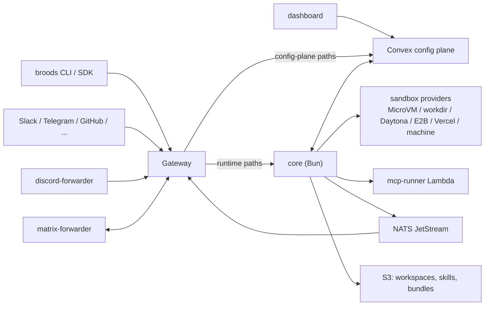

# Internals overview

This section is for people who work on Broods itself: contributors, self-hosters and operators. It covers how the code is laid out, how a request moves through the system, and how to run and extend it. If you are building agents on Broods, start at the [user docs](../index.md) instead.

## What is in the repo

The repo is a Bun workspaces monorepo. The parts form one product: the gateway is the front door, core owns runtime truth, Convex owns config and persistence, and the dashboard and CLI are two clients of the same config plane.

| Path                     | Package                     | Job                                                                                                                                                                                   |
| ------------------------ | --------------------------- | ------------------------------------------------------------------------------------------------------------------------------------------------------------------------------------- |
| `apps/core`              | `@broods/core`              | The agent harness. One Bun container behind the gateway. Accounts, agent runs, channel webhooks, tools, skills, sandboxes, workspaces, async status, SSE. Also owns `sst.config.ts`.  |
| `apps/gateway`           | `@broods/gateway`           | Every public request hits this first. Splits config-plane paths from core paths and terminates the agent, observability and terminal WebSockets.                                      |
| `apps/lambda`            | none, plain `.mjs`          | The hosted MCP runner Lambda (`handler.mjs`, `child-runner.mjs`) and the sandbox log forwarder (`sandbox-log-forwarder.mjs`). Deployed by `apps/core/sst.config.ts`, no build step.   |
| `apps/discord-forwarder` | `@broods/discord-forwarder` | Holds the Discord Gateway sockets, one per bot token, and posts regular messages to the channel webhook. Single replica.                                                              |
| `apps/matrix-forwarder`  | `@broods/matrix-forwarder`  | Runs the Matrix `/sync` long-polls and holds each account's E2EE keys. Posts decrypted messages in, sends encrypted replies out. Crypto store on a persistent volume, single replica. |
| `apps/dashboard`         | `@broods/dashboard`         | The Next.js UI. Drives core through Convex.                                                                                                                                           |
| `packages/convex`        | `@broods/convex`            | Shared Convex backend: the config plane plus runtime persistence for core and the dashboard.                                                                                          |
| `apps/docs`              | `@broods/docs`              | This Docusaurus site and the OpenAPI spec at `docs/api-reference/openapi.yaml`.                                                                                                       |
| `packages/broods`        | `broods`                    | The published CLI and TypeScript SDK.                                                                                                                                                 |
| `packages/demos`         | not a workspace             | Runnable demos against a deployed core.                                                                                                                                               |

Two sibling repos sit next to the checkout:

- `../infra` provisions the k8s cluster and VMs. Keep `apps/core/sst.config.ts` constants, naming and tags aligned with it.
- `../lambda-sanbdox` is a Rust HTTP server baked into the AWS Lambda MicroVM image. It runs bash, python and node for the `lambda` sandbox provider. The executor is `apps/core/src/harness/sandbox/microvm-executor.ts`.

## Where to start reading

1. [Architecture](architecture.md) for the request path and where each record lives.
2. [Queue and steer](queue-and-steer.md) for the concurrency contract every ingress path shares.
3. The subsystem page you are about to touch: [channels](channels.md), [tools and MCP](tools-and-mcp.md), [subagents](subagents.md), [storage](storage.md), [sandboxes](sandboxes.md), [security](security.md) or [observability](observability.md).
4. [Self-hosting](self-hosting.md), [operations](operations.md) and [CI/CD](ci-cd.md) before you deploy anything.

Each workspace also has its own `AGENTS.md` with the gotchas for that folder. Read it when you touch the folder.

## Contributor workflow

- Install once with `bun install` at the root. Workspace scripts live in each `package.json`.
- Before you call a change done, run the workspace's own `bun run check` (types, plus lint for the dashboard) and the root `bun run format` (oxfmt). Do not run raw `tsc`; the config is wrong for it.
- Lint is oxlint with one `.oxlintrc.json` at the root. `bun run lint` at the root covers every workspace. `bun run lint:types` is the type-aware pass; it has a backlog, so do not add new findings.
- The pre-commit hook in `.githooks/` runs oxlint and `oxfmt --check` on staged files. `bun install` wires it through the root `prepare` script.
- A Convex schema or function change needs `bun run --filter @broods/convex codegen`, and the generated diff is committed. Core and the dashboard typecheck against it without local codegen.
- React is pinned per app package. Never add React to the root package.
- A breaking storage or backend change gets no compat shim for dead record formats. Reset and recreate the affected accounts or resources instead.
- A change to a public contract moves everything that describes it: `apps/docs/docs/api-reference/openapi.yaml`, the docs, `packages/demos`, the SDK types and client in `packages/broods`, and the focused tests.

## Extending Broods

- Add a built-in tool: [Tools and MCP](tools-and-mcp.md#add-a-built-in-tool). Most integrations should be an MCP server instead.
- Add a channel: [Channels](channels.md#add-a-channel).
- Add a chat command: the steps are below.

### Add a chat command

Chat commands such as `/new`, `/compact` and `/queue` are handled by core before the agent sees the message.

1. Add an entry to the `commands` array in `apps/core/src/shared/commands.ts`.
2. Give it `aliases`, a `description` and an `execute` function that returns the reply text. Set `discord` metadata if it should register as a Discord slash command, and `showInHelp: false` to keep it out of `/help`.
3. Use only the channel-agnostic `ChannelActions` interface. Commands must not import channel-specific modules.
4. A command that touches conversation history must take the conversation lease first, as `/clear` and `/compact` do. See [queue and steer](queue-and-steer.md#channel-commands).
