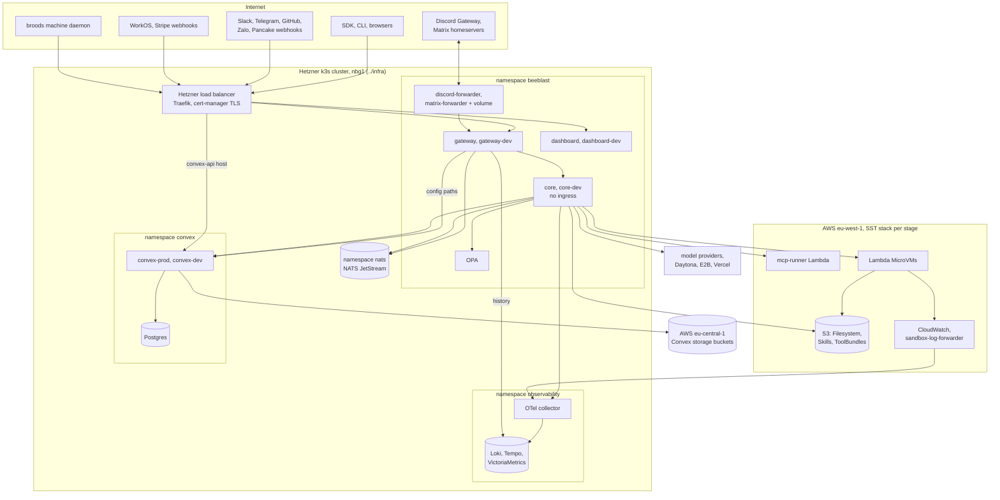

# Internals overview

This section is for the contributors, self-hosters and operators who work on Broods itself. It covers how the code is laid out, how a request moves through the system, and how to run and extend it. If you are building agents on Broods, start at the [user docs](../index.md) instead.

## What is in the repo

The repo is a Bun workspaces monorepo. The parts form one product. The gateway is the front door, core owns runtime truth, Convex owns config and persistence, and the dashboard and CLI are two clients of the same config plane.

| Path                     | Package                     | Job                                                                                                                                                                                                                               |
| ------------------------ | --------------------------- | --------------------------------------------------------------------------------------------------------------------------------------------------------------------------------------------------------------------------------- |
| `apps/core`              | `@broods/core`              | The agent harness, one Bun container behind the gateway. Runtime API, channel webhooks, cron runs, tools, skills, sandboxes, workspaces, async status, SSE, the machine socket. Also holds `sst.config.ts` for the AWS resources. |
| `apps/gateway`           | `@broods/gateway`           | The front door. Sends config-plane paths to Convex and the rest to core, and terminates the agent, observability, terminal and machine WebSockets.                                                                                |
| `apps/lambda`            | none, plain `.mjs`          | The hosted MCP runner Lambda (`handler.mjs`, `child-runner.mjs`) and the sandbox log forwarder (`sandbox-log-forwarder.mjs`). Deployed by `apps/core/sst.config.ts`, no build step.                                               |
| `apps/discord-forwarder` | `@broods/discord-forwarder` | Holds the Discord Gateway sockets, one per bot token, and posts regular messages to the channel webhook. Single replica.                                                                                                          |
| `apps/matrix-forwarder`  | `@broods/matrix-forwarder`  | Runs the Matrix `/sync` long-polls and holds each account's E2EE keys. Posts decrypted messages in, sends encrypted replies out. Crypto store on a persistent volume, single replica.                                             |
| `apps/dashboard`         | `@broods/dashboard`         | The Next.js UI. Reads and writes Convex as a WorkOS user, and opens gateway sockets for logs, traces, the test chat and sandbox terminals.                                                                                        |
| `packages/convex`        | `@broods/convex`            | Shared Convex backend: the config plane plus runtime persistence for core and the dashboard.                                                                                                                                      |
| `apps/docs`              | `@broods/docs`              | This Docusaurus site and the OpenAPI spec at `docs/api-reference/openapi.yaml`.                                                                                                                                                   |
| `packages/broods`        | `broods`                    | The published CLI and TypeScript SDK. `broods` exports `BroodsClient`, `WebSocketClient` and the `define*` helpers. `broods/account` exports the dependency-free `BroodsAccountClient`.                                           |
| `packages/demos`         | not a workspace             | Runnable demos against a deployed core.                                                                                                                                                                                           |

Two sibling repos sit next to the checkout:

- `../infra` provisions the k8s cluster and VMs. Keep `apps/core/sst.config.ts` constants, naming and tags aligned with it.
- `../lambda-sanbdox` is a Rust HTTP server baked into the AWS Lambda MicroVM image. It runs bash, python and node for the `lambda` sandbox provider. The executor is `apps/core/src/harness/sandbox/microvm-executor.ts`.

The [architecture](architecture.md) page has the system diagram, each request path, and where every record lives.

## Deployment

The managed service runs on one Hetzner k3s cluster and one AWS account. The cluster holds every long-running process, including the self-hosted Convex backends. AWS holds the bytes and the untrusted compute. Dev and production share the cluster as separate releases, `core-dev` next to `core` and so on, and each has its own SST stage in AWS, `dev` and `production-eu-west-1`.

| Where                        | What runs there                                                                                                                                                | Provisioned by                           |
| ---------------------------- | -------------------------------------------------------------------------------------------------------------------------------------------------------------- | ---------------------------------------- |
| Hetzner k3s, `beeblast`      | gateway, core, dashboard, OPA, the two forwarders. One public door per stage: `gateway.broods.app` and `gateway.dev.broods.app`. Core has no ingress.          | `../infra` Helm releases                 |
| Hetzner k3s, `convex`        | Self-hosted `convex-backend` for prod and dev, on one Postgres with a block volume. Browsers and CI use the public api host; gateway and core stay in-cluster. | `../infra` Helm releases                 |
| Hetzner k3s, `nats`          | NATS JetStream for `WS_RESPONSES` and `OBSERVABILITY`. In-cluster only.                                                                                        | `../infra` Helm releases                 |
| Hetzner k3s, `observability` | OTel collector, Loki, Tempo, VictoriaMetrics, Grafana.                                                                                                         | `../infra` Helm releases                 |
| AWS `eu-west-1`              | Workspace, skill and bundle buckets, the mcp-runner Lambda, MicroVM images and roles, the MicroVM log group and forwarder, the sandbox VPC.                    | `apps/core/sst.config.ts`, per SST stage |
| AWS `eu-central-1`           | Convex storage buckets and nightly exports.                                                                                                                    | `../infra` Terraform                     |
| GitHub                       | Actions for CI and deploys, `ghcr.io/beeblastco/broods-*` images.                                                                                              | `.github/workflows`                      |

The forwarders are one release each for both planes, because a bot token must hold one socket. The docs site is static files on S3 behind CloudFront. How a commit reaches each box is in [CI/CD](ci-cd.md), and how to run the same shape yourself is in [self-hosting](self-hosting.md).

## Where to start reading

1. [Architecture](architecture.md) for the request path and where each record lives.
2. [Queue and steer](queue-and-steer.md) for the concurrency contract every ingress path shares.
3. The subsystem page you are about to touch, such as [channels](channels.md), [tools and MCP](tools-and-mcp.md), [subagents](subagents.md), [storage](storage.md), [sandboxes](sandboxes.md), [security](security.md) or [observability](observability.md).
4. [Self-hosting](self-hosting.md), [operations](operations.md) and [CI/CD](ci-cd.md) before you deploy anything.

Each workspace also has its own `AGENTS.md` with the gotchas for that folder. Read it when you touch the folder.

## Contributor workflow

- Install once with `bun install` at the root. Workspace scripts live in each `package.json`.
- Before you call a change done, run the workspace's own `bun run check` and the root `bun run format`. `check` runs types, plus lint for the dashboard, and `format` runs oxfmt. Do not run raw `tsc`, because the config is wrong for it.
- Lint is oxlint with one `.oxlintrc.json` at the root. `bun run lint` at the root covers every workspace. `bun run lint:types` is the type-aware pass; it has a backlog, so do not add new findings.
- The pre-commit hook in `.githooks/` runs oxlint and `oxfmt --check` on staged files. `bun install` wires it through the root `prepare` script.
- A Convex schema or function change needs `bun run --filter @broods/convex codegen`, and the generated diff is committed. Core and the dashboard typecheck against it without local codegen.
- React is pinned per app package. Never add React to the root package.
- A breaking storage or backend change gets no compat shim for dead record formats. Reset and recreate the affected accounts or resources instead.
- A change to a public contract moves everything that describes it, meaning `apps/docs/docs/api-reference/openapi.yaml`, the docs, `packages/demos`, the SDK types and client in `packages/broods`, and the focused tests.

## Extending Broods

- To add a built-in tool, see [Tools and MCP](tools-and-mcp.md). Most integrations should be an MCP server instead.
- To add a channel, see [Channels](channels.md).
- To add a chat command, follow the steps below.

### Add a chat command

Chat commands such as `/new`, `/compact` and `/queue` are handled by core before the agent sees the message.

1. Add an entry to the `commands` array in `apps/core/src/shared/commands.ts`.
2. Give it `aliases`, a `description` and an `execute` function that returns the reply text. Set `discord` metadata if it should register as a Discord slash command, and `showInHelp: false` to keep it out of `/help`.
3. Use only the channel-agnostic `ChannelActions` interface. Commands must not import channel-specific modules.
4. A command that touches conversation history must take the conversation lease first, as `/clear` and `/compact` do. See [queue and steer](queue-and-steer.md).
