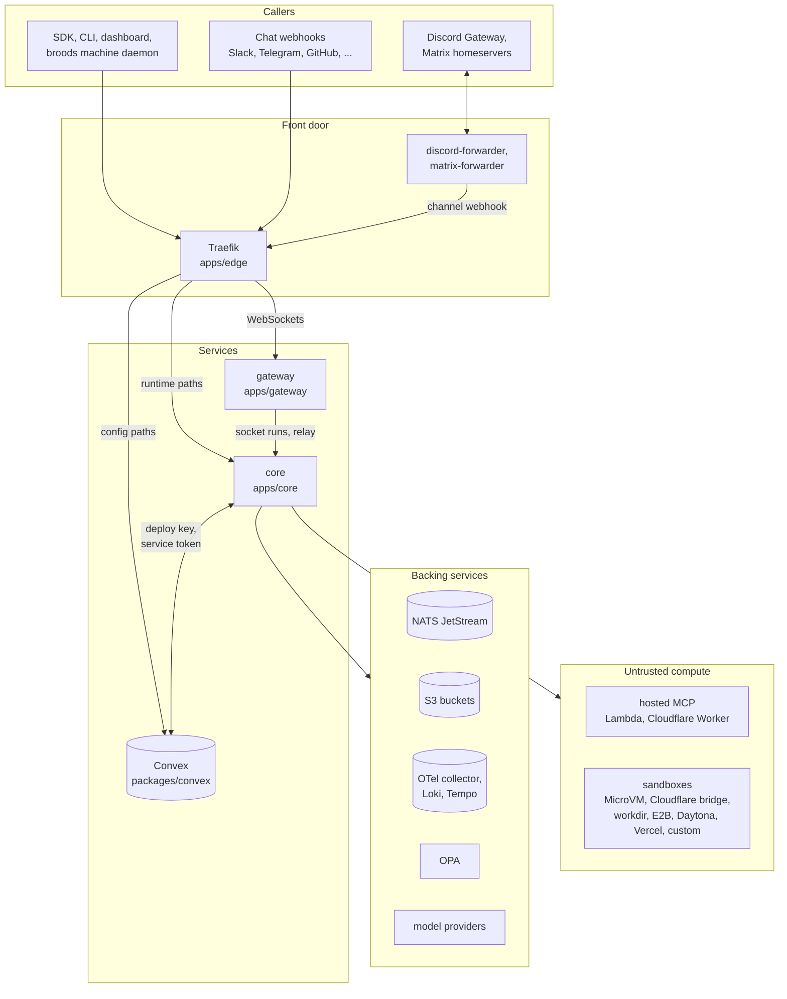
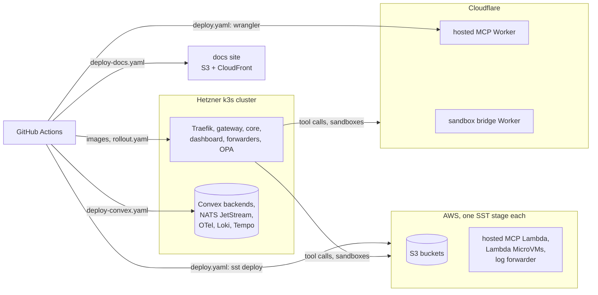

# Internals overview

For people who work on Broods itself: contributors, self-hosters and operators. Building agents on Broods? Start at the [user docs](../index.md).

## What is in the repo

One Bun workspaces monorepo, one product. Traefik is the door, the gateway owns the sockets, core owns runtime truth, Convex owns config and persistence, and the dashboard and CLI are two clients of the same config plane.

### Service architecture

```mermaid
flowchart TB
  subgraph In["Callers"]
    direction LR
    Clients["SDK, CLI, dashboard,<br/>broods machine daemon"]
    Hooks["Chat webhooks<br/>Slack, Telegram, GitHub, ..."]
    Socks["Discord Gateway,<br/>Matrix homeservers"]
  end
  subgraph Door["Front door"]
    direction LR
    Edge["Traefik<br/>apps/edge"]
    Fwd["discord-forwarder,<br/>matrix-forwarder"]
  end
  subgraph Services
    direction LR
    GW["gateway<br/>apps/gateway"]
    Core["core<br/>apps/core"]
    Convex[("Convex<br/>packages/convex")]
  end
  subgraph Back["Backing services"]
    direction LR
    NATS[("NATS JetStream")]
    S3[("S3 buckets")]
    Obs[("OTel collector,<br/>Loki, Tempo")]
    OPA["OPA"]
    Models["model providers"]
  end
  subgraph Compute["Untrusted compute"]
    direction LR
    MCP["hosted MCP<br/>Lambda, Cloudflare Worker"]
    SB["sandboxes<br/>MicroVM, Cloudflare bridge,<br/>workdir, E2B, Daytona, Vercel, custom"]
  end

  Clients --> Edge
  Hooks --> Edge
  Socks <--> Fwd
  Fwd -->|"channel webhook"| Edge
  Edge -->|"config paths"| Convex
  Edge -->|"runtime paths"| Core
  Edge -->|"WebSockets"| GW
  GW -->|"socket runs, relay"| Core
  Core <-->|"deploy key,<br/>service token"| Convex
  Core --> Back
  Core --> Compute
```

| Path                      | Package                      | Job                                                                                   |
| ------------------------- | ---------------------------- | ------------------------------------------------------------------------------------- |
| `apps/edge`               | `@broods/edge`               | Route table that generates the Traefik config: path split, per-address limits, CORS   |
| `apps/gateway`            | `@broods/gateway`            | Agent, observability, terminal and machine WebSockets                                 |
| `apps/core`               | `@broods/core`               | Agent harness: runs, channel webhooks, crons, tools, sandboxes. Holds `sst.config.ts` |
| `packages/convex`         | `@broods/convex`             | Config plane, CLI sync, every table, the crons component                              |
| `apps/dashboard`          | `@broods/dashboard`          | Next.js UI on Convex, as a WorkOS user                                                |
| `packages/broods`         | `broods`                     | Published CLI and TypeScript SDK                                                      |
| `apps/discord-forwarder`  | `@broods/discord-forwarder`  | One Discord Gateway socket per bot token, single replica                              |
| `apps/matrix-forwarder`   | `@broods/matrix-forwarder`   | Matrix `/sync` long-polls and E2EE keys, single replica, persistent volume            |
| `apps/lambda`             | none, plain `.mjs`           | Hosted MCP runner and the sandbox log forwarder                                       |
| `apps/cloudflare-mcp`     | `@broods/cloudflare-mcp`     | Hosted MCP runtime on Workers, same contract as the Lambda runner                     |
| `apps/cloudflare-sandbox` | `@broods/cloudflare-sandbox` | Bridge Worker behind the `cloudflare` sandbox provider                                |
| `apps/docs`               | `@broods/docs`               | This site and `docs/api-reference/openapi.yaml`                                       |
| `packages/demos`          | not a workspace              | Runnable demos against a deployed core                                                |
| `verification`            | not a workspace              | Lean 4 models of routing, the run lifecycle and CLI sync                              |

Sibling repos next to the checkout: `../infra` (k8s cluster and VMs, keep `sst.config.ts` naming aligned with it) and `../lambda-sanbdox` (the Rust server in the MicroVM image behind the `lambda` provider).

## Deployment

```mermaid
flowchart LR
  Actions["GitHub Actions"]
  subgraph K3s["Hetzner k3s cluster"]
    direction TB
    K1["Traefik, gateway, core,<br/>dashboard, forwarders, OPA"]
    K2[("Convex backends,<br/>NATS JetStream,<br/>OTel, Loki, Tempo")]
  end
  subgraph AWS["AWS, one SST stage each"]
    direction TB
    A1[("S3 buckets")]
    A2["hosted MCP Lambda,<br/>Lambda MicroVMs,<br/>log forwarder"]
  end
  subgraph CF["Cloudflare"]
    direction TB
    C1["hosted MCP Worker"]
    C2["sandbox bridge Worker"]
  end
  Docs["docs site<br/>S3 + CloudFront"]

  Actions -->|"images, rollout.yaml"| K1
  Actions -->|"deploy-convex.yaml"| K2
  Actions -->|"deploy.yaml: sst deploy"| AWS
  Actions -->|"deploy.yaml: wrangler"| C1
  Actions -->|"deploy-docs.yaml"| Docs
  K1 -->|"tool calls, sandboxes"| AWS
  K1 -->|"tool calls, sandboxes"| CF
```

| Where              | What runs there                                                                 | Shipped by                                             |
| ------------------ | ------------------------------------------------------------------------------- | ------------------------------------------------------ |
| Hetzner k3s        | Traefik, core, gateway, dashboard, forwarders, OPA, Convex, NATS, observability | Image build, then `rollout.yaml` into `../infra` Helm  |
| Convex backends    | Schema and functions, prod and dev                                              | `deploy-convex.yaml` on push to `main` or `dev`        |
| AWS, per SST stage | Buckets, mcp-runner, MicroVM roles and log forwarder, sandbox VPC, IAM          | `deploy.yaml`, `sst deploy`                            |
| Cloudflare         | Hosted MCP Worker per non-production stage                                      | `deploy.yaml`, `wrangler deploy`                       |
| Cloudflare         | Sandbox bridge Worker                                                           | No workflow; `wrangler` from `apps/cloudflare-sandbox` |
| S3 + CloudFront    | This docs site                                                                  | `deploy-docs.yaml`                                     |

- Dev and production share the cluster as separate releases (`core-dev` next to `core`). The forwarders are one release each for both planes, because one bot token holds one socket.
- Production hosted MCP stays on Lambda; only non-production stages get the Workers runtime.
- MicroVM images are built by `../lambda-sanbdox` CI, not SST.

Pods, namespaces and replicas: [Operations](operations.md#runtime-topology). How a commit reaches each box: [CI/CD](ci-cd.md). Running the same shape yourself: [self-hosting](self-hosting.md).

## Where to start reading

| You are touching                        | Read                                                                            |
| --------------------------------------- | ------------------------------------------------------------------------------- |
| Request paths, run lifecycle, state     | [Architecture](architecture.md)                                                 |
| Anything that admits a message          | [Queue and steer](queue-and-steer.md)                                           |
| A chat platform                         | [Channels](channels.md)                                                         |
| Tools, MCP, hooks                       | [Tools and MCP](tools-and-mcp.md), [subagents](subagents.md)                    |
| Compute and files                       | [Sandboxes](sandboxes.md), [storage](storage.md)                                |
| Credentials, encryption, untrusted code | [Security](security.md)                                                         |
| Logs, traces, metrics                   | [Observability](observability.md)                                               |
| Deploying or running it                 | [Self-hosting](self-hosting.md), [operations](operations.md), [CI/CD](ci-cd.md) |

Each workspace has its own `AGENTS.md` with the gotchas for that folder. Read it before changing that workspace.

## Contributor workflow

- `bun install` at the root. Scripts live in each `package.json`.
- Before calling a change done: the workspace's `bun run check` (types, plus lint for the dashboard) and the root `bun run format` (oxfmt). Never raw `tsc`.
- Lint is oxlint, one `.oxlintrc.json` at the root. `bun run lint:types` has a backlog; add no new findings.
- Convex schema or function change: `bun run --filter @broods/convex codegen` and commit the generated diff.
- End to end without cloud: `bun run local:up`, then `bun run local:verify`.
- React is pinned per app package, never at the root.
- Breaking storage change: no compat shim. Reset and recreate the affected accounts or resources.
- A public contract change moves `openapi.yaml`, the docs, `packages/demos`, the SDK in `packages/broods` and the focused tests together.

## Extending Broods

- Built-in tool: [tools and MCP](tools-and-mcp.md). Most integrations should be an MCP server instead.
- Channel: [channels](channels.md).

### Add a chat command

Core handles chat commands such as `/new`, `/compact` and `/queue` before the agent sees the message.

1. Add an entry to `commands` in `apps/core/src/shared/commands.ts` with `aliases`, a `description` and an `execute` that returns the reply text. Optional: `discord` metadata to register a slash command, `showInHelp: false` to hide it from `/help`.
2. Use only the channel-agnostic `ChannelActions` interface. No channel-specific imports.
3. A command that touches history must hold the conversation lease. `/new` takes it and is refused while busy. `/compact` sets `queued: true`, so the drain loop runs it under the lease after the current turn. See [queue and steer](queue-and-steer.md).
