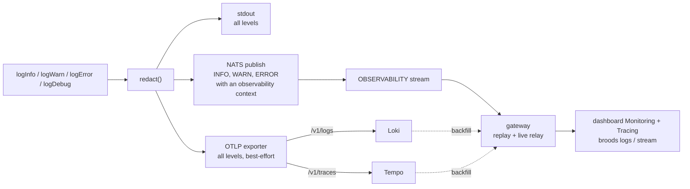
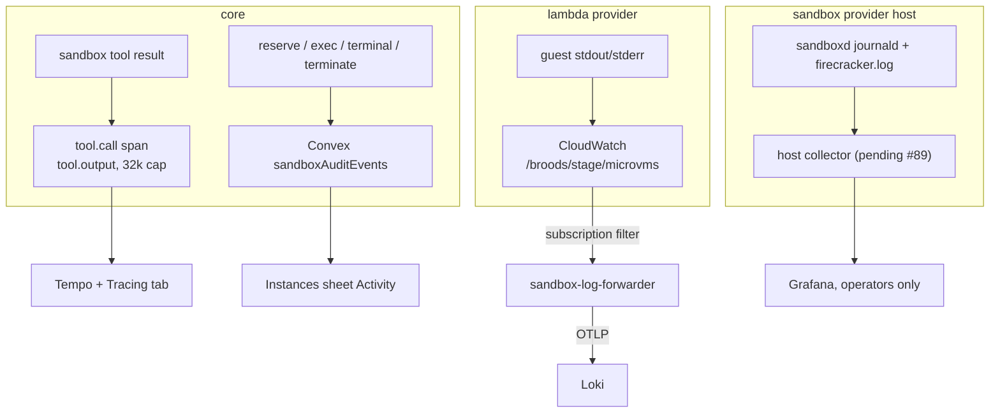

# Observability

This page covers the log and trace pipeline: how every line is redacted, where it lands, how the dashboard and `broods logs` read it, and how sandbox output joins in. What users see is in the [observability guide](../guides/observability.md). Paths are relative to `apps/core/`.

## Pipeline

`emit()` in `src/shared/log.ts` is the one place every log line and span is redacted. It then writes to three sinks:



- stdout always gets every line, unmodified after redaction. It is the CloudWatch fallback and the source for metric filters.
- OTLP goes to `OTEL_EXPORTER_OTLP_ENDPOINT` and lands in Loki and Tempo, the long-term store. Gen-AI spans come from the AI SDK v7 `@ai-sdk/otel` integration, registered on the same tracer at init. Those spans do not record inputs or outputs, because the harness's own spans already carry the redacted payloads.
- NATS gets INFO and above, and only when an observability context (project, stage, endpoint id) is set. This is the live path. Channel and cron runs have no deployment-scoped context, so they skip NATS and still reach stdout and OTLP.

A failure in one sink never blocks the others and never throws into the agent path.

### User code

`console.*` inside a code hook runs in a V8 isolate with no logger of its own. The isolate sends each line back as a `log` frame on the NDJSON protocol that carries results, and the host re-emits it through `emit()` while it reads that run's frames. The line inherits the run's observability context and reaches all three sinks tagged `source: "user-code"`. Writing to stderr instead would lose it, because the pooled worker discards its children's stderr.

## Tenant scoping

Logs and spans carry the same attributes, so a span, its logs and the live stream correlate:

`account_id`, `project`, `stage`, `endpoint_id`, `agent_id`, `conversation_key`, `trace_id`

NATS subjects encode the routable subset (`src/shared/nats.ts`):

```text
v1.<accountId>.<project>.<base64url(stage)>.{logs|traces}.<endpointId>
```

The durable `OBSERVABILITY` JetStream stream binds `v1.*.*.*.logs.>` and `v1.*.*.*.traces.>`. It is a file-backed buffer of about 2 hours that the gateway replays on connect before tailing live. Unlike `WS_RESPONSES`, it is not purged on persist. Loki and Tempo own everything older.

## The observability socket

The dashboard Monitoring and Tracing tabs and `broods logs`, `broods stream` and `broods dev` read through the gateway's observability socket.

- It refuses the stage runtime key. Clients connect with a fifteen-minute stage session ticket (`fp_dts_`), which the CLI mints from a login token at `POST /v1/account/stage-session` and refreshes before each reconnect.
- A `subscribe` with `backfill` always gets a closing `backfill` message, even when Loki or Tempo failed; that message then carries `error`, so a client can tell an empty stage from a failed query.
- Logs come back in one message. Traces cost one Tempo lookup each, so they arrive newest-first in pieces flagged `more: true`, and the closing message carries the failure count.
- `fetchTrace { traceId }` pulls one trace from Tempo for a log line older than the 7 day traces backfill window. Tempo's id lookup is not tenant-scoped, so the gateway filters the spans to the socket's account, project and stage before anything leaves.
- Tempo truncates large attributes on ingest, so when the same span arrives from both NATS and Tempo, the dashboard keeps the richer or terminal copy.

## Traces

Every top-level run is its own trace, labelled by what started it: `task` for a request, `cron` for a scheduled run, `subtask` for a subagent.

- The task span and every model step record `model.system`, the whole assembled prompt: the agent's prompt plus the memory index, workspace, memory, scheduler, skills and subagent harness blocks, skills loaded mid-run, persisted system context and steering. `model.system_part_count` and `model.system_chars` report the real size even when the payload is truncated.
- Each model step splits into time to first token, streaming (token generation only) and tool wait (also shown as child tool spans). Streaming never includes tool time.
- A failed `task` or `cron` root has a Continue button that posts `continue: true` for its agent and scoped conversation key.
- Config mutations write to Convex `configAuditEvents`, which the dashboard Settings Audit Logs tab reads.

## Sandbox output

Sandbox runs produce output in three places, and each takes a different road. Only the second is a log stream.



1. Tool output on the trace, live on every provider. The harness does not log sandbox output. It puts the redacted result on the `tool.call` span as `tool.output`, capped at 32k characters. Lifecycle actions go to `sandboxAuditEvents`. The Logs tab sees almost none of this: `bash` logs one INFO line when a background job starts, the MicroVM and Daytona executors log a few warnings, and the workdir executor logs nothing. Output the guest writes with no tool call in front of it is not captured by this path.
2. MicroVM guest output, built. What the guest writes to stdout and stderr (the `/run` hook, background jobs, servers the agent started) goes to CloudWatch at `/broods/<stage>/microvms`, set by `MICROVM_LOG_GROUP_NAME`. Core names each stream `<accountId>/<project>/<stage>/<uuid>/<mac>` at launch and stores it on the instance row as `logStream`. A `-` segment marks a run with no deployment scope (channel, cron), which still ships for operators but never indexes as a tenant. The mac is an HMAC over the first four segments keyed by the `OTEL_EXPORTER_OTLP_HEADERS` line that core and the forwarder share. A guest can read the VM role from IMDS and create any stream in the group, so only a name core signed earns tenant labels; a forged one ships unlabeled. A CloudWatch subscription filter invokes `apps/lambda/sandbox-log-forwarder.mjs`, which verifies the name, sets `account_id`, `project` and `stage`, redacts, and posts one OTLP/HTTP request to the cluster collector, the only external write path into Loki. The VM id rides as `sandbox_id` structured metadata under service `broods-sandbox`, so an ephemeral VM never becomes a new Loki stream.
3. Workdir host, not built. `sandboxd` logs to journald and each VM keeps a Firecracker log, neither with a tenant. When the production host lands (#89), an otel-collector-contrib on the host will ship them as operator-only logs with `host`, `unit` and `sandbox_id` but no `account_id`, so they reach Grafana and never a customer dashboard.

The dashboard Instances sheet Logs tab and `broods logs --sandbox <uuid>` subscribe with `{ sandboxId }`. Sandbox lines never pass through NATS, so the gateway polls Loki every 2 s over a 3 minute lookback, newest first, dropping what it already relayed. The lookback is that wide because CloudWatch redelivery lands lines a minute or two late. Lines relay as opaque text under `eventType: "sandbox"`. The deployment stream's backfill excludes the bridge's service, so the Monitoring tab matches its live relay. Sandbox backfill looks back one day, not 30: the sandbox filter is structured metadata, so Loki scans every chunk of the tenant in the window, and a month took 8 s against 0.2 s for a day. A line reaches the screen 1 to 2 s after the collector accepts it, plus CloudWatch delivery time.

The forwarder and its filter are SST resources that deploy only when `OTEL_EXPORTER_OTLP_HEADERS` is set for the stage. It is the same `Authorization=Basic ...` line core ships with, so one credential serves both and rotates once.

## Runtime telemetry

Core writes compact JSON lines for metric-bearing events so CloudWatch Logs Insights, metric filters and dashboards can graph usage without parsing SSE.

| `eventType`                            | Carries                                                                                                                                  |
| -------------------------------------- | ---------------------------------------------------------------------------------------------------------------------------------------- |
| `model.step.finished`                  | Per-call `durationMs`, AI SDK `usage`, response id, model and timestamp, provider metadata, warning counts, tool call and result counts  |
| `model.invocation.finished`, `.failed` | Final status, whole-run `durationMs`, total `usage`, step count, tool call count, `toolsUsed`, per-tool `toolUsage`, compact `toolCalls` |
| `tool.call.finished`, `.failed`        | `toolName`, `toolCallId`, `durationMs`                                                                                                   |
| `model.step.warnings`                  | Provider warnings, such as an unsupported reasoning level                                                                                |

Common fields: `accountId`, `agentId`, `conversationKey`, `eventId`, `modelProvider`, `modelId`, `stepNumber`, `durationMs`.

A `tool.call` span for a hosted MCP tool also carries `tool.compute.type: "mcp-sandbox"` and `tool.compute.cpu_usec`. Calls that shared one Lambda invoke each carry an even share of its CPU. No such attributes means the call ran in-process.

Prompts, full tool inputs and outputs, request and response bodies, and response headers are not logged by default.

## Security

- One redaction chokepoint. `log.ts` redacts by key name (exact, prefix and suffix deny lists) and scrubs every string against the run's known secret values before any sink sees it.
- Scoped STS mount credentials are never logged. The MicroVM forwarder applies the pattern half of redaction (`Bearer` and `Basic` values, query-string secrets, `fp_agent_` and `fp_sts_` tokens), but it cannot know a run's own secret values. A guest that echoes an injected secret prints it to the owning account's view and to operators. Treat sandbox stdout as untrusted.
- A sandbox tail is scoped like every other observability socket. The gateway builds the Loki selector from the ticket's server-derived account, project and stage, and the client's `sandboxId` only narrows inside that. It must be the UUID shape core mints, or the wire rejects it before it reaches LogQL.

## Retention and follow-ups

- CloudWatch keeps the MicroVM group 30 days, Loki keeps 90. Once the bridge is verified on a stage, the group's retention can drop to a few days.
- The workdir host collector belongs to the workdir provisioning runbook in the infra repo and waits for the production host (#89).
