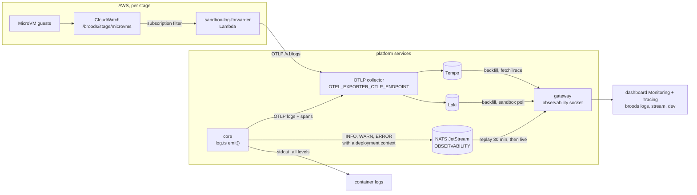
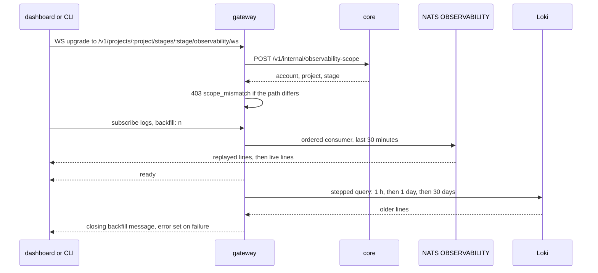
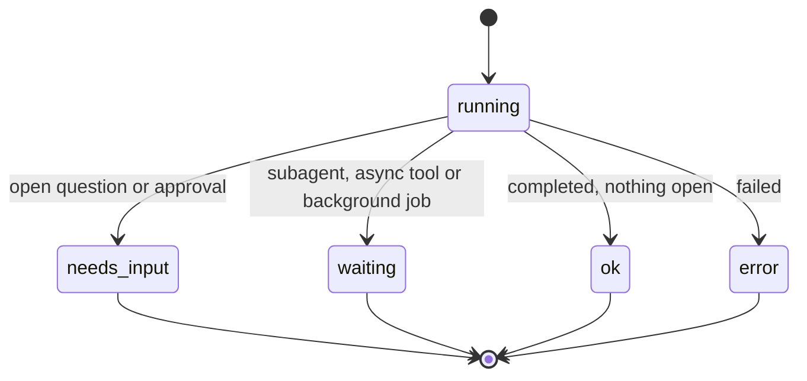
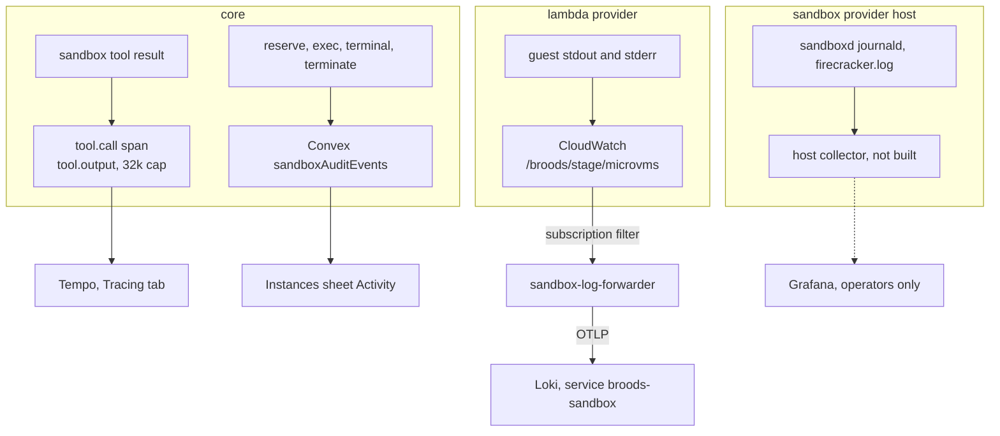
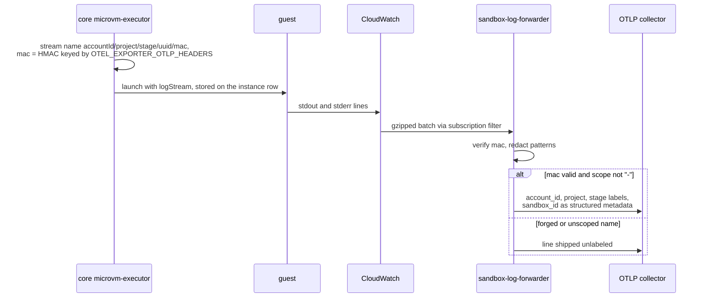

# Observability

The log and trace pipeline: where each line goes, how it is redacted, and how the dashboard and `broods logs` read it back. What users see is in the [observability guide](../guides/observability.md). Paths are relative to `apps/core/`.

## Pipeline


```mermaid
flowchart LR
  subgraph Platform["platform services"]
    Core["core<br/>log.ts emit()"]
    NATS[("NATS JetStream<br/>OBSERVABILITY")]
    Coll["OTLP collector<br/>OTEL_EXPORTER_OTLP_ENDPOINT"]
    Loki[("Loki")]
    Tempo[("Tempo")]
    GW["gateway<br/>observability socket"]
  end
  subgraph AWS["AWS, per stage"]
    VM["MicroVM guests"] --> CW["CloudWatch<br/>/broods/stage/microvms"]
    CW -->|"subscription filter"| Fwd["sandbox-log-forwarder<br/>Lambda"]
  end
  Core -->|"stdout, all levels"| Std["container logs"]
  Core -->|"OTLP logs + spans"| Coll
  Core -->|"INFO, WARN, ERROR<br/>with a deployment context"| NATS
  Fwd -->|"OTLP /v1/logs"| Coll
  Coll --> Loki
  Coll --> Tempo
  NATS -->|"replay 30 min, then live"| GW
  Loki -->|"backfill, sandbox poll"| GW
  Tempo -->|"backfill, fetchTrace"| GW
  GW --> Clients["dashboard Monitoring + Tracing<br/>broods logs, stream, dev"]
```

`emit()` in `src/shared/log.ts` is the one place every core line is redacted, then written to three sinks. A failing sink never blocks the others or throws into the agent path.

| Sink   | Levels            | Role                                                                                                                   |
| ------ | ----------------- | ---------------------------------------------------------------------------------------------------------------------- |
| stdout | all               | CloudWatch fallback and the source for metric filters                                                                  |
| OTLP   | all, best effort  | long-term store in Loki and Tempo. Gen-AI spans come from `@ai-sdk/otel` on the same tracer, without inputs or outputs |
| NATS   | INFO, WARN, ERROR | the live path. Only with an observability context, so channel and cron runs skip it                                    |

`console.*` in a code hook comes back as a `log` frame on the NDJSON protocol, and the host re-emits it through `emit()` with the run's context, tagged `source: "user-code"`. Stderr would be lost, because the pooled worker discards it.

## Tenant scoping

Logs and spans carry the same attributes, so a span, its logs and the live stream correlate: `account_id`, `project`, `stage`, `endpoint_id`, `agent_id`, `conversation_key`, `trace_id`. NATS subjects encode the routable part (`src/shared/nats.ts`):

```text
v1.<accountId>.<project>.<base64url(stage)>.{logs|traces}.<endpointId>
```

The `OBSERVABILITY` stream binds `v1.*.*.*.logs.>` and `v1.*.*.*.traces.>`, file-backed, keeping 2 hours, 512 MiB and 20,000 messages per subject. Nothing purges it early. Loki and Tempo own everything older.

## The observability socket

The dashboard Monitoring and Tracing tabs and `broods logs`, `broods stream` and `broods dev` read through the gateway (`apps/gateway/src/observability.ts`):


```mermaid
sequenceDiagram
  participant C as dashboard or CLI
  participant G as gateway
  participant Core as core
  participant N as NATS OBSERVABILITY
  participant L as Loki

  C->>G: WS upgrade to /v1/projects/:project/stages/:stage/observability/ws
  G->>Core: POST /v1/internal/observability-scope
  Core-->>G: account, project, stage
  G->>G: 403 scope_mismatch if the path differs
  C->>G: subscribe logs, backfill: n
  G->>N: ordered consumer, last 30 minutes
  N-->>C: replayed lines, then live lines
  G-->>C: ready
  G->>L: stepped query: 1 h, then 1 day, then 30 days
  L-->>G: older lines
  G-->>C: closing backfill message, error set on failure
```

Traces take the same path with a Tempo search in place of the Loki query.

| Limit               | Value                                                                                               |
| ------------------- | --------------------------------------------------------------------------------------------------- |
| Credential          | stage ticket `bdts_` (15 min). The runtime key is refused                                           |
| Loki backfill steps | 1 h in 5 s, 1 day in 10 s, 30 days in 15 s. Stops at the first step that fills a page or times out  |
| Tempo backfill      | 7 day search in 15 s, then 6 trace lookups at a time, 5 s each, sent newest first in chunks of 12   |
| `fetchTrace`        | one trace by id, filtered to the socket's scope (Tempo's lookup is not tenant-scoped), shared 5 min |
| Backpressure        | over 512 KiB unsent: live messages dropped, backfill waits up to 5 s                                |

A subscribe with `backfill` always gets a closing `backfill` message, with `error` set when Loki or Tempo failed, so a client can tell an empty stage from a failed query. When the same span arrives from NATS and Tempo, the dashboard keeps the richer or terminal copy, since Tempo truncates large attributes.

## Traces

Every top-level run is its own trace: `agent.task` for a request, `agent.cron` for a scheduled run, `agent.subtask` for a subagent. The root span closes in one of these states:


```mermaid
stateDiagram-v2
  [*] --> running
  running --> ok: completed, nothing open
  running --> error: failed
  running --> needs_input: open question or approval
  running --> waiting: subagent, async tool or background job
  needs_input --> [*]
  waiting --> [*]
  ok --> [*]
  error --> [*]
```

OTel only has ok and error, so the state rides in `task.state` with `task.waiting_on` (`question`, `approval`, `subagent`, `tool`), and the gateway restores it on backfill.

- The root and every model step record `model.system`, the whole assembled prompt, with `model.system_part_count` and `model.system_chars`.
- `agent.environment` is the live `<environment>` block (clock, reply target, where `bash` can run). It is added after the history, never stored in it, and recorded on the trace. The system prompt has no clock, so it stays a cached prefix.
- `tool.input` and `tool.output` hold at most 32,000 characters. Images and files show type and size, not bytes.
- Each model step splits into time to first token, streaming and tool wait.
- The Tracing tab shows one row per request: runs sharing its `task.id`, runs it resumed (`task.root_id`) and its subagents (`parent.trace_id`) nest under it. A failed `task` or `cron` root has a Continue button that posts `continue: true`.
- Config mutations and run completion go to the audit ledger; see [security](security.md#audit-ledger).

## Sandbox output

Sandbox output takes three roads. Only the second is a log stream.


```mermaid
flowchart TD
  subgraph core["core"]
    Exec["sandbox tool result"] --> Span["tool.call span<br/>tool.output, 32k cap"]
    Life["reserve, exec, terminal, terminate"] --> Audit["Convex sandboxAuditEvents"]
  end
  Span --> Tempo2["Tempo, Tracing tab"]
  Audit --> Sheet["Instances sheet Activity"]

  subgraph microvm["lambda provider"]
    VM["guest stdout and stderr"] --> CW["CloudWatch<br/>/broods/stage/microvms"]
  end
  CW -->|"subscription filter"| Fwd["sandbox-log-forwarder"]
  Fwd -->|"OTLP"| Loki2["Loki, service broods-sandbox"]

  subgraph workdir["sandbox provider host"]
    Sbx["sandboxd journald, firecracker.log"] --> Coll["host collector, not built"]
  end
  Coll -.-> Ops["Grafana, operators only"]
```

1. Tool output, every provider. The harness puts the redacted result on the `tool.call` span instead of logging it. Lifecycle actions go to `sandboxAuditEvents`. The Logs tab sees almost none of this.
2. MicroVM guest output. What the guest writes (the `/run` hook, background jobs, servers) goes to `/broods/<stage>/microvms` (`MICROVM_LOG_GROUP_NAME`) and through the forwarder to Loki.
3. The `sandbox` provider's host is not wired yet. Its journald and Firecracker logs carry no tenant, so a future host collector would ship them to operators only.

How a guest line earns tenant labels:


```mermaid
sequenceDiagram
  participant Core as core microvm-executor
  participant VM as guest
  participant CW as CloudWatch
  participant F as sandbox-log-forwarder
  participant O as OTLP collector

  Core->>Core: stream name accountId/project/stage/uuid/mac,<br/>mac = HMAC keyed by OTEL_EXPORTER_OTLP_HEADERS
  Core->>VM: launch with logStream, stored on the instance row
  VM->>CW: stdout and stderr lines
  CW->>F: gzipped batch via subscription filter
  F->>F: verify mac, redact patterns
  alt mac valid and scope not "-"
    F->>O: account_id, project, stage labels,<br/>sandbox_id as structured metadata
  else forged or unscoped name
    F->>O: line shipped unlabeled
  end
```

A guest can read the VM role and create any stream in the group, so only a name core signed earns tenant labels. The VM id rides as structured metadata, so an ephemeral VM never becomes a new Loki stream. The forwarder and its filter deploy only when the stage has `OTEL_EXPORTER_OTLP_HEADERS`, the same credential core ships with.

The Instances sheet Logs tab and `broods logs --sandbox <uuid>` subscribe with `{ sandboxId }`. Sandbox lines never pass through NATS, so the gateway polls Loki every 2 s over a 3 minute lookback (at most 1,000 lines, 5 s per poll), dropping lines it already sent; CloudWatch redelivery can land lines a minute or two late. Sandbox backfill reads one day in 15 s, because the structured-metadata filter scans every chunk in the window. The deployment stream's backfill excludes `broods-sandbox`, so the Monitoring tab matches its live relay.

## Runtime telemetry

Core writes compact JSON lines for metric-bearing events, so CloudWatch Logs Insights and metric filters can graph usage:

| `eventType`                            | Carries                                                                                        |
| -------------------------------------- | ---------------------------------------------------------------------------------------------- |
| `model.step.finished`                  | per-call `durationMs`, `usage`, response id, model, provider metadata, warning and tool counts |
| `model.invocation.finished`, `.failed` | status, run `durationMs`, total `usage`, step and tool counts, `toolsUsed`, `toolUsage`        |
| `tool.call.finished`, `.failed`        | `toolName`, `toolCallId`, `durationMs`                                                         |
| `model.step.warnings`                  | provider warnings                                                                              |

Common fields: `accountId`, `agentId`, `conversationKey`, `eventId`, `modelProvider`, `modelId`, `stepNumber`, `durationMs`.

A `tool.call` span for off-process work carries `tool.compute.type` and `tool.compute.cpu_usec`: `sandbox` (host cgroup), `lambda` (image `getrusage`) or `mcp-sandbox` (hosted MCP, an even share of its batch's CPU; Cloudflare reports none). The same samples sum per task into `sandboxUsage` rows.

Prompts, full tool payloads, request and response bodies and response headers are not logged by default.

## Security

- One chokepoint. `log.ts` redacts by key name with `isSecretName` (`packages/convex/model/secretNames.ts`) and scrubs every string against sensitive env values and the run's own secret values. Pattern rules also catch `Bearer` and `Basic` values, query-string secrets and every `b`-prefixed Broods credential (`bsk_`, `bask_`, `bpdk_`, `bcli_`, `bcode_`, `bsts_`, `bdts_`, `brt_`).
- The forwarder applies only the pattern half: it cannot know a run's secret values. A guest that echoes an injected secret shows it to its own account and to operators. Treat sandbox stdout as untrusted.
- A sandbox tail is scoped like any socket: the Loki selector comes from the ticket's account, project and stage, and `sandboxId` only narrows it. It must be the UUID shape core mints.
- Retention: CloudWatch keeps the MicroVM group 30 days, Loki keeps 90.
