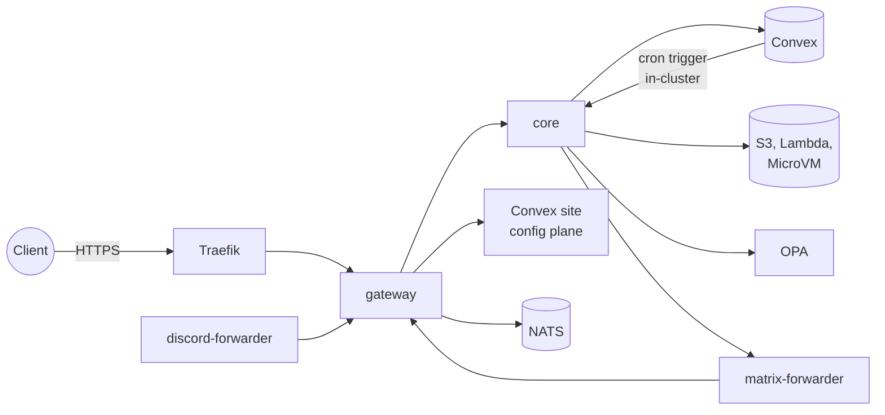

# Operations

This page is for running a Broods deployment day to day. It covers what runs where, the secrets and how to rotate them, the rules that keep the service token internal, the two forwarders, and runbooks for failures the code names. First-time setup is in [self-hosting](self-hosting.md). Log and trace plumbing is in [observability](observability.md).

## Runtime topology

The managed service runs on one k3s cluster, deployed from the infra repo (`kubernetes/charts/releases/`). Each pod listens on port 3000.

| Release                                      | Namespace       | Image                      | Replicas           | Exposed                                                |
| -------------------------------------------- | --------------- | -------------------------- | ------------------ | ------------------------------------------------------ |
| `gateway`, `gateway-dev`                     | `beeblast`      | `broods-gateway`           | scale freely       | `gateway.broods.app`, `gateway.dev.broods.app`         |
| `core`, `core-dev`                           | `beeblast`      | `broods-core`              | 1                  | cluster only: `http://core.beeblast.svc.cluster.local` |
| `dashboard`, `dashboard-dev`                 | `beeblast`      | `broods-dashboard`         | as needed          | `dashboard.broods.app`, `dashboard.dev.broods.app`     |
| `discord-forwarder`                          | `beeblast`      | `broods-discord-forwarder` | 1, `Recreate`      | none                                                   |
| `matrix-forwarder`                           | `beeblast`      | `broods-matrix-forwarder`  | 1, `Recreate`, PVC | cluster only, for core's sends                         |
| `convex-prod`, `convex-dev`                  | `convex`        | self-hosted Convex         | 1                  | Convex API and site hosts                              |
| `nats`                                       | `nats`          | NATS with JetStream        | chart default      | in-cluster `nats://`, plus a `wss://` ingress          |
| `opa`                                        | `beeblast`      | OPA with the Broods rego   | chart default      | `opa.beeblast.co`                                      |
| `otel-collector`, `loki`, `tempo`, `grafana` | `observability` | upstream                   | chart default      | OTLP ingress                                           |

- Core authenticates to AWS with an access key for the per-stage `core-runtime` IAM user that SST creates. The key lives in the `core-secrets` k8s secret.
- Async runs execute in-process, capped by `MAX_INPROCESS_WORKERS`, default 8. A request's work deadline is `REQUEST_TIMEOUT_BUDGET_MS`, default 10 minutes. On `SIGTERM` core drains in-process workers for up to `SHUTDOWN_DEADLINE_MS`, default 25 seconds. Runs still going then fail with a restart error and hand their conversation leases back, so a conversation is not locked for the 15-minute lease TTL.
- Core runs as a single replica, because the machine sandbox registry and the worker queue live in memory.
- On boot and every 30 seconds, `apps/core/src/harness/ingress-recovery.ts` starts queued work whose conversation has no live owner. Convex promotes each queue atomically, so an overlapping pod never runs one twice.
- The gateway buffers each proxied request body and refuses one over 20 MiB (`GATEWAY_MAX_REQUEST_BODY_BYTES`). A WebSocket upgrade whose token core cannot check, on a 5xx or timeout, gets `502` and does not count against `GATEWAY_AUTH_FAILURES_PER_MINUTE`, default 20. On `SIGTERM` the gateway stops listening and closes open sockets with `1012`, so clients reconnect to another pod.
- Core schedules nothing. The Convex crons component owns every schedule, including the account-deletion cascade. When one fires, a Convex action POSTs `{ kind: "cron", accountId, cronId }` to `BROODS_ACCOUNT_MANAGE_URL/v1/cron-runs` with `SERVICE_AUTH_SECRET`.
- Core's sandbox sweeper releases reserved sandboxes whose conversation never came back, once an hour by default (`SANDBOX_SWEEP_INTERVAL_SECONDS`). A lease keeps two core pods from sweeping at once. It lives in core, not a Convex cron, because deleting a sandbox calls the in-cluster workdir control plane.
- A green image build deploys nothing. `rollout.yaml` dispatches the infra workflow that rolls the pod. See [CI/CD](ci-cd.md).

## Service secrets

Four secrets, one job each. None falls back to another. Core refuses to start without all four, and the gateway without `TERMINAL_TICKET_SECRET`.

| Secret                   | Job                                                       | Set on                   |
| ------------------------ | --------------------------------------------------------- | ------------------------ |
| `SERVICE_AUTH_SECRET`    | Service bearer (with `X-Account-Id`) and the cron trigger | core, Convex env         |
| `STAGE_TICKET_SECRET`    | Signs and verifies `fp_dts_` stage session tickets        | Convex env (signs), core |
| `TERMINAL_TICKET_SECRET` | Seals and opens sandbox terminal tickets                  | core (seals), gateway    |
| `MEDIA_TICKET_SECRET`    | Seals and opens `/v1/media/{ticket}` links                | core                     |

Rotation:

- `TERMINAL_TICKET_SECRET` and `MEDIA_TICKET_SECRET` take a comma-separated list. The first entry seals, every entry opens. Prepend the new value, roll the pods, then drop the old one. A media link never expires, so dropping a value is what revokes the links it sealed.
- `SERVICE_AUTH_SECRET` and `STAGE_TICKET_SECRET` are single values. Change core and Convex together. Stage tickets live 15 minutes, so rotating `STAGE_TICKET_SECRET` logs out open dashboard log streams and `broods logs` sessions until they mint a new ticket.
- `ACCOUNT_CONFIG_ENCRYPTION_SECRET` is set on core and Convex and must never change without a re-encryption migration. Stored agent and sandbox configs are unreadable under a new value.
- `ADMIN_ACCOUNT_SECRET` is set on core and Convex. Rotating it only affects admin account creation and the account admin routes.

## Service token rules

The service token never crosses the public door. Only Convex sends it, always to core's in-cluster address.

- The gateway drops a client `X-Account-Id` unless `GATEWAY_FORWARD_ACCOUNT_ID=true`.
- The gateway sets `x-broods-via-gateway` on every upstream request. Core and the config plane refuse the service token on a request that carries it. The header name is `VIA_GATEWAY_HEADER` in `packages/convex/model/serviceBridge.ts`.
- The gateway answers `404` for `/v1/cron-runs` and `/v1/mcp-service/rpc`. `GATEWAY_DENY_INTERNAL_PATHS=false` turns that off.

If Convex cannot reach core directly, fix the network rather than the flags. Run `bunx convex env set BROODS_ACCOUNT_MANAGE_URL http://core.beeblast.svc.cluster.local`, and add a NetworkPolicy egress rule from the `convex` namespace if one blocks it. The flags do not restore a gateway path.

## Forwarders

Discord delivers regular messages only over a Gateway WebSocket, and Matrix only over `/sync` long-polls. Each forwarder holds those connections and POSTs what arrives to the channel webhook through the gateway. Telegram, Slack, Zalo, GitHub and Pancake post to a registered webhook and need no forwarder.

Both share one design, and the Matrix forwarder imports the Discord forwarder's `config.ts`, `connections.ts`, `backoff.ts`, `forward.ts`, `log.ts` and `supervisor.ts`:

- One release serves every config plane. `BROODS_CONFIG_PLANES` is a JSON array of `{ name, convexUrl, webhookBaseUrl }`, and plane `dev` reads its admin key from `CONVEX_DEPLOY_KEY_DEV`. Adding a Convex deployment is one array entry and one secret key. Neither forwarder ever holds `ACCOUNT_CONFIG_ENCRYPTION_SECRET`. Convex decrypts and returns only the token and webhook path, through `channel/connections.listConnections`.
- The connection list is a Convex websocket subscription, not a poll. A plane that errors keeps what it last answered, so a Convex blip does not close sockets. A plane that has never answered contributes nothing. Readiness stays false until the first plane answers.
- One connection per token, fanned out to every webhook that token serves. Two agents or two stages sharing a token both run from one connection.
- Single replica with `strategy: Recreate`, always. A second pod means a second connection per token and every message answered twice. Never add a release per stage; add a plane to the existing one.
- `/healthz` answers while the process is alive and never waits on Convex, so a Convex outage cannot become a restart loop. `/readyz` returns `503` until the first plane answers and carries the per-socket or per-account detail.
- A webhook that rejects an event loses it. `fanOut` logs the non-OK response and moves on. There is no outbox.

Discord specifics:

- Events go out as `{ "type": "GATEWAY_MESSAGE_CREATE", "data": ... }` with the bot token in `x-discord-gateway-token`. The forwarder adds `thread` when a message is inside a thread, because Discord omits the parent.
- Discord resets a bot token after 1000 IDENTIFYs in 24 hours and emails its owner. Reconnect backoff is capped at `DISCORD_BACKOFF_CEILING_MS`, 300 s, which alone keeps a permanently failing socket under 300 IDENTIFYs a day. The per-token counter `DISCORD_IDENTIFY_LIMIT`, default 500, parks a socket before the limit. The counter is in memory, so a crash loop is the one thing that defeats it.
- RESUME only dials a host under `.discord.gg`, whatever READY names, so the bot token cannot be sent elsewhere.

Matrix specifics:

- `MATRIX_STORE_DIR` holds each account's crypto store and sync token and must be a persistent volume. It is required at startup so a missing volume fails loudly. Losing it loses the device keys. Encrypted rooms become unreadable and the account has to log in again as a new device.
- Core sends replies, reactions and typing through `POST /v1/send` and `POST /v1/typing` on the forwarder (`MATRIX_FORWARDER_URL`), authenticated with the access token, because only the forwarder can encrypt for the room.
- The first sync with no stored token skips backlog. An undecryptable event waits up to 5 minutes for its room key and holds the stored sync token back meanwhile, so a restart replays it. A gap of more than 50 messages in a room is logged, not backfilled.

## Runbooks

| Symptom                                                            | Cause and fix                                                                                                                                                                      |
| ------------------------------------------------------------------ | ---------------------------------------------------------------------------------------------------------------------------------------------------------------------------------- |
| Core exits at boot naming a secret                                 | One of `SERVICE_AUTH_SECRET`, `STAGE_TICKET_SECRET`, `MEDIA_TICKET_SECRET`, `TERMINAL_TICKET_SECRET` is missing. Set it in the pod env                                             |
| Config-plane routes answer `503` through the gateway               | `BROODS_CONFIG_URL` is unset on the gateway. Point it at the Convex `*.convex.site` origin                                                                                         |
| Crons never fire, or sandbox deletes leave reservations behind     | Convex cannot reach core with the service token. Check `BROODS_ACCOUNT_MANAGE_URL` is core's in-cluster URL, not the gateway, and that `SERVICE_AUTH_SECRET` matches on both sides |
| Every agent config fails to decrypt                                | `ACCOUNT_CONFIG_ENCRYPTION_SECRET` differs from the value that encrypted the data. Restore the old value                                                                           |
| `deny-all` or `restricted` `lambda` sandboxes fail to launch       | `MICROVM_EGRESS_NETWORK_CONNECTOR_ARN` is unset on core. Set it from the `microvmEgressNetworkConnectorArn` output                                                                 |
| Discord agent answers `/new` but ignores mentions                  | The discord-forwarder is not running, or has no plane for that deployment. Check `/readyz`                                                                                         |
| Discord socket stops with close code 4014                          | Message Content Intent is off in the Discord developer portal. The forwarder logs it by name and does not retry. Nothing on the Broods side fixes it                               |
| Log line "Discord IDENTIFY budget exhausted, holding off"          | The token spent its `DISCORD_IDENTIFY_LIMIT` in 24 hours. The socket parks until the oldest IDENTIFY ages out. Find why it keeps reconnecting before raising the limit             |
| Matrix account `failed` in `/readyz`, core's sends get `409`       | The homeserver answered `M_UNKNOWN_TOKEN`. That account stopped; others keep running. Log in again and set the new access token on the connection                                  |
| Matrix agent cannot read encrypted rooms after a redeploy          | The crypto store was lost. Put `MATRIX_STORE_DIR` on a persistent volume, then log the account in again as a new device                                                            |
| Image built but pods still run the old version                     | The rollout job failed or `INFRA_DISPATCH_TOKEN` is missing. Check the `rollout` job of the build workflow and the infra run it names                                              |
| `broods logs` or the dashboard stream stops after about 15 minutes | The stage ticket expired and could not be renewed. The CLI mints a new one before each reconnect from its login, so re-run `broods login` if the login itself expired              |

## Drift cleanup

See [CI/CD](ci-cd.md#drift-cleanup).
