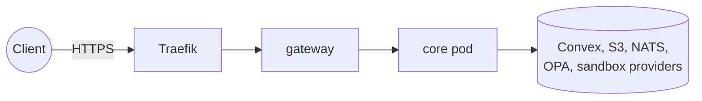
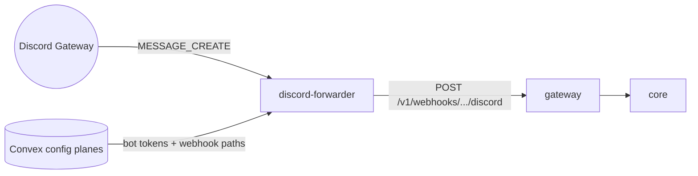

# Operations

This page covers running the Broods containers: core, the service secrets, the service token rules, and the Discord and Matrix forwarders. It is for operators of the managed service and of self-hosted deployments. Setting a deployment up the first time is in [self-hosting](self-hosting.md).

## Container runtime

Core ships as one image, `ghcr.io/beeblastco/broods-core`, built from `apps/core/Dockerfile` by the `Build Core Image` workflow with `dev` and `main` tags. One Bun process serves the harness and account routes behind the gateway. The pods are deployed from the infra repo (`kubernetes/charts/releases/core-dev.yaml` and `core.yaml`). A green image build deploys nothing by itself: `rollout.yaml` dispatches the infra workflow that rolls the pod.

- An IAM access key for the per-stage `core-runtime` user authorizes the AWS data plane.
- Async self-invocations run in-process, capped by `MAX_INPROCESS_WORKERS`.
- The invocation deadline comes from `REQUEST_TIMEOUT_BUDGET_MS`, default 10 minutes.
- Background-job callbacks use `PUBLIC_BASE_URL`.
- Core schedules nothing itself. The Convex crons component owns every schedule, including the account-deletion cascade. When a cron fires, a Convex action POSTs `{ kind: "cron", accountId, cronId }` to core's in-cluster address `BROODS_ACCOUNT_MANAGE_URL`, authenticated with `SERVICE_AUTH_SECRET`.

## Service secrets

Four secrets, one job each. None falls back to another, and core and the gateway refuse to start without theirs.

| Secret                   | Job                                                       | Set on                   |
| ------------------------ | --------------------------------------------------------- | ------------------------ |
| `SERVICE_AUTH_SECRET`    | Service bearer (with `X-Account-Id`) and the cron trigger | core, Convex env         |
| `STAGE_TICKET_SECRET`    | Signs and verifies `fp_dts_` stage session tickets        | Convex env (signs), core |
| `TERMINAL_TICKET_SECRET` | Seals and opens sandbox terminal tickets                  | core (seals), gateway    |
| `MEDIA_TICKET_SECRET`    | Seals and opens `/v1/media/{ticket}` links                | core                     |

`TERMINAL_TICKET_SECRET` is the gateway's only secret. It and `MEDIA_TICKET_SECRET` take a comma-separated list: the first entry seals, every entry opens. To rotate, prepend the new value, roll the pods, then drop the old one. A media link never expires, so dropping its secret is what revokes it. `SERVICE_AUTH_SECRET` and `STAGE_TICKET_SECRET` are single values; change both sides together.

`ACCOUNT_CONFIG_ENCRYPTION_SECRET` and `ADMIN_ACCOUNT_SECRET` are stable production secrets. Rotating the encryption secret needs a re-encryption migration.

## Service token rules

The service token never crosses the public door. Only Convex sends it, always to core's in-cluster address. Three rules enforce that:

- The gateway drops a client `X-Account-Id` unless `GATEWAY_FORWARD_ACCOUNT_ID=true`.
- The gateway sets `x-broods-via-gateway` on every upstream request, and core and the config plane refuse the service token when it is present.
- The gateway answers `404` for `/v1/cron-runs` and `/v1/mcp-service/rpc`. `GATEWAY_DENY_INTERNAL_PATHS=false` turns that off.

If Convex cannot reach core directly, fix that rather than flipping the flags: `bunx convex env set BROODS_ACCOUNT_MANAGE_URL http://core.beeblast.svc.cluster.local`, plus a NetworkPolicy egress rule from the `convex` namespace if needed. The two flags do not restore the old path.

## Discord gateway forwarder

Discord delivers regular messages only over a Gateway WebSocket, so a process has to hold one per bot token. That is `ghcr.io/beeblastco/broods-discord-forwarder`, built from `apps/discord-forwarder/Dockerfile` by `Build Discord Forwarder Image` and deployed from the infra repo (`kubernetes/charts/releases/discord-forwarder.yaml`).

It forwards each event as `{ "type": "GATEWAY_MESSAGE_CREATE", "data": ... }` with the bot token in `x-discord-gateway-token`.

There is one release, not one per stage. `BROODS_CONFIG_PLANES` lists the Convex deployments to read as a JSON array of `{ name, convexUrl, webhookBaseUrl }`, and each plane's credential comes from `CONVEX_DEPLOY_KEY_<NAME>` (plane `dev` reads `CONVEX_DEPLOY_KEY_DEV`). Adding a deployment is one array entry and one secret key. The forwarder never holds `ACCOUNT_CONFIG_ENCRYPTION_SECRET`; Convex decrypts and returns only the bot token and webhook path through `channel/connections.listConnections`, which takes a channel name so a future held-open transport can reuse it.

Sharing one process across planes is required, not tidy. Discord counts connections per bot token, and the same token can be deployed to dev and prod. A forwarder per stage would hold two sockets and answer every message twice. One process keys sockets by token and fans each event out to every plane's webhook.

A plane that fails a poll keeps serving what it last answered, so a Convex blip cannot read as "every token was deleted" and close sockets. A plane that has never answered contributes nothing, so a backend that is not live yet does not stop the others. Only a poll where no plane answered leaves the pod unready.

Constraints, most important first:

- Single replica, `strategy: Recreate`. Two pods means two sockets per token and duplicate replies. Do not scale it, do not let a RollingUpdate surge a second pod, and do not add a second release per stage. Add a plane to the existing one.
- Discord resets a bot token after 1000 IDENTIFYs in 24 hours and emails its owner. The forwarder caps reconnect backoff at 300 s and counts IDENTIFYs per token, parking a socket instead of dialling past the limit. A restart loop defeats the counter, which is why liveness (`/healthz`) does not depend on the config plane. Only readiness (`/readyz`) does.
- Close code 4014 means Message Content Intent is off in the Discord developer portal. The forwarder logs it by name and stops. Nothing on the Broods side fixes it.

`GET /healthz` reports per-socket state. `state: "fatal"` on a token means the bot needs attention in the portal.

Telegram, Slack, Zalo, GitHub and Pancake deliver to a registered webhook URL, so they need no forwarder.

## Matrix forwarder

Matrix has no webhooks. `apps/matrix-forwarder` long-polls `/sync` once per access token, holds each account's end-to-end encryption keys, and posts decrypted room messages to the channel webhook. Core sends replies, reactions and typing back through it, because only it can encrypt them. Its crypto store lives on a persistent volume. Run a single replica: two would poll the same account twice and double every message.

## Public access defaults

The public runtime endpoint (HTTP, SSE and WebSocket with a stage runtime key) is off per agent until the agent sets `publicAccess: true`. A refused request gets `403` with code `public_access_disabled`. Account secrets, channel webhooks and cron runs are never gated by the flag. Bringing a custom domain for the generated endpoint URL is not supported yet.

## Drift cleanup

See [CI/CD](ci-cd.md#drift-cleanup).
