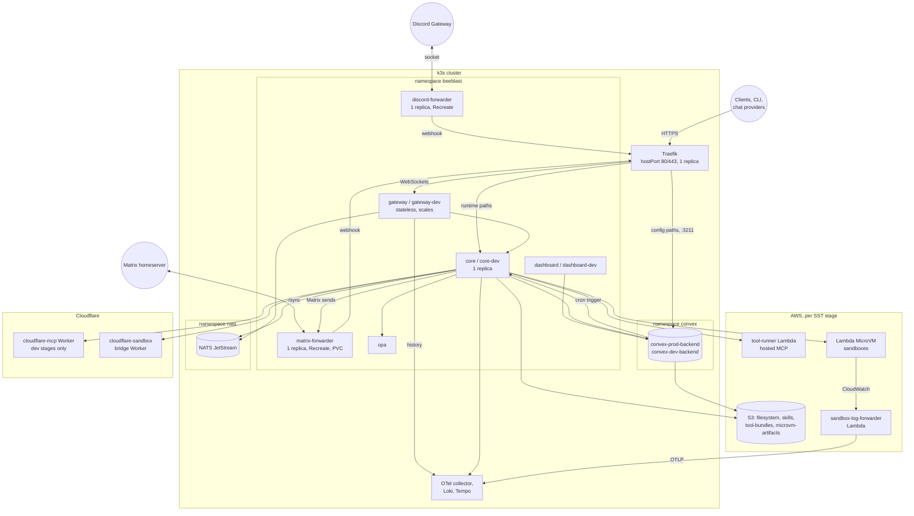
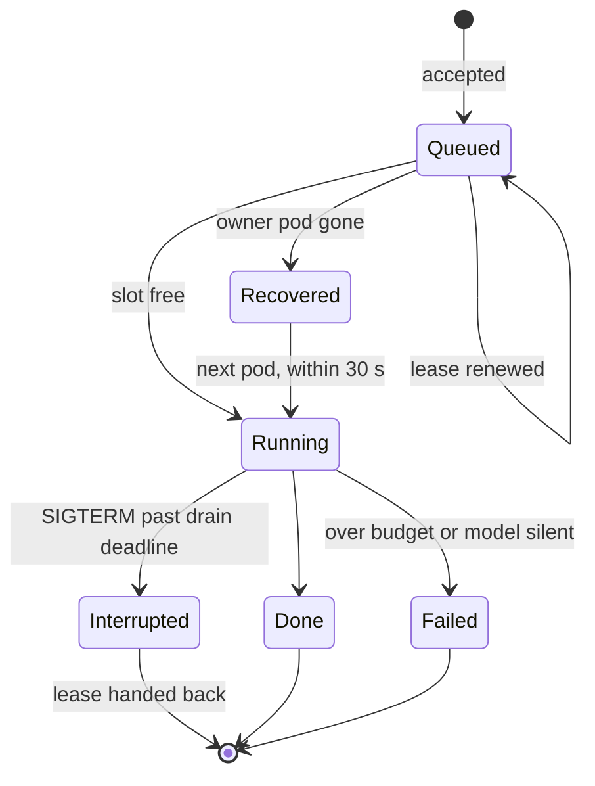
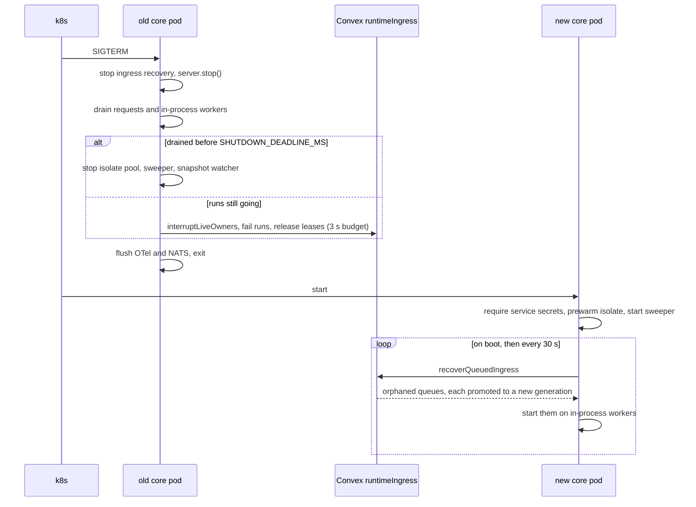
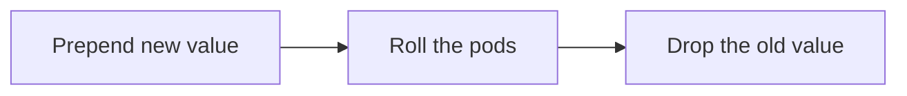
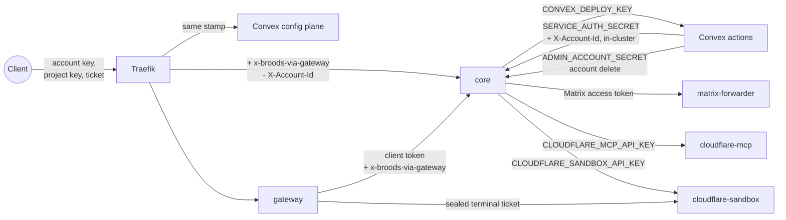
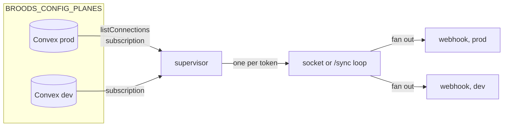
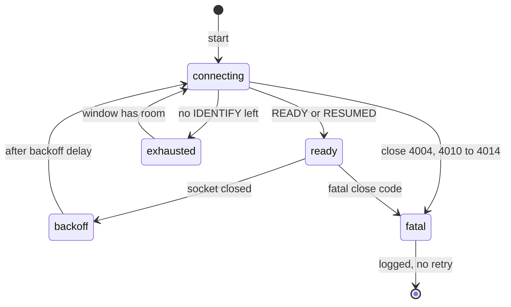
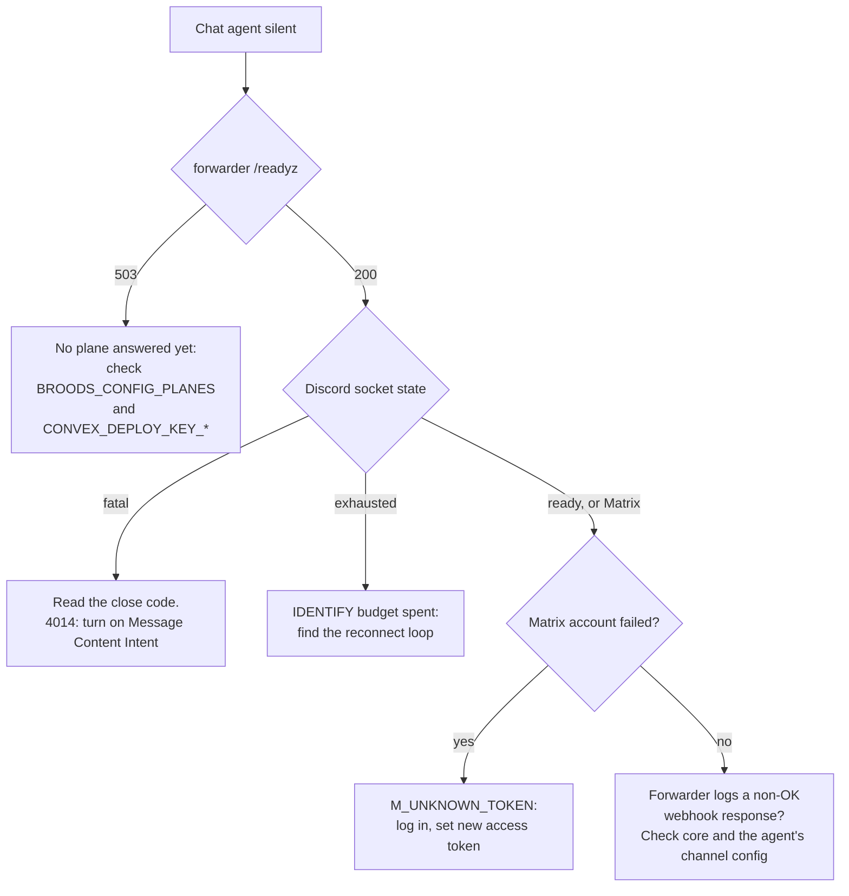

# Operations

Running a Broods deployment day to day. First-time setup is in [self-hosting](self-hosting.md), how commits reach the cluster is in [CI/CD](ci-cd.md), and log and trace plumbing is in [observability](observability.md).

## Runtime topology

The managed service runs on one k3s cluster, deployed from the infra repo (`kubernetes/charts/releases/`). The AWS data plane comes from `apps/core/sst.config.ts`, one copy per SST stage. Service names and hosts below are the ones `apps/edge/src/generate.ts` routes to.

```mermaid
flowchart TB
  Users(("Clients, CLI,<br/>chat providers"))
  DiscordGW((Discord Gateway))
  Homeserver((Matrix homeserver))

  subgraph k3s["k3s cluster"]
    Traefik["Traefik<br/>hostPort 80/443, 1 replica"]
    subgraph beeblast["namespace beeblast"]
      Gateway["gateway / gateway-dev<br/>stateless, scales"]
      Core["core / core-dev<br/>1 replica"]
      Dashboard["dashboard / dashboard-dev"]
      DFwd["discord-forwarder<br/>1 replica, Recreate"]
      MFwd["matrix-forwarder<br/>1 replica, Recreate, PVC"]
      OPA["opa"]
    end
    subgraph convexns["namespace convex"]
      Convex[("convex-prod-backend<br/>convex-dev-backend")]
    end
    subgraph natsns["namespace nats"]
      NATS[("NATS JetStream")]
    end
    Obs["OTel collector,<br/>Loki, Tempo"]
  end

  subgraph AWS["AWS, per SST stage"]
    S3[("S3: filesystem, skills,<br/>tool-bundles, microvm-artifacts")]
    ToolRunner["tool-runner Lambda<br/>hosted MCP"]
    MicroVM["Lambda MicroVM<br/>sandboxes"]
    LogFwd["sandbox-log-forwarder<br/>Lambda"]
  end

  subgraph CF["Cloudflare"]
    McpWorker["cloudflare-mcp Worker<br/>dev stages only"]
    SbxWorker["cloudflare-sandbox<br/>bridge Worker"]
  end

  Users -->|HTTPS| Traefik
  Traefik -->|runtime paths| Core
  Traefik -->|"config paths, :3211"| Convex
  Traefik -->|WebSockets| Gateway
  Gateway --> Core
  Gateway --> NATS
  Gateway -->|history| Obs
  Dashboard --> Convex
  Core --> Convex
  Core --> NATS
  Core --> OPA
  Core --> Obs
  Convex -->|cron trigger| Core
  Core --> S3
  Core --> ToolRunner
  Core --> MicroVM
  Core --> McpWorker
  Core --> SbxWorker
  Convex --> S3
  MicroVM -->|CloudWatch| LogFwd
  LogFwd -->|OTLP| Obs
  DiscordGW <-->|socket| DFwd
  Homeserver <-->|"/sync"| MFwd
  DFwd -->|webhook| Traefik
  MFwd -->|webhook| Traefik
  Core -->|Matrix sends| MFwd
```

| Piece          | Replicas                 | Why                                                                                  |
| -------------- | ------------------------ | ------------------------------------------------------------------------------------ |
| core           | 1                        | The machine sandbox registry and the in-process worker queue live in memory          |
| gateway        | any                      | Stateless. On `SIGTERM` it closes sockets with `1012` so clients reconnect elsewhere |
| forwarders     | 1, `strategy: Recreate`  | A second pod means a second socket per token and every message answered twice        |
| Traefik        | 1                        | Rate-limit buckets count in memory per pod                                           |
| cloudflare-mcp | one Worker per dev stage | `deploy.yaml` skips production, so production hosted MCP stays on Lambda             |

- Core authenticates to AWS with an access key for the per-stage `core-runtime` IAM user. Convex uses the `convex-bootstrap` user, which can only assume `ConvexAwsRole`.
- Core schedules nothing. The Convex crons component owns every schedule and POSTs each firing to core's `/v1/cron-runs` in-cluster.
- A green image build deploys nothing. `rollout.yaml` dispatches the infra workflow that rolls the pod. See [CI/CD](ci-cd.md#rollouts).

## Core runtime limits

| Knob                                                     | Default | Effect                                                                              |
| -------------------------------------------------------- | ------- | ----------------------------------------------------------------------------------- |
| `MAX_INPROCESS_WORKERS`                                  | 8       | Async runs in flight per pod. The rest queue, with their conversation lease renewed |
| `WORKER_TIMEOUT_BUDGET_MS`                               | 600000  | A run still going 5 s past this loses its slot and fails                            |
| `MODEL_FIRST_CHUNK_TIMEOUT_MS`, `MODEL_CHUNK_TIMEOUT_MS` | 300000  | Model silence before the first chunk, or between chunks, fails the run              |
| `REQUEST_TIMEOUT_BUDGET_MS`                              | 600000  | Work deadline of one request                                                        |
| `SHUTDOWN_DEADLINE_MS`                                   | 25000   | Drain time on `SIGTERM` before live runs are failed                                 |
| `SANDBOX_SWEEP_INTERVAL_SECONDS`                         | 3600    | How often core releases reserved sandboxes whose conversation never came back       |

Time inside a tool call does not count toward the chunk timeouts, except a tool the model provider runs itself (such as its web search).

An async run on one core pod:

```mermaid
stateDiagram-v2
  [*] --> Queued: accepted
  Queued --> Running: slot free
  Queued --> Queued: lease renewed
  Running --> Done
  Running --> Failed: over budget or model silent
  Running --> Interrupted: SIGTERM past drain deadline
  Interrupted --> [*]: lease handed back
  Queued --> Recovered: owner pod gone
  Recovered --> Running: next pod, within 30 s
  Done --> [*]
  Failed --> [*]
```

What a core restart does, from `shutdown()` and boot in `apps/core/src/server.ts`:

```mermaid
sequenceDiagram
  participant K as k8s
  participant Old as old core pod
  participant CVX as Convex runtimeIngress
  participant New as new core pod

  K->>Old: SIGTERM
  Old->>Old: stop ingress recovery, server.stop()
  Old->>Old: drain requests and in-process workers
  alt drained before SHUTDOWN_DEADLINE_MS
    Old->>Old: stop isolate pool, sweeper, snapshot watcher
  else runs still going
    Old->>CVX: interruptLiveOwners, fail runs, release leases (3 s budget)
  end
  Old->>Old: flush OTel and NATS, exit
  K->>New: start
  New->>New: require service secrets, prewarm isolate, start sweeper
  loop on boot, then every 30 s
    New->>CVX: recoverQueuedIngress
    CVX-->>New: orphaned queues, each promoted to a new generation
    New->>New: start them on in-process workers
  end
```

Without the interrupt, a conversation stays locked for the 15-minute lease TTL. Convex promotes each queue atomically, so an overlapping pod never runs one twice.

## Edge limits

Traefik's `broods-edge` IngressRoute is generated from `apps/edge/src/routes.ts`. A route added to core or the config plane needs a row there, then the regenerated file in the infra repo.

| Router                                | Limit per client address        |
| ------------------------------------- | ------------------------------- |
| core, config plane, download links    | 1200 a minute (burst 200)       |
| WebSocket upgrades                    | 120 a minute (burst 60)         |
| channel webhooks, media links, health | none, providers share addresses |

Over the limit answers `429` with CORS headers. Traefik binds the node's ports 80 and 443 (`hostPort`) to see each client's own address; behind a load balancer without PROXY protocol every client shares one bucket.

The gateway has its own limit: `GATEWAY_AUTH_FAILURES_PER_MINUTE` (default 20) failed socket logins per address. A token core could not check, on a 5xx or timeout, gets `502` and does not count.

## Service secrets

Each secret has one job and none falls back to another. Core refuses to boot without the first four, and the gateway without `TERMINAL_TICKET_SECRET`.

| Secret                             | Job                                       | Set on                    | Format       |
| ---------------------------------- | ----------------------------------------- | ------------------------- | ------------ |
| `SERVICE_AUTH_SECRET`              | Service bearer, with `X-Account-Id`       | core, Convex              | single value |
| `STAGE_TICKET_SECRET`              | Signs `bdts_` stage tickets (15 min)      | Convex signs, core reads  | single value |
| `TERMINAL_TICKET_SECRET`           | Seals sandbox terminal tickets            | core seals, gateway opens | list         |
| `MEDIA_TICKET_SECRET`              | Seals `/v1/media/:ticket` links           | core                      | list         |
| `ACCOUNT_CONFIG_ENCRYPTION_SECRET` | Wraps each account's data key             | core, Convex              | list         |
| `ADMIN_ACCOUNT_SECRET`             | Admin bearer for the account admin routes | core, Convex, dashboard   | single value |

A list is comma-separated: the first entry seals, every entry opens.

```mermaid
flowchart LR
  A["Prepend new value"] --> B["Roll the pods"] --> C["Drop the old value"]
```

- `TERMINAL_TICKET_SECRET`, `MEDIA_TICKET_SECRET`: the steps above. A media link never expires, so dropping a value is what revokes the links it sealed.
- `ACCOUNT_CONFIG_ENCRYPTION_SECRET`: follow the [rotation runbook](security.md#rotation-runbook). It adds a `rewrapAllKeys` step; dropping a value before the rewrap finishes makes every config it wrapped unreadable.
- `SERVICE_AUTH_SECRET`, `STAGE_TICKET_SECRET`: change core and Convex together. Rotating the stage secret logs out open dashboard log streams and `broods logs` until they mint a new ticket.

## Service token rules

The service token never crosses the public door. Only Convex sends it, always to core's in-cluster URL (`BROODS_ACCOUNT_MANAGE_URL`).

```mermaid
flowchart LR
  Client((Client)) -->|"account key,<br/>project key, ticket"| Traefik
  Traefik -->|"+ x-broods-via-gateway<br/>- X-Account-Id"| Core[core]
  Traefik -->|same stamp| Site[Convex config plane]
  Traefik --> Gateway[gateway]
  Gateway -->|"client token<br/>+ x-broods-via-gateway"| Core
  Convex[Convex actions] -->|"SERVICE_AUTH_SECRET<br/>+ X-Account-Id, in-cluster"| Core
  Convex -->|"ADMIN_ACCOUNT_SECRET<br/>account delete"| Core
  Core -->|CONVEX_DEPLOY_KEY| Convex
  Core -->|Matrix access token| MFwd[matrix-forwarder]
  Core -->|CLOUDFLARE_MCP_API_KEY| MCP[cloudflare-mcp]
  Core -->|CLOUDFLARE_SANDBOX_API_KEY| SBX[cloudflare-sandbox]
  Gateway -->|sealed terminal ticket| SBX
```

- Core (`isServiceToken` in `apps/core/src/shared/auth.ts`) and the config plane both refuse the service token on any request that carries `x-broods-via-gateway`. The header name is `VIA_GATEWAY_HEADER` in `packages/convex/model/serviceBridge.ts`.
- The in-cluster-only paths `/v1/cron-runs` and `/v1/mcp-service/rpc` are routed to core like any other path; core refuses them because a stamped request can never carry a valid service token.
- If Convex cannot reach core, fix the network; there is no public path to open. Set `BROODS_ACCOUNT_MANAGE_URL` to `http://core.beeblast.svc.cluster.local` and allow egress from the `convex` namespace.

## Forwarders

Discord sends regular messages only over a Gateway socket, and Matrix only over `/sync` long-polls. Every other channel posts to a webhook and needs no forwarder. The Matrix forwarder imports the Discord forwarder's config, connection, backoff, forward, log and supervisor modules, so both work the same way:

```mermaid
flowchart LR
  subgraph planes["BROODS_CONFIG_PLANES"]
    P1[("Convex prod")]
    P2[("Convex dev")]
  end
  P1 -->|"listConnections<br/>subscription"| Sup[supervisor]
  P2 -->|subscription| Sup
  Sup -->|one per token| Conn["socket or /sync loop"]
  Conn -->|fan out| W1["webhook, prod"]
  Conn -->|fan out| W2["webhook, dev"]
```

- One release serves every config plane. Plane `dev` reads its admin key from `CONVEX_DEPLOY_KEY_DEV`. Add a plane to the array, never a release per stage.
- Convex decrypts and returns only the token and webhook path. Neither forwarder holds `ACCOUNT_CONFIG_ENCRYPTION_SECRET`.
- A plane that errors keeps its last answer, so a Convex blip closes no socket. `/healthz` never waits on Convex; `/readyz` is `503` until the first plane answers.
- A webhook that rejects an event loses it. There is no outbox.

A Discord socket, from `apps/discord-forwarder/src/socket.ts`:

```mermaid
stateDiagram-v2
  [*] --> connecting: start
  connecting --> ready: READY or RESUMED
  connecting --> exhausted: no IDENTIFY left
  exhausted --> connecting: window has room
  ready --> backoff: socket closed
  backoff --> connecting: after backoff delay
  connecting --> fatal: close 4004, 4010 to 4014
  ready --> fatal: fatal close code
  fatal --> [*]: logged, no retry
```

- Discord resets a token after 1000 IDENTIFYs in 24 hours. `DISCORD_IDENTIFY_LIMIT` (default 500) parks the socket first. The counter is in memory, so a crash loop defeats it.
- A RESUME spends no IDENTIFY and only dials a host under `.discord.gg`, so the bot token cannot be sent elsewhere.
- Events go out as `GATEWAY_MESSAGE_CREATE` with the token in `x-discord-gateway-token`, plus `thread` for a message in a thread.

Matrix:

- `MATRIX_STORE_DIR` holds each account's crypto store and sync token and must be a persistent volume. Losing it loses the device keys.
- Core sends replies, reactions and typing through the forwarder's `POST /v1/send` and `POST /v1/typing`, authenticated with the access token, because only the forwarder can encrypt for the room.
- An undecryptable event waits up to 5 minutes for its room key and holds the stored sync token back, so a restart replays it.

## Runbooks

| Symptom                                                        | Fix                                                                                             |
| -------------------------------------------------------------- | ----------------------------------------------------------------------------------------------- |
| Core exits at boot naming a secret                             | Set the missing service secret in the pod env                                                   |
| New route answers `404`, or reaches the wrong plane            | `bun run --filter @broods/edge generate kubernetes`, land it in infra                           |
| Crons never fire, sandbox deletes leave reservations           | Point `BROODS_ACCOUNT_MANAGE_URL` at core in-cluster; match `SERVICE_AUTH_SECRET` on both sides |
| Every agent config fails to decrypt                            | Put the value that wrapped the keys back in `ACCOUNT_CONFIG_ENCRYPTION_SECRET`                  |
| `deny-all` or `restricted` `lambda` sandboxes fail to launch   | Set `MICROVM_EGRESS_NETWORK_CONNECTOR_ARN` from the `microvmEgressNetworkConnectorArn` output   |
| Discord agent answers `/new` but ignores mentions              | discord-forwarder down or missing that plane. Check `/readyz`                                   |
| Matrix agent cannot read encrypted rooms after a redeploy      | Put `MATRIX_STORE_DIR` on a persistent volume, log in again as a new device                     |
| Image built but pods run the old version                       | Check the build workflow's `rollout` job and `INFRA_DISPATCH_TOKEN`                             |
| `broods logs` or dashboard stream stops after about 15 minutes | Stage ticket could not be renewed. Re-run `broods login`                                        |

A Discord or Matrix agent that stays silent:

```mermaid
flowchart TD
  A["Chat agent silent"] --> B{"forwarder /readyz"}
  B -->|"503"| B1["No plane answered yet:<br/>check BROODS_CONFIG_PLANES<br/>and CONVEX_DEPLOY_KEY_*"]
  B -->|"200"| C{"Discord socket state"}
  C -->|fatal| C1["Read the close code.<br/>4014: turn on Message Content Intent"]
  C -->|exhausted| C2["IDENTIFY budget spent:<br/>find the reconnect loop"]
  C -->|"ready, or Matrix"| D{"Matrix account failed?"}
  D -->|yes| D1["M_UNKNOWN_TOKEN:<br/>log in, set new access token"]
  D -->|no| E["Forwarder logs a non-OK<br/>webhook response?<br/>Check core and the agent's channel config"]
```

## Drift cleanup

See [CI/CD](ci-cd.md#drift-cleanup).
