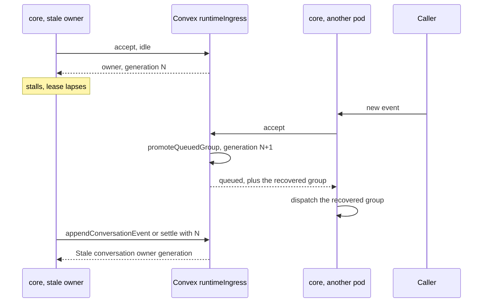
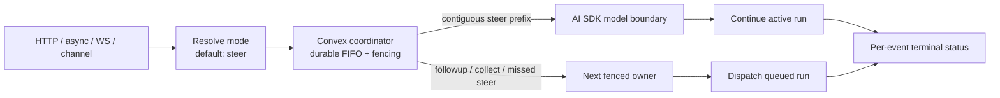
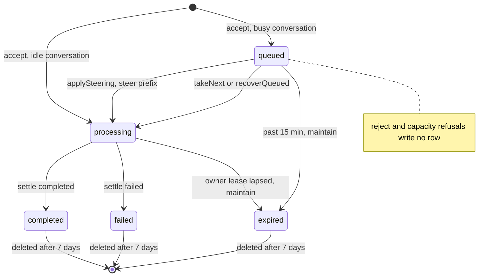
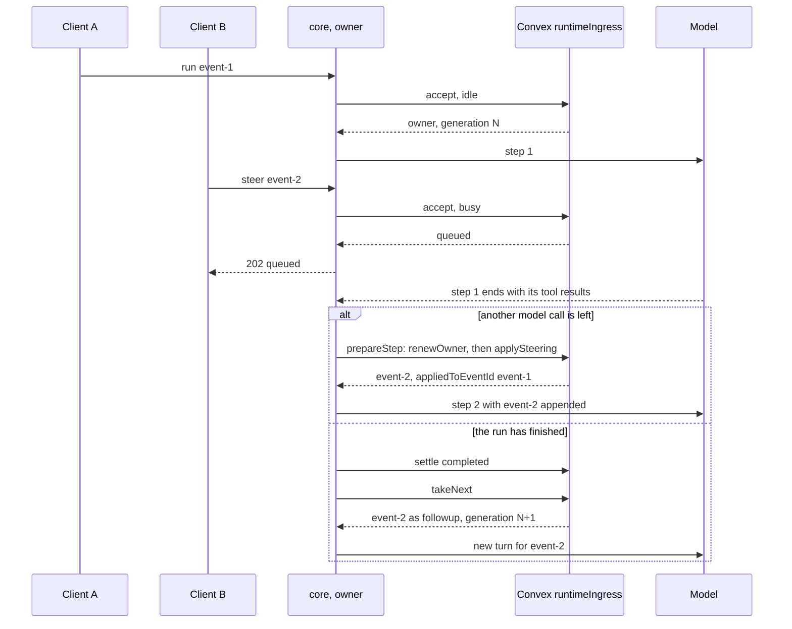

# Queue and steer

This is the design record for a message that arrives while a conversation is busy. One contract covers direct HTTP, async HTTP, WebSocket and channel ingress. It shipped for [issue #71](https://github.com/beeblastco/broods/issues/71).

To use it, read [Conversations](../guides/conversations.md). This page is for changing it.

## Where it lives

| File                                | Owns                                                                                                                                                         |
| ----------------------------------- | ------------------------------------------------------------------------------------------------------------------------------------------------------------ |
| `packages/convex/runtimeIngress.ts` | The coordinator: `accept`, `applySteering`, `takeNext`, `settle`, `stopOwner`, `acquireClear`, `clearConversation`, `renewOwner`, `releaseOwner`, `maintain` |
| `apps/core/src/harness/ingress.ts`  | Candidate and delivery types, the limit and TTL constants, admission helpers                                                                                 |
| `apps/core/src/harness/harness.ts`  | The `prepareStep` and `onStepEnd` hooks that apply steering at a step boundary                                                                               |
| `apps/core/src/harness/handler.ts`  | HTTP and async admission, `409` and `429` responses, the continuation workers                                                                                |
| `apps/core/src/shared/commands.ts`  | `/steer`, `/queue`, `/stop` and `/cancel`, lease-safe `/new` and `/clear`, `/compact`                                                                        |
| `apps/gateway/src/agent.ts`         | WebSocket `execute`, `control`, `attach` and `cancel` frames, ACK and status relay                                                                           |

## Why it exists

Before this contract, a per-conversation lease serialized work and each transport treated a busy conversation its own way. Direct SSE answered `409`. Async accepted the request and then failed it as busy. Channels buffered messages and folded them into the next turn. The WebSocket gateway allowed one execute per socket, and its `cancel` frame stopped only gateway-side reads. The contract replaced all of that with one default, `steer`, and no transition mode. It does not add distributed cancellation.

## Steering is a boundary, not an abort

`steer` adds the new input after the current AI SDK step, including its whole in-flight tool batch, and before the next model call. It never aborts a model call or a running tool.

Hard interrupt, abort and distributed cancellation are separate features. Each needs its own ownership, tool cleanup, persistence, billing and terminal-state rules before the API can claim a core run was cancelled. Nobody should redefine the gateway `cancel` frame as core cancellation.

## Modes

Every ingress surface uses the same four modes.

| Mode       | What a busy conversation does                                                                |
| ---------- | -------------------------------------------------------------------------------------------- |
| `reject`   | Refuses the input and stores nothing. The caller gets a conflict.                            |
| `followup` | Stores one FIFO envelope that runs as its own turn after earlier work.                       |
| `collect`  | Stores the envelope, then merges every envelope waiting at drain time into one next turn.    |
| `steer`    | Offers the envelope at the next step boundary, and falls back to `followup` if none is left. |

HTTP, async, WebSocket `execute` and `control`, and plain channel messages all default to `steer`. Callers ask for `reject`, `followup` or `collect` explicitly. Channel `/queue <message>` is the one-message `followup` form.

`collect` keeps order. The model sees one merged turn, but every contributing envelope keeps its own status, and the application record lists the contributor event ids in order.

## Envelopes and idempotency

Authentication and parsing produce an in-memory `IngressCandidate`. Parsing stores nothing. The coordinator resolves the mode and stores an envelope only when it accepts the candidate, so a busy `reject` leaves no envelope and no status row.

`IngressDelivery` in `ingress.ts` has one variant per delivery kind. `http`, `async` and `websocket` carry `publicEventId`, `publicConversationKey`, and for runtime-key ingress a `publicDeploymentIngress` marker. `channel` carries the channel name, the sender `identity` and the reply-routing `source`. Delivery holds routing identifiers only. It never stores provider credentials, bearer tokens, request headers or copies of the message.

An envelope stores `requestedMode`, which is the caller's mode or the resolved `steer` default. It also stores the server-derived `accountId` and `agentId`, which callers cannot set.

Every transport shares one idempotency identity:

```text
(accountId, agentId, scopedConversationKey, idempotencyKey)
```

`idempotencyKey` defaults to `eventId`. `eventId` stays the public correlation id and is not a second identity. The first acceptance binds the identity to its `eventId`, payload digest, envelope and status. A retry with the same identity and digest gets that `eventId` and status back. The same identity with a different digest is `409 idempotency_conflict`.

The binding lives as long as the status row, seven days, including after `completed`, `failed` or `expired`. An expired envelope therefore cannot run twice. A rejected candidate never binds, because it was never accepted.

## FIFO, limits and recovery

The coordinator stores each accepted envelope as its own row, ordered by a sequence number it assigns in the same transaction. `(createdAt, eventId)` is only a diagnostic tie-breaker.

`collect` never replaces its source envelopes. At drain time the coordinator creates one application whose `contributingEventIds` lists every source in order, and links each envelope to it. Each source then moves through `applied` and `processing` to the same terminal status, so polling and audit still work per request.

Steering follows the same rule at a live boundary. Only the contiguous run of `steer` envelopes at the head of the queue is merged and injected. A `followup` or `collect` ahead of a later steer is never skipped. If the run has no model call left, that same steer prefix becomes one follow-up application, and every contributor keeps its own status.

In a channel the steer prefix also stops at a new sender. `applySteering` compares `delivery.identity.userId`, so a message from someone other than the person whose turn is running waits for its own turn, where policy checks it against that sender's id and roles. This rule came after the original record.

The limits are constants in `ingress.ts`. Core sends them to Convex on every admission, and changing them is a code change.

| Limit                             | Value  | Constant                            |
| --------------------------------- | ------ | ----------------------------------- |
| Queued envelopes per conversation | 100    | `DEFAULT_INGRESS_MAX_COUNT`         |
| Queued event bytes                | 1 MiB  | `DEFAULT_INGRESS_MAX_BYTES`         |
| Queued envelope lifetime          | 15 min | `DEFAULT_INGRESS_TTL_MS`            |
| Conversation lease                | 15 min | `DEFAULT_CONVERSATION_LEASE_TTL_MS` |
| Status and idempotency records    | 7 days | `DEFAULT_INGRESS_STATUS_TTL_MS`     |

Acceptance is atomic. The coordinator either inserts the envelope with its status row or rejects it. Overflow returns `429 ingress_capacity` and never silently drops the oldest or newest item. An envelope that outlives its lifetime moves to terminal `expired`, so lost work stays visible.

Every lease acquisition or recovery increments a per-conversation `ownerGeneration` and returns it as a fencing token. The generation survives lease deletion. Dequeue, history writes, status changes, result commits and lease release all carry the token, and Convex refuses any of them once the generation has moved on. Core checks the token again right before it starts a tool, publishes to the stream or posts a channel reply. A call already in flight when ownership changes cannot be revoked, but its result and later writes are refused. Channel delivery stays best effort and uses the provider's idempotency metadata where one exists.

After a crash, maintenance marks elapsed work `expired`. When a new event reaches a conversation whose lease expired with work still queued, admission first promotes the oldest queued group to the new generation and schedules it, and the newcomer queues behind it. A stale worker cannot apply an envelope or commit output after that. Core also calls `recoverQueued` on boot and on a timer, for queues nobody writes to again.

How the fencing token shuts out a stale owner:



Each envelope carries its own execution context, meaning the resolved agent config with per-run `model` overrides and one-turn `system` messages. The payload digest covers them. A queued request therefore runs with its own overrides and never inherits the previous owner's.



Every accepted envelope ends as `completed`, `failed` or `expired`. Its status carries `requestedMode`, the `appliedMode` that happened, and `appliedToEventId`. A steer that missed its boundary shows `requestedMode: "steer"`, `appliedMode: "followup"` and the event id of the follow-up turn. An idle request records its own event id, and an idle steer records `appliedMode: "followup"` because it starts a normal turn.

The status an envelope row moves through, with the `runtimeIngress.ts` mutation that moves it:



`accepted` and `applied` are in the `IngressStatus` type, but no envelope row is ever written with them. The run status route overlays the async run record, so while that record is nonterminal a poller sees `awaiting_approval` or `awaiting_input` instead of the envelope status.

## The step boundary

Steering enters at one point, the AI SDK `prepareStep` hook. After `onStepEnd` has seen every tool result of the current step, and before the next model call, the coordinator takes the steer prefix, appends it to history, refreshes the next step's messages and system context, and records the active event id as `appliedToEventId`.

Nothing enters mid-stream or between tool calls of one parallel batch. When the run has finished, hit its step limit, entered an approval or terminal path, or has no next model call for any other reason, the steer stays queued. After the owner settles, `takeNext` promotes it, merged with any contiguous steers behind it, as one `followup` application under the next generation.



`renewOwner` runs first in `prepareStep`. It answers `stopped` when `/stop` asked this generation to stop, and `stale` when ownership moved, and either one ends the run before steering is applied.

This follows the AI SDK contract. [`prepareStep`](https://ai-sdk.dev/docs/reference/ai-sdk-core/stream-text) runs before a step and may replace its messages, and the next step's messages already include finished tool results. [`onStepFinish`](https://ai-sdk.dev/docs/ai-sdk-core/tools-and-tool-calling#onstepfinish-callback) fires only once the step's text, tool calls and tool results exist.

## HTTP

A first direct request can own its `200 text/event-stream` response. A second request on the busy conversation, in `followup`, `collect` or `steer`, gets no second stream. Once Convex accepts it, core answers `202 application/json`:

```json
{
  "runId": "run_8c1d4a9e2f1b40d7a3c65e90b7412fda",
  "eventId": "event-2",
  "conversationKey": "conversation-1",
  "status": "queued",
  "requestedMode": "steer",
  "statusUrl": "/v1/runs/run_8c1d4a9e2f1b40d7a3c65e90b7412fda"
}
```

Steered output stays on the active SSE stream, because it is part of that run. `followup` and `collect` work is visible through the status URL and does not hold the accepting connection open. Only an explicit `reject` returns the busy conflict without a status record.

Async HTTP follows the same contract. A busy async request is queued for the next boundary. `202` always means Convex stored the envelope, never merely that a worker was scheduled.

## WebSocket

While a run is active, a client sends correlated `control` frames and receives `ack` and `status` frames:

```json
{ "type": "control", "requestId": "r2", "eventId": "event-2", "idempotencyKey": "client-op-2", "events": [] }
{ "type": "ack", "requestId": "r2", "eventId": "event-2", "status": "queued" }
{ "type": "status", "requestId": "r2", "eventId": "event-2", "status": "processing", "appliedMode": "steer", "appliedToEventId": "event-1" }
```

`execute` and `control` default to `steer`. `requestId` correlates frames on one socket only. `idempotencyKey` joins the identity above and defaults to `eventId`, and `eventId` ties the frame to the stored envelope.

Convex and core own admission and status. The gateway only delivers the frames. It sends `ack` after core confirms acceptance and reads later transitions from the authenticated status route. JetStream output, an open socket or gateway polling never count as acceptance.

A socket holds at most 8 control inputs in flight (`MAX_CONTROLS_IN_FLIGHT` in `apps/gateway/src/agent.ts`). One stays in flight until its status is terminal. The gateway would also release it on `applied`, but no envelope is stored with that status, so a steered control holds its place until the run it joined settles, and a queued `collect` or `followup` until its own run ends. A `control` past the limit gets a `status` frame with `status: "failed"` and an error, and can be sent again once an earlier one settles.

`agentId` on `attach` and `execute` becomes a NATS subject token, so the gateway refuses one that holds `.`, `*`, `>` or whitespace.

A busy `execute` that gets queued receives its `ack` and stays open. The gateway streams the queued event's output once it runs, polls its status, and always ends with a terminal `done` or `error` frame, never a bare `ack`. A turn that starts at once is followed the same way, so a core that dies mid-run still ends the stream on its durable status. The gateway reads status from core's in-cluster address, and only after a run's output has been quiet for 3 seconds.

### Attach and replay

A reconnecting client attaches to one event with the last cursor it fully processed:

```json
{ "type": "attach", "requestId": "a1", "agentId": "agent-1", "conversationKey": "conversation-1", "eventId": "event-1", "runId": "run_8c1d4a9e2f0b4c7d9e1f2a3b4c5d6e7f", "afterCursor": "ws-responses:4:1234" }
{ "type": "attached", "requestId": "a1", "eventId": "event-1", "status": "processing", "replayFromCursor": "ws-responses:4:1235", "replayThroughCursor": "ws-responses:4:1270" }
{ "type": "output", "eventId": "event-1", "cursor": "ws-responses:4:1235", "replay": true, "data": { "type": "text-delta", "text": "..." } }
```

The cursor is opaque. It encodes the JetStream stream generation, the global `JsMsg.seq`, and a hash of its event, so a cursor cannot resume another event's output. The publisher's own `NatsStreamEvent.sequence` resets per publisher and is not a cursor. `afterCursor` is exclusive, and the client advances its cursor only after it has handled a whole `output` frame.

After authorization the gateway opens one ordered consumer at `afterCursor + 1` and records the current high-water mark as `replayThroughCursor`. Frames up to that mark carry `replay: true`, later frames `replay: false`, and the single consumer leaves no gap between them. Without `afterCursor`, replay starts at the earliest retained frame of the event. The gateway filters the conversation's subject by the event id in the NATS headers. `replayFromCursor` comes back only when the client sent `afterCursor`, because sequences are global to the stream. A fresh attach takes its first cursor from the first `output` frame.

Attach returns `replay_unavailable` with the latest status and `statusUrl` when the cursor's generation is stale, when it belongs to another event, when it points past the last retained message, or when the message at that sequence has expired. It never skips a gap silently.

Nothing purges the stream per event or per conversation, because one subject can hold output for several queued events. JetStream drops output by `max_age`, 3 minutes, and `max_msgs_per_subject`, 2,000. After that the Convex status and idempotency records, kept 7 days, are the only record, and a reconnect gets the final status instead of token output. The SDK unwraps `output` frames for `onMessage` and `stream()`, and passes the raw envelope to `onOutput` for clients that store cursors.

Closing a socket or sending `cancel` only detaches that reader. The core run keeps going.

## Channel commands

Channels use the same coordinator.

- `/steer <text>` sends one `steer` envelope. On an idle conversation the text starts a normal turn.
- `/queue <text>` sends one `followup` envelope. There is no sticky per-conversation mode. Every message resolves its own.
- `/stop` and `/cancel` ask the current owner to stop at the next boundary. The in-flight batch finishes and remote tools keep running. The owner then settles `failed` with `stoppedByUser: true`, and queued work moves to a new generation.
- `/new` and `/clear` are refused while a turn or queued envelope exists. Otherwise they clear history while holding the lease, so history never disappears under a running turn.
- `/compact [instructions]` follows the same lease rule and summarizes the stored history whatever the agent's `session.compaction` says. The instructions steer what the summary keeps.

## Authorization

Authorization finishes before any envelope exists.

- An account secret keeps its account and agent ownership checks.
- A runtime key keeps its project, stage, endpoint and agent scope. The HTTP path must match it, and WebSocket `control` and `attach` inherit the socket's scope.
- Channel ingress keeps provider authentication and the configured account and agent route.

The server derives the scoped conversation key and the storage identity. A caller cannot steer another tenant's conversation by sending its raw conversation key, event id, status URL, NATS subject or connection id. Status reads and retries repeat the same checks.

## Subagents and status

Steer and stop reach one conversation owner. They never spread into subagents the parent already started. A persistent child conversation can be steered only through ingress addressed to that child. Stopping the parent waits a bounded time for running children to settle their own status, and does not inject their late results into another parent step.

With `subagent.stream: true`, a child publishes stream parts on the `WS_RESPONSES` subject of its account, child agent and conversation key. The `taskId` from `run_subagent` is the attach `eventId`, so attach, control and cursor binding work unchanged. A `done` part only marks delivery. The child's status row stays the terminal record after JetStream drops the output.

A runtime key attaches to a child only through its parent. Core allows the status read only when the child's event and conversation, the parent's stored ingress status, the active public parent and the server-derived `publicDeploymentIngress` marker all match the key's account, project, stage and endpoint. Endpoint metadata on account, channel, cron or internal work does not count. The gateway then checks the returned conversation key before it picks the NATS subject. Private children stay unreachable through the public endpoint, and no parent field the client sends is trusted. The rest is in [Subagents](subagents.md).

An envelope row is `queued`, `processing`, `completed`, `failed` or `expired`, as in the state diagram above. `IngressStatus` also lists `accepted` and `applied`, which no row carries. The public status can also report `awaiting_approval` with `approvals`, or `awaiting_input`. `requestedMode` is present for all coordinated ingress, and absent only for records that never went through the FIFO, such as a subagent result.

## Observability

Metrics, logs and traces may record account and agent ids, event ids, a hashed conversation identity, requested and applied mode, status, queue depth, event count, age, boundary latency, fallback reason and `appliedToEventId`. They never record message content, tool inputs or results, system prompts, credentials, delivery secrets, idempotency keys or raw headers.

## Status

Implemented, including the Convex primitives, step-boundary steering, HTTP and async admission with the SDK and OpenAPI, gateway attach and control frames, the channel commands, and cross-transport tests. The tests are in `packages/convex/tests/runtimeIngress.test.ts` and the core ingress tests.

[Issue #95](https://github.com/beeblastco/broods/issues/95) built per-subagent streaming on the same correlation, status, subject, replay and retention rules, with no second protocol.

To change a limit or TTL, change the constant in `ingress.ts` and the numbers in [Conversations](../guides/conversations.md) together.
