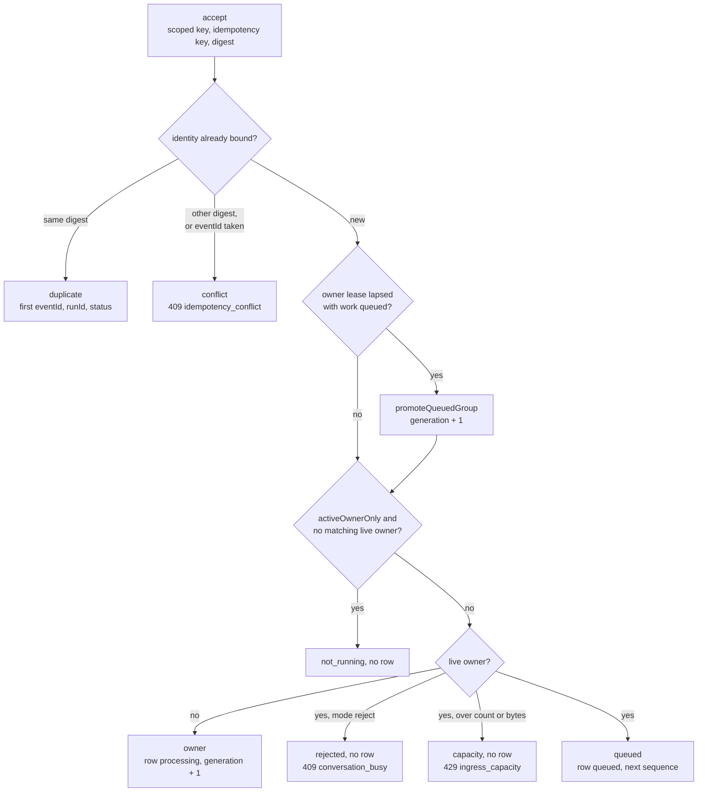
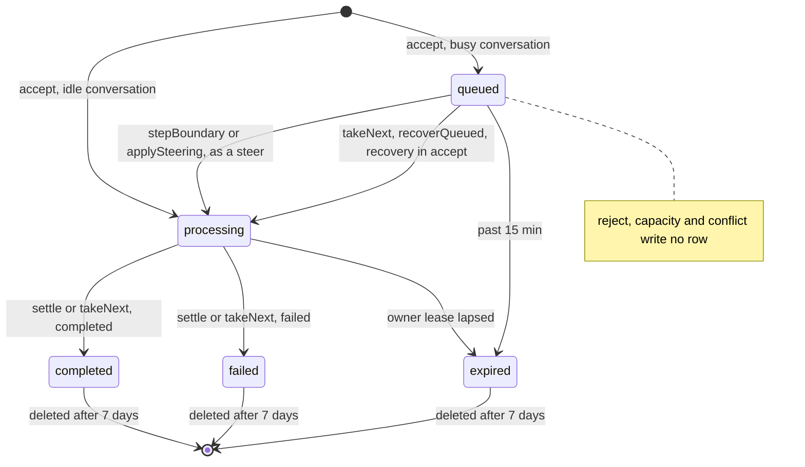
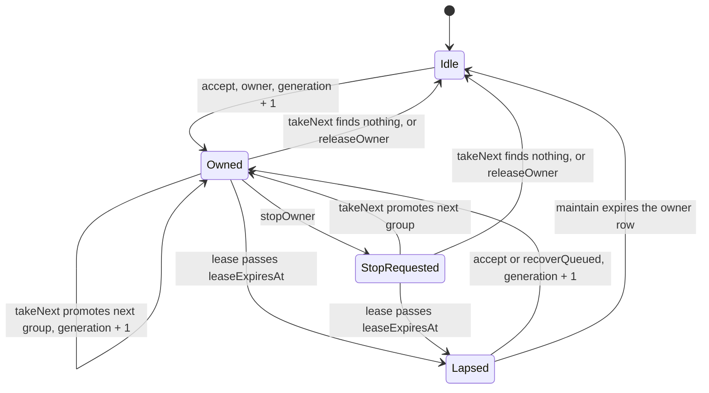
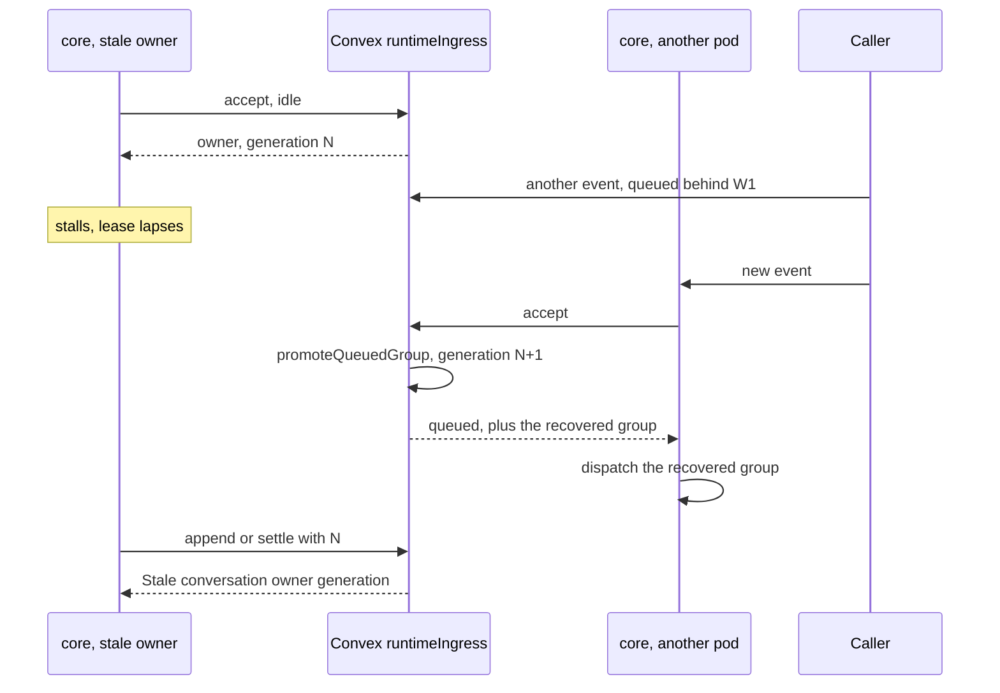
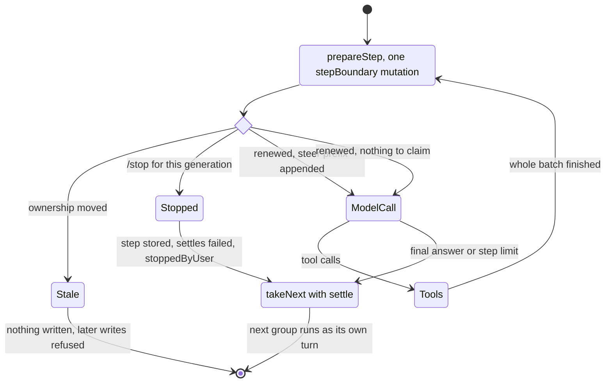
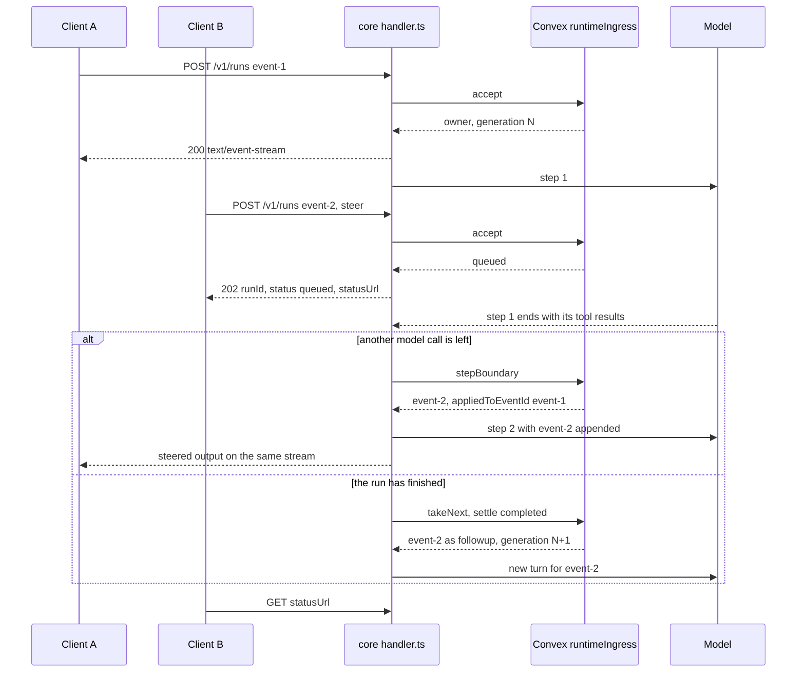
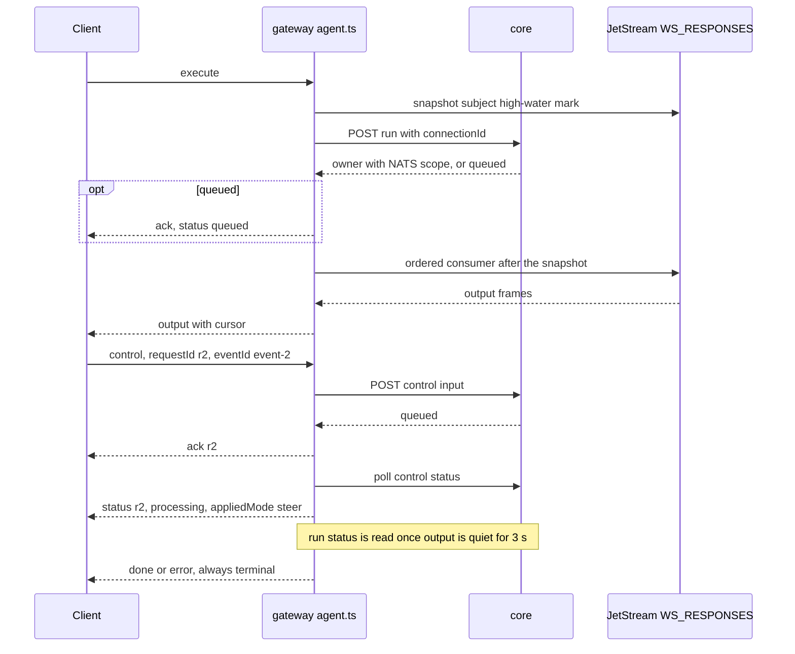
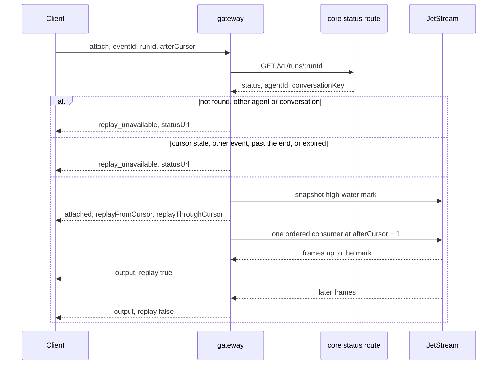

# Queue and steer

What happens to a message that arrives while its conversation is busy. One contract covers direct HTTP, async HTTP, WebSocket and channel ingress ([issue #71](https://github.com/beeblastco/broods/issues/71)). To use it, read [Conversations](../guides/conversations.md). This page is for changing it.

## Where it lives

| File                                | Owns                                                                                                                                       |
| ----------------------------------- | ------------------------------------------------------------------------------------------------------------------------------------------ |
| `packages/convex/runtimeIngress.ts` | The coordinator: `accept`, `stepBoundary`, `applySteering`, `takeNext`, `settle`, `stopOwner`, `maintain`, `recoverQueued`, `acquireClear` |
| `apps/core/src/harness/ingress.ts`  | Candidate and delivery types, limits and TTLs, admission helpers                                                                           |
| `apps/core/src/harness/harness.ts`  | `prepareStep`, where a steer joins a running turn                                                                                          |
| `apps/core/src/harness/handler.ts`  | HTTP, async and channel admission, `409` and `429`, the drain loops                                                                        |
| `apps/core/src/shared/commands.ts`  | `/steer`, `/queue`, `/stop` and `/cancel`, `/new` and `/clear`, `/compact`                                                                 |
| `apps/gateway/src/agent.ts`         | WebSocket `execute`, `control`, `attach` and `cancel`, `ack` and `status` relay                                                            |
| `verification/Broods/Ingress.lean`  | The envelope lifecycle model and its proofs. Change the mutations, update the model.                                                       |

## Modes

| Mode       | Busy conversation                                                               | Merged at drain                                    |
| ---------- | ------------------------------------------------------------------------------- | -------------------------------------------------- |
| `reject`   | Refused, nothing stored. `409 conversation_busy`.                               | n/a                                                |
| `followup` | One FIFO envelope, runs as its own turn                                         | no                                                 |
| `collect`  | Queued like `followup`                                                          | the contiguous `collect` run at the head, one turn |
| `steer`    | Offered at the next step boundary of the running turn, else runs as a follow-up | the contiguous `steer` run at the head, one turn   |

Every surface defaults to `steer`. Channel `/queue <text>` is a one-message `followup`. A merged group stops at a mode change and at a different sender (`delivery.identity.userId`), so in a channel a stranger's message waits for its own turn and its own policy check. A merged turn shows the model one input, but every envelope keeps its own status row and the application row lists `contributingEventIds` in order.

Steering is a boundary, not an abort. It never interrupts a model call or a running tool. The gateway `cancel` frame only detaches a reader. Hard cancellation would need its own ownership, cleanup and billing rules and is not part of this contract.

## Admission

`accept` decides in one Convex transaction. Authentication and parsing happen before it and store nothing.

```mermaid
flowchart TD
  In["accept<br/>scoped key, idempotency key, digest"] --> Id{"identity already bound?"}
  Id -->|"same digest"| Dup["duplicate<br/>first eventId, runId, status"]
  Id -->|"other digest,<br/>or eventId taken"| Conf["conflict<br/>409 idempotency_conflict"]
  Id -->|"new"| Lapsed{"owner lease lapsed<br/>with work queued?"}
  Lapsed -->|"yes"| Recover["promoteQueuedGroup<br/>generation + 1"]
  Lapsed -->|"no"| Late
  Recover --> Late{"activeOwnerOnly and<br/>no matching live owner?"}
  Late -->|"yes"| NR["not_running, no row"]
  Late -->|"no"| Busy{"live owner?"}
  Busy -->|"no"| Own["owner<br/>row processing, generation + 1"]
  Busy -->|"yes, mode reject"| Rej["rejected, no row<br/>409 conversation_busy"]
  Busy -->|"yes, over count or bytes"| Cap["capacity, no row<br/>429 ingress_capacity"]
  Busy -->|"yes"| Q["queued<br/>row queued, next sequence"]
```

- The idempotency identity is `(accountId, agentId, scopedConversationKey, idempotencyKey)`, with `idempotencyKey` defaulting to `eventId`. The binding lasts as long as the status row, seven days, so an expired envelope cannot run twice.
- A recovered group comes back with the outcome, and core dispatches it (`dispatchRecoveredIngress`) before handling the newcomer.
- `activeOwnerOnly` is how [subagent](subagents.md) controls refuse to land on a finished or different task.
- Each envelope stores its own execution context (resolved config ref, per-run `model` overrides, one-turn `system` messages), and the digest covers it, so a queued request never inherits the previous owner's overrides.
- `delivery` holds routing ids only: `http`, `async` and `websocket` carry the public event and conversation ids and, for runtime-key ingress, the `publicDeploymentIngress` marker. `channel` carries the channel name, sender `identity` and reply `source`. Never credentials, headers or message copies.

## Envelope lifecycle

One `runtimeIngressEnvelopes` row, with the mutation that moves it. `verification/Broods/Ingress.lean` proves terminal states absorb and every write is fenced.

```mermaid
stateDiagram-v2
  [*] --> processing: accept, idle conversation
  [*] --> queued: accept, busy conversation
  queued --> processing: stepBoundary or applySteering, as a steer
  queued --> processing: takeNext, recoverQueued, recovery in accept
  queued --> expired: past 15 min
  processing --> completed: settle or takeNext, completed
  processing --> failed: settle or takeNext, failed
  processing --> expired: owner lease lapsed
  completed --> [*]: deleted after 7 days
  failed --> [*]: deleted after 7 days
  expired --> [*]: deleted after 7 days
  note right of queued: reject, capacity and conflict write no row
```

The status carries `requestedMode`, `appliedMode` and `appliedToEventId`. A steer that missed its boundary reads `requestedMode: "steer"`, `appliedMode: "followup"`. An idle request records its own event id, and an idle steer records `appliedMode: "followup"`. A settle after `/stop` sets `stoppedByUser`. `accepted` and `applied` exist in the `IngressStatus` type only. The run status route overlays the async run record, so a poller can also see `awaiting_approval` or `awaiting_input`.

## Ownership and fencing

The `runtimeConversationCoordinators` row for a conversation:

```mermaid
stateDiagram-v2
  [*] --> Idle
  Idle --> Owned: accept, owner, generation + 1
  Owned --> Owned: stepBoundary renews lease, claims steers
  Owned --> StopRequested: stopOwner
  StopRequested --> Owned: takeNext promotes next group
  Owned --> Owned: takeNext promotes next group, generation + 1
  Owned --> Idle: takeNext finds nothing, or releaseOwner
  StopRequested --> Idle: takeNext finds nothing, or releaseOwner
  Owned --> Lapsed: lease passes leaseExpiresAt
  StopRequested --> Lapsed: lease passes leaseExpiresAt
  Lapsed --> Owned: accept or recoverQueued, generation + 1
  Lapsed --> Idle: maintain expires the owner row
```

`Lapsed` is not a stored field: the row still names an owner, but its `leaseExpiresAt` has passed. Every acquisition bumps `ownerGeneration`, which survives lease deletion. Dequeue, history writes, status changes, result commits and release all carry it, and Convex refuses them once it moved on. Core checks it again before a tool call, a stream publish or a channel reply. A successful fenced call proves ownership for `OWNER_CHECK_INTERVAL_MS` (2 s), so periodic checks inside that window skip the read. Frames the client acts on (`done`, `error`, approvals, questions, structured output, `waiting`) always check.

```mermaid
sequenceDiagram
  participant W1 as core, stale owner
  participant CX as Convex runtimeIngress
  participant W2 as core, another pod
  participant C as Caller

  W1->>CX: accept, idle
  CX-->>W1: owner, generation N
  C->>CX: another event, queued behind W1
  Note over W1: stalls, lease lapses
  C->>W2: new event
  W2->>CX: accept
  CX->>CX: promoteQueuedGroup, generation N+1
  CX-->>W2: queued, plus the recovered group
  W2->>W2: dispatch the recovered group
  W1->>CX: append or settle with N
  CX-->>W1: Stale conversation owner generation
```

Core also calls `recoverQueued` on boot and on a timer, for queues nobody writes to again. It pages through queued conversations one at a time, so a long queue behind a live owner hides no others.

## The step boundary

Steering enters at one point, the AI SDK `prepareStep` hook, after every tool result of the previous step exists and before the next model call.

```mermaid
stateDiagram-v2
  [*] --> Boundary
  Boundary: prepareStep, one stepBoundary mutation
  state verdict <<choice>>
  Boundary --> verdict
  verdict --> Stale: ownership moved
  verdict --> Stopped: /stop for this generation
  verdict --> ModelCall: renewed, steer prefix appended
  verdict --> ModelCall: renewed, nothing to claim
  ModelCall --> Tools: tool calls
  Tools --> Boundary: whole batch finished
  ModelCall --> Settle: final answer or step limit
  Stopped --> Settle: step stored, settles failed, stoppedByUser
  Stale --> [*]: nothing written, later writes refused
  Settle: takeNext with settle
  Settle --> [*]: next group runs as its own turn
```

`stepBoundary` stores the finished step's messages, checks for a stop, renews the lease once a tenth of the TTL has passed, and claims the steer prefix, all in one transaction. A claimed steer costs one more call, the append. Subagent results queued during the pass join at the same boundary ([subagents](subagents.md)). A steer still queued when the run has no model call left is promoted by `takeNext`, merged with contiguous steers from the same sender, as one `followup` under the next generation.

A `config.harness` run has no `prepareStep`. Its steers are applied before the turn starts, and on runtimes that take mid-turn input (Claude Code, Codex, OpenCode, Pi) `applySteering` with `textOnly` claims plain-text steers at each step start and hands them over with `experimental_steerTurn`. A steer with an image, file or system message waits for the next turn. DeepAgents, and any runtime that refuses mid-turn input, get steers at the next turn.

## HTTP

```mermaid
sequenceDiagram
  participant A as Client A
  participant B as Client B
  participant Core as core handler.ts
  participant CX as Convex runtimeIngress
  participant M as Model

  A->>Core: POST /v1/runs event-1
  Core->>CX: accept
  CX-->>Core: owner, generation N
  Core-->>A: 200 text/event-stream
  Core->>M: step 1
  B->>Core: POST /v1/runs event-2, steer
  Core->>CX: accept
  CX-->>Core: queued
  Core-->>B: 202 runId, status queued, statusUrl
  M-->>Core: step 1 ends with its tool results
  alt another model call is left
    Core->>CX: stepBoundary
    CX-->>Core: event-2, appliedToEventId event-1
    Core->>M: step 2 with event-2 appended
    Core-->>A: steered output on the same stream
  else the run has finished
    Core->>CX: takeNext, settle completed
    CX-->>Core: event-2 as followup, generation N+1
    Core->>M: new turn for event-2
  end
  B->>Core: GET statusUrl
```

A busy request never gets a second stream. `202` always means Convex stored the envelope, never just that a worker was scheduled. Async HTTP follows the same contract.

## WebSocket

The gateway delivers frames. Convex and core own admission and status, and JetStream output never counts as acceptance.

```mermaid
sequenceDiagram
  participant Cl as Client
  participant G as gateway agent.ts
  participant Core as core
  participant N as JetStream WS_RESPONSES

  Cl->>G: execute
  G->>N: snapshot subject high-water mark
  G->>Core: POST run with connectionId
  Core-->>G: owner with NATS scope, or queued
  opt queued
    G-->>Cl: ack, status queued
  end
  G->>N: ordered consumer after the snapshot
  N-->>G: output frames
  G-->>Cl: output with cursor
  Cl->>G: control, requestId r2, eventId event-2
  G->>Core: POST control input
  Core-->>G: queued
  G-->>Cl: ack r2
  G->>Core: poll control status
  G-->>Cl: status r2, processing, appliedMode steer
  Note over G,Core: run status is read once output is quiet for 3 s
  G-->>Cl: done or error, always terminal
```

- `execute` and `control` default to `steer`. `requestId` correlates frames on one socket, `idempotencyKey` joins the identity above, `eventId` ties the frame to the envelope.
- A socket holds at most 8 controls in flight (`MAX_CONTROLS_IN_FLIGHT`). One stays in flight until its status is terminal, so a steer holds its slot until the run it joined settles. One past the limit gets `status: "failed"`.
- A queued `execute` gets `ack` and stays open until its own run ends. The gateway reads status from core's in-cluster address, so a core that dies mid-run still ends the stream on its durable status.
- `agentId` becomes a NATS subject token, so the gateway refuses one with `.`, `*`, `>` or whitespace.
- Closing the socket or sending `cancel` only detaches the reader. The core run keeps going.

### Attach and replay

```mermaid
sequenceDiagram
  participant Cl as Client
  participant G as gateway
  participant Core as core status route
  participant N as JetStream

  Cl->>G: attach, eventId, runId, afterCursor
  G->>Core: GET /v1/runs/:runId
  Core-->>G: status, agentId, conversationKey
  alt not found, other agent or conversation
    G-->>Cl: replay_unavailable, statusUrl
  else cursor stale, other event, past the end, or expired
    G-->>Cl: replay_unavailable, statusUrl
  else
    G->>N: snapshot high-water mark
    G-->>Cl: attached, replayFromCursor, replayThroughCursor
    G->>N: one ordered consumer at afterCursor + 1
    N-->>G: frames up to the mark
    G-->>Cl: output, replay true
    N-->>G: later frames
    G-->>Cl: output, replay false
  end
```

- A cursor is `ws-responses:<generation>:<sequence>:<event-hash>`: the stream generation, the global `JsMsg.seq`, and a hash of the event, so it cannot resume another event's output. `afterCursor` is exclusive. The client advances it only after handling a whole `output` frame.
- Without `afterCursor`, replay starts at the event's earliest retained frame and `replayFromCursor` is omitted. The gateway filters the conversation subject by the event id in the NATS headers.
- JetStream keeps output for 3 minutes and 2,000 messages per subject. Nothing purges per event, since one subject holds several queued events. After that the Convex status, kept 7 days, is the only record. Attach never skips a gap silently.
- The SDK unwraps `output` frames for `onMessage` and `stream()`, and passes the raw envelope to `onOutput` for clients that store cursors.

## Channel commands

| Command                   | Effect                                                                                                                                                                          |
| ------------------------- | ------------------------------------------------------------------------------------------------------------------------------------------------------------------------------- |
| `/steer <text>`           | One `steer` envelope. On an idle conversation it starts a normal turn.                                                                                                          |
| `/queue <text>`           | One `followup` envelope. There is no sticky per-conversation mode.                                                                                                              |
| `/stop`, `/cancel`        | `stopOwner`: stop at the next boundary. The in-flight batch finishes. The owner settles `failed` with `stoppedByUser`, queued work moves on.                                    |
| `/new`, `/clear`          | `acquireClear`: refused while a turn or queued envelope exists, otherwise clears history under the lease.                                                                       |
| `/compact [instructions]` | One `followup` envelope that runs in place of a model turn and summarizes stored history. Any HTTP, async or WebSocket run whose whole input is `/compact` takes the same path. |

## Authorization

Authorization finishes before any envelope exists. An account key keeps its account and agent checks. A runtime key keeps its project, stage, endpoint and agent scope, and WebSocket `control` and `attach` inherit the socket's scope. Channel ingress keeps provider authentication. The server derives the scoped conversation key, so a raw conversation key, event id, status URL or NATS subject from another tenant reaches nothing. Status reads and retries repeat the checks.

## Subagents and status

Steer and stop reach one conversation owner and never spread into children the parent already started. A persistent child is steered only through ingress addressed to that child. With `subagent.stream: true`, a child publishes on `WS_RESPONSES` under its own account, agent and conversation, and its `taskId` is the attach `eventId`, so attach, control and cursors work unchanged. Who may attach to a child is in [subagents](subagents.md#attach-authorization).

## Limits

Constants in `apps/core/src/harness/ingress.ts`, sent to Convex on every admission. Change them together with the numbers in [Conversations](../guides/conversations.md).

| Limit                             | Value  | Constant                            |
| --------------------------------- | ------ | ----------------------------------- |
| Queued envelopes per conversation | 100    | `DEFAULT_INGRESS_MAX_COUNT`         |
| Queued event bytes                | 1 MiB  | `DEFAULT_INGRESS_MAX_BYTES`         |
| Queued envelope lifetime          | 15 min | `DEFAULT_INGRESS_TTL_MS`            |
| Conversation lease                | 15 min | `DEFAULT_CONVERSATION_LEASE_TTL_MS` |
| Status and idempotency records    | 7 days | `DEFAULT_INGRESS_STATUS_TTL_MS`     |

## Observability

Metrics, logs and traces may record account and agent ids, event ids, a hashed conversation identity, requested and applied mode, status, queue depth, event count, age, boundary latency, fallback reason and `appliedToEventId`. Never message content, tool inputs or results, system prompts, credentials, delivery secrets, idempotency keys or raw headers. Tests live in `packages/convex/tests/runtimeIngress.test.ts` and the core ingress tests.
