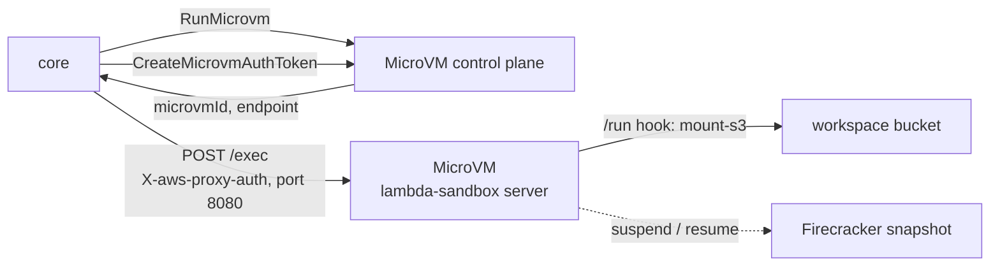
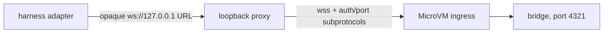

# Sandboxes

This page covers how core runs sandbox tools on each provider, how reservations and background jobs work, and what the MicroVM and workdir backends need from their images. Users configure sandboxes through the [sandboxes guide](../guides/sandboxes/index.md). Paths are relative to `apps/core/src/harness/sandbox/` unless noted.

## Executor model

Every sandbox tool (`bash`, `read`, `write`, `edit`, `glob`, `grep`) compiles to one `run` against the selected provider's executor. There is no per-runtime routing.

| Provider  | Executor              | Compute                                            |
| --------- | --------------------- | -------------------------------------------------- |
| `lambda`  | `microvm-executor.ts` | AWS Lambda MicroVM (Firecracker)                   |
| `sandbox` | `workdir-executor.ts` | Self-hosted workdir (Firecracker)                  |
| `daytona` | `daytona-executor.ts` | Daytona                                            |
| `e2b`     | `e2b-executor.ts`     | E2B                                                |
| `vercel`  | `vercel-executor.ts`  | `@vercel/sandbox`, loaded lazily                   |
| `machine` | `machine-executor.ts` | The `broods machine` daemon over `/v1/machines/ws` |

Limits come from `packages/convex/model/sandboxRules.ts`. `timeout` defaults to 30 s and caps at 600 s, set by `WORKSPACE_SANDBOX_MAX_TIMEOUT_SECONDS` and `WORKSPACE_SANDBOX_LAMBDA_MAX_TIMEOUT_SECONDS`. `outputLimitBytes` defaults to 64 KiB and caps at 256 KiB, set by `WORKSPACE_SANDBOX_MAX_OUTPUT_LIMIT_BYTES`. Every executor truncates stdout and stderr to it. `memoryLimit` caps at 8192 MB on `lambda`. A blocking call also stays inside the request budget, `REQUEST_TIMEOUT_BUDGET_MS` in `src/server.ts`, 10 minutes by default. Background jobs are bound by neither.

### Capability matrix

| Provider  | S3 workspace mount                                  | Persistent                       | Background jobs                                  |
| --------- | --------------------------------------------------- | -------------------------------- | ------------------------------------------------ |
| `sandbox` | `mount-s3`, per run                                 | native pause/resume and standby  | yes, with live logs and stop                     |
| `lambda`  | `mount-s3` inside the VM from the `/run` hook       | snapshot suspend/resume, 8 h max | yes, in the persistent VM                        |
| `daytona` | `mount-s3` when `options.mountAwsS3Buckets` is true | native, `autoStopInterval`       | yes, with live logs and stop                     |
| `e2b`     | not wired, rejected                                 | native pause/resume              | native launch and callback, no live logs or stop |
| `vercel`  | not wired, rejected                                 | named persistent sandbox         | yes, with live logs and stop                     |
| `machine` | not supported, rejected                             | no                               | no                                               |

`fallbackProvider` is handled in `runSandbox()` in `src/harness/tools/filesystem-utils.ts`. When the primary executor throws `SandboxCapacityError`, the same run goes to the fallback once and a warning is logged. The MicroVM executor throws it for `InsufficientCapacityException`, `ServiceQuotaExceededException`, `ThrottlingException` and `TooManyRequestsException`; workdir and Daytona throw it for their own admission refusals. `options` and `snapshot` belong to the primary and are dropped. Validation refuses a fallback equal to `provider`, a `machine` fallback, and any fallback on a `persistent` config.

Per-call `envVars` go through `mergeSandboxEnv()` in `utils.ts`, which drops the `RESERVED_SANDBOX_ENV_KEYS`. Those are `BASH_ENV`, `ENV`, `HOME`, `LD_AUDIT`, `LD_LIBRARY_PATH`, `LD_PRELOAD`, `LOGNAME`, `NODE_OPTIONS`, `PATH`, `PROMPT_COMMAND`, `PYTHONHOME`, `PYTHONPATH`, `PYTHONSTARTUP`, `SHELL`, `TMPDIR`, `USER` and the `__CB_*` job-callback slots. Account `config.envVars` is not filtered.

### CPU metering

`sandbox` and `lambda` execs report CPU, from the workdir cgroup on `sandbox` and from the image's `getrusage` report on `lambda`. `src/harness/harness.ts` sums it per task into `sandboxUsage` rows keyed by type, by role `agent` or `tool`, and by tool name, and puts the per-call figure on the `tool.call` span as `tool.compute.type` and `tool.compute.cpu_usec`. Hosted MCP calls use the same attributes with type `mcp-sandbox`. Other providers report no CPU.

## Lambda MicroVM

Each session runs in one AWS Lambda MicroVM, a Firecracker VM that boots the `lambda-sandbox` image from the sibling repo `../lambda-sanbdox` as a long-lived HTTP server with real `bash`, `python3`, Node 22, `uv` and `ripgrep`.



1. `RunMicrovm` starts a VM from the image and returns an HTTPS `endpoint` and `microvmId`.
2. Core mints a JWE with `CreateMicrovmAuthToken` and POSTs to `https://<endpoint>/exec` with `X-aws-proxy-auth` and `X-aws-proxy-port: 8080`. The proxy maps 443 to the image's 8080. The token lives 15 minutes; core caches it per VM and port at module scope and reuses it until 5 minutes before expiry.
3. The image answers request errors with HTTP 200 and an `ok: false` body. A proxy `502` or `503` means the VM is still restoring its snapshot, which takes 1 to 10 s, so the exec retries for up to 30 s. A `504` fails the call, because the guest may already be running the command.

A reserved VM's endpoint is cached for 3 minutes, so a repeat call skips the reservation lookup and `GetMicrovm`. A stale entry costs one failed POST inside a 1.2 s budget before the authoritative path takes over.

`RunMicrovm` gets `maximumDurationInSeconds` of the call timeout plus 60 s for an ephemeral VM, and `min(lifecycle.maxLifetimeSeconds, 28800)` for a persistent one. A persistent VM also gets an `idlePolicy`, with `maxIdleDurationSeconds` from `lifecycle.idleTimeoutSeconds`, `suspendedDurationSeconds` from `maxLifetimeSeconds` or 7 days, and auto-resume on.

The exec response is `{ ok, runtime, exit_code, timed_out, duration_ms, stdout, stderr }`.

### Lifecycle hooks

The image serves hooks on port 9000 under `/aws/lambda-microvms/runtime/v1/<hook>`. These are internal to the image, not account config.

| Hook                  | When            | Image does                                         |
| --------------------- | --------------- | -------------------------------------------------- |
| `/ready`, `/validate` | image build     | return 200                                         |
| `/run`                | each VM start   | `mount-s3` the workspace from the `runHookPayload` |
| `/resume`             | resume          | reconnect and refresh                              |
| `/suspend`            | before snapshot | `sync(2)`                                          |
| `/terminate`          | teardown        | unmount and final `sync`                           |

For a workspace run, core resolves the mount with `resolveS3Mount()` and puts `{ workspace: { namespace, root, mount: { bucket, prefix, region, endpoint, env } } }` in the `runHookPayload`. `env` holds one-hour STS credentials scoped to the prefix. The harness's own credentials never enter the VM. A persistent VM outlives that hour, so core pushes fresh credentials to `/workspace/credentials` in the guest every 30 minutes, where mountpoint-s3 re-reads them. After launch core checks the mount for up to 30 s, the `/run` hook's own budget. Stateless runs skip the mount and work in `/tmp`.

Mountpoint for S3 was chosen over S3 Files (`mount -t s3files`). S3 Files allows in-place edits and keeps credentials out of the VM, but needs a NAT gateway on restricted networks and adds per-GB cache and transfer charges. Mountpoint works on every network mode for the managed bucket and is the same code path workdir and Daytona use. S3 Files stays a possible opt-in for write-heavy or strict-isolation sandboxes.

### Image and build

AWS builds the image from an S3 zip of a Dockerfile and sources with `create-microvm-image` and `update-microvm-image`. It is not an ECR image Lambda or a custom runtime. A build is a versioned Firecracker snapshot of memory and disk. Core selects it by ARN through `MICROVM_IMAGE_IDENTIFIER`, optionally pinned with `MICROVM_IMAGE_VERSION`. A config's `snapshot` overrides the image. Image CI lives in `../lambda-sanbdox`.

`apps/core/sst.config.ts` provisions the prerequisites in the core region, except in `ap-southeast-1` where the feature is not available yet (`microvmPrereqsEnabled()`):

- the `MicrovmArtifacts` bucket, zips under `microvm-images/`,
- the `microvm-build` role for image builds and the `microvm-execution` role for `RunMicrovm`,
- the `/broods/<stage>/microvms` log group, 30 day retention,
- the NAT-less `SandboxNetwork` VPC with an S3 gateway endpoint scoped to the managed workspace bucket, and the `microvm-egress` connector whose ARN reaches core as `MICROVM_EGRESS_NETWORK_CONNECTOR_ARN`.

Account config cannot override the image, roles, log group or size catalog. Validation rejects `options.functionNames`, `options.executionRoleArn` and `options.logGroup`; core reads role and log group only from `MICROVM_EXECUTION_ROLE_ARN` and `MICROVM_LOG_GROUP_NAME`.

There is no API to promote a running VM into a new image, so the dashboard's Create snapshot action is offered only for workdir.

### Network

`allow-all` uses the default `INTERNET_EGRESS` with no connector. `deny-all` and `restricted` attach the shared egress connector. It has no NAT, so no internet, and the S3 gateway endpoint keeps the managed workspace bucket reachable. Link-local IMDS stays reachable too. The endpoint policy names only the managed bucket, so a bring-your-own bucket has no route under these modes. The boundary is deploy-time and shared, so it cannot take per-account allowlists, and a `lambda` config with `allowDomains` or `allowCidrs` is rejected. Without `MICROVM_EGRESS_NETWORK_CONNECTOR_ARN`, `deny-all` sandboxes fail to launch instead of falling back to open egress.

### Security notes

- Child processes start from `env_clear()`. That clears the environment, not IMDS. Code in the VM can read the MicroVM execution role from the metadata address on any network mode. The role is limited to writing CloudWatch logs in this stage's MicroVM group. It can create a stream named after another tenant, which is why the log forwarder labels only stream names core signed. See [observability](observability.md#sandbox-output).
- Persistent VMs attach the AWS-managed `HTTP_INGRESS` and `SHELL_INGRESS` connectors at `RunMicrovm`, the second for the dashboard terminal. Connectors cannot be added to a live VM, so instances reserved before the feature must be terminated and re-reserved; the terminal route fails with that hint.
- The in-VM mount directory uses the base namespace by design. Reservation, endpoint cache and S3 prefix key on the full namespace, so one VM holds one workspace.

## Harness adapters

An agent with `harness` set runs its adapter, Claude Code, Codex, Deep Agents, OpenCode or Pi, inside its first sandbox through `@broods/ai-sdk-sandbox`. `src/harness/ai-sdk-harness/sandbox.ts` picks the driver by provider, `microvm-harness-driver.ts` for `lambda` `workdir-harness-driver.ts` for `sandbox`. Both keep reservation ownership in their executor and use a version-scoped reservation key per harness type. The bridge listens on port 4321.

Neither provider has a native streaming process API, so `harness-shell-process.ts` runs the adapter as a detached, file-spooled process, and short shell calls poll its output in 64 KiB chunks every 25 ms, plus its status and cancellation.

On `lambda`, the upstream harness contract returns a URL, but MicroVM WebSocket ingress needs the AWS token and target port as subprotocols. `microvm-websocket-proxy.ts` resolves this with a loopback-only proxy:



Core mints the token just in time, scoped to the bridge port. It exists only in core and the upstream `Sec-WebSocket-Protocol` header, never in a URL, query string, error or log. The loopback route is a random 256-bit capability, pre-connect buffering is capped at 1 MiB and frames at 16 MiB, and upstreams must be `wss:` in the MicroVM hostname namespace. On workdir the bridge port is a workdir preview URL, so a config with no workdir API key cannot publish one.

Opt-in live tests, each cleaning up its own sandboxes and never touching shared Convex state:

```bash
cd apps/core
MICROVM_HARNESS_TEST=1 bun test tests/sandbox-microvm-harness.integration.test.ts
WORKDIR_TEST_URL=... WORKDIR_TEST_KEY=... bun test tests/workdir-harness.integration.test.ts
```

## Workdir (`sandbox` provider)

Core reaches the workdir control plane at `WORKDIR_URL` with `WORKDIR_API_KEY`, unless a config's `options` override them. Workdir images are built or imported through the workdir image API and referenced by name in `config.snapshot`. Sizes apply as create-time resources, with vCPU clamped to 0.5, 1, 2 or 4; explicit `options.cpu`, `memoryMb` and `diskGb` win. `options.docker: true` enables docker-in-sandbox and is accepted only on this provider.

Every command runs as `timeout -k 5 <seconds> bash -c ...`, because the workdir API has no exec timeout of its own.

A self-hosted workdir node needs, or every file tool fails with `mount-s3: not found`:

- the [`mountpoint-s3`](https://github.com/awslabs/mountpoint-s3) binary in the rootfs. Add it to `deploy/images/*/Dockerfile` in workdir and rebuild with `build-image.sh`.
- a guest kernel with `CONFIG_FUSE_FS=y`. The prebuilt Firecracker CI kernels up to v1.13 ship without FUSE, so build from the FC `microvm-kernel-ci` config with FUSE on and point `kernel_image` in the node's `config.toml` at it,
- `bash` and GNU coreutils `timeout` in the rootfs.

## Daytona, E2B and Vercel

Credentials fall back to deployment env when a config omits them. Daytona reads `DAYTONA_API_KEY`, `DAYTONA_ORGANIZATION_ID`, `DAYTONA_API_URL` and `DAYTONA_TARGET`. E2B reads `E2B_API_KEY`. Vercel reads `VERCEL_TOKEN`, `VERCEL_TEAM_ID` and `VERCEL_PROJECT_ID`.

- Daytona needs a snapshot with `mount-s3`. Build it with `bun run daytona:s3-snapshot`, from `apps/core/scripts/daytona-s3-snapshot.ts`, which reads `DAYTONA_S3_SNAPSHOT_BASE_IMAGE` and `DAYTONA_S3_SNAPSHOT_NAME`. The executor assumes the `sandbox-s3mount` role named by `SANDBOX_MOUNT_ROLE_ARN` and injects prefix-scoped credentials. Without the role it needs `AWS_ACCESS_KEY_ID` and `AWS_SECRET_ACCESS_KEY` in `envVars`. The skills bucket is no longer mounted. `load_skill` stages skills into the workspace, and a configured skills bucket only logs a warning. `lifecycle.idleTimeoutSeconds` maps to `autoStopInterval`, and `maxLifetimeSeconds`, or 7 days, to `autoDeleteInterval`, both in minutes. `network` maps to `networkBlockAll`, and domain allowlists are ignored with a warning.
- E2B maps `lifecycle.idleTimeoutSeconds` to the sandbox timeout with `lifecycle.onTimeout: "pause"`. Background jobs use `commands.run` with `background: true` and disconnect from the handle, so there are no `.fp-jobs` markers and no live logs or stop. E2B cannot enforce egress, so validation requires `allow-all`.
- Vercel creates a persistent sandbox with `Sandbox.create()` under a new name, a prefix derived from the reservation key plus a random generation, stored as the reservation's `externalId`. The generation keeps a sweeper that took a row from deleting a machine a new run just created under the same key. `onCreate` and `onResume` run as one script guarded by a `.fp-lifecycle-created` marker in the work dir, so `onCreate` runs the first time and `onResume` after that. The Vercel timeout counts from start, not last activity, so the executor maps `idleTimeoutSeconds` onto it and a persistent sandbox stops that long after each wake. `maxLifetimeSeconds` is not enforced.

## Machine

`machine-executor.ts` runs `bash`, the `computer` tool and local MCP servers on a user's computer through the WebSocket the `broods machine` daemon holds on `/v1/machines/ws`. Frames are defined once in `src/shared/machine-socket.ts`, which the CLI bundles, and the gateway relays them unchanged.

- Live daemons are held in memory in core, keyed per record, and mirrored to Convex for the dashboard Instances list. A heartbeat every 60 s marks a quiet computer offline.
- One daemon holds a record. A second is closed with `4423` and a reason naming the holder's host; `--force` replaces the holder, which gets `4409`. Bad credentials close with `4401`, an unknown sandbox name with `4404`, a malformed frame with `4400`.
- The socket accepts a login-derived stage ticket, the account secret, or a role session with `sandboxes:write` on the record. Never the stage runtime key.
- Frames are capped at 4 MiB. A computer action has 30 s, an MCP call 60 s, and a `bash` call its timeout plus 5 s.
- Validation rejects `persistent`, `size`, `snapshot`, `memoryLimit` and any network mode other than `allow-all`, and a machine cannot back a workspace.

## Reservations

A `persistent: true` config reserves one instance per workspace namespace, or per `accountId:agentId:sandboxId` when no workspace is mounted, or per `options.reservationKey` when set. Keys are hashed and account-scoped in `src/shared/workspaces.ts` before they reach the registry, so no key an author writes can name another account's machine.

- Every provider, workdir included, records the provider id in the Convex `sandboxReservations` table through `instance-store.ts`, and mirrors a row into `sandboxInstances` for the dashboard.
- `claimSandboxReservation` is conditional, so a concurrent first create has one winner. The loser deletes its duplicate and reconnects to the winner's id. Deletes are conditional on the expected id too, so a stale caller never removes a machine another run replaced.
- A reservation expires 7 days after its last use, per `SANDBOX_RESERVATION_TTL_SECONDS` in `packages/convex/runtime.ts`.
- `src/shared/sandbox-sweeper.ts` runs hourly (`SANDBOX_SWEEP_INTERVAL_SECONDS`), first after a random delay under 30 s, under a 5 minute lease so one replica sweeps at a time. It pages 100 reservations at a time through `releaseExpiredSandboxes()` in `src/shared/sandbox-cleanup.ts`, deleting the sandbox at the provider before the row.
- `lifecycle.maxLifetimeSeconds` is checked on acquire, never on a timer, so it cannot interrupt a running command.
- Deleting a workspace, sandbox config or account tears down its reservations (`releaseReservedSandboxes()`, `releaseSandboxConfigInstances()`).
- A persistent MicroVM counts against the account's allocated-memory quota while running or suspended. Too many persistent configs make every new launch fail with `ServiceQuotaExceededException`, and `fallbackProvider` cannot help because reserved sandboxes have none.

## Lifecycle actions and audit

The dashboard and the account API drive reserved sandboxes through `POST /v1/sandboxes/:id/<action>` in `src/accounts/handler.ts`, where the action is `suspend`, `resume`, `terminate`, `snapshot`, `refresh`, `exec` or `terminal`. Every action, successful or not, writes a `sandboxAuditEvents` row with the actor source (`dashboard`, `agent` or `service`), shown in the Instances sheet Activity list. `exec` takes at most 20,000 characters of code; the dashboard calls it with a 30 s timeout and a 64 KiB output cap.

## Background jobs

`bash { background: true }` on a reserved sandbox launches a detached session and returns a `statusId`, the model-facing name for the internal `resultId`.

- Launch mints the `resultId` and a per-job token, records the origin delivery, and writes a `runtimeAsyncToolResults` row in a sealed group.
- The job runs as a `setsid` session. `lambda`, workdir, Daytona and Vercel use the job-control scripts in `jobs.ts`, which keep `<id>.running` with the boot id, `.log`, `.exit` and `.pid` under `<workspace root>/.fp-jobs/<reservation key>` for status, log tail and stop. A sandbox runs at most 10 concurrent jobs, per `MAX_CONCURRENT_BACKGROUND_JOBS`.
- Each job stamps the launching boot id. A job killed by a recreate or scale-to-zero reports `failed`, so a stale `.running` marker is never read as running forever. A MicroVM resume keeps the boot id, so a resumed job is still running.
- On exit the job POSTs to `/v1/sandbox-jobs/:resultId/complete` with `x-job-token`, using the image's `python3`. The token rides the launch exec's environment as `__CB_TOKEN`, never the script text that shows in the process table. Unknown ids and bad tokens both return 404.
- Idle scale-down never pauses a sandbox with a running job.
- The callback needs egress to `PUBLIC_BASE_URL`. Without it the job still runs and polling still works.

## Terminal

Workdir and MicroVM instances get a real in-guest TTY in the dashboard. Other providers answer the terminal route as unsupported, and the dashboard keeps the bounded `exec` runner for them, at 30 s and 64 KiB per command.


The upstream URL and provider credential travel inside the AES-256-GCM sealed ticket (`src/shared/terminal-ticket.ts`), so the browser only holds an opaque short-lived token. Workdir tickets carry the org key as a bearer header. MicroVM tickets carry a `CreateMicrovmShellAuthToken` JWE, valid 30 minutes, in `X-aws-proxy-auth` for the VM's native shell. Opening a terminal resumes a suspended instance first.

## Snapshot status model

The dashboard maps each backend's states onto one status:

| Status         | AWS MicroVM                                             | workdir                |
| -------------- | ------------------------------------------------------- | ---------------------- |
| `pending`      | Version PENDING                                         | build queued           |
| `building`     | Version IN_PROGRESS, Image CREATING or UPDATING         | image building         |
| `pulling`      | base image pull                                         | base image pull        |
| `active`       | Version SUCCESSFUL and ACTIVE, Image CREATED or UPDATED | image ready            |
| `inactive`     | Version SUCCESSFUL and INACTIVE                         | soft-deleted or idle   |
| `error`        | CREATION_FAILED, or `get-microvm` stateReason           | runtime or build error |
| `build_failed` | Version FAILED                                          | build failed           |

## Security review notes (2026-09)

Findings from the host-boundary review, each closed in the harness:

- `options.docker` must be a boolean and is accepted on the `sandbox` provider only.
- `lambda` refuses `restricted` allowlists at validation instead of launching on the shared connector with a warning.
- Every executor merges env through one helper that drops reserved keys.
- A BYO bucket needs `storage.prefix`, and mount credentials are scoped to `bucket/prefix/*`.
- The background-job callback token rides the exec environment, not the script text.
- One MicroVM holds one workspace.
- Workspace `bash` rejects literal `..` traversal as a guardrail only. A shell expands `$'\x2e\x2e'` or `$(printf ..)` after the check. Containment comes from the VM and the prefix-scoped mount credentials. Writes to absolute paths outside the mount are refused, except `/tmp` and `/var/tmp`, unless the workspace runs on the agent's own persistent sandbox.
