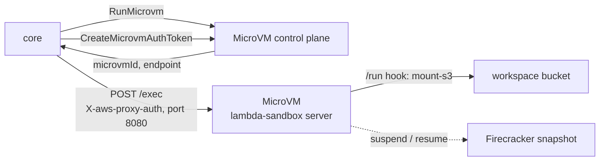
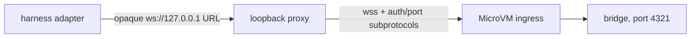
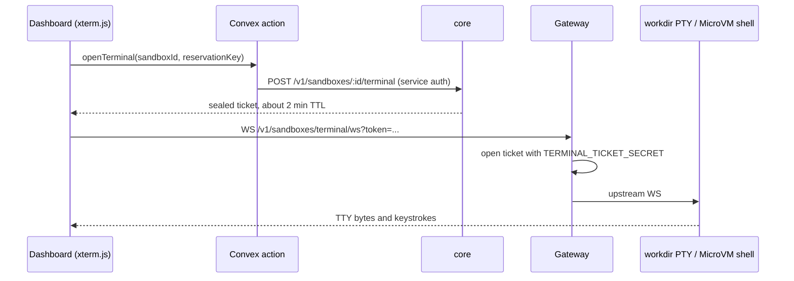

# Sandboxes

This page covers how core runs sandbox tools on each provider, how reservations and background jobs work, and what the MicroVM and workdir backends need from their images. Users configure sandboxes through the [sandboxes guide](../guides/sandboxes/index.md). Paths are relative to `apps/core/src/harness/sandbox/` unless noted.

## Executor model

Every sandbox tool (`bash`, `read`, `write`, `edit`, `glob`, `grep`) compiles to one `run` against the selected provider's executor. There is no per-runtime routing.

| Provider  | Executor              | Compute                                           |
| --------- | --------------------- | ------------------------------------------------- |
| `lambda`  | `microvm-executor.ts` | AWS Lambda MicroVM (Firecracker)                  |
| `sandbox` | `workdir-executor.ts` | Self-hosted workdir (Firecracker)                 |
| `daytona` | `daytona-executor.ts` | Daytona                                           |
| `e2b`     | `e2b-executor.ts`     | E2B                                               |
| `vercel`  | `vercel-executor.ts`  | `@vercel/sandbox`, loaded lazily                  |
| `machine` | `machine-executor.ts` | The `broods machine` daemon over `/v1/machine/ws` |

Output is truncated at 256 KB by the MicroVM image and again at `outputLimitBytes` in the harness. A blocking call is capped at the harness request budget, `REQUEST_TIMEOUT_BUDGET_MS` (10 minutes by default); background jobs are not.

### Capability matrix

| Provider  | S3 workspace mount                                  | Persistent                       | Background jobs                                  |
| --------- | --------------------------------------------------- | -------------------------------- | ------------------------------------------------ |
| `sandbox` | `mount-s3`, per run                                 | native pause/resume and standby  | yes, with live logs and stop                     |
| `lambda`  | `mount-s3` inside the VM from the `/run` hook       | snapshot suspend/resume, 8 h max | yes, in the persistent VM                        |
| `daytona` | `mount-s3` when `options.mountAwsS3Buckets` is true | native, `autoStopInterval`       | yes, with live logs and stop                     |
| `e2b`     | not wired, rejected                                 | native pause/resume              | native launch and callback, no live logs or stop |
| `vercel`  | not wired, rejected                                 | named persistent sandbox         | yes, with live logs and stop                     |
| `machine` | not supported, rejected                             | no                               | no                                               |

`fallbackProvider` on an ephemeral config hands a run to a second provider once when the primary refuses the create for capacity (MicroVM memory quota, workdir admission ceiling, no Daytona runner). The switch is logged. `options` and `snapshot` belong to the primary and do not carry over.

Per-call `envVars` go through one merge helper and cannot set `PATH`, `HOME`, `LD_*`, `NODE_OPTIONS`, `PYTHONPATH`, `BASH_ENV`, `ENV`, `PROMPT_COMMAND` or the job-callback slots.

## Lambda MicroVM

Each session runs in one AWS Lambda MicroVM: a Firecracker VM that boots the `lambda-sandbox` image (sibling repo `../lambda-sanbdox`) as a long-lived HTTP server with real `bash`, `python3`, Node 22, `uv` and `ripgrep`.



1. `RunMicrovm` starts a VM from the image and returns an HTTPS `endpoint` and `microvmId`.
2. Core mints a JWE with `CreateMicrovmAuthToken` and POSTs to `https://<endpoint>/exec` with `X-aws-proxy-auth` and `X-aws-proxy-port: 8080`. The proxy maps 443 to the image's 8080. The token lives at most 15 minutes; core caches it per VM and port and reuses it until 5 minutes before expiry.
3. The image answers request errors with HTTP 200 and an `ok: false` body. A proxy `502` or `503` means the VM is still restoring its snapshot (1 to 10 s), so the first exec retries. A `504` fails the call, because the guest may already be running the command.

The exec response is `{ ok, runtime, exit_code, timed_out, duration_ms, stdout, stderr }`.

### Lifecycle hooks

The image serves hooks on port 9000 under `/aws/lambda-microvms/runtime/v1/<hook>`. These are internal to the image, not account config.

| Hook                  | When            | Image does                                         |
| --------------------- | --------------- | -------------------------------------------------- |
| `/ready`, `/validate` | image build     | return 200                                         |
| `/run`                | each VM start   | `mount-s3` the workspace from the `runHookPayload` |
| `/resume`             | resume          | reconnect and refresh                              |
| `/suspend`            | before snapshot | `sync(2)`                                          |
| `/terminate`          | teardown        | unmount and final `sync`                           |

For a workspace run, core assumes a namespace-scoped STS role and puts the credentials and bucket/prefix in the `runHookPayload`, at most 16 KB. The harness's own credentials never enter the VM. Stateless runs skip the mount and work in `/tmp`.

Mountpoint for S3 was chosen over S3 Files (`mount -t s3files`). S3 Files allows in-place edits and keeps credentials out of the VM, but needs a NAT gateway on restricted networks and adds per-GB cache and transfer charges. Mountpoint works on every network mode for the managed bucket and is the same code path workdir and Daytona use. S3 Files stays a possible opt-in for write-heavy or strict-isolation sandboxes.

### Image and build

AWS builds the image from an S3 zip (Dockerfile plus sources) with `create-microvm-image` and `update-microvm-image`. It is not an ECR image Lambda or a custom runtime. A build is a versioned Firecracker snapshot of memory and disk. Core selects it by ARN through `MICROVM_IMAGE_IDENTIFIER`. Image CI lives in `../lambda-sanbdox`.

SST provisions the build prerequisites in the core region: `microvmArtifactsBucketName` (zips under `microvm-images/`), `microvmBuildRoleArn` for image builds, and `microvmExecutionRoleArn` for `RunMicrovm` and CloudWatch logs. They are skipped in `ap-southeast-1`, where the feature is not available yet.

Account config cannot override the image, roles, log group or size catalog. Validation rejects `options.functionNames`, `options.executionRoleArn` and `options.logGroup`; core reads role and log group only from `MICROVM_EXECUTION_ROLE_ARN` and `MICROVM_LOG_GROUP_NAME`.

There is no API to promote a running VM into a new image, so the dashboard's Create snapshot action is offered only for workdir.

### Network

`allow-all` uses the default `INTERNET_EGRESS`. `deny-all` and `restricted` attach a shared VPC egress connector with no internet: the managed workspace bucket and link-local IMDS stay reachable. The boundary is deploy-time and shared, so it cannot take per-account allowlists, and a `lambda` config with `allowDomains` or `allowCidrs` is rejected. If the deployment has no connector, `deny-all` sandboxes fail to launch instead of falling back to open egress.

### Security notes

- Child processes start from `env_clear()`. That clears the environment, not IMDS: code in the VM can read the MicroVM execution role from the metadata address on any network mode. The role is limited to writing CloudWatch logs in this stage's MicroVM group. It can create a stream named after another tenant, which is why the log forwarder labels only stream names core signed. See [observability](observability.md#sandbox-output).
- Persistent VMs attach the AWS-managed `SHELL_INGRESS` connector at `RunMicrovm` for the dashboard terminal. Connectors cannot be added to a live VM, so instances reserved before the feature must be terminated and re-reserved; the API answers `409` with that hint.
- The in-VM mount directory uses the base namespace by design. Reservation, endpoint cache and S3 prefix key on the full namespace, so one VM holds one workspace.

### Harness bridge

The MicroVM harness driver (`microvm-harness-driver.ts`) can bootstrap the Claude Code and Codex harness bridges inside a persistent VM. The upstream contract returns a URL, but MicroVM WebSocket ingress needs the AWS token and target port as subprotocols. `microvm-websocket-proxy.ts` resolves this with a loopback-only proxy:



Core mints the token just in time, scoped to the bridge port. It exists only in core and the upstream `Sec-WebSocket-Protocol` header, never in a URL, query string, error or log. The loopback route is a random 256-bit capability, pre-connect buffering is bounded, and production upstreams must be `wss:` in the MicroVM hostname namespace.

The opt-in live test uses synthetic reservations and an in-memory store, terminates every VM in `finally`, and never touches shared Convex state:

```bash
cd apps/core
MICROVM_HARNESS_TEST=1 bun test tests/sandbox-microvm-harness.integration.test.ts
```

## Workdir (`sandbox` provider)

Workdir images are built or imported through the workdir image API and referenced by name in `config.snapshot`. Sizes apply as create-time resources, with vCPU clamped to 0.5, 1, 2 or 4; explicit `options.cpu`, `memoryMb` and `diskGb` win. `options.docker: true` enables docker-in-sandbox and is accepted only on this provider.

Every command runs as `timeout -k 5 <seconds> bash -c ...`, because the workdir API has no exec timeout of its own.

A self-hosted workdir node needs, or every file tool fails with `mount-s3: not found`:

- the [`mountpoint-s3`](https://github.com/awslabs/mountpoint-s3) binary in the rootfs (add it to `deploy/images/*/Dockerfile` in workdir and rebuild with `build-image.sh`),
- a guest kernel with `CONFIG_FUSE_FS=y`. The prebuilt Firecracker CI kernels up to v1.13 ship without FUSE, so build from the FC `microvm-kernel-ci` config with FUSE on and point `kernel_image` in the node's `config.toml` at it,
- `bash` and GNU coreutils `timeout` in the rootfs.

## Daytona, E2B and Vercel

- Daytona needs a snapshot with `mount-s3`. Build it with `bun run daytona:s3-snapshot`, which reads `DAYTONA_S3_SNAPSHOT_BASE_IMAGE` and `DAYTONA_S3_SNAPSHOT_NAME`. The executor assumes the `sandbox-s3mount` role (`SANDBOX_MOUNT_ROLE_ARN`) and injects prefix-scoped credentials. Without the role, supply `AWS_ACCESS_KEY_ID` and `AWS_SECRET_ACCESS_KEY` through `envVars`. With `SKILLS_BUCKET_NAME` set it also mounts the skills bucket read-only at `options.skillsMountPath` (default `/mnt/skills`). `network` maps to `networkBlockAll`; domain allowlists are ignored with a warning.
- E2B maps `lifecycle.idleTimeoutSeconds` to the sandbox timeout with `onTimeout: "pause"`. Background jobs use `commands.run` with `background: true` and disconnect from the handle, so there are no `.fp-jobs` markers and no live logs or stop. E2B cannot enforce egress, so validation requires `allow-all`.
- Vercel passes `onCreate` and `onResume` to `Sandbox.getOrCreate()` and `Sandbox.get()` natively. Its timeout counts from start, not last activity, so the executor maps `idleTimeoutSeconds` onto it and a persistent sandbox stops that long after each wake. `maxLifetimeSeconds` is not enforced. Persistent sandboxes are named by `reservationKey ?? namespace`.

## Reservations

A `persistent: true` config reserves one instance per workspace namespace, or per `accountId:agentId:sandboxId` when no workspace is mounted, or per `options.reservationKey` when set. Keys are account-scoped before they reach the registry, so no key an author writes can name another account's machine.

- Workdir reserves a deterministic sandbox per namespace. Lambda, Daytona, E2B and Vercel store the provider id in Convex (`sandboxReservations`, `sandboxInstances`) through `instance-store.ts`.
- A conditional claim resolves a concurrent first create: the loser discards its duplicate and reconnects to the winner.
- Reservation rows carry a 7 day idle TTL refreshed on every use. `src/shared/sandbox-sweeper.ts` deletes expired sandboxes at the provider and drops the row.
- `lifecycle.maxLifetimeSeconds` is checked on acquire, never on a timer, so it cannot interrupt a running command.
- Deleting a workspace or account tears down its reservations explicitly (`src/shared/sandbox-cleanup.ts`).
- A persistent MicroVM counts against the account's allocated-memory quota while running or suspended. Too many persistent configs make every new launch fail with `ServiceQuotaExceededException`.

## Background jobs

`bash { background: true }` on a reserved sandbox launches a detached session and returns a `statusId`, the model-facing name for the internal `resultId`.

- Launch mints the `resultId` and a per-job token, records the origin delivery, and writes a `runtimeAsyncToolResults` row in a sealed group.
- The job runs as a `setsid` session. Workdir, Daytona and Vercel use the harness job-control scripts in `jobs.ts`, which write `.fp-jobs` marker files for status, log tail and stop. At most 10 concurrent jobs per sandbox on those providers.
- Each job stamps the launching boot id. A job killed by a recreate or scale-to-zero reports `failed`, so a stale `.running` marker is never read as running forever. A MicroVM resume keeps the boot id, so a resumed job is still running.
- On exit the job POSTs to `/v1/sandbox-jobs/{resultId}/complete` with `x-job-token`. The token rides the launch exec's environment, never the script text that shows in the process table. Unknown ids and bad tokens both return 404.
- Idle scale-down never pauses a sandbox with a running job.
- The callback needs egress to `PUBLIC_BASE_URL`. Without it the job still runs and polling still works.

## Terminal

Workdir and MicroVM instances get a real in-guest TTY in the dashboard. Third-party providers keep a bounded command runner (30 s and 64 KiB per command).



The upstream URL and provider credential travel inside the AES-256-GCM sealed ticket, so the browser only holds an opaque short-lived token. Workdir tickets carry the org key as a bearer header. MicroVM tickets carry a `CreateMicrovmShellAuthToken` JWE in `X-aws-proxy-auth` for the VM's native shell. Connecting resumes a suspended instance.

## Snapshot status model

The dashboard maps each backend's states onto one status:

| Status         | AWS MicroVM                                             | workdir                |
| -------------- | ------------------------------------------------------- | ---------------------- |
| `pending`      | Version PENDING                                         | build queued           |
| `building`     | Version IN_PROGRESS, Image CREATING or UPDATING         | image building         |
| `pulling`      | base image pull                                         | base image pull        |
| `active`       | Version SUCCESSFUL and ACTIVE, Image CREATED or UPDATED | image ready            |
| `inactive`     | Version SUCCESSFUL and INACTIVE                         | soft-deleted or idle   |
| `error`        | CREATION_FAILED, or `get-microvm` stateReason           | runtime or build error |
| `build_failed` | Version FAILED                                          | build failed           |

## Security review notes (2026-09)

Findings from the host-boundary review, each closed in the harness:

- `options.docker` is validated: boolean, `sandbox` provider only.
- `lambda` refuses `restricted` allowlists at validation instead of launching on the shared connector with a warning.
- Every executor merges env through one helper that drops reserved keys.
- A BYO bucket needs `storage.prefix`, and mount credentials are scoped to `bucket/prefix/*`.
- The background-job callback token rides the exec environment, not the script text.
- One MicroVM holds one workspace.
- Workspace `bash` rejects literal `..` traversal as a guardrail only. A shell expands `$'\x2e\x2e'` or `$(printf ..)` after the check. Containment comes from the VM and the prefix-scoped mount credentials. Writes to absolute paths outside the mount are refused, except `/tmp` and `/var/tmp`, unless the workspace runs on the agent's own persistent sandbox.
