# Sandboxes

How core runs sandbox tools on each provider. Users configure sandboxes through the [sandboxes guide](../guides/sandboxes/index.md). Paths are relative to `apps/core/src/harness/sandbox/` unless noted.

## Where sandboxes run

Core owns every call. Providers only run commands; reservations, ids, env and limits stay in core and Convex.

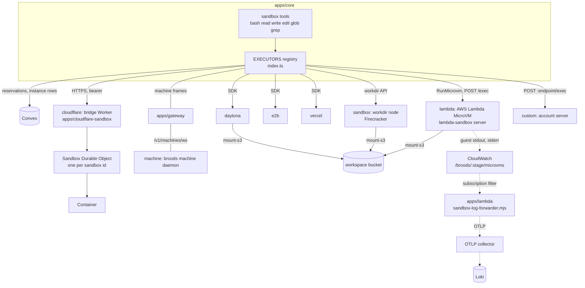
```mermaid
flowchart TB
  subgraph core["apps/core"]
    TOOLS["sandbox tools<br/>bash read write edit glob grep"] --> REG["EXECUTORS registry<br/>index.ts"]
  end
  REG -->|"reservations, instance rows"| CVX[("Convex")]

  REG -->|"RunMicrovm, POST /exec"| MVM["lambda: AWS Lambda MicroVM<br/>lambda-sandbox server"]
  REG -->|"workdir API"| WD["sandbox: workdir node<br/>Firecracker"]
  REG -->|"SDK"| DAY["daytona"]
  REG -->|"SDK"| E2B["e2b"]
  REG -->|"SDK"| VER["vercel"]
  REG -->|"HTTPS, bearer"| CFW["cloudflare: bridge Worker<br/>apps/cloudflare-sandbox"]
  CFW --> DO["Sandbox Durable Object<br/>one per sandbox id"] --> CT["Container"]
  REG ---|"machine frames"| GW["apps/gateway"]
  GW ---|"/v1/machines/ws"| DAEMON["machine: broods machine daemon"]
  REG -->|"POST :endpoint/exec"| CUSTOM["custom: account server"]

  MVM -->|"mount-s3"| S3[("workspace bucket")]
  WD -->|"mount-s3"| S3
  DAY -->|"mount-s3"| S3

  MVM -.->|"guest stdout, stderr"| CW["CloudWatch<br/>/broods/:stage/microvms"]
  CW -.->|"subscription filter"| FWD["apps/lambda<br/>sandbox-log-forwarder.mjs"]
  FWD -.->|"OTLP"| COL["OTLP collector"] -.-> LOKI[("Loki")]
```

- `lambda` is the provider string for the AWS Lambda MicroVM backend. Its guest image is the Rust server in the sibling repo `../lambda-sanbdox`.
- Only MicroVM guest logs take the CloudWatch path. The forwarder labels a line by tenant only when core signed its stream name, see [observability](observability.md#sandbox-output).

## Executor model

Every sandbox tool compiles to one `run` on the provider's executor. `index.ts` maps provider name to factory in `EXECUTORS`. The names are `SANDBOX_PROVIDERS` in `packages/convex/model/sandboxProviders.ts`, the one list the Convex validator, core and the SDK derive from.

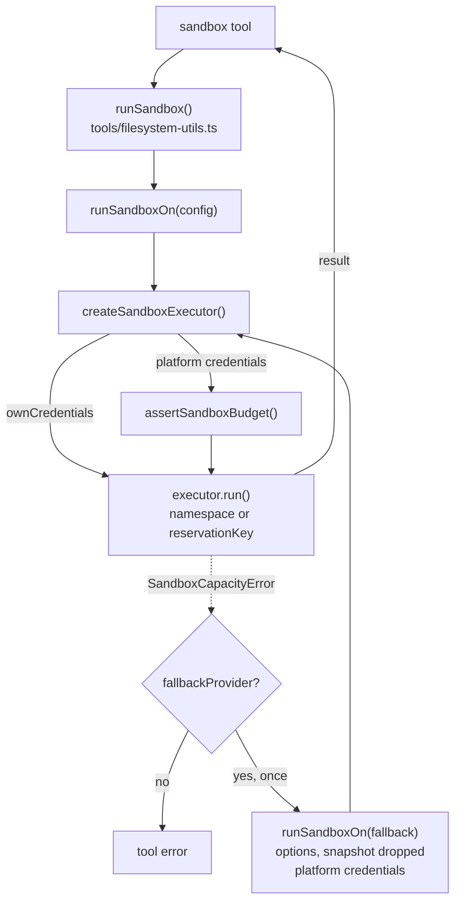
```mermaid
flowchart TD
  T["sandbox tool"] --> RS["runSandbox()<br/>tools/filesystem-utils.ts"]
  RS --> ON["runSandboxOn(config)"]
  ON --> CE["createSandboxExecutor()"]
  CE -->|"platform credentials"| BUD["assertSandboxBudget()"]
  CE -->|"ownCredentials"| EX
  BUD --> EX["executor.run()<br/>namespace or reservationKey"]
  EX -->|"result"| T
  EX -.->|"SandboxCapacityError"| FB{"fallbackProvider?"}
  FB -->|"no"| ERR["tool error"]
  FB -->|"yes, once"| ON2["runSandboxOn(fallback)<br/>options, snapshot dropped<br/>platform credentials"]
  ON2 --> CE
```

- The budget wrapper also guards `runBackground`, `resume`, `postReserved` and `prewarm`.
- `SandboxCapacityError` comes only from a refused create: MicroVM `InsufficientCapacityException`, `ServiceQuotaExceededException`, `ThrottlingException`, `TooManyRequestsException`, and the workdir and Daytona admission refusals. Validation refuses a fallback on a `persistent` config, a fallback equal to `provider`, and a `machine` or `custom` fallback.
- Limits come from `packages/convex/model/sandboxRules.ts`: `timeout` 30 s default, capped by `WORKSPACE_SANDBOX_MAX_TIMEOUT_SECONDS` and `WORKSPACE_SANDBOX_LAMBDA_MAX_TIMEOUT_SECONDS`; output capped by `WORKSPACE_SANDBOX_MAX_OUTPUT_LIMIT_BYTES`. A blocking call also stays inside `REQUEST_TIMEOUT_BUDGET_MS` in `src/server.ts`. Background jobs are bound by neither.
- Env: `mergeSandboxEnv()` in `utils.ts` lays per-call `envVars` over the account's, drops `RESERVED_SANDBOX_ENV_KEYS` (`PATH`, `HOME`, `LD_PRELOAD`, `NODE_OPTIONS`, the `__CB_*` callback slots and the rest) from the per-call layer, drops the `BROODS_*` identity names from both, then sets the run's `BROODS_*` identity on top.
- The exec wire contract a MicroVM image, the Cloudflare bridge and a `custom` server share is `SandboxExecRequest` / `SandboxExecResponse` in `src/shared/domain/sandbox-config.ts`. `parseExecResponse` and `execRunResult` in `utils.ts` read it.
- CPU: `sandbox` reports CPU from the workdir cgroup and `lambda` from the image's `getrusage`. `src/harness/harness.ts` sums it into `sandboxUsage` rows and puts `tool.compute.type` and `tool.compute.cpu_usec` on the `tool.call` span. Other providers report none.

### Contribute a provider

1. Write `src/harness/sandbox/<name>-executor.ts` implementing `SandboxExecutor` from `types.ts`. Only `run` is required; reservation, jobs and lifecycle methods are feature-detected.
2. Add the name to `SANDBOX_PROVIDERS`. Add it to `STATELESS_SANDBOX_PROVIDERS` too if Broods never reserves it.
3. Import the file in `index.ts` and add it to `EXECUTORS`. The build fails until you do, and the import is what pulls the file into the compiled binary.
4. Put option validation in `sandboxRules.ts`, and say in `runsOnOwnCredentials` (`src/shared/workspaces.ts`) whether the platform meters it.

### Capability matrix

| Provider     | Executor                 | Workspace mount                     | Persistent                         | Suspend, resume | Snapshot | Background jobs                    |
| ------------ | ------------------------ | ----------------------------------- | ---------------------------------- | --------------- | -------- | ---------------------------------- |
| `lambda`     | `microvm-executor.ts`    | `mount-s3` in the `/run` hook       | idle suspend, 8 h max              | yes             | yes      | yes, logs and stop                 |
| `sandbox`    | `workdir-executor.ts`    | `mount-s3` per run                  | native pause, resume, standby      | yes             | yes      | yes, logs and stop                 |
| `daytona`    | `daytona-executor.ts`    | `mount-s3` with `mountAwsS3Buckets` | native `autoStopInterval`          | no              | yes      | yes, logs and stop                 |
| `e2b`        | `e2b-executor.ts`        | rejected                            | native pause on timeout            | no              | yes      | launch and callback, no logs, stop |
| `vercel`     | `vercel-executor.ts`     | rejected                            | named sandbox                      | no              | yes      | yes, logs and stop                 |
| `cloudflare` | `cloudflare-executor.ts` | rejected                            | same Container while warm, no disk | no              | no       | no                                 |
| `machine`    | `machine-executor.ts`    | rejected                            | no                                 | no              | no       | no                                 |
| `custom`     | `http-executor.ts`       | rejected                            | no                                 | no              | no       | no                                 |

Background jobs need a persistent workspace sandbox, so a provider that cannot mount a workspace cannot run one.

## Stateless call

A run with `persistent` unset creates a machine, runs once and tears it down. A platform-paid one gets an ephemeral `sandboxInstances` row for the length of the call, which is what the meter bills.

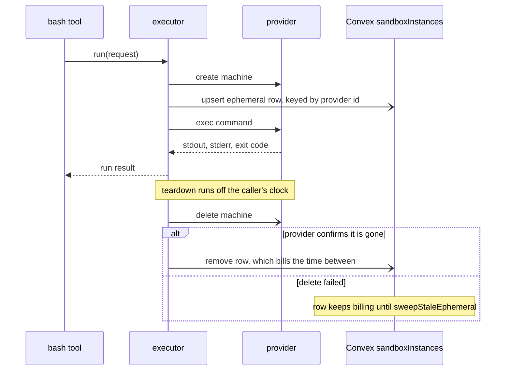
```mermaid
sequenceDiagram
  participant B as bash tool
  participant E as executor
  participant P as provider
  participant DB as Convex sandboxInstances

  B->>E: run(request)
  E->>P: create machine
  E-)DB: upsert ephemeral row, keyed by provider id
  E->>P: exec command
  P-->>E: stdout, stderr, exit code
  E-->>B: run result
  Note over E,P: teardown runs off the caller's clock
  E-)P: delete machine
  alt provider confirms it is gone
    E-)DB: remove row, which bills the time between
  else delete failed
    Note over DB: row keeps billing until sweepStaleEphemeral
  end
```

- Every write for one sandbox id goes through `queueMirrorWrite`, so a removal never lands before the upsert.
- Cloudflare writes the row before the exec that starts the Container, so its start is billed too. The MicroVM writes it after `RunMicrovm` returns.
- A lost row is billed no further than the provider's max call timeout plus 2 minutes (`ephemeralSandboxMaxMs` in `packages/convex/model/usageMeter.ts`). `sweepStaleEphemeral`, started by the hourly `accrueRecent` cron, deletes it after that.
- A sandbox on the account's own credentials gets no row. No lifecycle verb accepts an ephemeral row.

## Reservations

A `persistent: true` config reserves one machine per key. Keys are hashed and account-scoped in `src/shared/workspaces.ts`, so no key an author writes can name another account's machine.

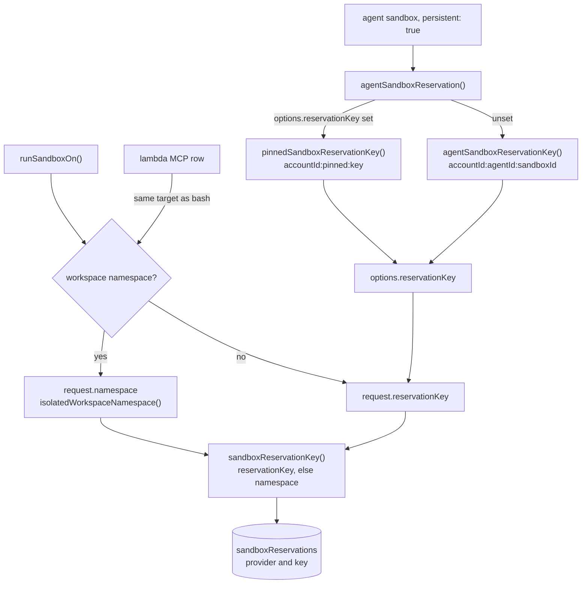
```mermaid
flowchart TD
  CFG["agent sandbox, persistent: true"] --> AR["agentSandboxReservation()"]
  AR -->|"options.reservationKey set"| PIN["pinnedSandboxReservationKey()<br/>accountId:pinned:key"]
  AR -->|"unset"| AGT["agentSandboxReservationKey()<br/>accountId:agentId:sandboxId"]
  PIN --> OPT["options.reservationKey"]
  AGT --> OPT
  RUN["runSandboxOn()"] --> HAS{"workspace namespace?"}
  HAS -->|"yes"| NSK["request.namespace<br/>isolatedWorkspaceNamespace()"]
  HAS -->|"no"| RK["request.reservationKey"]
  OPT --> RK
  MCPR["lambda MCP row"] -->|"same target as bash"| HAS
  NSK --> KEY["sandboxReservationKey()<br/>reservationKey, else namespace"]
  RK --> KEY
  KEY --> REG[("sandboxReservations<br/>provider and key")]
```

Harness adapters pick their own key, see [harness adapters](#harness-adapters).

### First call and resume

The MicroVM executor (`#acquire` in `microvm-executor.ts`) as the example. Workdir, Daytona, E2B, Vercel and Cloudflare follow the same claim and race rules.

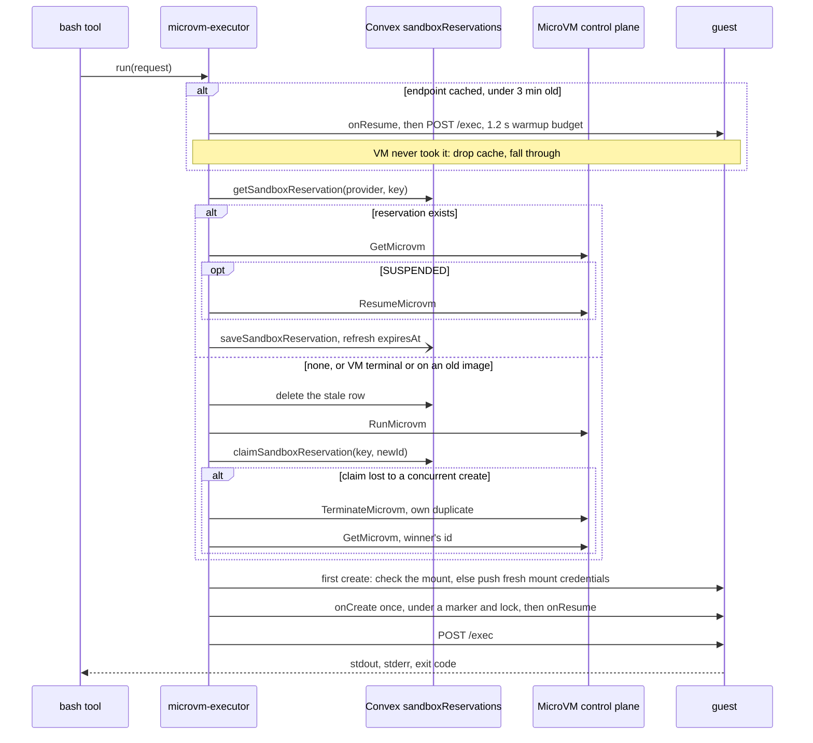
```mermaid
sequenceDiagram
  participant T as bash tool
  participant E as microvm-executor
  participant R as Convex sandboxReservations
  participant CP as MicroVM control plane
  participant VM as guest

  T->>E: run(request)
  alt endpoint cached, under 3 min old
    E->>VM: onResume, then POST /exec, 1.2 s warmup budget
    Note over E,VM: VM never took it: drop cache, fall through
  end
  E->>R: getSandboxReservation(provider, key)
  alt reservation exists
    E->>CP: GetMicrovm
    opt SUSPENDED
      E->>CP: ResumeMicrovm
    end
    E-)R: saveSandboxReservation, refresh expiresAt
  else none, or VM terminal or on an old image
    E->>R: delete the stale row
    E->>CP: RunMicrovm
    E->>R: claimSandboxReservation(key, newId)
    alt claim lost to a concurrent create
      E->>CP: TerminateMicrovm, own duplicate
      E->>CP: GetMicrovm, winner's id
    end
  end
  E->>VM: first create: check the mount, else push fresh mount credentials
  E->>VM: onCreate once, under a marker and lock, then onResume
  E->>VM: POST /exec
  VM-->>T: stdout, stderr, exit code
```

- A slow resume or a control-plane error propagates. Only a VM unknown to the provider or terminal is replaced, since replacing a suspended one leaks it against the account's memory quota.
- A persistent MicroVM counts against that quota while running or suspended. Too many make every launch fail with `ServiceQuotaExceededException`, and a reserved sandbox has no fallback.
- `lifecycle.maxLifetimeSeconds` is checked on acquire, never on a timer, so it cannot interrupt a running command.

### Reservation row

`sandboxReservations` is the authoritative key to provider id map. Every write is conditional on the expected id, so a stale caller never removes a machine another run replaced.

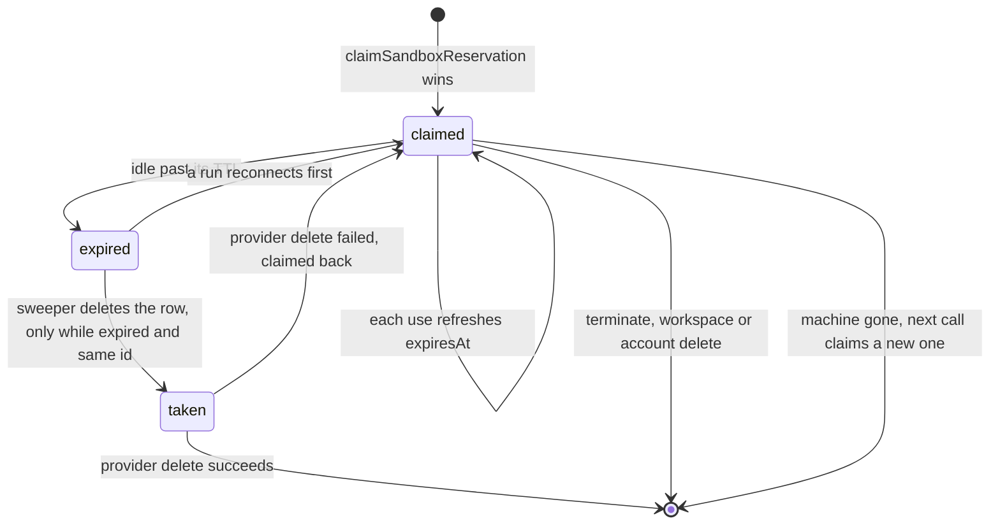
```mermaid
stateDiagram-v2
  [*] --> claimed: claimSandboxReservation wins
  claimed --> claimed: each use refreshes expiresAt
  claimed --> expired: idle past its TTL
  expired --> claimed: a run reconnects first
  expired --> taken: sweeper deletes the row, only while expired and same id
  taken --> [*]: provider delete succeeds
  taken --> claimed: provider delete failed, claimed back
  claimed --> [*]: terminate, workspace or account delete
  claimed --> [*]: machine gone, next call claims a new one
```

- TTL: 7 days after last use (`SANDBOX_RESERVATION_TTL_SECONDS` in `packages/convex/runtime.ts`), one day for a harness reservation on a conversation key (`ISOLATED_SANDBOX_RELEASE_SECONDS` in `src/harness/harness.ts`).
- `src/shared/sandbox-sweeper.ts` runs hourly (`SANDBOX_SWEEP_INTERVAL_SECONDS`) under a 5 minute lease, first after a random delay under 30 s. It pages expired reservations, plus mirror rows no reservation names, through `releaseExpiredSandboxes()` in `src/shared/sandbox-cleanup.ts`.
- A release goes through the provider that reserved the machine, not the config's current one, so switching provider or turning `persistent` off strands nothing. It uses the reserving config's credentials when the instance row says `ownCredentials`, else the platform's.
- A sandbox config that still holds an instance is kept when its CLI resource or canvas card goes, so an instance never names a missing config.

### Instance row

`sandboxInstances` mirrors each reserved machine for the dashboard. Core writes the steady states. The dashboard's suspend action parks the row in `suspending` (`packages/convex/sandbox/public.ts`).

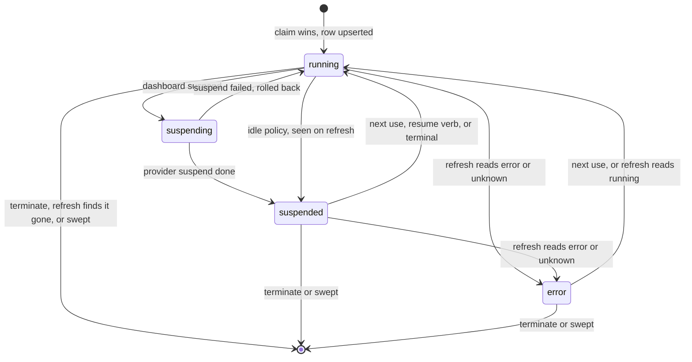
```mermaid
stateDiagram-v2
  [*] --> running: claim wins, row upserted
  running --> suspending: dashboard suspend
  suspending --> suspended: provider suspend done
  suspending --> running: suspend failed, rolled back
  running --> suspended: idle policy, seen on refresh
  suspended --> running: next use, resume verb, or terminal
  running --> error: refresh reads error or unknown
  suspended --> error: refresh reads error or unknown
  error --> running: next use, or refresh reads running
  running --> [*]: terminate, refresh finds it gone, or swept
  suspended --> [*]: terminate or swept
  error --> [*]: terminate or swept
```

- Refresh removes the row when the provider reports nothing or `terminating`, so `terminating` is never stored by core.
- `specs` is what the meter bills. `specsVerified` is set only when the size is real: a provider report, or the size Broods sets on workdir, MicroVM and Cloudflare. Without it the dashboard shows `?`.

## Lifecycle actions and terminal

The dashboard and the account API call `POST /v1/sandboxes/:id/:action` in `src/accounts/handler.ts`, with action `suspend`, `resume`, `terminate`, `snapshot`, `refresh`, `exec` or `terminal`. Each writes a `sandboxAuditEvents` row with the actor source. `exec` takes at most 20,000 characters; the dashboard calls it with a 30 s timeout and 64 KiB output.

`terminal` opens a real TTY on `sandbox`, `lambda` and `cloudflare`. Other providers answer it as unsupported and the dashboard keeps the bounded `exec` runner.

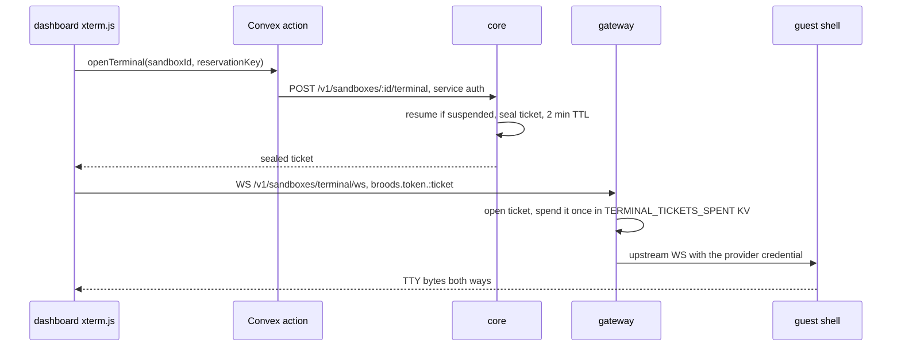
```mermaid
sequenceDiagram
  participant D as dashboard xterm.js
  participant C as Convex action
  participant Core as core
  participant G as gateway
  participant P as guest shell

  D->>C: openTerminal(sandboxId, reservationKey)
  C->>Core: POST /v1/sandboxes/:id/terminal, service auth
  Core->>Core: resume if suspended, seal ticket, 2 min TTL
  Core-->>D: sealed ticket
  D->>G: WS /v1/sandboxes/terminal/ws, broods.token.:ticket
  G->>G: open ticket, spend it once in TERMINAL_TICKETS_SPENT KV
  G->>P: upstream WS with the provider credential
  P-->>D: TTY bytes both ways
```

| Provider     | Upstream                                | Credential in the ticket                                      |
| ------------ | --------------------------------------- | ------------------------------------------------------------- |
| `sandbox`    | workdir PTY WebSocket                   | workdir API key as bearer                                     |
| `lambda`     | MicroVM native shell (`SHELL_INGRESS`)  | `CreateMicrovmShellAuthToken` JWE, 30 min, `X-aws-proxy-auth` |
| `cloudflare` | bridge `GET /v1/sandboxes/:id/terminal` | bridge API key as bearer                                      |

- The ticket is AES-256-GCM sealed (`src/shared/terminal-ticket.ts`), so the browser holds only an opaque token. If NATS is down the upgrade answers 502 rather than skip the spend check.
- A Cloudflare Container that is not running answers 409; a command has to start it first.

## Background jobs

`bash { background: true }` on a persistent workspace sandbox launches a detached `setsid` session and returns a `statusId`, the model-facing name of the `runtimeAsyncToolResults` row's `resultId`.

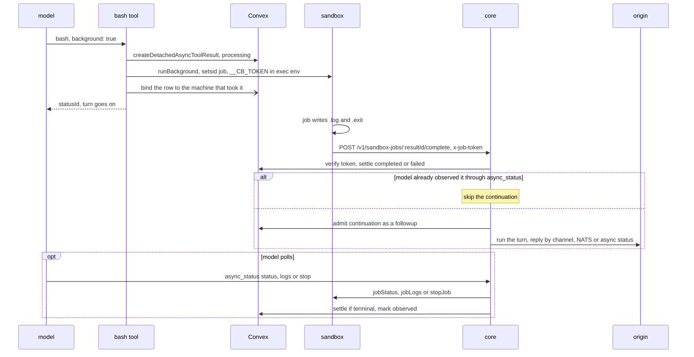
```mermaid
sequenceDiagram
  participant M as model
  participant B as bash tool
  participant CVX as Convex
  participant S as sandbox
  participant Core as core
  participant O as origin

  M->>B: bash, background: true
  B->>CVX: createDetachedAsyncToolResult, processing
  B->>S: runBackground, setsid job, __CB_TOKEN in exec env
  B-)CVX: bind the row to the machine that took it
  B-->>M: statusId, turn goes on
  S->>S: job writes .log and .exit
  S->>Core: POST /v1/sandbox-jobs/:resultId/complete, x-job-token
  Core->>CVX: verify token, settle completed or failed
  alt model already observed it through async_status
    Note over Core: skip the continuation
  else
    Core->>CVX: admit continuation as a followup
    Core->>O: run the turn, reply by channel, NATS or async status
  end
  opt model polls
    M->>Core: async_status status, logs or stop
    Core->>S: jobStatus, jobLogs or stopJob
    Core->>CVX: settle if terminal, mark observed
  end
```

The row exists before the launch, so a fast job's callback never arrives first. A settled row answers 409; an unknown id or wrong token answers 404, so the route is not a token oracle. The continuation queues behind any live turn, see [queue and steer](queue-and-steer.md).

The job as `statusScript` in `jobs.ts` reads its marker files:

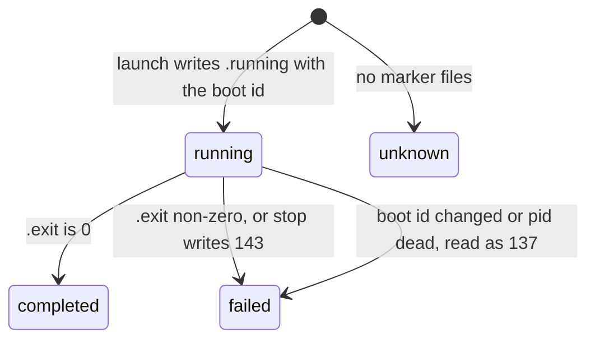
```mermaid
stateDiagram-v2
  [*] --> running: launch writes .running with the boot id
  running --> completed: .exit is 0
  running --> failed: .exit non-zero, or stop writes 143
  running --> failed: boot id changed or pid dead, read as 137
  [*] --> unknown: no marker files
```

The `runtimeAsyncToolResults` row the model sees through `async_status`:

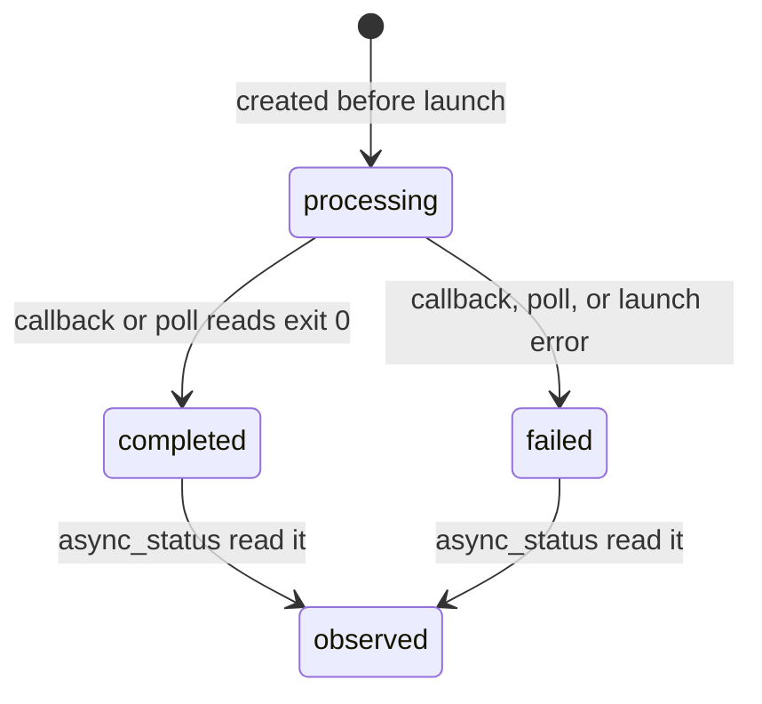
```mermaid
stateDiagram-v2
  [*] --> processing: created before launch
  processing --> completed: callback or poll reads exit 0
  processing --> failed: callback, poll, or launch error
  completed --> observed: async_status read it
  failed --> observed: async_status read it
```

- `lambda`, workdir, Daytona and Vercel keep markers under `<workspace root>/.fp-jobs/<reservation key>`, at most 10 running (`MAX_CONCURRENT_BACKGROUND_JOBS`). E2B uses its native `background: true` command, so it has callback delivery but no logs or stop.
- A MicroVM resume keeps the boot id, so a resumed job still reads as running. A recreate or scale-to-zero changes it, so the job reads as failed.
- The callback runs the image's `python3` and needs egress to `PUBLIC_BASE_URL`. Without it the job still runs and polling still works. Idle scale-down never pauses a sandbox with a running job.

## Lambda MicroVM

Each reserved key runs in one AWS Lambda MicroVM, a Firecracker VM booting the `lambda-sandbox` image from `../lambda-sanbdox` as a long-lived HTTP server with `bash`, `python3`, Node 22, `uv` and `ripgrep`.

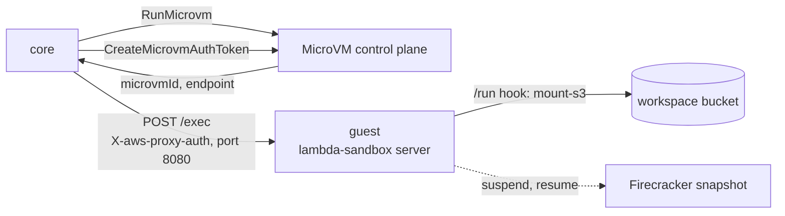
```mermaid
flowchart LR
  Core["core"] -->|"RunMicrovm"| CP["MicroVM control plane"]
  CP -->|"microvmId, endpoint"| Core
  Core -->|"CreateMicrovmAuthToken"| CP
  Core -->|"POST /exec<br/>X-aws-proxy-auth, port 8080"| VM["guest<br/>lambda-sandbox server"]
  VM -->|"/run hook: mount-s3"| S3[("workspace bucket")]
  VM -.->|"suspend, resume"| Snap["Firecracker snapshot"]
```

- The auth token lives 15 minutes; core caches it per VM and port and reuses it until 5 minutes before expiry.
- A proxy 502 or 503 means the VM is still restoring its snapshot, so `/exec` retries for up to 30 s. A 504 fails the call, because the guest may already be running the command. Request errors come back as HTTP 200 with `ok: false`.
- `maximumDurationInSeconds` is the call timeout plus 60 s for an ephemeral VM, and `min(maxLifetimeSeconds, 28800)` for a persistent one. A persistent VM also gets an `idlePolicy` with auto-resume.
- The exec answer carries `burst`, vCPU-seconds and GiB-seconds above baseline since boot. Core forwards its growth to `sandbox.instances.recordBurst`, and the meter bills it at baseline rates.

A persistent VM as the control plane sees it. Core never extends a VM; a terminal one is replaced on the next call, so local disk and processes are gone while the workspace stays.

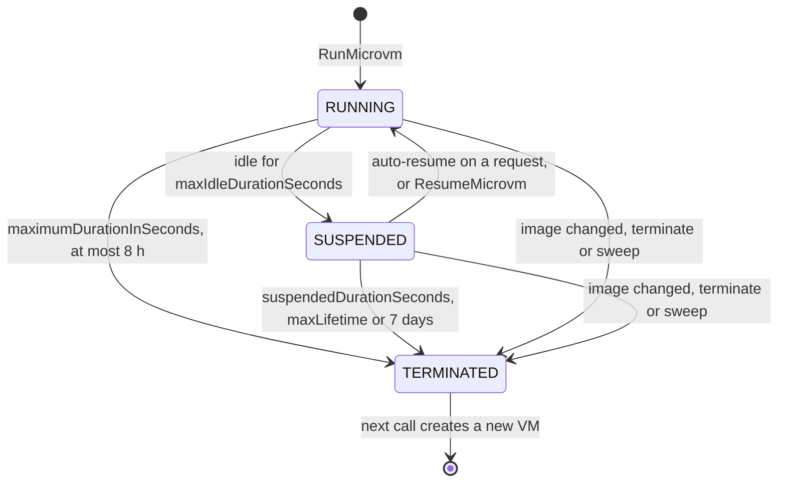
```mermaid
stateDiagram-v2
  [*] --> RUNNING: RunMicrovm
  RUNNING --> SUSPENDED: idle for maxIdleDurationSeconds
  SUSPENDED --> RUNNING: auto-resume on a request, or ResumeMicrovm
  RUNNING --> TERMINATED: maximumDurationInSeconds, at most 8 h
  SUSPENDED --> TERMINATED: suspendedDurationSeconds, maxLifetime or 7 days
  RUNNING --> TERMINATED: image changed, terminate or sweep
  SUSPENDED --> TERMINATED: image changed, terminate or sweep
  TERMINATED --> [*]: next call creates a new VM
```

### Lifecycle hooks and the workspace mount

The image serves hooks on port 9000 under `/aws/lambda-microvms/runtime/v1/:hook`. They are internal to the image, not account config.

| Hook                  | When            | Image does                                         |
| --------------------- | --------------- | -------------------------------------------------- |
| `/ready`, `/validate` | image build     | return 200                                         |
| `/run`                | each VM start   | `mount-s3` the workspace from the `runHookPayload` |
| `/resume`             | resume          | reconnect and refresh                              |
| `/suspend`            | before snapshot | `sync(2)`                                          |
| `/terminate`          | teardown        | unmount and final `sync`                           |

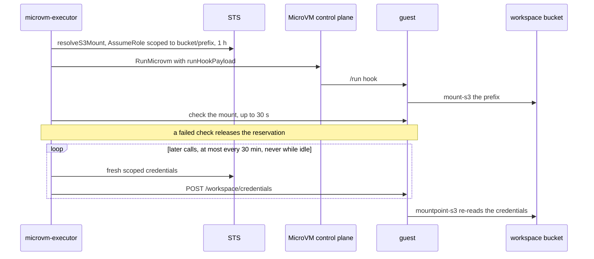
```mermaid
sequenceDiagram
  participant E as microvm-executor
  participant STS as STS
  participant CP as MicroVM control plane
  participant VM as guest
  participant S3 as workspace bucket

  E->>STS: resolveS3Mount, AssumeRole scoped to bucket/prefix, 1 h
  E->>CP: RunMicrovm with runHookPayload
  CP->>VM: /run hook
  VM->>S3: mount-s3 the prefix
  E->>VM: check the mount, up to 30 s
  Note over E,VM: a failed check releases the reservation
  loop later calls, at most every 30 min, never while idle
    E->>STS: fresh scoped credentials
    E->>VM: POST /workspace/credentials
  end
  VM->>S3: mountpoint-s3 re-reads the credentials
```

The harness's own credentials never enter the VM. Stateless runs skip the mount and work in `/tmp`. Mountpoint for S3 was chosen over S3 Files because it works on every network mode without a NAT gateway and is the same path workdir and Daytona use.

### Image, snapshots and network

- The image is built by AWS from an S3 zip of a Dockerfile (`create-microvm-image`), a versioned Firecracker snapshot of memory and disk. Core selects it with `MICROVM_IMAGE_IDENTIFIER`, optionally pinned by `MICROVM_IMAGE_VERSION`. `image: "obscura"` boots the `-obscura` variant next to the default. A `snapshot` ARN must be in the same account and region, and a `broods-snapshot-*` one boots only for the account with a `sandboxSnapshots` row for it.
- `apps/core/sst.config.ts` provisions the `MicrovmArtifacts` bucket, the `microvm-build` and `microvm-execution` roles, the `/broods/:stage/microvms` log group with its forwarder subscription, and the NAT-less `SandboxNetwork` VPC with the `microvm-egress` connector. Not in `ap-southeast-1` (`microvmPrereqsEnabled()`).
- Network: `allow-all` uses default internet egress. `deny-all` and `restricted` attach the shared egress connector, which has no NAT; its S3 gateway endpoint reaches only the managed workspace bucket. Per-account allowlists cannot apply, so `allowDomains` and `allowCidrs` are rejected. Without `MICROVM_EGRESS_NETWORK_CONNECTOR_ARN`, `deny-all` fails to launch.

There is no API to promote a running VM into an image, so a snapshot is an image build:

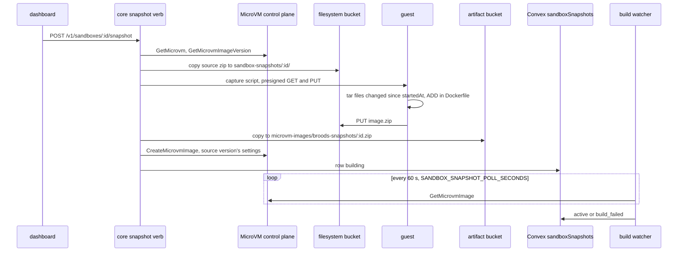
```mermaid
sequenceDiagram
  participant D as dashboard
  participant C as core snapshot verb
  participant CP as MicroVM control plane
  participant FS as filesystem bucket
  participant VM as guest
  participant A as artifact bucket
  participant DB as Convex sandboxSnapshots
  participant W as build watcher

  D->>C: POST /v1/sandboxes/:id/snapshot
  C->>CP: GetMicrovm, GetMicrovmImageVersion
  C->>FS: copy source zip to sandbox-snapshots/:id/
  C->>VM: capture script, presigned GET and PUT
  VM->>VM: tar files changed since startedAt, ADD in Dockerfile
  VM->>FS: PUT image.zip
  C->>A: copy to microvm-images/broods-snapshots/:id.zip
  C->>CP: CreateMicrovmImage, source version's settings
  C->>DB: row building
  loop every 60 s, SANDBOX_SNAPSHOT_POLL_SECONDS
    W->>CP: GetMicrovmImage
  end
  W->>DB: active or build_failed
```

The capture script is `microvm-snapshot.ts`. It skips `/proc`, `/sys`, `/dev`, `/run`, `/tmp`, `/mnt` and the workspace root, refuses a clock more than 5 minutes off, changes over 4 GiB and a zip over 5 GiB. The tar only adds files, so a file deleted in the VM comes back from the source image.

### Isolation levels

A workspace's `isolation` picks the namespace a run mounts (`isolatedWorkspaceNamespace` in `src/shared/workspaces.ts`). The full namespace is the reservation key, the S3 prefix and the STS session policy scope, so each level is its own VM, prefix and credentials.

| Level          | Namespace                             | Who shares it                                   |
| -------------- | ------------------------------------- | ----------------------------------------------- |
| unset          | `fs-<hash(account:workspace)>`        | every agent and conversation on the workspace   |
| `conversation` | `<base>/<alias>/<hash(conversation)>` | one conversation, per the channel's `partition` |
| `agent`        | `<base>/agent/<hash(agentId)>`        | one agent, across all of its conversations      |

- The folders stay under the base prefix, so a workspace purge, the storage meter and teardown by namespace prefix still cover them.
- `assumeScopedMountCredentials` in `s3-mount.ts` names the session `fp-sandbox-mount-<agentId>` on an `agent` mount and `fp-sandbox-mount-acct-<accountId>` on any other, since those outlive one run. On the platform `sandbox-s3mount` role it also sets `SourceIdentity` and the `broods:account` and `broods:agent` session tags, so CloudTrail ties each S3 call to an account and, on an `agent` mount, an agent. A bring-your-own role gets the session name only.
- The in-VM mount directory uses the base namespace by design; reservation, endpoint cache and prefix key on the full one, so one VM holds one workspace folder.

### Security notes

- Child processes start from `env_clear()`, which does not hide IMDS. Code in the VM can read the execution role, which can only write logs in this stage's MicroVM group. It can create a stream named after another tenant, which is why the forwarder labels only stream names core signed.
- Persistent VMs attach `HTTP_INGRESS` and `SHELL_INGRESS` at `RunMicrovm`. Connectors cannot be added to a live VM, so an instance reserved before them must be terminated and re-reserved; the terminal route says so.

## Workdir (`sandbox` provider)

- Core reaches the workdir control plane at `WORKDIR_URL` with `WORKDIR_API_KEY`, unless `options.workdirUrl` and `options.apiKey` override them. Images are referenced by name in `config.snapshot`.
- Sizes are create-time resources with vCPU clamped to 0.5, 1, 2 or 4; explicit `options.cpu`, `memoryMb` and `diskGb` win. `options.docker: true` enables docker-in-sandbox, on this provider only.
- Every command runs as `timeout -k 5 :seconds bash -c ...`, since the workdir API has no exec timeout.
- A self-hosted node needs the `mountpoint-s3` binary in the rootfs, a guest kernel with `CONFIG_FUSE_FS=y` (the prebuilt Firecracker CI kernels up to v1.13 ship without it), and `bash` plus GNU `timeout`. Without them every file tool fails with `mount-s3: not found`.

## Daytona, E2B and Vercel

Credentials fall back to deployment env: `DAYTONA_API_KEY`, `DAYTONA_ORGANIZATION_ID`, `DAYTONA_API_URL`, `DAYTONA_TARGET`; `E2B_API_KEY`; `VERCEL_TOKEN`, `VERCEL_TEAM_ID`, `VERCEL_PROJECT_ID`.

| Topic             | Daytona                                                | E2B                                       | Vercel                                                 |
| ----------------- | ------------------------------------------------------ | ----------------------------------------- | ------------------------------------------------------ |
| Idle              | `idleTimeoutSeconds` to `autoStopInterval`             | sandbox timeout with `onTimeout: "pause"` | timeout counts from start, reset each wake             |
| Max lifetime      | `maxLifetimeSeconds` or 7 days to `autoDeleteInterval` | not mapped                                | not enforced                                           |
| `config.snapshot` | `snapshot`                                             | `template`                                | `source` snapshot for `snap_`, else image              |
| Snapshot verb     | `sandbox.createSnapshot`, `broods-<uuid>` name         | `Sandbox.createSnapshot`                  | `sandbox.snapshot({ expiration: 0 })`                  |
| Network           | `networkBlockAll`, domain lists ignored with a warning | `allow-all` only                          | `allow-all`, `deny-all`, or domain and CIDR allowlists |

- Daytona needs a snapshot with `mount-s3`, built by `bun run daytona:s3-snapshot` (`apps/core/scripts/daytona-s3-snapshot.ts`). It assumes the `sandbox-s3mount` role (`SANDBOX_MOUNT_ROLE_ARN`) for prefix-scoped credentials.
- Each snapshot verb finishes before it answers, so the row is `active` at once.
- Vercel names a persistent sandbox with a prefix from the reservation key plus a random generation, stored as `externalId`, so a sweeper deleting an old machine never hits a new one under the same key. `onCreate` and `onResume` run as one script guarded by `.fp-lifecycle-created`.

## Cloudflare

The Container API only answers inside a Durable Object, so `cloudflare-executor.ts` calls the bridge Worker in `apps/cloudflare-sandbox` (`src/index.ts`). Each sandbox id is one `Sandbox` Durable Object owning one Container booted from the Worker's `Dockerfile`. The bridge stays dumb: ids, env, working directory and output limit all come from core.

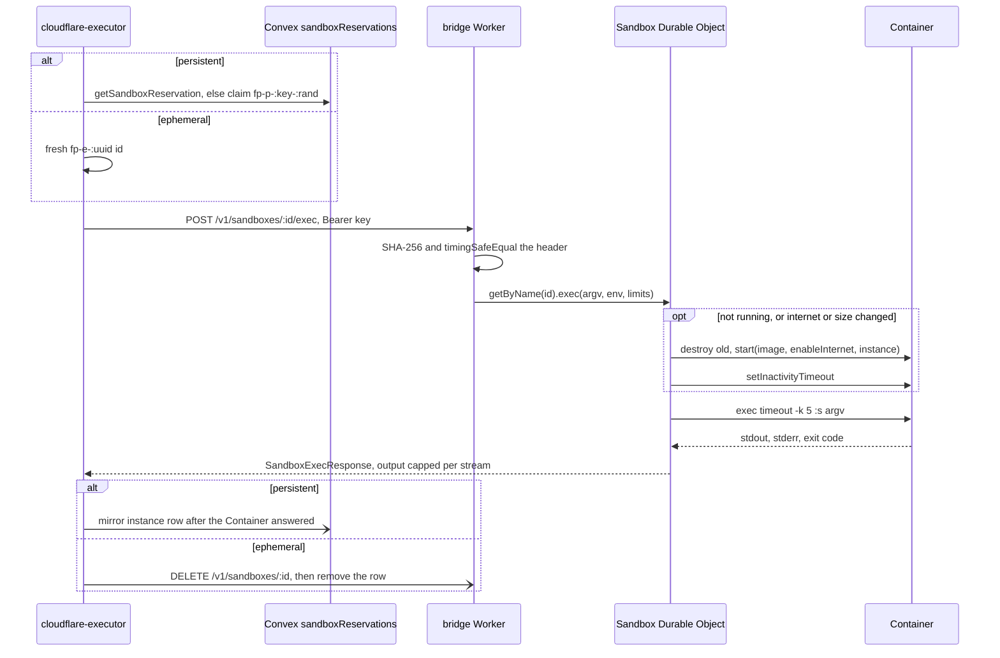
```mermaid
sequenceDiagram
  participant E as cloudflare-executor
  participant R as Convex sandboxReservations
  participant W as bridge Worker
  participant DO as Sandbox Durable Object
  participant C as Container

  alt persistent
    E->>R: getSandboxReservation, else claim fp-p-:key-:rand
  else ephemeral
    E->>E: fresh fp-e-:uuid id
  end
  E->>W: POST /v1/sandboxes/:id/exec, Bearer key
  W->>W: SHA-256 and timingSafeEqual the header
  W->>DO: getByName(id).exec(argv, env, limits)
  opt not running, or internet or size changed
    DO->>C: destroy old, start(image, enableInternet, instance)
    DO->>C: setInactivityTimeout
  end
  DO->>C: exec timeout -k 5 :s argv
  C-->>DO: stdout, stderr, exit code
  DO-->>E: SandboxExecResponse, output capped per stream
  alt persistent
    E-)R: mirror instance row after the Container answered
  else ephemeral
    E-)W: DELETE /v1/sandboxes/:id, then remove the row
  end
```

| Route                            | Does                                                                           |
| -------------------------------- | ------------------------------------------------------------------------------ |
| `POST /v1/sandboxes/:id/exec`    | Starts the Container if needed, runs one argv, answers a `SandboxExecResponse` |
| `GET /v1/sandboxes/:id`          | `{ running }`                                                                  |
| `DELETE /v1/sandboxes/:id`       | Destroys the Container                                                         |
| `GET /v1/sandboxes/:id/terminal` | PTY WebSocket, raw bytes both ways, for a `terminal` ticket                    |

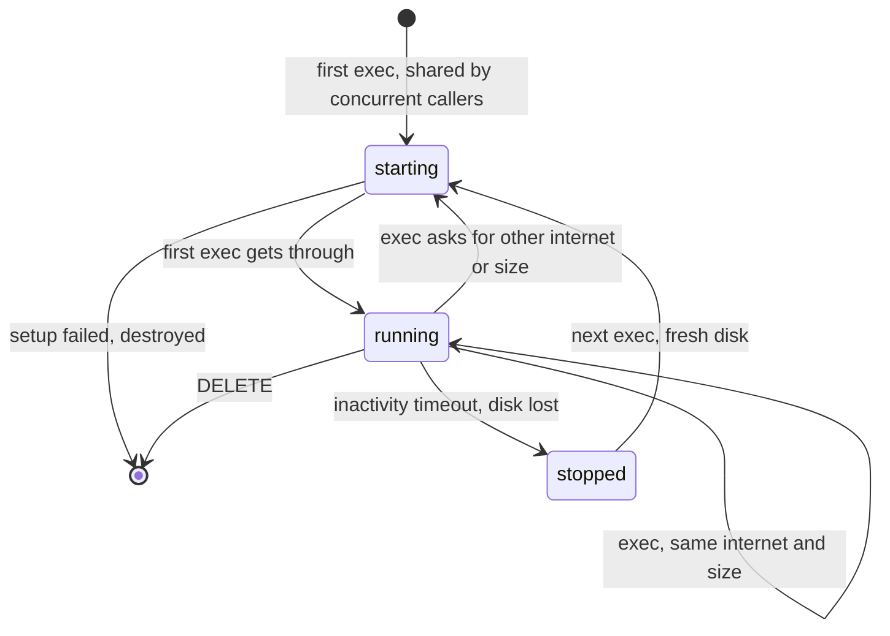
```mermaid
stateDiagram-v2
  [*] --> starting: first exec, shared by concurrent callers
  starting --> running: first exec gets through
  starting --> [*]: setup failed, destroyed
  running --> running: exec, same internet and size
  running --> starting: exec asks for other internet or size
  running --> stopped: inactivity timeout, disk lost
  running --> [*]: DELETE
  stopped --> starting: next exec, fresh disk
```

- A Durable Object exists once named, so a persistent reservation is only the claim. A run that loses the race uses the winner's id. An existing reservation is reused by key alone, which is how the dashboard console reaches it.
- A stopped Container lost its disk, so `getInstanceInfo` reports it gone, not suspended. There is no suspend, snapshot, workspace mount or background job, and harness adapters refuse the provider.
- `network.mode: "allow-all"` starts with `enableInternet: true`, anything else without; `restricted` is rejected. `size` maps to the nearest instance type, `standard-1` to `standard-4` (`CLOUDFLARE_INSTANCE_TYPES` in `apps/core/src/shared/sandbox-sizes.ts`).
- Limits are in `apps/cloudflare-sandbox/src/limits.ts`, which core imports to clamp: 1 MiB output per stream, 15 minute timeout, 6 hour idle (the `setInactivityTimeout` ceiling). An ephemeral Container idles only a minute past its command, so one whose `DELETE` failed stops soon.
- Exit 124 or 137 counts as a timeout only once the deadline passed; earlier it is the command's own exit or an OOM kill.
- `deploy.yaml` does not deploy the bridge. A deployment that offers the provider runs `wrangler deploy` and sets `SANDBOX_API_KEY` on the Worker equal to core's `CLOUDFLARE_SANDBOX_API_KEY`, with `CLOUDFLARE_SANDBOX_URL` pointing at it.

## Machine

`machine-executor.ts` runs `bash`, the `computer` tool and local MCP servers on a user's computer over the WebSocket the `broods machine` daemon holds. Frames are defined once in `src/shared/machine-socket.ts`, which the CLI bundles; the gateway relays them unchanged.

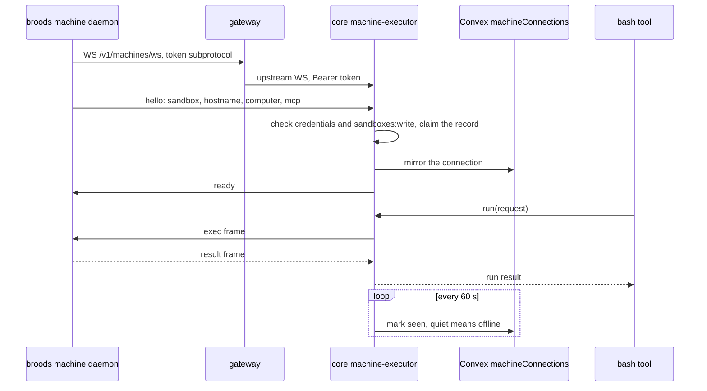
```mermaid
sequenceDiagram
  participant D as broods machine daemon
  participant G as gateway
  participant Core as core machine-executor
  participant CVX as Convex machineConnections
  participant T as bash tool

  D->>G: WS /v1/machines/ws, token subprotocol
  G->>Core: upstream WS, Bearer token
  D->>Core: hello: sandbox, hostname, computer, mcp
  Core->>Core: check credentials and sandboxes:write, claim the record
  Core->>CVX: mirror the connection
  Core->>D: ready
  T->>Core: run(request)
  Core->>D: exec frame
  D-->>Core: result frame
  Core-->>T: run result
  loop every 60 s
    Core->>CVX: mark seen, quiet means offline
  end
```

- One daemon holds a record. A second is closed with `4423` naming the holder's host; `--force` replaces the holder, which gets `4409`. Bad credentials close with `4401`, an unknown sandbox name with `4404`, a malformed frame with `4400`.
- The socket accepts a stage ticket minted from `broods login`, the account key, or a role session with `sandboxes:write` on the record. Never the runtime key or the dashboard's member ticket.
- Frames cap at 4 MiB. A computer action has 30 s, an MCP call 60 s, `bash` its timeout plus 5 s.
- Validation rejects `persistent`, `size`, `snapshot` and any network mode but `allow-all`, and a machine cannot back a workspace.

## Harness adapters

An agent with `harness` set runs its adapter (Claude Code, Codex, Deep Agents, OpenCode or Pi) inside its first sandbox through `@broods/ai-sdk-sandbox`. Only a persistent `lambda` or `sandbox` qualifies; `src/harness/ai-sdk-harness/sandbox.ts` picks `microvm-harness-driver.ts` or `workdir-harness-driver.ts`. The bridge listens on port 4321.

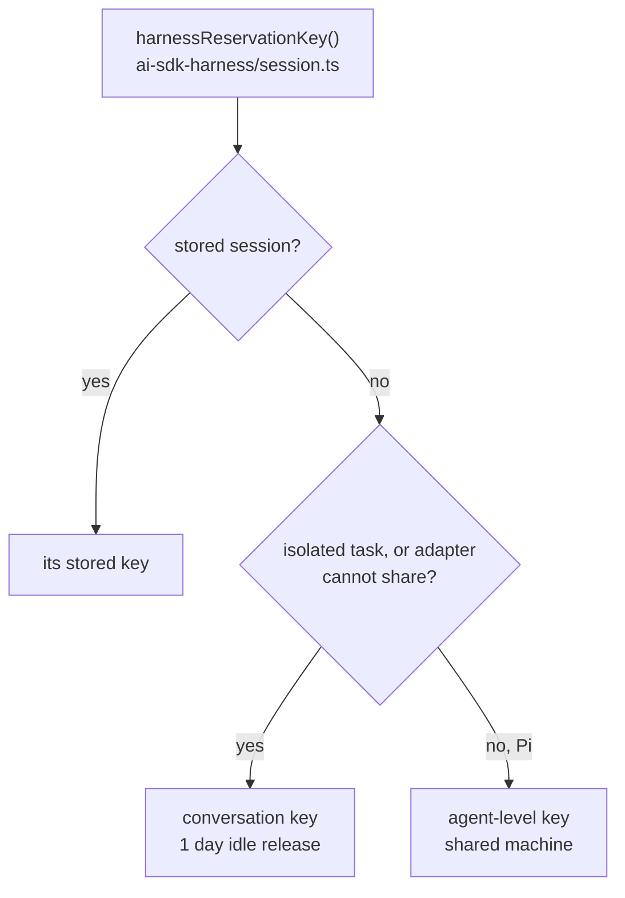
```mermaid
flowchart TD
  S["harnessReservationKey()<br/>ai-sdk-harness/session.ts"] --> ST{"stored session?"}
  ST -->|"yes"| SK["its stored key"]
  ST -->|"no"| ISO{"isolated task, or adapter<br/>cannot share?"}
  ISO -->|"yes"| CK["conversation key<br/>1 day idle release"]
  ISO -->|"no, Pi"| AK["agent-level key<br/>shared machine"]
```

- The key is stored on `runtimeHarnessSessions`, so a conversation resumes on the machine it started on. A session ending on a shared machine neither suspends nor deletes it.
- Neither provider streams processes, so `harness-shell-process.ts` runs the adapter detached and file-spooled; short shell calls poll its output in 180 KiB chunks every 25 ms.
- On `lambda`, WebSocket ingress needs the AWS token and port as subprotocols, so `microvm-websocket-proxy.ts` hands the adapter a loopback URL and adds them upstream. The token stays in core and the upstream header, never a URL or log.

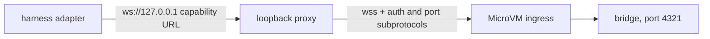
```mermaid
flowchart LR
  Adapter["harness adapter"] -->|"ws://127.0.0.1 capability URL"| Proxy["loopback proxy"]
  Proxy -->|"wss + auth and port subprotocols"| Ingress["MicroVM ingress"]
  Ingress --> Bridge["bridge, port 4321"]
```

- Live state (size, other runs holding the machine, and on a harness turn CPU, memory and disk from one probe) goes at the end of `<environment>`. `live-status.ts` keeps occupancy in memory, which is correct because core runs one replica.

Opt-in live tests, each cleaning up its own sandboxes:

```bash
cd apps/core
MICROVM_HARNESS_TEST=1 bun test tests/sandbox-microvm-harness.integration.test.ts
WORKDIR_TEST_URL=... WORKDIR_TEST_KEY=... bun test tests/workdir-harness.integration.test.ts
```

## Snapshot status model

`sandboxSnapshots.status` as core writes it:

```mermaid
stateDiagram-v2
  [*] --> building: lambda snapshot, CreateMicrovmImage started
  [*] --> active: workdir, Daytona, E2B, Vercel capture done
  building --> active: watcher sees an active image version
  building --> build_failed: watcher sees a failed version or CREATE_FAILED
```

The schema also allows `pending`, `pulling`, `inactive` and `error`, and the dashboard has a tone for each, but no core path writes them today.

## Security review notes (2026-09)

Findings from the host-boundary review, each closed in the harness:

- `options.docker` must be a boolean and is accepted on the `sandbox` provider only.
- `lambda` refuses `restricted` allowlists at validation instead of launching on the shared connector with a warning.
- Every executor merges env through one helper that drops reserved keys.
- A BYO bucket needs `storage.prefix`, and mount credentials are scoped to `bucket/prefix/*`.
- The background-job callback token rides the exec environment, not the script text.
- One MicroVM holds one workspace.
- Workspace `bash` rejects literal `..` traversal as a guardrail only. A shell expands `$'\x2e\x2e'` or `$(printf ..)` after the check. Containment comes from the VM and the prefix-scoped mount credentials. Writes to absolute paths outside the mount are refused, except `/tmp` and `/var/tmp`, unless the workspace runs on the agent's own persistent sandbox.
