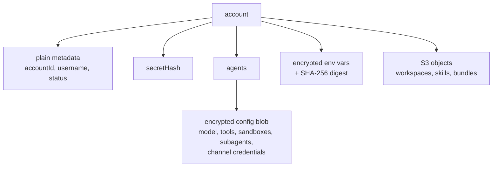
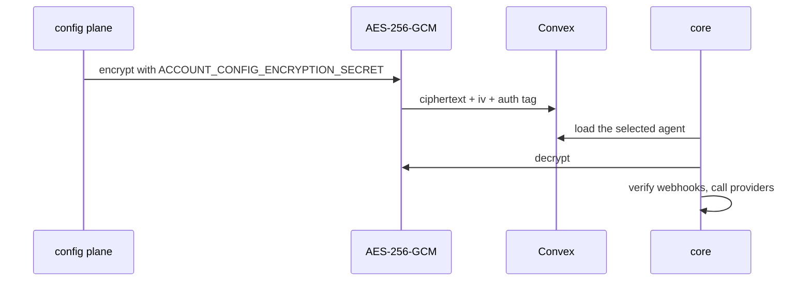

# Security

This page covers what Broods stores, how secrets are protected, and how untrusted code is contained. Who can do what in the dashboard and CLI is in the user-facing [security guide](../guides/security.md). This is an early product, and the model is deliberately simple: it keeps provider secrets out of plaintext Convex rows, but it is not a final production-grade secrets system.

## What is stored

- The account secret is never stored. It is returned once on create or rotation; only `secretHash` is kept.
- Provider credentials must be usable at runtime, so they cannot be hashed. They live inside encrypted agent config or encrypted env vars.
- Env vars store a SHA-256 digest beside the encrypted value, so `broods env sync` and `broods diff` can compare local and remote values without revealing either.
- Sandbox config, including `envVars`, is encrypted at rest.
- The workspace, skills and tool-bundles buckets block public access and use a deny-by-default bucket policy that allows only the stage's runtime roles, the scoped `sandbox-s3mount` role, the MicroVM build and execution roles, and deployment roles.

## Config encryption

- AES-256-GCM encrypts config before the Convex write.
- `AccountConfigEncryptionSecret` is an SST secret. Rotating it needs a re-encryption migration.
- Core decrypts only when it needs a selected agent's runtime settings.

Reads recursively redact secret-like field names (`token`, `secret`, `privateKey`, `apiKey` and similar), including inside tool config, as `********`. Sending `********` back in a patch keeps the stored value.

Logs go through one redaction chokepoint. See [observability](observability.md#security).

## Credentials

| Prefix       | Credential           | Scope                                                                                          |
| ------------ | -------------------- | ---------------------------------------------------------------------------------------------- |
| `fp_acct_`   | Account secret       | Whole tenant                                                                                   |
| `fp_cli_`    | CLI login token      | An org owner or admin. Re-checked against current membership on every request                  |
| `fp_agent_`  | Stage runtime key    | One account, project, stage and endpoint. Encrypted at rest and recoverable by the owning user |
| `fp_deploy_` | Deploy key           | One project and stage                                                                          |
| `fp_role_`   | Role                 | Never used directly. Exchanged for a session                                                   |
| `fp_sts_`    | Role session         | The role's policy. Default TTL 1 hour, max 12. Only the hash is stored                         |
| `fp_dts_`    | Stage session ticket | Fifteen minutes, signed by Convex with `STAGE_TICKET_SECRET`                                   |

Rules the code enforces:

- The runtime key is meant to sit in a frontend, so it is limited further. It reaches only agents of its own stage (another stage's `agentId` answers `404`). It needs `publicAccess: true` on the agent. It cannot send `system` or `model` overrides unless the agent sets `allowRunOverrides: true` (`403 run_overrides_disabled`). With `continue: true` it re-enters only conversations the direct API opened, never a channel session. It cannot open the observability socket, because logs and traces carry every end user's chats and tool payloads.
- A deploy key syncs its own stage only. Skills and hooks are account-wide by name, so a deploy key whose manifest names one that another stage manages is refused instead of replacing it. The org secret and a login token may move a name between stages. `--prune` leaves other stages' rows alone and fails when an agent or channel record still lists a policy it would remove.
- A deploy key can set and list env vars but never read a value back. `broods env get` needs a login token or the org secret, and every reveal is recorded in `environmentVariableReveals`.
- `broods login` binds the one-time code to the CLI process with PKCE (S256), so a code caught by another local listener cannot be exchanged.
- Sessions cannot mint new sessions, rotate the account secret, or touch `/v1/roles`. A stage runtime key may assume only roles pinned to its own project and stage. `status: "disabled"` on a role kills every live session.
- Webhook signing secrets and env var values are write-only in the dashboard.

## Hosted MCP servers

Account-uploaded MCP bundles are untrusted code and never run in the core process. They run on the mcp-runner Lambda, a plain Node.js function outside a VPC, so egress is open internet.

- With `MCP_TENANT_ISOLATION=true` on both the SST deploy and core, the function runs in Lambda tenant isolation mode. Every invoke carries the account id as its tenant id, and Lambda never reuses an execution environment across accounts. An account's first call after idle is a cold start. AWS has to enable tenancy configuration on the AWS account first. Without the flag, accounts share warm environments and the child process is the only separation.
- Inside an environment, each bundle runs in a child process with a scrubbed environment and a fresh per-invocation `TMPDIR`. The child is containment, not a trust boundary: it runs as the same OS user as the function and can read the function's environment.
- What holds: the execution role grants only CloudWatch Logs; the bundle arrives through a short-lived presigned URL and is imported from memory, never written to disk; the function holds no S3 or data-plane access; a child only receives calls for the one `accountId + sha256` it was spawned for.
- A changed bundle always gets a fresh process. A retiring child is reaped as a process group, and because `setsid` can escape the group, the function also kills every other process running as its user before each new child.
- Warm reuse is bounded by a max invocation count and an idle TTL. A timeout, rejected payload or unhandled rejection retires the child. Reuse gives up a clean process per call within one tenant's bundle: module-level state persists across its own calls, like any long-lived MCP server, while `HOME` and `TMPDIR` are re-pointed at fresh scratch dirs per invocation. The calls of one batch share that scratch dir.
- Bundles are capped at 50 MB (10 MB inline in a request body) and time-bounded, and their sha256 is checked on every invoke.

Treat anything the function can reach as reachable by tenant code.

## Code hooks

Inline [code hooks](../guides/hooks.md) run in a V8 `isolated-vm` isolate in a Node child of core. There is no filesystem, no npm or native imports, and network only through an SSRF-guarded `fetch`: private and metadata ranges are blocked, and resolved addresses are pinned against DNS rebinding. Handlers are serialized with `.toString()`, so the SDK rejects bundles that use imports, `require`, `node:` modules or closure variables. A hook that throws or times out is skipped, so a hook deny is best effort. Anything that must hold belongs in an enforced policy, which fails closed.

## Sandboxes

- Runs start from a cleared environment. Only declared `envVars` and the image's reserved vars reach them.
- No account secret enters a sandbox. Background jobs authenticate their callback with a per-job token.
- Workspace mounts get short-lived STS credentials scoped to the workspace's key prefix, and read-only access to the skills bucket.
- File tools normalize paths and reject traversal before a command reaches a provider.
- Third-party providers (E2B, Daytona, Vercel) run outside the AWS boundary. Give them isolated mounts, minimal env vars, provider-side egress controls, and no secrets a workload does not need.

More detail is in [sandboxes](sandboxes.md#security-review-notes-2026-09).

## Outbound requests

User-supplied URLs are checked before core sends credentials to them: MCP `url` and OAuth `tokenUrl`, lifecycle webhook `url`, channel `apiUrl` overrides, and storage `endpoint`. They must be public `https`, and private, loopback, link-local and metadata addresses are refused. MCP and webhook delivery do not follow redirects.

## Limits

- Upload URLs for hosted MCP bundles and workspace files are capped at 20 open grants per account per hour. Blobs uploaded but never registered are deleted after a day. A workspace file's size is read from the stored blob, never the client, and refused over 512 KB.
- Anyone with `ACCOUNT_CONFIG_ENCRYPTION_SECRET` and table access can decrypt config. This protects against accidental table-read exposure, not compromised application code.

## Why it is this simple

- No Secrets Manager object per account.
- No KMS decrypt call on every config read.
- Account metadata and runtime config stay in Convex without per-provider secret resources.

Revisit this when Broods needs per-tenant keys or key rotation without a migration.
