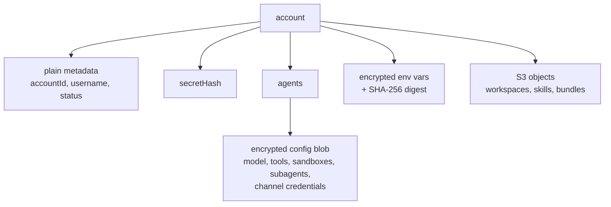
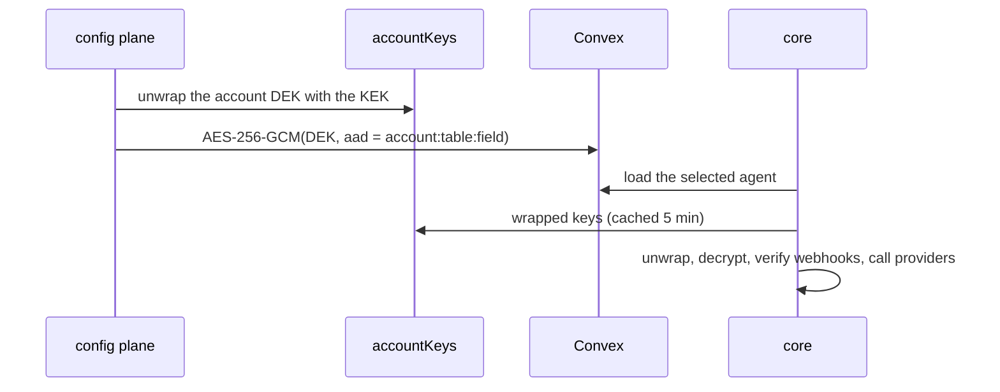
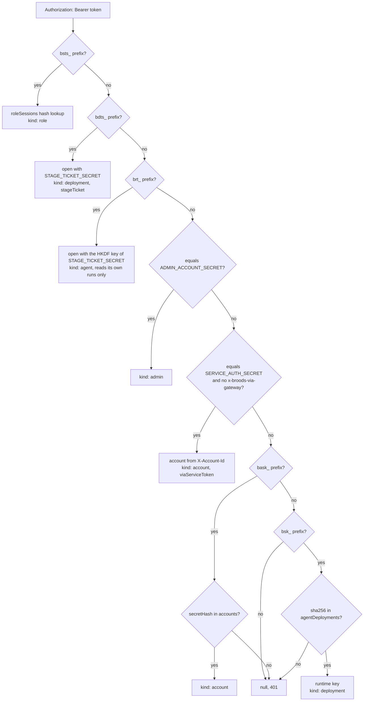
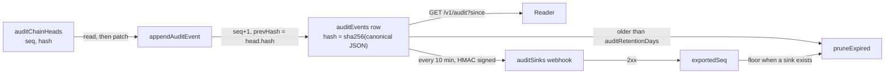

# Security

This page covers what Broods stores, how secrets are protected, and how untrusted code is contained. Who can do what in the dashboard and CLI is in the user-facing [security guide](../guides/security.md). This is an early product, and the model is simple on purpose. It keeps provider secrets out of plaintext Convex rows, but it is not a final production-grade secrets system.

## What is stored

```mermaid
flowchart TD
  Account["account"] --> Meta["plain metadata<br/>accountId, username, status"]
  Account --> Hash["secretHash"]
  Account --> Agent["agents"]
  Agent --> Config["encrypted config blob<br/>model, tools, sandboxes, subagents,<br/>channel credentials"]
  Account --> Env["encrypted env vars<br/>+ SHA-256 digest"]
  Account --> S3["S3 objects<br/>workspaces, skills, bundles"]
```

- The account key is never stored. It is returned once on create or rotation; only `secretHash` is kept.
- Provider credentials must be usable at runtime, so they cannot be hashed. They live inside encrypted agent config or encrypted env vars.
- Env vars store a SHA-256 digest beside the encrypted value, so `broods env sync` and `broods diff` can compare local and remote values without revealing either.
- Sandbox config, including `envVars`, is encrypted at rest.
- The workspace, skills, tool-bundles and MicroVM artifact buckets block public access. `denyUnlessProjectPrincipal()` in `apps/core/sst.config.ts` denies `s3:*` to every principal except the stage's `sandbox-s3mount`, `microvm-build` and `microvm-execution` roles, the `core-runtime` IAM user the core pods use, the `convex-aws` role the config plane assumes, the GitHub Actions deploy roles, and the account root.

## Encryption at rest

```mermaid
sequenceDiagram
  participant API as config plane
  participant Keys as accountKeys
  participant CVX as Convex
  participant Core as core

  API->>Keys: unwrap the account DEK with the KEK
  API->>CVX: AES-256-GCM(DEK, aad = account:table:field)
  Core->>CVX: load the selected agent
  Core->>Keys: wrapped keys (cached 5 min)
  Core->>Core: unwrap, decrypt, verify webhooks, call providers
```

Envelope encryption, one codec for both sides (`packages/convex/model/envelope.ts`):

- Every account owns a 32-byte data encryption key (DEK), minted on its first write and stored in `accountKeys` wrapped under the key encryption key (KEK). The KEK is derived from `ACCOUNT_CONFIG_ENCRYPTION_SECRET`; each key row records the `kekId` (first 8 hex of SHA-256 of the secret) it was wrapped under, so a KMS-backed KEK can replace the derived one later without a schema change.
- A stored blob is AES-256-GCM under the DEK with `${accountId}:${table}:${field}` as additional data, and its `ciphertext` column reads `v2:<keyId>:<base64url>`. A ciphertext cannot be moved to another tenant, row kind or column, and names the key that opens it. The `iv` and `tag` columns are unchanged.
- Encrypted columns: `agents.encryptedConfig` and `encryptedSourceConfig`, the same two on `sandboxConfigs`, `environmentVariables.ciphertext`, `accountEnvVars.ciphertext`, `agentRuntimeSecrets.ciphertext`, `agentDeployments.apiKeyCiphertext`, `channelEndpoints.tokenCiphertext`, `connections.ciphertext` and `auditSinks.encryptedSecret`.
- `environmentVariables.valueDigest` is HMAC-SHA256 under the DEK, so a dump of the table cannot be brute-forced against short values. The CLI still compares plain SHA-256: `listEnvBySecretHash` computes that per request from the decrypted value.
- `ACCOUNT_CONFIG_ENCRYPTION_SECRET` is plain runtime env on core and on the Convex deployment, and both must hold the same value. It takes a comma-separated list: the first entry wraps new keys, every entry unwraps.
- The cipher under the codec is swappable: Convex runs it on Web Crypto, core on the synchronous `node:crypto` (`src/shared/node-aead.ts`), which keeps a per-turn decrypt off a thread hop. The format is the same, so a blob sealed by either opens with the other.
- Convex builds the keyring once per request (`accountCipher*` in `model/accountKeys.ts`) and never caches it across requests. Core caches unwrapped keys per account for five minutes (`src/shared/convex/account-keys.ts`) and refreshes once when a row names a key it has not seen.

### Rotation runbook

Both run with `bunx convex run` against the deployment, as the deployment admin. None has a UI. Each one is paginated with a self-reschedule and idempotent; call it with no continuation arguments and wait for the scheduled batches to drain. The value a call returns covers its first batch only, so `isDone: false` is the normal answer. A batch that throws stops the walk and shows as a failed scheduled function.

1. **Rotate one account's DEK.** `bunx convex run account/keys:rotateAccountKey '{"accountId": "<id>"}'` mints a new key, which every write uses from that moment, rewrites every blob of the account under it table by table, then retires the older keys. Calling it again before it finishes, or after a batch failed, resumes the same rotation, and only the walk that began under the newest key retires the older ones. A retired key opens nothing, so a config that an HTTP action sealed under the old key is refused with a `409` and the caller retries under the new one.
2. **Rotate the KEK.** Core and Convex pick up an env change at different moments, so the new secret goes in last before it goes first. Set `old,new` on both and deploy, so each side can unwrap under either. Then set `new,old` on both, run `bunx convex run account/keys:rewrapAllKeys`, and once the batches drain check that no `accountKeys` row still carries the old `kekId`. Only then drop `old` and deploy again. No blob is rewritten; only the wrapped keys change.

Reads recursively redact secret-like field names such as `token`, `secret`, `privateKey`, `apiKey`, `cookie` and `authorization`, plus every value in a `headers` map, as `********`, including inside tool config. One rule, `isSecretName` in `packages/convex/model/secretNames.ts`, decides which names are secret here, which MCP headers must be `${NAME}` refs, and which keys log and policy redaction hide. A value made only of `${NAME}` refs holds no secret and is shown as is; in a header it may follow an auth scheme word, like `Bearer ${KEY}`. Sending `********` back in a patch keeps the stored value.

Logs go through one redaction chokepoint. See [observability](observability.md#security).

## Credentials

| Prefix   | Credential           | Scope                                                                                          |
| -------- | -------------------- | ---------------------------------------------------------------------------------------------- |
| `bask_`  | Account key          | Whole tenant                                                                                   |
| `bcli_`  | CLI login token      | An org owner or admin. Re-checked against current membership on every request                  |
| `bsk_`   | Runtime key          | One account, project, stage and endpoint. Encrypted at rest and recoverable by the owning user |
| `bpdk_`  | Project key          | One project and stage                                                                          |
| `brole_` | Role                 | Never used directly. Exchanged for a session                                                   |
| `bsts_`  | Role session         | The role's policy. Default TTL 1 hour, max 12. Only the hash is stored                         |
| `bdts_`  | Stage session ticket | Fifteen minutes, signed by Convex with `STAGE_TICKET_SECRET`                                   |
| `brt_`   | Run token            | Reads its own agent's runs. Signed by core, never stored                                       |

Every Broods credential starts with `b`, so a person or a secret scanner can tell it from another vendor's key. The `broods-credential` rule in `.gitleaks.toml` matches each one by its full shape: `bsk_`, `bask_`, `bpdk_`, `bcli_`, `bcode_` and `bsts_` followed by 43 base64url chars, and `bdts_` and `brt_` followed by a base64url payload, a dot and a 43-char signature. `brole_` ids are not secrets and are not matched. Core resolves a bearer in a fixed order in `resolveBearerAuth()` (`apps/core/src/shared/auth.ts`). `bsts_`, `bdts_` and `brt_` are routed by prefix and resolve as that kind or not at all. The admin secret and service token are compared next. A `bask_` or `bsk_` token then goes straight to its one hash lookup. Any other token, a key minted under an old prefix included, is refused without a lookup. The config plane routes the same way, and `cli/http.ts` adds `bcli_` and `bpdk_`:

```mermaid
flowchart TD
  Bearer["Authorization: Bearer token"] --> Sts{"bsts_ prefix?"}
  Sts -->|yes| Role["roleSessions hash lookup<br/>kind: role"]
  Sts -->|no| Dts{"bdts_ prefix?"}
  Dts -->|yes| Ticket["open with STAGE_TICKET_SECRET<br/>kind: deployment, stageTicket"]
  Dts -->|no| Brt{"brt_ prefix?"}
  Brt -->|yes| Run["open with the HKDF key of STAGE_TICKET_SECRET<br/>kind: agent, reads its own runs only"]
  Brt -->|no| Admin{"equals ADMIN_ACCOUNT_SECRET?"}
  Admin -->|yes| AdminCtx["kind: admin"]
  Admin -->|no| Svc{"equals SERVICE_AUTH_SECRET<br/>and no x-broods-via-gateway?"}
  Svc -->|yes| SvcCtx["account from X-Account-Id<br/>kind: account, viaServiceToken"]
  Svc -->|no| Ask{"bask_ prefix?"}
  Ask -->|yes| Acct{"secretHash in accounts?"}
  Acct -->|yes| AcctCtx["kind: account"]
  Ask -->|no| Bsk{"bsk_ prefix?"}
  Bsk -->|yes| Key{"sha256 in agentDeployments?"}
  Key -->|yes| Deploy["runtime key<br/>kind: deployment"]
  Bsk -->|no| Deny["null, 401"]
  Acct -->|no| Deny
  Key -->|no| Deny
```

Every branch that names an account also requires it to be `active`, except the account key on `DELETE /v1/account`, which accepts a disabled account so the owner can retry a deletion. `bcli_` and `bpdk_` never reach core; the Convex config plane checks them in `packages/convex/cli/http.ts`, and `bcli_` also in `config/routes/roles.ts`.

Rules the code enforces:

- The runtime key is meant to sit in a frontend, so it is limited further. It reaches only agents of its own stage, and another stage's `agentId` answers `404`. It needs `publicAccess: true` on the agent. It cannot send `system` or `model` overrides unless the agent sets `allowRunOverrides: true`, and gets `403 run_overrides_disabled` otherwise. With `continue: true` it re-enters only conversations the direct API opened, never a channel session. It cannot open the observability socket, because logs and traces carry every end user's chats and tool payloads.
- A member's stage ticket (`bdts_`) is the dashboard's credential. It reaches every agent of its stage, `publicAccess` or not, and its `continue: true` re-enters channel sessions too, so Continue on a failed Telegram task answers back in Telegram.
- A project key syncs its own stage only. Skills and hooks are account-wide by name, so a project key whose manifest names one that another stage manages is refused instead of replacing it. The account key and a login token may move a name between stages. `--prune` leaves other stages' rows alone and fails when an agent or channel record still lists a policy it would remove.
- A project key can set and list env vars but never read a value back. `broods env get` needs a login token or the account key, and every reveal is recorded in `environmentVariableReveals`.
- `broods login` binds the one-time code to the CLI process with S256 PKCE, so a code caught by another local listener cannot be exchanged.
- Sessions cannot mint new sessions, rotate the account key, or touch `/v1/roles`. A runtime key may assume only roles pinned to its own project and stage. A pinned session's resource must resolve to that stage before any rule is read (`authorize()` in `packages/convex/model/apiAuthorization.ts`), so collections and account-wide resources are refused. `status: "disabled"` on a role kills every live session.
- Webhook signing secrets and env var values are write-only in the dashboard.

## Hosted MCP servers

Account-uploaded MCP bundles are untrusted code and never run in the core process. They run on the tool-runner Lambda, a plain Node.js function outside a VPC, so egress is open internet.

The call path from core through the Lambda to the child is drawn in [tools and MCP](tools-and-mcp.md#hosted-servers).

- Today the function is `tool-runner`, and accounts share warm execution environments. The separation is the child process, plus a sweep before each spawn that kills any process of the function's user left behind by an earlier bundle.
- `MCP_TENANT_ISOLATION=true`, on both the SST deploy and core, creates the function as `mcp-runner` with `tenancyConfig: { tenantIsolationMode: "PER_TENANT" }`. Every invoke then carries `accountId:agentId` as its tenant id (the account id alone for a probe with no agent), and Lambda never reuses an execution environment across agents, let alone accounts. It is off because AWS rejects tenancy config for this AWS account; turn it on once AWS enables it.

- Inside an environment, each bundle runs in a child process with a scrubbed environment and a fresh per-invocation `TMPDIR`. The child is containment, not a trust boundary. It runs as the same OS user as the function and can read the function's environment.
- These protections hold. The execution role grants only CloudWatch Logs. The bundle arrives through a presigned URL valid for 120 s, reaches the child over a dedicated pipe on fd 3, and is imported from memory without touching disk. The child checks its sha256 before importing it. The function holds no S3 or data-plane access. A child only receives calls for the one `accountId + agentId + sha256` it was spawned for, and core batches calls on the same key, so two agents of one account never share a child even with tenancy off.
- A changed bundle always gets a fresh process. A retiring child is reaped as a process group, and because `setsid` can escape the group, the function also kills every other process running as its user before each new child.
- Warm reuse is bounded at 64 invokes and 300 s idle per child, set by `MCP_CHILD_MAX_CALLS` and `MCP_CHILD_IDLE_SECONDS`. `MCP_CHILD_REUSE=0` turns reuse off. A timeout, rejected payload or unhandled rejection retires the child. Reuse gives up a clean process per call within one tenant's bundle. Module-level state persists across its own calls, like any long-lived MCP server, while `HOME` and `TMPDIR` are re-pointed at fresh scratch dirs per invocation. The calls of one batch share that scratch dir.
- An invocation gets 30 s and 16 MiB of output, set in `apps/lambda/handler.mjs`. The child aborts 2 s earlier so the run settles before the handler's SIGKILL. Bundles are capped at 50 MB, or 10 MB inline in a request body.

Treat anything the function can reach as reachable by tenant code.

## Code hooks

Inline [code hooks](../guides/hooks.md) run in a V8 `isolated-vm` isolate. Bun cannot load `isolated-vm`, so core spawns Node runners (`src/harness/isolate/runner/runner.mjs`) and talks to them over the NDJSON frame protocol in `src/harness/frames.ts`.

- By default a pool of 4 long-lived workers, set by `ISOLATE_WORKER_POOL_SIZE`, keeps a warm isolate per tenant with a fresh context per call. Idle workers are reaped after 120 s, set by `ISOLATE_WORKER_IDLE_SECONDS`. `ISOLATE_POOL=0` falls back to one runner process per call, at most 8 at once, set by `ISOLATE_RUNNER_CONCURRENCY`.
- Each isolate gets 128 MB (`ISOLATE_MEMORY_LIMIT_MB`) and 30 s (`ISOLATE_RUNNER_TIMEOUT_SECONDS`). A runner receives only `PATH` and those isolate settings from core's environment, never core's secrets. Output is capped at 1 MiB on top of the request size.
- There is no filesystem and no npm or native imports. Network goes only through `ctx.fetch`, the SSRF-guarded pinned fetch in `runner/pinned-fetch.mjs`. It resolves the name, rejects private, loopback and metadata ranges, connects to the address it validated, and caps bodies at 5 MB, requests at 30 s and redirects at 5. The same fetch backs channel attachment downloads.
- Handlers are serialized with `.toString()`, so the SDK rejects bundles that use imports, `require`, `node:` modules or closure variables.
- A hook that throws or times out is skipped, so a hook deny is best effort. Anything that must hold belongs in an enforced policy, which fails closed.

## Sandboxes

- Runs start from a cleared environment. Only declared `envVars` and the image's reserved vars reach them.
- No account key enters a sandbox. Background jobs authenticate their callback with a per-job token.
- Workspace mounts get one-hour STS credentials whose session policy allows only the workspace's key prefix. The `sandbox-s3mount` role itself can also read the skills bucket, but no session core mints for a sandbox includes it; skills reach a sandbox as staged copies in the workspace.
- A mount session minted for a sandbox is attributed: its name carries the agent id on an agent-isolated mount and the account id on a mount other agents can reuse, and on the platform role it also carries `SourceIdentity` and the `broods:account` / `broods:agent` session tags, so CloudTrail shows which account made an S3 call, and which agent where the mount is one agent's alone. The role trusts only the `core-runtime` user. See [sandboxes](sandboxes.md#isolation-levels).
- A workspace with `isolation: "agent"` gives every attached agent its own namespace, so its sandbox, S3 prefix and mount credentials are per agent. An agent cannot reach another agent's files or VM through a shared workspace unless the workspace is deliberately shared.
- File tools normalize paths and reject traversal before a command reaches a provider.
- E2B, Daytona and Vercel run outside the AWS boundary. Give them isolated mounts, minimal env vars, provider-side egress controls, and no secrets a workload does not need.

More detail is in [sandboxes](sandboxes.md#security-review-notes-2026-09).

## Outbound requests

Core checks user-supplied URLs before it sends credentials to them. That covers MCP `url` and OAuth `tokenUrl`, lifecycle webhook `url`, channel `apiUrl` overrides, and storage `endpoint`. They must be public `https`, and private, loopback, link-local and metadata addresses are refused. MCP and webhook delivery do not follow redirects.

## Audit ledger

Every account has one append-only ledger in Convex (`auditEvents`, written only through `appendAuditEvent` in `packages/convex/model/auditEvents.ts`). It holds config mutations from the config plane, dashboard and CLI sync, plus two runtime rows: `run.completed` and `tool.denied`. A run is audited once, when it finishes: the usage write (`internal.usage.recordTaskUsage`) appends the `run.completed` row (status, `startedAt`, duration, step and tool counts, token totals) in the same mutation, so the per-turn Convex call budget is unchanged. There is no `run.started` row, and a run cut off at pod shutdown writes no usage row and no ledger row (the ingress settle runs on every run, so it cannot tell a cut-off apart without a flag). `tool.denied` is appended by core when an enforcing policy stops a tool. Rows never carry tool input, config blobs or secrets; `detailsJson` is capped at 8 KB.

```mermaid
flowchart LR
  Head["auditChainHeads<br/>seq, hash"] -->|read, then patch| Append["appendAuditEvent"]
  Append -->|seq+1, prevHash = head.hash| Row["auditEvents row<br/>hash = sha256(canonical JSON)"]
  Row -->|GET /v1/audit?since| Reader
  Row -->|every 10 min, HMAC signed| Sink["auditSinks webhook"]
  Sink -->|2xx| Watermark["exportedSeq"]
  Row -->|older than auditRetentionDays| Prune["pruneExpired"]
  Watermark -->|floor when a sink exists| Prune
```

- Chain: each row stores `seq` (per account, gapless at append), `prevHash` and `hash`. The hash is sha256 over the canonical JSON (keys sorted by UTF-16 code unit, no whitespace) of every row field but `hash`: `accountId`, `seq`, `prevHash`, `at`, `actor`, `action`, `resource`, `summary`, `detailsJson`, `projectId`, `stageId` and `traceId`. An optional field the row does not have is left out of the JSON, never written as `null`. The head row is read and patched in the same mutation, so Convex OCC serializes concurrent appends and two writers cannot take the same `seq`.
- Verify: `GET /v1/audit/verify` (internal query `audit.ledger.verifyChain`) recomputes every hash and link over a range, 1000 rows per call, and `ok` covers only `checkedFrom` to `checkedTo`. Stored rows are gapless from the oldest kept row to the head, so a row missing at the start of a range is reported at its `seq`, while rows below the oldest kept row are a pruned prefix and are not. Without `toSeq` the last row must match the head, so a deleted tail is reported at the first missing `seq`. Editing a row breaks its own hash; re-hashing it breaks the next row's `prevHash`.
- Export: `PUT /v1/audit/sink` stores one webhook per account, the secret sealed under the account's envelope key. The `export audit events` cron posts the rows past `exportedSeq` as JSON arrays of up to 200, at most 10 batches per sink per tick, each with `X-Broods-Signature: sha256=<hmac>`, the same shape as lifecycle webhooks, and advances the watermark on each 2xx. Sinks export side by side with a 10 second timeout, so one receiver cannot hold up another account's export. The url is held to public `https` by the same `assertPublicHttpsUrl` the rest of the config plane uses.
- Retention: `pruneExpired` sweeps every account with a ledger and deletes rows older than the account's `auditRetentionDays` (90 by default, settable through `PATCH /v1/account`). When the account has a sink, `exportedSeq` is a floor: a row the sink has not exported is never dropped, however old. The head row is never deleted, and rows go oldest first with no gap, so the kept range always verifies from its oldest row to the head.
- Access: the account secret, or a role with `audit:read` for the ledger and `audit:write` for the sink. Setting `auditRetentionDays` takes `audit:write` on top of `account:write`, since it decides when rows are deleted.

## Agent principal and run tokens

Every run acts as one agent of one account, never "as the account". Core builds a `Principal` (`apps/core/src/shared/domain/principal.ts`) where the `Session` is constructed: `{ kind: "agent", accountId, agentId, chain }`. The chain records who asked, oldest first:

| Run                                             | Chain                                                                      |
| ----------------------------------------------- | -------------------------------------------------------------------------- |
| Channel turn                                    | `[{ kind: "user", id, name?, channel }]` from the adapter's identity       |
| Direct API                                      | `[{ kind: "api", keyKind: "account" \| "deployment" }]`, set by the router |
| Cron firing                                     | `[{ kind: "api", keyKind: "cron" }]`                                       |
| Subagent, or a run started by session messaging | the parent's chain, then `{ kind: "agent", agentId: parent }`              |
| Requester not known                             | no chain                                                                   |

Core never guesses a link. A queued envelope rebuilt after the request is gone, an async-tool continuation and a channel re-entry without a stored sender all run with no chain, and so does every run they delegate to. The ledger row then has no `actor.chain`, the span has no `principal.chain` and an MCP request has no `X-Broods-Principal`. The ledger is hash-chained, so a guessed link could never be corrected.

The link shape is one validator, `principalLinkValidator` in `packages/convex/model/principal.ts`, so core and the ledger cannot drift. The principal appears in four places:

- OPA input: `input.principal` next to the flat `agentId`, `userId` and `userRoles` fields. The rego resolves dotted paths, so a rule can condition on `principal.chain[0].kind` with no engine change.
- Audit ledger: `run.completed` (appended by the usage write, which now takes `principalChain`) and `tool.denied` rows carry `actor.chain`. The row hash already covers `actor`, so the chain is tamper-evident like the rest.
- Root span: `principal.agentId` and `principal.chain` (`user:U1>agent:a1`) on `agent.task`, `agent.cron` and `agent.subtask`.
- Sandbox env and MCP requests, below.

Run tokens (`brt_…`) let sandbox code read its agent's runs. A token is stateless: base64url JSON of `{ accountId, agentId, exp }`, HMAC-SHA256 signed with a key derived from `STAGE_TICKET_SECRET` by HKDF-SHA256 (empty salt, info `broods-run-token`, 32 bytes). No new secret, and the purpose separation means a run token can never open a stage ticket. The payload is signed, not encrypted, and sandbox code can read it, so it carries the two ids and nothing core does not check on the way back in: no chain, no user id, no display name. A display name stays on the ledger and the OPA input, and never enters an MCP header either. Log and span redaction strips `brt_` bearers like the other prefixed credentials. Its TTL is the worker budget (`WORKER_TIMEOUT_BUDGET_MS`) plus five minutes, capped at two hours. Core mints one lazily, on the first sandbox exec of a run, so the per-turn Convex budget is untouched and a run with no exec never signs one.

A run token resolves on core to auth kind `agent`. It may `GET /v1/runs/{runId}` for its own agent's runs, and nothing else. Every other core route, `POST /v1/runs` included, answers 403 `run_token_scope`; the config plane and the CLI routes answer 401 `run tokens cannot reach the config plane` on the prefix alone; the machine socket and the account verbs refuse it.

Not yet: starting runs with a run token. A run started that way would run on the agent's stored config, so it first needs to inherit the holder's narrowing (channel record `denyTools` and policies, a parent's policies, the cron flag), a depth cap on self-delegation, and the holder's stage scope.

Sandbox code reads its identity from the `bash` exec env (the file tools run the harness's own scripts and get none): `BROODS_RUN_TOKEN`, `BROODS_AGENT_ID`, `BROODS_ACCOUNT_ID` and, when core knows its public base (`PUBLIC_BASE_URL`), `BROODS_BASE_URL`, the name the SDK and CLI already read. `mergeSandboxEnv` lays them over both the account `envVars` and the per-call env, and the four names are in `RESERVED_SANDBOX_ENV_KEYS`, so nothing an account configures can spoof them. They ride each exec, never a sandbox's create-time env, because a persistent sandbox outlives the run that created it. Background jobs get none on any provider: a detached job outlives the run and its token. `mergeSandboxEnv` drops the four names from the account `envVars` as well as the per-call env, so a configured `BROODS_BASE_URL` never stands in where core sets none.

Remote MCP servers (`http` and `hosted` transports) receive `X-Broods-Agent-Id` on every request and, when the chain is known, `X-Broods-Principal` (base64url JSON of the chain without display names, the calling agent last). The hosted path forwards them inside each `requests[].mcpRequest.headers` of the Lambda payload, per request rather than per batch because one batch mixes calls from different agents; the bundle reads them off the synthesized `Request`. A row or config header of either name is dropped in any case, since the wire would join it with the real one. They are kept out of the tool-listing cache key, so a listing is still shared across callers.

## Limits

- Upload URLs for hosted MCP bundles and workspace files are capped at 20 open grants per account per hour. Blobs uploaded but never registered are deleted after a day. A workspace file's size is read from the stored blob, never the client, and refused over 512 KB.
- Anyone with `ACCOUNT_CONFIG_ENCRYPTION_SECRET` and table access can decrypt config. This protects against accidental table-read exposure, not compromised application code.

## Why it is this simple

- No Secrets Manager object per account.
- No KMS decrypt call on every config read.
- Account metadata and runtime config stay in Convex without per-provider secret resources.
