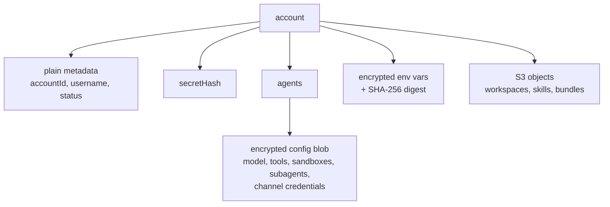
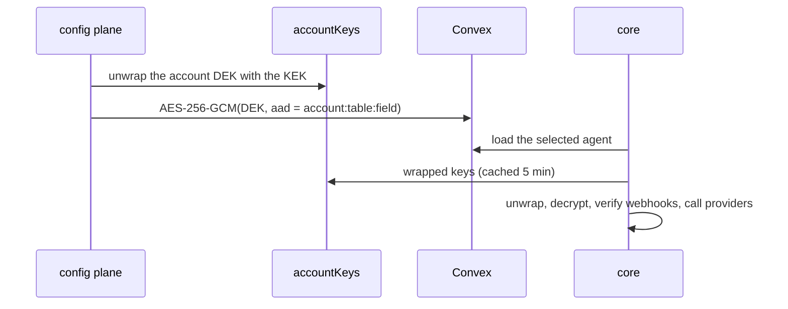
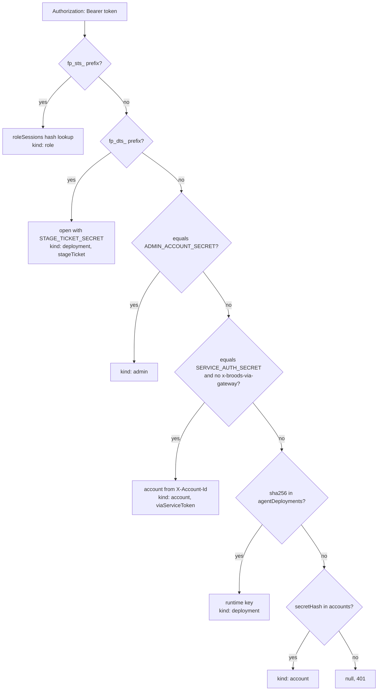

# Security

This page covers what Broods stores, how secrets are protected, and how untrusted code is contained. Who can do what in the dashboard and CLI is in the user-facing [security guide](../guides/security.md). This is an early product, and the model is simple on purpose. It keeps provider secrets out of plaintext Convex rows, but it is not a final production-grade secrets system.

## What is stored

```mermaid
flowchart TD
  Account["account"] --> Meta["plain metadata<br/>accountId, username, status"]
  Account --> Hash["secretHash"]
  Account --> Agent["agents"]
  Agent --> Config["encrypted config blob<br/>model, tools, sandboxes, subagents,<br/>channel credentials"]
  Account --> Env["encrypted env vars<br/>+ SHA-256 digest"]
  Account --> S3["S3 objects<br/>workspaces, skills, bundles"]
```

- The account secret is never stored. It is returned once on create or rotation; only `secretHash` is kept.
- Provider credentials must be usable at runtime, so they cannot be hashed. They live inside encrypted agent config or encrypted env vars.
- Env vars store a SHA-256 digest beside the encrypted value, so `broods env sync` and `broods diff` can compare local and remote values without revealing either.
- Sandbox config, including `envVars`, is encrypted at rest.
- The workspace, skills, tool-bundles and MicroVM artifact buckets block public access. `denyUnlessProjectPrincipal()` in `apps/core/sst.config.ts` denies `s3:*` to every principal except the stage's `sandbox-s3mount`, `microvm-build` and `microvm-execution` roles, the `core-runtime` IAM user the core pods use, the `convex-aws` role the config plane assumes, the GitHub Actions deploy roles, and the account root.

## Encryption at rest

```mermaid
sequenceDiagram
  participant API as config plane
  participant Keys as accountKeys
  participant CVX as Convex
  participant Core as core

  API->>Keys: unwrap the account DEK with the KEK
  API->>CVX: AES-256-GCM(DEK, aad = account:table:field)
  Core->>CVX: load the selected agent
  Core->>Keys: wrapped keys (cached 5 min)
  Core->>Core: unwrap, decrypt, verify webhooks, call providers
```

Envelope encryption, one codec for both sides (`packages/convex/model/envelope.ts`):

- Every account owns a 32-byte data encryption key (DEK), minted on its first write and stored in `accountKeys` wrapped under the key encryption key (KEK). The KEK is derived from `ACCOUNT_CONFIG_ENCRYPTION_SECRET`; each key row records the `kekId` (first 8 hex of SHA-256 of the secret) it was wrapped under, so a KMS-backed KEK can replace the derived one later without a schema change.
- A stored blob is AES-256-GCM under the DEK with `${accountId}:${table}:${field}` as additional data, and its `ciphertext` column reads `v2:<keyId>:<base64url>`. A ciphertext cannot be moved to another tenant, row kind or column, and names the key that opens it. The `iv` and `tag` columns are unchanged.
- Encrypted columns: `agents.encryptedConfig` and `encryptedSourceConfig`, the same two on `sandboxConfigs`, `environmentVariables.ciphertext`, `accountEnvVars.ciphertext`, `agentRuntimeSecrets.ciphertext`, `agentDeployments.apiKeyCiphertext`, `channelEndpoints.tokenCiphertext` and `connections.ciphertext`.
- `environmentVariables.valueDigest` is HMAC-SHA256 under the DEK, so a dump of the table cannot be brute-forced against short values. The CLI still compares plain SHA-256: `listEnvBySecretHash` computes that per request from the decrypted value.
- `ACCOUNT_CONFIG_ENCRYPTION_SECRET` is plain runtime env on core and on the Convex deployment, and both must hold the same value. It takes a comma-separated list: the first entry wraps new keys, every entry unwraps.
- The cipher under the codec is swappable: Convex runs it on Web Crypto, core on the synchronous `node:crypto` (`src/shared/node-aead.ts`), which keeps a per-turn decrypt off a thread hop. The format is the same, so a blob sealed by either opens with the other.
- Convex builds the keyring once per request (`accountCipher*` in `model/accountKeys.ts`) and never caches it across requests. Core caches unwrapped keys per account for five minutes (`src/shared/convex/account-keys.ts`) and refreshes once when a row names a key it has not seen.

### Rotation runbook

All three run with `bunx convex run` against the deployment, as the deployment admin. None has a UI. Each one is paginated with a self-reschedule and idempotent; call it with no continuation arguments and wait for the scheduled batches to drain. The value a call returns covers its first batch only, so `isDone: false` is the normal answer. A batch that throws stops the walk and shows as a failed scheduled function.

1. **Legacy rows, once per deployment.** Blobs written before envelope encryption have no `v2:` prefix and still decrypt through the legacy branch in `envelope.ts`. Run `bunx convex run migrations:migrateToEnvelope` on dev and on production; it mints a key for every account that has none and rewrites every legacy blob under it. Each call returns `skipped`, the running count of rows whose project has no account yet; those stay legacy. Once both have run and `skipped` is zero, the legacy branch can be deleted. A legacy blob also opens under the whole unsplit env value, so a secret that holds a comma or outer whitespace keeps working after deploy; run this step before changing that value, since its pieces are what the list is read as from now on.
2. **Rotate one account's DEK.** `bunx convex run account/keys:rotateAccountKey '{"accountId": "<id>"}'` mints a new key, which every write uses from that moment, rewrites every blob of the account under it table by table, then retires the older keys. Calling it again before it finishes, or after a batch failed, resumes the same rotation, and only the walk that began under the newest key retires the older ones. A retired key opens nothing, so a config that an HTTP action sealed under the old key is refused with a `409` and the caller retries under the new one.
3. **Rotate the KEK.** Core and Convex pick up an env change at different moments, so the new secret goes in last before it goes first. Set `old,new` on both and deploy, so each side can unwrap under either. Then set `new,old` on both, run `bunx convex run account/keys:rewrapAllKeys`, and once the batches drain check that no `accountKeys` row still carries the old `kekId`. Only then drop `old` and deploy again. No blob is rewritten; only the wrapped keys change. Legacy blobs are keyed by the secret itself, so finish step 1 before dropping the secret they were written under.

Reads recursively redact secret-like field names such as `token`, `secret`, `privateKey` and `apiKey` as `********`, including inside tool config. Sending `********` back in a patch keeps the stored value.

Logs go through one redaction chokepoint. See [observability](observability.md#security).

## Credentials

| Prefix       | Credential           | Scope                                                                                          |
| ------------ | -------------------- | ---------------------------------------------------------------------------------------------- |
| `fp_acct_`   | Account secret       | Whole tenant                                                                                   |
| `fp_cli_`    | CLI login token      | An org owner or admin. Re-checked against current membership on every request                  |
| `fp_agent_`  | Stage runtime key    | One account, project, stage and endpoint. Encrypted at rest and recoverable by the owning user |
| `fp_deploy_` | Deploy key           | One project and stage                                                                          |
| `fp_role_`   | Role                 | Never used directly. Exchanged for a session                                                   |
| `fp_sts_`    | Role session         | The role's policy. Default TTL 1 hour, max 12. Only the hash is stored                         |
| `fp_dts_`    | Stage session ticket | Fifteen minutes, signed by Convex with `STAGE_TICKET_SECRET`                                   |

Core resolves a bearer in a fixed order in `resolveBearerAuth()` (`apps/core/src/shared/auth.ts`). Only `fp_sts_` and `fp_dts_` are routed by prefix. The rest are tried as secrets, then as hashes:

```mermaid
flowchart TD
  Bearer["Authorization: Bearer token"] --> Sts{"fp_sts_ prefix?"}
  Sts -->|yes| Role["roleSessions hash lookup<br/>kind: role"]
  Sts -->|no| Dts{"fp_dts_ prefix?"}
  Dts -->|yes| Ticket["open with STAGE_TICKET_SECRET<br/>kind: deployment, stageTicket"]
  Dts -->|no| Admin{"equals ADMIN_ACCOUNT_SECRET?"}
  Admin -->|yes| AdminCtx["kind: admin"]
  Admin -->|no| Svc{"equals SERVICE_AUTH_SECRET<br/>and no x-broods-via-gateway?"}
  Svc -->|yes| SvcCtx["account from X-Account-Id<br/>kind: account, viaServiceToken"]
  Svc -->|no| Key{"sha256 in agentDeployments?"}
  Key -->|yes| Deploy["runtime key<br/>kind: deployment"]
  Key -->|no| Acct{"secretHash in accounts?"}
  Acct -->|yes| AcctCtx["kind: account"]
  Acct -->|no| Deny["null, 401"]
```

Every branch that names an account also requires it to be `active`, except the account secret on `DELETE /v1/account`, which accepts a disabled account so the owner can retry a deletion. `fp_cli_` and `fp_deploy_` never reach core; the Convex config plane checks them in `packages/convex/cli/http.ts`, and `fp_cli_` also in `config/routes/roles.ts`.

Rules the code enforces:

- The runtime key is meant to sit in a frontend, so it is limited further. It reaches only agents of its own stage, and another stage's `agentId` answers `404`. It needs `publicAccess: true` on the agent. It cannot send `system` or `model` overrides unless the agent sets `allowRunOverrides: true`, and gets `403 run_overrides_disabled` otherwise. With `continue: true` it re-enters only conversations the direct API opened, never a channel session. It cannot open the observability socket, because logs and traces carry every end user's chats and tool payloads.
- A member's stage ticket (`fp_dts_`) is the dashboard's credential. It reaches every agent of its stage, `publicAccess` or not, and its `continue: true` re-enters channel sessions too, so Continue on a failed Telegram task answers back in Telegram.
- A deploy key syncs its own stage only. Skills and hooks are account-wide by name, so a deploy key whose manifest names one that another stage manages is refused instead of replacing it. The org secret and a login token may move a name between stages. `--prune` leaves other stages' rows alone and fails when an agent or channel record still lists a policy it would remove.
- A deploy key can set and list env vars but never read a value back. `broods env get` needs a login token or the org secret, and every reveal is recorded in `environmentVariableReveals`.
- `broods login` binds the one-time code to the CLI process with S256 PKCE, so a code caught by another local listener cannot be exchanged.
- Sessions cannot mint new sessions, rotate the account secret, or touch `/v1/roles`. A stage runtime key may assume only roles pinned to its own project and stage. `status: "disabled"` on a role kills every live session.
- Webhook signing secrets and env var values are write-only in the dashboard.

## Hosted MCP servers

Account-uploaded MCP bundles are untrusted code and never run in the core process. They run on the tool-runner Lambda, a plain Node.js function outside a VPC, so egress is open internet.

The call path from core through the Lambda to the child is drawn in [tools and MCP](tools-and-mcp.md#hosted-servers).

- Today the function is `tool-runner`, and accounts share warm execution environments. The separation is the child process, plus a sweep before each spawn that kills any process of the function's user left behind by an earlier bundle.
- `MCP_TENANT_ISOLATION=true`, on both the SST deploy and core, creates the function as `mcp-runner` with `tenancyConfig: { tenantIsolationMode: "PER_TENANT" }`. Every invoke then carries the account id as its tenant id, and Lambda never reuses an execution environment across accounts. It is off because AWS rejects tenancy config for this AWS account; turn it on once AWS enables it.

- Inside an environment, each bundle runs in a child process with a scrubbed environment and a fresh per-invocation `TMPDIR`. The child is containment, not a trust boundary. It runs as the same OS user as the function and can read the function's environment.
- These protections hold. The execution role grants only CloudWatch Logs. The bundle arrives through a presigned URL valid for 120 s, reaches the child over a dedicated pipe on fd 3, and is imported from memory without touching disk. The child checks its sha256 before importing it. The function holds no S3 or data-plane access. A child only receives calls for the one `accountId + sha256` it was spawned for.
- A changed bundle always gets a fresh process. A retiring child is reaped as a process group, and because `setsid` can escape the group, the function also kills every other process running as its user before each new child.
- Warm reuse is bounded at 64 invokes and 300 s idle per child, set by `MCP_CHILD_MAX_CALLS` and `MCP_CHILD_IDLE_SECONDS`. `MCP_CHILD_REUSE=0` turns reuse off. A timeout, rejected payload or unhandled rejection retires the child. Reuse gives up a clean process per call within one tenant's bundle. Module-level state persists across its own calls, like any long-lived MCP server, while `HOME` and `TMPDIR` are re-pointed at fresh scratch dirs per invocation. The calls of one batch share that scratch dir.
- An invocation gets 30 s and 16 MiB of output, set in `apps/lambda/handler.mjs`. The child aborts 2 s earlier so the run settles before the handler's SIGKILL. Bundles are capped at 50 MB, or 10 MB inline in a request body.

Treat anything the function can reach as reachable by tenant code.

## Code hooks

Inline [code hooks](../guides/hooks.md) run in a V8 `isolated-vm` isolate. Bun cannot load `isolated-vm`, so core spawns Node runners (`src/harness/isolate/runner/runner.mjs`) and talks to them over the NDJSON frame protocol in `src/harness/frames.ts`.

- By default a pool of 4 long-lived workers, set by `ISOLATE_WORKER_POOL_SIZE`, keeps a warm isolate per tenant with a fresh context per call. Idle workers are reaped after 120 s, set by `ISOLATE_WORKER_IDLE_SECONDS`. `ISOLATE_POOL=0` falls back to one runner process per call, at most 8 at once, set by `ISOLATE_RUNNER_CONCURRENCY`.
- Each isolate gets 128 MB (`ISOLATE_MEMORY_LIMIT_MB`) and 30 s (`ISOLATE_RUNNER_TIMEOUT_SECONDS`). A runner receives only `PATH` and those isolate settings from core's environment, never core's secrets. Output is capped at 1 MiB on top of the request size.
- There is no filesystem and no npm or native imports. Network goes only through `ctx.fetch`, the SSRF-guarded pinned fetch in `runner/pinned-fetch.mjs`. It resolves the name, rejects private, loopback and metadata ranges, connects to the address it validated, and caps bodies at 5 MB, requests at 30 s and redirects at 5. The same fetch backs channel attachment downloads.
- Handlers are serialized with `.toString()`, so the SDK rejects bundles that use imports, `require`, `node:` modules or closure variables.
- A hook that throws or times out is skipped, so a hook deny is best effort. Anything that must hold belongs in an enforced policy, which fails closed.

## Sandboxes

- Runs start from a cleared environment. Only declared `envVars` and the image's reserved vars reach them.
- No account secret enters a sandbox. Background jobs authenticate their callback with a per-job token.
- Workspace mounts get one-hour STS credentials whose session policy allows only the workspace's key prefix. The `sandbox-s3mount` role itself can also read the skills bucket, but no session core mints for a sandbox includes it; skills reach a sandbox as staged copies in the workspace.
- File tools normalize paths and reject traversal before a command reaches a provider.
- E2B, Daytona and Vercel run outside the AWS boundary. Give them isolated mounts, minimal env vars, provider-side egress controls, and no secrets a workload does not need.

More detail is in [sandboxes](sandboxes.md#security-review-notes-2026-09).

## Outbound requests

Core checks user-supplied URLs before it sends credentials to them. That covers MCP `url` and OAuth `tokenUrl`, lifecycle webhook `url`, channel `apiUrl` overrides, and storage `endpoint`. They must be public `https`, and private, loopback, link-local and metadata addresses are refused. MCP and webhook delivery do not follow redirects.

## Limits

- Upload URLs for hosted MCP bundles and workspace files are capped at 20 open grants per account per hour. Blobs uploaded but never registered are deleted after a day. A workspace file's size is read from the stored blob, never the client, and refused over 512 KB.
- Anyone with `ACCOUNT_CONFIG_ENCRYPTION_SECRET` and table access can decrypt config. This protects against accidental table-read exposure, not compromised application code.

## Why it is this simple

- No Secrets Manager object per account.
- No KMS decrypt call on every config read.
- Account metadata and runtime config stay in Convex without per-provider secret resources.

Revisit this when Broods needs per-tenant keys or key rotation without a migration.
