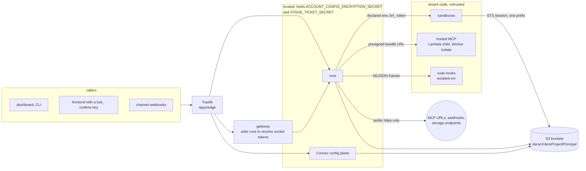
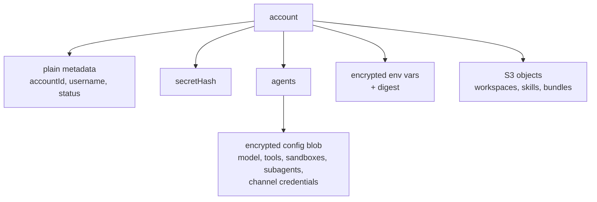
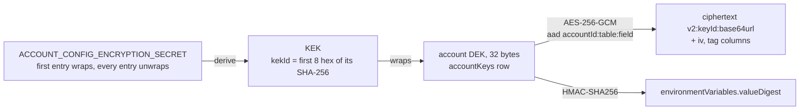
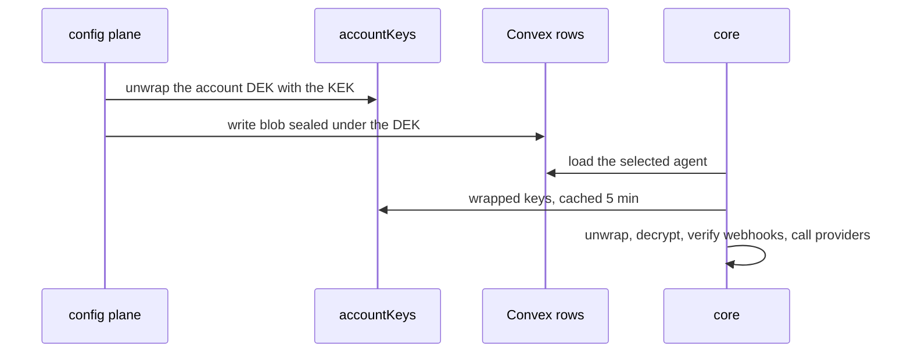
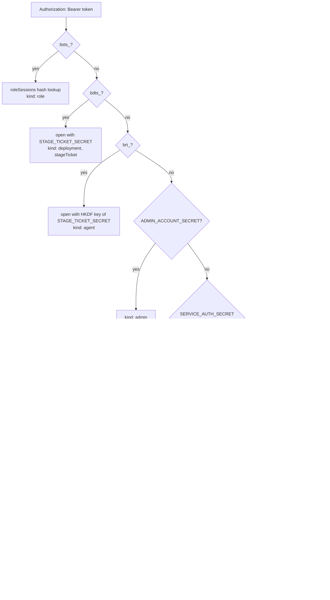
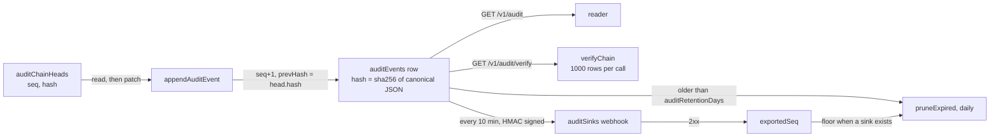
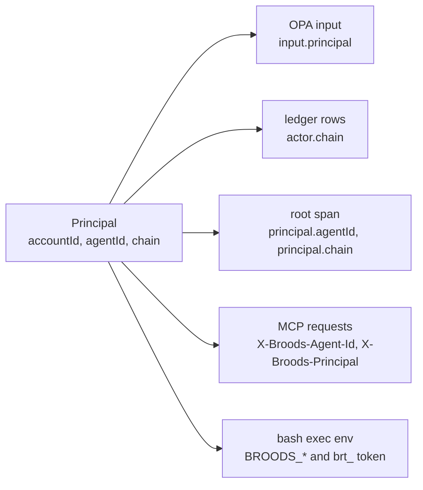
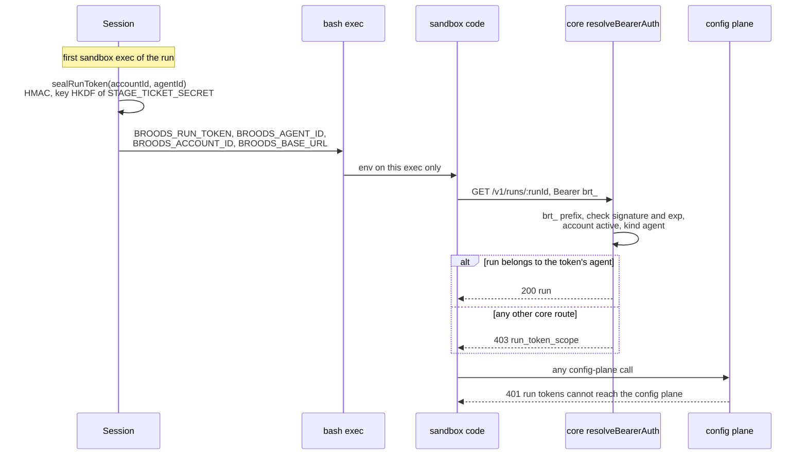

# Security

What Broods stores, how secrets are protected, and how untrusted code is contained. Who can do what in the dashboard and CLI is in the [security guide](../guides/security.md). The model is simple on purpose: it keeps provider secrets out of plaintext Convex rows, but it is not a final production-grade secrets system.

## Trust boundaries

```mermaid
flowchart LR
  subgraph Callers["callers"]
    Dash["dashboard, CLI"]
    Front["frontend with a bsk_ runtime key"]
    Hooks["channel webhooks"]
  end
  Callers --> Edge["Traefik<br/>apps/edge"]
  subgraph Trusted["trusted: holds ACCOUNT_CONFIG_ENCRYPTION_SECRET<br/>and STAGE_TICKET_SECRET"]
    Core["core"]
    Convex["Convex config plane"]
  end
  Edge --> Core
  Edge --> Convex
  Edge --> GW["gateway<br/>asks core to resolve socket tokens"]
  GW --> Core
  subgraph Tenant["tenant code, untrusted"]
    Sbx["sandboxes"]
    Mcp["hosted MCP<br/>Lambda child, Worker isolate"]
    Iso["code hooks<br/>isolated-vm"]
  end
  Core -->|"declared env, brt_ token"| Sbx
  Core -->|"presigned bundle URL"| Mcp
  Core -->|"NDJSON frames"| Iso
  Sbx -->|"STS session, one prefix"| S3[("S3 buckets<br/>denyUnlessProjectPrincipal")]
  Core --> S3
  Convex --> S3
  Core -->|"public https only"| Out(("MCP URLs, webhooks,<br/>storage endpoints"))
```

Everything inside "tenant code" is treated as hostile. Anything it can reach is reachable by tenant code.

## What is stored

```mermaid
flowchart TD
  Account["account"] --> Meta["plain metadata<br/>accountId, username, status"]
  Account --> Hash["secretHash"]
  Account --> Agent["agents"]
  Agent --> Config["encrypted config blob<br/>model, tools, sandboxes, subagents,<br/>channel credentials"]
  Account --> Env["encrypted env vars<br/>+ digest"]
  Account --> S3["S3 objects<br/>workspaces, skills, bundles"]
```

- The account key is returned once on create or rotation. Only `secretHash` is kept.
- Provider credentials must be usable at runtime, so they are encrypted, not hashed.
- The workspace, skills, tool-bundles and MicroVM artifact buckets block public access. `denyUnlessProjectPrincipal()` in `apps/core/sst.config.ts` denies `s3:*` to everyone but the stage's `sandbox-s3mount`, `microvm-build` and `microvm-execution` roles, the `core-runtime` user, the `convex-aws` role, the GitHub Actions deploy roles and the account root.

## Encryption at rest

Envelope encryption, one codec for both sides (`packages/convex/model/envelope.ts`):

```mermaid
flowchart LR
  Secret["ACCOUNT_CONFIG_ENCRYPTION_SECRET<br/>first entry wraps, every entry unwraps"] -->|derive| KEK["KEK<br/>kekId = first 8 hex of its SHA-256"]
  KEK -->|wraps| DEK["account DEK, 32 bytes<br/>accountKeys row"]
  DEK -->|"AES-256-GCM<br/>aad accountId:table:field"| Blob["ciphertext v2:keyId:base64url<br/>+ iv, tag columns"]
  DEK -->|HMAC-SHA256| Digest["environmentVariables.valueDigest"]
```

```mermaid
sequenceDiagram
  participant API as config plane
  participant Keys as accountKeys
  participant CVX as Convex rows
  participant Core as core

  API->>Keys: unwrap the account DEK with the KEK
  API->>CVX: write blob sealed under the DEK
  Core->>CVX: load the selected agent
  Core->>Keys: wrapped keys, cached 5 min
  Core->>Core: unwrap, decrypt, verify webhooks, call providers
```

- The additional data binds a blob to its tenant, table and column, and the `keyId` names the key that opens it.
- Encrypted columns (`ENVELOPE_COLUMNS`): `agents.encryptedConfig` and `encryptedSourceConfig`, the same two on `sandboxConfigs`, `environmentVariables.ciphertext`, `accountEnvVars.ciphertext`, `agentRuntimeSecrets.ciphertext`, `agentDeployments.apiKeyCiphertext`, `channelEndpoints.tokenCiphertext`, `connections.ciphertext`, `auditSinks.encryptedSecret`.
- The CLI compares env values by plain SHA-256, which `listEnvBySecretHash` computes per request from the decrypted value. The stored digest is keyed, so a table dump cannot be brute-forced.
- Convex runs the cipher on Web Crypto and builds the keyring per request (`model/accountKeys.ts`). Core runs it on `node:crypto` (`src/shared/node-aead.ts`) and caches unwrapped keys per account for 5 minutes (`src/shared/convex/account-keys.ts`), refreshing once when a row names an unknown key. The format is the same on both sides.

### Rotation runbook

Both are internal mutations, run as the deployment admin. Each pages through its rows with a self-reschedule and is idempotent. Call it with no continuation arguments and wait for the scheduled batches to drain; the returned value covers only the first batch, so `isDone: false` is normal. A batch that throws stops the walk and shows as a failed scheduled function.

**Rotate one account's DEK**

1. Run `bunx convex run account/keys:rotateAccountKey '{"accountId": "<id>"}'`.
2. It mints a new key, which every write uses from then on, and rewrites every blob of the account under it, table by table.
3. When the walk finishes it retires the older keys. Re-running it before then, or after a failed batch, resumes the same rotation.
4. A config an HTTP action sealed under a retired key is refused with `409`, and the caller retries.

**Rotate the KEK**

1. Set `ACCOUNT_CONFIG_ENCRYPTION_SECRET=old,new` on core and on Convex. Deploy both.
2. Set `new,old` on both. Deploy both.
3. Run `bunx convex run account/keys:rewrapAllKeys` and wait for the batches to drain.
4. Check that no `accountKeys` row still carries the old `kekId`.
5. Set `new` alone on both. Deploy both.

No blob is rewritten in a KEK rotation; only the wrapped keys change. The two-step order exists because core and Convex pick up an env change at different moments.

### Redaction

Reads redact secret-like field names (`token`, `secret`, `privateKey`, `apiKey`, `cookie`, `authorization`) and every `headers` value as `********`. One rule, `isSecretName` in `packages/convex/model/secretNames.ts`, decides secret names for config reads, MCP header refs, logs and policies. A value made only of `${NAME}` refs, optionally after an auth scheme word, is shown as is. Sending `********` back in a patch keeps the stored value. Logs: see [observability](observability.md#security).

## Credentials

| Prefix   | Credential           | Scope                                                                         |
| -------- | -------------------- | ----------------------------------------------------------------------------- |
| `bask_`  | Account key          | Whole tenant                                                                  |
| `bcli_`  | CLI login token      | An org owner or admin, re-checked against membership on every request         |
| `bsk_`   | Runtime key          | One account, project, stage and endpoint. Encrypted, recoverable by its owner |
| `bpdk_`  | Project key          | One project and stage                                                         |
| `brole_` | Role                 | Never used directly. Exchanged for a session                                  |
| `bsts_`  | Role session         | The role's policy. Default 1 hour, max 12. Only the hash is stored            |
| `bdts_`  | Stage session ticket | 15 minutes, signed by Convex with `STAGE_TICKET_SECRET`                       |
| `brt_`   | Run token            | Reads its own agent's runs. Signed by core, never stored                      |

Every credential starts with `b`, and the `broods-credential` rule in `.gitleaks.toml` matches each full shape (`brole_` ids are not secrets). Core resolves a bearer in `resolveBearerAuth()` (`apps/core/src/shared/auth.ts`):

```mermaid
flowchart TD
  Bearer["Authorization: Bearer token"] --> Sts{"bsts_?"}
  Sts -->|yes| Role["roleSessions hash lookup<br/>kind: role"]
  Sts -->|no| Dts{"bdts_?"}
  Dts -->|yes| Ticket["open with STAGE_TICKET_SECRET<br/>kind: deployment, stageTicket"]
  Dts -->|no| Brt{"brt_?"}
  Brt -->|yes| Run["open with HKDF key of STAGE_TICKET_SECRET<br/>kind: agent"]
  Brt -->|no| Admin{"ADMIN_ACCOUNT_SECRET?"}
  Admin -->|yes| AdminCtx["kind: admin"]
  Admin -->|no| Svc{"SERVICE_AUTH_SECRET<br/>and not via gateway?"}
  Svc -->|yes| SvcCtx["account from X-Account-Id<br/>viaServiceToken"]
  Svc -->|no| Ask{"bask_?"}
  Ask -->|yes| Acct{"secretHash in accounts?"}
  Acct -->|yes| AcctCtx["kind: account"]
  Ask -->|no| Bsk{"bsk_?"}
  Bsk -->|yes| Key{"sha256 in agentDeployments?"}
  Key -->|yes| Deploy["runtime key<br/>kind: deployment"]
  Bsk -->|no| Deny["null, 401"]
  Acct -->|no| Deny
  Key -->|no| Deny
```

Every branch that names an account requires it `active`, except the account key on `DELETE /v1/account`, so an owner can retry a deletion. `bcli_` and `bpdk_` never reach core; the config plane checks them in `packages/convex/cli/http.ts`.

| Credential           | Limits the code enforces                                                                                                                                                                                                                                        |
| -------------------- | --------------------------------------------------------------------------------------------------------------------------------------------------------------------------------------------------------------------------------------------------------------- |
| Runtime key `bsk_`   | Own stage only (another stage's `agentId` answers `404`). Needs `publicAccess: true`. No `system` or `model` override without `allowRunOverrides` (`403 run_overrides_disabled`). `continue: true` only into direct-API conversations. No observability socket. |
| Stage ticket `bdts_` | Every agent of its stage. `continue: true` re-enters channel sessions too.                                                                                                                                                                                      |
| Project key `bpdk_`  | Syncs its own stage. Cannot replace a skill or hook another stage manages. Sets and lists env vars but never reads a value.                                                                                                                                     |
| Role session `bsts_` | Cannot mint sessions, rotate the account key or touch `/v1/roles`. A pinned session's resource must resolve to its stage first (`authorize()` in `packages/convex/model/apiAuthorization.ts`). A disabled role kills every live session.                        |
| Login `bcli_`        | `broods login` binds the one-time code with S256 PKCE. `broods env get` reveals are recorded in `environmentVariableReveals`.                                                                                                                                   |

## Hosted MCP servers

Account-uploaded MCP bundles never run in the core process. They run on the tool-runner Lambda or the Cloudflare Worker; both paths are drawn in [tools and MCP](tools-and-mcp.md#hosted-servers).

Lambda (`apps/lambda/handler.mjs`):

- One shared function, `tool-runner`, outside a VPC, so egress is open internet. Warm environments can serve several accounts. The separation is the child process plus `reapStrays`, which kills every other process of the function's user before each spawn.
- The child gets a scrubbed env (`PATH`, `HOME`, `TMPDIR`, `NODE_ENV`, its timeout) and a fresh scratch dir per batch. It is containment, not a trust boundary: same OS user, so it can read the function's environment. The execution role grants only CloudWatch Logs.
- The bundle arrives by presigned URL valid 120 s, reaches the child on fd 3, is sha256-checked and imported from memory. The function holds no S3 or data-plane access.
- A child serves one `accountId:agentId:sha256` only, so two agents of one account never share one. Module-level state persists across that key's calls.
- `MCP_TENANT_ISOLATION=true` on both SST and core creates `mcp-runner` with `PER_TENANT` tenancy and sends `accountId:agentId` as the Lambda tenant id. It is off because AWS rejects tenancy config for this AWS account.

Cloudflare (`apps/cloudflare-mcp/src/index.ts`):

- Each `tenantId:sha256` gets its own Dynamic Worker isolate with `env: {}`, no compatibility flags and no bindings, so tenant code reads no secret.
- Egress goes through `TenantOutbound`, which refuses non-http(s) schemes, the runtime's own host and the bundle store's host. There is no `connect()`.
- The R2 copy is keyed by content hash and re-hashed against the row on every load.

## Code hooks

Inline [code hooks](../guides/hooks.md) run in a V8 `isolated-vm` isolate. Bun cannot load `isolated-vm`, so core spawns Node runners (`src/harness/isolate/runner/runner.mjs`) and talks NDJSON frames (`src/harness/frames.ts`).

- Pool of `ISOLATE_WORKER_POOL_SIZE` (4) warm workers, reaped after `ISOLATE_WORKER_IDLE_SECONDS` (120). `ISOLATE_POOL=0` spawns per call, at most `ISOLATE_RUNNER_CONCURRENCY` (8).
- 128 MB and 30 s per isolate, 1 MiB output. A runner gets only `PATH` and the isolate settings from core's env.
- No filesystem, no imports. Network only through `ctx.fetch` (`runner/pinned-fetch.mjs`): resolves, refuses private and metadata ranges, connects to the validated address, caps bodies at 5 MB and requests at 30 s.
- A hook that throws or times out is skipped, so a hook deny is best effort. Anything that must hold belongs in an enforced policy.

## Sandboxes

- Runs start from a cleared env: declared `envVars` plus the image's reserved vars. No account key enters a sandbox; background jobs call back with a per-job token.
- Workspace mounts get one-hour STS credentials whose session policy allows only the workspace prefix. The session carries the agent or account in its name and, on the platform role, `SourceIdentity` and session tags, so CloudTrail attributes every S3 call. See [sandboxes](sandboxes.md#isolation-levels) and [storage](storage.md#bring-your-own-bucket).
- `isolation: "agent"` gives each agent its own namespace, sandbox and mount credentials.
- File tools normalize paths and reject traversal before a provider sees the command.
- E2B, Daytona and Vercel run outside the AWS boundary: isolated mounts, minimal env vars, provider-side egress controls.

More in [sandboxes](sandboxes.md#security-review-notes-2026-09).

## Outbound requests

User-supplied URLs must be public `https` before core sends credentials to them: MCP `url` and OAuth `tokenUrl`, lifecycle webhook `url`, channel `apiUrl` overrides and storage `endpoint`. Private, loopback, link-local and metadata addresses are refused. MCP and webhook delivery do not follow redirects.

## Audit ledger

One append-only, hash-chained ledger per account in Convex (`auditEvents`, written only through `appendAuditEvent` in `packages/convex/model/auditEvents.ts`). It holds config mutations from every surface plus two runtime rows: `run.completed`, appended by the usage write in the same mutation so the per-turn Convex budget is unchanged, and `tool.denied`, appended when an enforcing policy stops a tool. There is no `run.started`, and a run cut off at pod shutdown writes no row. Rows never carry tool input, config blobs or secrets; `detailsJson` is capped at 8 KB.

```mermaid
flowchart LR
  Head["auditChainHeads<br/>seq, hash"] -->|"read, then patch"| Append["appendAuditEvent"]
  Append -->|"seq+1, prevHash = head.hash"| Row["auditEvents row<br/>hash = sha256 of canonical JSON"]
  Row -->|"GET /v1/audit"| Reader["reader"]
  Row -->|"GET /v1/audit/verify"| Verify["verifyChain<br/>1000 rows per call"]
  Row -->|"every 10 min, HMAC signed"| Sink["auditSinks webhook"]
  Sink -->|2xx| Watermark["exportedSeq"]
  Row -->|"older than auditRetentionDays"| Prune["pruneExpired, daily"]
  Watermark -->|"floor when a sink exists"| Prune
```

| Part      | Rule                                                                                                                                                                                                                                            |
| --------- | ----------------------------------------------------------------------------------------------------------------------------------------------------------------------------------------------------------------------------------------------- |
| Chain     | `hash` is sha256 over canonical JSON (keys sorted, no whitespace, absent optionals left out) of every other field. The head is read and patched in the same mutation, so Convex OCC serializes appends.                                         |
| Verify    | Recomputes hashes and links over a range; `ok` covers only `checkedFrom` to `checkedTo`. A gap is reported at its `seq`. Without `toSeq` the last row must match the head, so a deleted tail shows.                                             |
| Export    | `PUT /v1/audit/sink` stores one webhook, its secret sealed under the account key. The cron posts up to 10 batches of 200 rows per sink per tick with `X-Broods-Signature: sha256=<hmac>`, 10 s timeout each, and advances `exportedSeq` on 2xx. |
| Retention | `auditRetentionDays`, 90 by default, set through `PATCH /v1/account`. A row the sink has not exported is never dropped. The head is never deleted, and rows go oldest first, so the kept range always verifies.                                 |
| Access    | The account key, or a role with `audit:read` (ledger) and `audit:write` (sink). Setting retention also needs `account:write`.                                                                                                                   |

## Agent principal and run tokens

Every run acts as one agent of one account. Core builds a `Principal` (`apps/core/src/shared/domain/principal.ts`), `{ kind: "agent", accountId, agentId, chain }`, where the chain records who asked, oldest first:

| Run                                  | Chain                                                         |
| ------------------------------------ | ------------------------------------------------------------- |
| Channel turn                         | `[{ kind: "user", id, name?, channel }]`                      |
| Direct API                           | `[{ kind: "api", keyKind: "account" \| "deployment" }]`       |
| Cron firing                          | `[{ kind: "api", keyKind: "cron" }]`                          |
| Subagent, or a session-messaging run | the parent's chain, then `{ kind: "agent", agentId: parent }` |
| Requester not known                  | no chain                                                      |

Core never guesses a link: a rebuilt queued envelope, an async-tool continuation or a channel re-entry without a stored sender runs with no chain, since the hash-chained ledger could never correct a guess. The link shape is `principalLinkValidator` in `packages/convex/model/principal.ts`. The principal reaches:

```mermaid
flowchart LR
  P["Principal<br/>accountId, agentId, chain"] --> Opa["OPA input<br/>input.principal"]
  P --> Ledger["ledger rows<br/>actor.chain"]
  P --> Span["root span<br/>principal.agentId, principal.chain"]
  P --> Mcp["MCP requests<br/>X-Broods-Agent-Id, X-Broods-Principal"]
  P --> Env["bash exec env<br/>BROODS_* and brt_ token"]
```

`X-Broods-Principal` is base64url JSON of the chain without display names. The hosted path puts both headers in each `requests[].mcpRequest.headers`, since one batch mixes requesters. A row header of either name is dropped. Neither is part of the tool-listing cache key.

A run token lets sandbox code read its agent's runs:

```mermaid
sequenceDiagram
  participant S as Session
  participant B as bash exec
  participant C as sandbox code
  participant A as core resolveBearerAuth
  participant CP as config plane

  Note over S: first sandbox exec of the run
  S->>S: sealRunToken(accountId, agentId)<br/>HMAC, key HKDF of STAGE_TICKET_SECRET
  S->>B: BROODS_RUN_TOKEN, BROODS_AGENT_ID,<br/>BROODS_ACCOUNT_ID, BROODS_BASE_URL
  B->>C: env on this exec only
  C->>A: GET /v1/runs/:runId, Bearer brt_
  A->>A: brt_ prefix, check signature and exp,<br/>account active, kind agent
  alt run belongs to the token's agent
    A-->>C: 200 run
  else any other core route
    A-->>C: 403 run_token_scope
  end
  C->>CP: any config-plane call
  CP-->>C: 401 run tokens cannot reach the config plane
```

- The payload is `{ accountId, agentId, exp }`, signed, not encrypted: no chain, user id or display name. HKDF info `broods-run-token` keeps it from ever opening a stage ticket.
- TTL is `WORKER_TIMEOUT_BUDGET_MS` plus 5 minutes, capped at 2 hours. Minting is lazy, so a run with no exec signs none.
- `mergeSandboxEnv` drops the four `BROODS_*` names from account `envVars` and per-call env, so nothing configured can spoof them. They ride each exec, never a persistent sandbox's create-time env, and background jobs get none.
- The machine socket and the account verbs refuse a run token. Log redaction strips `brt_` bearers.
- Not yet: starting runs with a run token. That needs the holder's narrowing (channel `denyTools` and policies, parent policies, the cron flag), a depth cap and stage scope first.

## Limits

- Upload URLs for hosted MCP bundles and workspace files: 20 open grants per account per hour. Unregistered blobs are deleted after a day. A workspace file's size is read from the stored blob and refused over 512 KB.
- Anyone with `ACCOUNT_CONFIG_ENCRYPTION_SECRET` and table access can decrypt config. This guards against accidental table exposure, not compromised application code.
- By design there is no Secrets Manager object per account and no KMS call per config read.
