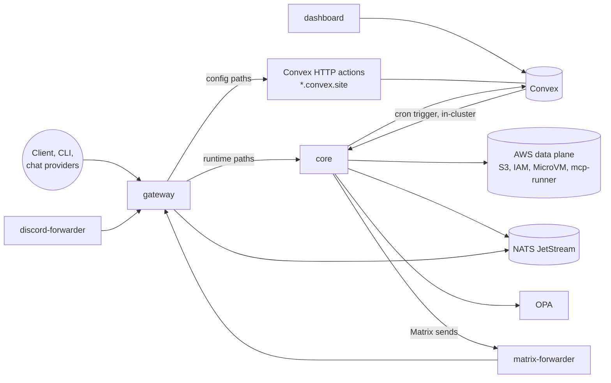

# Self-hosting

How to run Broods on your own AWS account and cluster, in the order the pieces depend on each other. Most users should use the managed service at `gateway.broods.app` instead. See the [quickstart](../quickstart.md). The CLI and SDK work the same against either.

To try the stack on one machine first, skip to [Run it locally](#run-it-locally).

## What you deploy



| Piece                       | Source                                           | Runs as                                                           |
| --------------------------- | ------------------------------------------------ | ----------------------------------------------------------------- |
| AWS data plane              | `apps/core/sst.config.ts`                        | SST deploy into your AWS account                                  |
| Convex backend              | `packages/convex`                                | Convex Cloud, or the self-hosted `convex-backend` image           |
| core                        | `apps/core/Dockerfile`                           | Container, port 3000, cluster-internal only                       |
| gateway                     | `apps/gateway/Dockerfile`                        | Container, port 3000, the only public door                        |
| dashboard                   | `apps/dashboard/Dockerfile`                      | Container, port 3000, needs WorkOS                                |
| discord-forwarder           | `apps/discord-forwarder/Dockerfile`              | Container, one replica. Only for Discord agents                   |
| matrix-forwarder            | `apps/matrix-forwarder/Dockerfile`               | Container, one replica, persistent volume. Only for Matrix agents |
| NATS with JetStream         | upstream                                         | Needed for WebSocket runs and live logs                           |
| OPA                         | upstream, with `apps/core/opa/broods_authz.rego` | Needed for agent policies                                         |
| OTel collector, Loki, Tempo | upstream                                         | Optional. Log and trace history                                   |

The managed service runs all of this on k3s. Its release files are in the infra repo under `kubernetes/charts/releases/`. They are `core.yaml`, `gateway.yaml`, `dashboard.yaml`, `convex-prod.yaml`, `nats.yaml`, `opa.yaml`, `loki.yaml`, `tempo.yaml`, the two forwarders, and `-dev` variants. Images are published to `ghcr.io/beeblastco/broods-{core,gateway,dashboard,discord-forwarder,matrix-forwarder}`, or build them from the Dockerfiles at the repo root with `docker build -f apps/core/Dockerfile .`.

## Prerequisites

- Bun at the version in `.bun-version`, 1.4.2 or newer.
- An AWS account and credentials that can create S3, IAM, Lambda and CloudWatch resources.
- A Kubernetes cluster, or any container host, for the five images.
- A Convex deployment, on Convex Cloud or self-hosted.
- A WorkOS AuthKit app if you run the dashboard. Without it there is no browser login, and so no `broods login`.

## 1. Deploy the AWS data plane

```bash
bun install --ignore-scripts
cp apps/core/.env.example apps/core/.env   # fill it in
cd apps/core
bun run deploy                             # scripts/build.ts, then sst deploy
```

`sst.config.ts` reads only these inputs. Runtime secrets are not SST secrets.

| Variable                      | Required | Notes                                                                                                                                                                                                                    |
| ----------------------------- | -------- | ------------------------------------------------------------------------------------------------------------------------------------------------------------------------------------------------------------------------ |
| `AWS_ACCOUNT_ID`              | yes      | Role ARNs, bucket policies, resource names. No default                                                                                                                                                                   |
| `PROJECT_NAME`                | yes      | Name prefix: `<stage>-<project>-<service>-<account>-<region>`; production stages drop the stage                                                                                                                          |
| `PROJECT_OWNER_EMAIL`         | yes      | Resource tags                                                                                                                                                                                                            |
| `AWS_REGION`                  | CI only  | Defaults to `eu-west-1` locally; required when `CI` is set                                                                                                                                                               |
| `AWS_PROFILE`                 | local    | Ignored when `CI` is set                                                                                                                                                                                                 |
| `SST_STAGE`                   | yes      | `dev`, `production-eu-west-1`, ... `production` and `production-*` are treated as production                                                                                                                             |
| `CONVEX_URL`                  | yes      | The deploy fails without it                                                                                                                                                                                              |
| `CONVEX_DEPLOY_KEY`           | yes      | Deploy key, or the self-hosted admin key                                                                                                                                                                                 |
| `OTEL_EXPORTER_OTLP_ENDPOINT` | no       | Collector for the sandbox log forwarder. Default `https://otel.beeblast.co`, so set it                                                                                                                                   |
| `OTEL_EXPORTER_OTLP_HEADERS`  | no       | `Authorization=Basic ...`. Unset skips the sandbox log forwarder, MicroVM logs stay in CloudWatch                                                                                                                        |
| `MCP_TENANT_ISOLATION`        | no       | Default on: the `mcp-runner` Lambda runs per-tenant. `false` creates `tool-runner` with shared environments, non-production only. AWS must enable tenancy for the account first, and the mode cannot change after create |
| `SANDBOX_IMAGE_READY`         | no       | `true` imports the existing sandbox ECR repo instead of creating it                                                                                                                                                      |

Stack outputs, which the containers and Convex need:

| Output                                                                                                             | Feeds                                                                       |
| ------------------------------------------------------------------------------------------------------------------ | --------------------------------------------------------------------------- |
| `filesystemBucketName`                                                                                             | core and Convex `FILESYSTEM_BUCKET_NAME`                                    |
| `skillsBucketName`                                                                                                 | core and Convex `SKILLS_BUCKET_NAME`                                        |
| `toolBundlesBucketName`                                                                                            | core and Convex `TOOL_BUNDLES_BUCKET_NAME`                                  |
| `toolRunnerFunctionName`                                                                                           | core `TOOL_RUNNER_FUNCTION_NAME`                                            |
| `microvmArtifactsBucketName`, `microvmBuildRoleArn`, `microvmExecutionRoleArn`, `microvmEgressNetworkConnectorArn` | core `MICROVM_*`                                                            |
| `coreRuntimeUserName`                                                                                              | mint an access key for core: `aws iam create-access-key --user-name <name>` |
| `convexAwsRoleArn`                                                                                                 | Convex `CONVEX_AWS_ROLE_ARN`                                                |
| `convexBootstrapUserName`                                                                                          | mint the Convex `AWS_ACCESS_KEY_ID` / `AWS_SECRET_ACCESS_KEY`               |

Two values are not outputs but follow fixed names. `SANDBOX_MOUNT_ROLE_ARN` is the role `<stage>-<project>-sandbox-s3mount-<account>-<region>`, without `<stage>-` on production, and `MICROVM_LOG_GROUP_NAME` is `/broods/<stage>/microvms`.

Production stages keep their buckets on removal and protect them. Add every long-lived stage to the matrix in `.github/workflows/drift-cleanup.yaml`, or the nightly reconcile never sees it. See [CI/CD](ci-cd.md).

## 2. Configure and deploy Convex

Set the deployment env with `bunx convex env set NAME value` from `packages/convex`:

| Variable                                                                   | Required  | Notes                                                                                                                                        |
| -------------------------------------------------------------------------- | --------- | -------------------------------------------------------------------------------------------------------------------------------------------- |
| `ACCOUNT_CONFIG_ENCRYPTION_SECRET`                                         | yes       | Same value as core. Encrypts agent and sandbox config                                                                                        |
| `ADMIN_ACCOUNT_SECRET`                                                     | yes       | Same value as core. Admin bearer for the account admin routes                                                                                |
| `SERVICE_AUTH_SECRET`                                                      | yes       | Same value as core. Cron trigger and service calls                                                                                           |
| `STAGE_TICKET_SECRET`                                                      | yes       | Same value as core. Signs `fp_dts_` tickets                                                                                                  |
| `BROODS_ACCOUNT_MANAGE_URL`                                                | yes       | Core's in-cluster URL, for example `http://core.<ns>.svc.cluster.local`. Never the public gateway: core refuses the service token there      |
| `AWS_REGION`                                                               | yes       | The data plane region                                                                                                                        |
| `AWS_ACCESS_KEY_ID`, `AWS_SECRET_ACCESS_KEY`                               | yes       | The bootstrap user's key. It can only assume `ConvexAwsRole`                                                                                 |
| `CONVEX_AWS_ROLE_ARN`                                                      | yes       | `convexAwsRoleArn` output                                                                                                                    |
| `CONVEX_AWS_EXTERNAL_ID`                                                   | no        | Default `broods-convex`                                                                                                                      |
| `FILESYSTEM_BUCKET_NAME`, `SKILLS_BUCKET_NAME`, `TOOL_BUNDLES_BUCKET_NAME` | yes       | Stack outputs                                                                                                                                |
| `MICROVM_ARTIFACTS_BUCKET_NAME`                                            | no        | Also refuses that bucket as a workspace's own storage                                                                                        |
| `ALLOW_PRIVATE_STORAGE_ENDPOINTS`                                          | no        | `true` accepts a private workspace `storage.endpoint`, such as MinIO. Set the same on core                                                   |
| `WORKOS_API_KEY`, `WORKOS_CLIENT_ID`, `WORKOS_WEBHOOK_SECRET`              | dashboard | WorkOS AuthKit: user sync and cleanup for dashboard logins                                                                                   |
| `DASHBOARD_ORIGIN`                                                         | billing   | Allowed origin for Stripe return URLs. Falls back to the origin of `NEXT_PUBLIC_WORKOS_REDIRECT_URI`                                         |
| `STRIPE_SECRET_KEY`, `STRIPE_WEBHOOK_SECRET`, `STRIPE_PRO_PRICE_ID`        | no        | Billing. Leave unset without it                                                                                                              |
| `STRIPE_PRO_PAYMENT_LINK`                                                  | no        | Stripe Payment Link that Upgrade opens, so Stripe owns the price and trial. Unset falls back to a Checkout Session for `STRIPE_PRO_PRICE_ID` |

Then deploy the functions:

```bash
cd packages/convex
CONVEX_DEPLOY_KEY=... bun run deploy
# self-hosted backend instead:
CONVEX_SELF_HOSTED_URL=https://convex.example.com CONVEX_SELF_HOSTED_ADMIN_KEY=... bun run deploy
```

Deploy Convex before core. Core calls functions that must already exist. CI enforces the same order.

## 3. Shared services

- NATS with JetStream, for WebSocket runs and the live log and trace stream. Core creates its streams (`WS_RESPONSES`, `OBSERVABILITY`) on first use. `nats://` or `tls://` is core TCP for in-cluster clients, `wss://` or `ws://` for clients outside.
- OPA, loaded with `apps/core/opa/broods_authz.rego`. Core posts to `/v1/data/broods/authz/decision`. Only agents with policies attached call it. `opa-policy-check.yaml` shows how to check a deployed OPA serves the same rego.
- An OTel collector with Loki and Tempo, optional. Core exports to `OTEL_EXPORTER_OTLP_ENDPOINT`; the gateway reads history from `LOKI_URL` and `TEMPO_URL`. Without them the dashboard shows only the live window NATS keeps.

## 4. Run the containers

Every image listens on port 3000 and answers `GET /healthz`.

### core

Refuses to start without the four service secrets. Keep it cluster-internal; the gateway is the only public door.

| Variable                                                                                                                                                | Required               | Notes                                                                                          |
| ------------------------------------------------------------------------------------------------------------------------------------------------------- | ---------------------- | ---------------------------------------------------------------------------------------------- |
| `CONVEX_URL`, `CONVEX_DEPLOY_KEY`                                                                                                                       | yes                    | Deploy key or self-hosted admin key                                                            |
| `ACCOUNT_CONFIG_ENCRYPTION_SECRET`                                                                                                                      | yes                    | Must match the value stored data was encrypted with. Changing it makes that data undecryptable |
| `SERVICE_AUTH_SECRET`, `STAGE_TICKET_SECRET`                                                                                                            | yes                    | Same values as Convex                                                                          |
| `TERMINAL_TICKET_SECRET`, `MEDIA_TICKET_SECRET`                                                                                                         | yes                    | Comma-separated lists. See [operations](operations.md)                                         |
| `ADMIN_ACCOUNT_SECRET`                                                                                                                                  | no                     | Enables `POST /v1/accounts`                                                                    |
| `AWS_ACCESS_KEY_ID`, `AWS_SECRET_ACCESS_KEY`, `AWS_REGION`                                                                                              | yes                    | The core runtime user's key                                                                    |
| `FILESYSTEM_BUCKET_NAME`, `SKILLS_BUCKET_NAME`, `TOOL_BUNDLES_BUCKET_NAME`, `TOOL_RUNNER_FUNCTION_NAME`                                                 | yes                    | Stack outputs                                                                                  |
| `PUBLIC_BASE_URL`                                                                                                                                       | yes                    | The public gateway URL. Sandbox job callbacks and status URLs use it                           |
| `SANDBOX_MOUNT_ROLE_ARN`                                                                                                                                | for mounts             | Role assumed for prefix-scoped workspace mount credentials                                     |
| `MICROVM_IMAGE_IDENTIFIER`, `MICROVM_EXECUTION_ROLE_ARN`, `MICROVM_LOG_GROUP_NAME`, `MICROVM_EGRESS_NETWORK_CONNECTOR_ARN`                              | for `lambda` sandboxes | Without the connector, `deny-all` MicroVMs fail to launch                                      |
| `WORKDIR_URL`, `WORKDIR_API_KEY`                                                                                                                        | for `sandbox`          | The workdir control plane                                                                      |
| `DAYTONA_API_KEY`, `DAYTONA_API_URL`, `DAYTONA_ORGANIZATION_ID`, `DAYTONA_TARGET`; `E2B_API_KEY`; `VERCEL_TOKEN`, `VERCEL_TEAM_ID`, `VERCEL_PROJECT_ID` | no                     | Fallbacks for sandbox configs that omit their own                                              |
| `ENABLE_WEBSOCKET`, `NATS_URL`, `NATS_TOKEN`                                                                                                            | for WebSocket          | `ENABLE_WEBSOCKET=true` needs `NATS_URL`                                                       |
| `OPA_BASE_URL`, `OPA_API_TOKEN`                                                                                                                         | for policies           | Default `http://127.0.0.1:8181`                                                                |
| `MATRIX_FORWARDER_URL`                                                                                                                                  | for Matrix             | In-cluster URL of the matrix-forwarder                                                         |
| `OTEL_EXPORTER_OTLP_ENDPOINT`, `OTEL_EXPORTER_OTLP_HEADERS`, `SERVICE_NAME`, `DEPLOYMENT_ENVIRONMENT`                                                   | no                     | Logs and traces. No endpoint means no export                                                   |
| `ENABLE_DIRECT_API`                                                                                                                                     | no                     | Default `true`. `false` turns `POST /v1/runs` off                                              |
| `ALLOW_PRIVATE_STORAGE_ENDPOINTS`                                                                                                                       | no                     | Same as on Convex                                                                              |
| `BROODS_CONTAINER_RUNTIME`                                                                                                                              | no                     | `1` in a deployed pod, enables isolate prewarm. Leave unset locally                            |

The tuning knobs and their defaults are `REQUEST_TIMEOUT_BUDGET_MS` 600000, `WORKER_TIMEOUT_BUDGET_MS` 600000, `MAX_INPROCESS_WORKERS` 8, `SHUTDOWN_DEADLINE_MS` 25000, `MCP_BATCH_WINDOW_MS` 10, `MCP_BATCH_MAX` 8, `ISOLATE_POOL`, `ISOLATE_WORKER_POOL_SIZE` 4, `ISOLATE_MEMORY_LIMIT_MB`, `ISOLATE_RUNNER_TIMEOUT_SECONDS`, `SANDBOX_SWEEP_INTERVAL_SECONDS`, and the `WORKSPACE_SANDBOX_*` limits in `apps/core/src/shared/sandbox.ts`.

Model and tool API keys are never deployment-wide. Accounts set them in agent config or as stage env vars.

### gateway

| Variable                                                                                                                                             | Required               | Notes                                                                                                         |
| ---------------------------------------------------------------------------------------------------------------------------------------------------- | ---------------------- | ------------------------------------------------------------------------------------------------------------- |
| `BROODS_CORE_URLS`                                                                                                                                   | yes                    | Comma-separated core origins, tried in order                                                                  |
| `BROODS_CONFIG_URL`                                                                                                                                  | yes                    | The Convex `*.convex.site` origin. Unset makes config-plane routes answer `503`                               |
| `TERMINAL_TICKET_SECRET`                                                                                                                             | yes                    | Same list as core                                                                                             |
| `NATS_URL`, `NATS_TOKEN`                                                                                                                             | for WebSocket and logs | Connected on first use                                                                                        |
| `LOKI_URL`, `TEMPO_URL`                                                                                                                              | no                     | Log and trace history for the dashboard and `broods logs`                                                     |
| `GATEWAY_FORWARD_ACCOUNT_ID`                                                                                                                         | no                     | Default off. Keep it off                                                                                      |
| `GATEWAY_DENY_INTERNAL_PATHS`                                                                                                                        | no                     | Default on: `/v1/cron-runs` and `/v1/mcp-service/rpc` answer `404`                                            |
| `GATEWAY_ALLOWED_ORIGINS`                                                                                                                            | no                     | WebSocket origin allow list. Default `broods.app`, `*.broods.app`, `localhost`, `127.0.0.1`. Set your domains |
| `GATEWAY_MAX_CONNECTIONS`, `GATEWAY_MAX_PAYLOAD_BYTES`, `GATEWAY_BACKPRESSURE_BYTES`, `GATEWAY_IDLE_TIMEOUT_SECONDS`, `GATEWAY_RUN_START_TIMEOUT_MS` | no                     | Per-pod limits. See `apps/gateway/.env.example`                                                               |
| `GATEWAY_UPGRADES_PER_MINUTE`, `GATEWAY_AUTH_FAILURES_PER_MINUTE`, `GATEWAY_HTTP_REQUESTS_PER_MINUTE`                                                | no                     | Per-IP rate limits. The HTTP one is off unless set                                                            |

The gateway is stateless. Scale it with replicas.

### dashboard

The build-time values are `NEXT_PUBLIC_CONVEX_URL`, `NEXT_PUBLIC_WORKOS_REDIRECT_URI` and `NEXT_PUBLIC_BROODS_BASE_URL`, the public gateway. The runtime values are `WORKOS_API_KEY`, `WORKOS_CLIENT_ID`, `WORKOS_REDIRECT_URI`, `WORKOS_COOKIE_PASSWORD`, and `CONVEX_SITE_URL` against a self-hosted Convex, which has no derivable `.convex.site` host. See `apps/dashboard/.env.example`.

### Forwarders

Run these only for Discord or Matrix agents. Each is one release for every Convex deployment you run, never one per stage. See [operations](operations.md#forwarders) for why.

| Variable                     | Forwarder | Notes                                                                                                      |
| ---------------------------- | --------- | ---------------------------------------------------------------------------------------------------------- |
| `BROODS_CONFIG_PLANES`       | both      | JSON array of `{ "name", "convexUrl", "webhookBaseUrl" }`. `webhookBaseUrl` is that plane's public gateway |
| `CONVEX_DEPLOY_KEY_<NAME>`   | both      | One key per plane, named after it upper-cased: plane `dev` reads `CONVEX_DEPLOY_KEY_DEV`                   |
| `DISCORD_BACKOFF_CEILING_MS` | discord   | Default 300000                                                                                             |
| `DISCORD_IDENTIFY_LIMIT`     | discord   | Default 500, half of Discord's 1000 per 24 hours                                                           |
| `MATRIX_STORE_DIR`           | matrix    | Required. Must be a persistent volume                                                                      |

Run each with one replica and `strategy: Recreate`.

## 5. Create an account

With the dashboard, sign in and the account is provisioned for your organization. Without it, create one with the admin secret:

```bash
curl -X POST "$BROODS_BASE_URL/v1/accounts" \
  -H "Authorization: Bearer $ADMIN_ACCOUNT_SECRET" \
  -H "Content-Type: application/json" \
  -d '{ "username": "company-a", "description": "Company A account" }'
```

The response holds the account `secret` once. That account belongs to an admin-owned synthetic org, not a WorkOS organization, so it has no dashboard login. Drive it with the account API or `BroodsAccountClient`.

## 6. Point the CLI at it

The CLI logs in through the dashboard, which hands it the API base URL in the login callback:

```bash
broods login --dashboard-url https://dashboard.example.com
broods dev
```

`login` records `BROODS_BASE_URL` in `.env.local`, so `broods run`, `broods logs` and SDK clients in the project reach the same deployment. A runtime key only works on the deployment that issued it; pointing a client elsewhere answers `401`. In CI, set `BROODS_TOKEN` to a deploy key and `BROODS_BASE_URL` instead.

## Webhook URLs

Production stages take the bare form. Other stages use their endpoint id, which `broods dev` prints after a sync:

```text
{BROODS_BASE_URL}/v1/webhooks/{accountId}/{channel}
{BROODS_BASE_URL}/v1/webhooks/{accountId}/dev/{endpointId}/{channel}
```

The bare URL picks a receiving agent from whichever credentials verify. A second stage holding the same bot token competes for the same traffic. The stage URL reaches only the stage it names.

## Smoke test

```bash
curl https://gateway.example.com/healthz
# {"status":"ok","activeWebSockets":0,"maxWebSockets":10000}
```

Then run a demo against it. Build the SDK once, then from the demo folder:

```bash
bun run --filter broods build
cd packages/demos/basic-stream
echo 'BROODS_BASE_URL=https://gateway.example.com' >> .env.local
bun install && bun run dev && bun run start
```

`basic-async` does the same with `background: true` and polling. `packages/demos/README.md` lists the rest.

## Run it locally

`bun run local:up` starts a self-hosted Convex in Docker plus core and gateway as watched Bun processes, with generated secrets. State, ports and logs live under `~/.broods-local/<instance>/`, keyed by worktree, so parallel checkouts get separate stacks.

```bash
bun run local:up        # --fresh wipes the instance first
bun run local:verify    # admin-creates an account and agent, runs it through the gateway, polls the run
bun run local:status
bun run local:down      # --purge deletes the instance state
```

`verify` passes without a model key. The run fails at the provider call, which still proves routing, auth, config encryption and the Convex round trips. Set `ANTHROPIC_API_KEY` or `OPENAI_API_KEY` for a full run. The local stack has no dashboard, AWS data plane or NATS, so it covers the config plane and runs without sandboxes or WebSocket.
