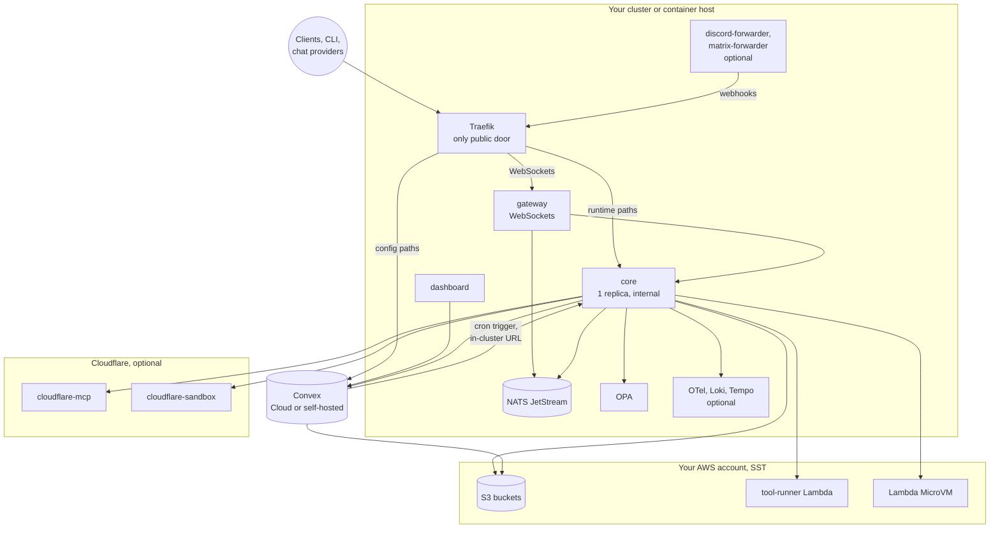
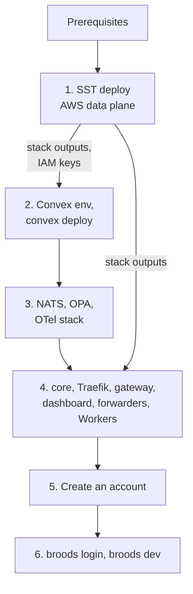
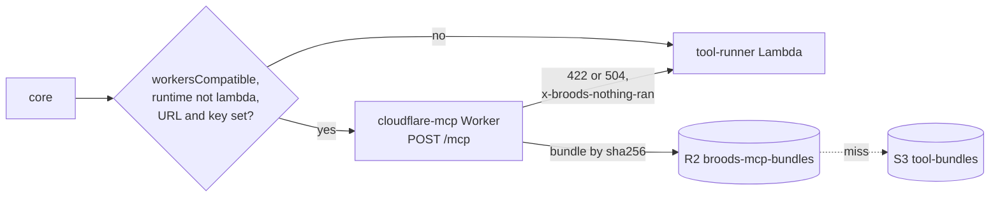
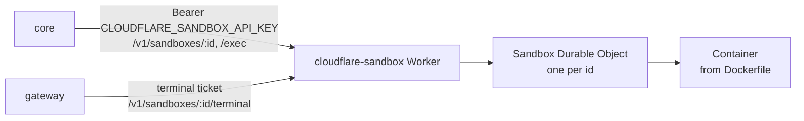
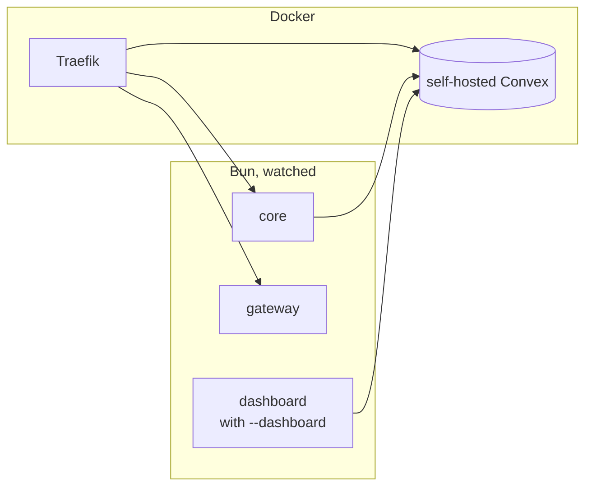

# Self-hosting

Run Broods on your own AWS account and cluster. Most users should use the managed service at `gateway.broods.app` instead, see the [quickstart](../quickstart.md); the CLI and SDK work the same against either. To try the stack on one machine first, skip to [Run it locally](#run-it-locally). Day-two work is in [operations](operations.md).

## What you deploy


```mermaid
flowchart TB
  Users(("Clients, CLI,<br/>chat providers"))

  subgraph host["Your cluster or container host"]
    Traefik["Traefik<br/>only public door"]
    Core["core<br/>1 replica, internal"]
    Gateway["gateway<br/>WebSockets"]
    Dashboard["dashboard"]
    NATS[("NATS JetStream")]
    OPA["OPA"]
    Obs["OTel, Loki, Tempo<br/>optional"]
    Fwd["discord-forwarder,<br/>matrix-forwarder<br/>optional"]
  end

  Convex[("Convex<br/>Cloud or self-hosted")]

  subgraph aws["Your AWS account, SST"]
    S3[("S3 buckets")]
    Lambda["tool-runner Lambda"]
    MicroVM["Lambda MicroVM"]
  end

  subgraph cf["Cloudflare, optional"]
    McpW["cloudflare-mcp"]
    SbxW["cloudflare-sandbox"]
  end

  Users --> Traefik
  Traefik -->|runtime paths| Core
  Traefik -->|config paths| Convex
  Traefik -->|WebSockets| Gateway
  Gateway --> Core
  Gateway --> NATS
  Dashboard --> Convex
  Core --> Convex
  Convex -->|"cron trigger,<br/>in-cluster URL"| Core
  Core --> NATS
  Core --> OPA
  Core --> Obs
  Core --> S3
  Core --> Lambda
  Core --> MicroVM
  Convex --> S3
  Fwd -->|webhooks| Traefik
  Core --> McpW
  Core --> SbxW
```

| Piece                       | Source                                           | Runs as                                                      |
| --------------------------- | ------------------------------------------------ | ------------------------------------------------------------ |
| AWS data plane              | `apps/core/sst.config.ts`                        | SST deploy into your AWS account                             |
| Convex backend              | `packages/convex`                                | Convex Cloud, or the self-hosted `convex-backend` image      |
| core                        | `apps/core/Dockerfile`                           | Container, port 3000, cluster-internal                       |
| Traefik                     | upstream, config from `apps/edge`                | The only public door                                         |
| gateway                     | `apps/gateway/Dockerfile`                        | Container, port 3000, behind Traefik                         |
| dashboard                   | `apps/dashboard/Dockerfile`                      | Container, port 3000                                         |
| NATS with JetStream         | upstream                                         | For WebSocket runs and live logs                             |
| OPA                         | upstream, with `apps/core/opa/broods_authz.rego` | For agent policies                                           |
| OTel collector, Loki, Tempo | upstream                                         | Optional. Log and trace history                              |
| discord-forwarder           | `apps/discord-forwarder/Dockerfile`              | Optional, one replica. Discord agents only                   |
| matrix-forwarder            | `apps/matrix-forwarder/Dockerfile`               | Optional, one replica, persistent volume. Matrix agents only |
| cloudflare-mcp              | `apps/cloudflare-mcp`                            | Optional Worker. Hosted MCP off Lambda                       |
| cloudflare-sandbox          | `apps/cloudflare-sandbox`                        | Optional Worker. The `cloudflare` sandbox provider           |

Images are published to `ghcr.io/beeblastco/broods-{core,gateway,dashboard,discord-forwarder,matrix-forwarder}`, or build them from the repo root with `docker build -f apps/core/Dockerfile .`.

## Setup order

Each step needs values from the one before it.


```mermaid
flowchart TD
  P["Prerequisites"] --> S1["1. SST deploy<br/>AWS data plane"]
  S1 -->|"stack outputs,<br/>IAM keys"| S2["2. Convex env,<br/>convex deploy"]
  S2 --> S3["3. NATS, OPA,<br/>OTel stack"]
  S3 --> S4["4. core, Traefik, gateway,<br/>dashboard, forwarders, Workers"]
  S1 -->|"stack outputs"| S4
  S4 --> S5["5. Create an account"]
  S5 --> S6["6. broods login, broods dev"]
```

## Prerequisites

- Bun at the version in `.bun-version`.
- An AWS account with credentials that can create S3, IAM, Lambda, EC2 networking and CloudWatch resources.
- A Kubernetes cluster or any container host.
- A Convex deployment, Cloud or self-hosted.
- No identity provider. A self-hosted dashboard signs the admin in with `ADMIN_ACCOUNT_SECRET`.

## 1. Deploy the AWS data plane

```bash
bun install --ignore-scripts
cp apps/core/.env.example apps/core/.env   # fill it in
cd apps/core
bun run deploy                             # build, then sst deploy
```

`sst.config.ts` reads only these. Runtime secrets are not SST secrets.

| Variable                      | Required | Notes                                                                                                       |
| ----------------------------- | -------- | ----------------------------------------------------------------------------------------------------------- |
| `AWS_ACCOUNT_ID`              | yes      | Role ARNs, bucket policies, resource names                                                                  |
| `PROJECT_NAME`                | yes      | Name prefix `<stage>-<project>-<service>-<account>-<region>`; production stages drop `<stage>-`             |
| `PROJECT_OWNER_EMAIL`         | yes      | Resource tags                                                                                               |
| `AWS_REGION`                  | CI only  | Defaults to `eu-west-1` locally                                                                             |
| `AWS_PROFILE`                 | local    | Ignored when `CI` is set                                                                                    |
| `SST_STAGE`                   | yes      | `dev`, `production-eu-west-1`, ... `production` and `production-*` are production                           |
| `CONVEX_URL`                  | yes      | The deploy fails without it                                                                                 |
| `CONVEX_DEPLOY_KEY`           | yes      | Deploy key, or the self-hosted admin key                                                                    |
| `OTEL_EXPORTER_OTLP_ENDPOINT` | no       | Collector for the sandbox log forwarder. Default `https://otel.beeblast.co`, so set it                      |
| `OTEL_EXPORTER_OTLP_HEADERS`  | no       | `Authorization=Basic ...`. Unset skips the sandbox log forwarder; MicroVM logs stay in CloudWatch           |
| `MCP_TENANT_ISOLATION`        | no       | `true` creates the hosted MCP Lambda in per-tenant mode. AWS must enable tenancy first; cannot change later |
| `SANDBOX_IMAGE_READY`         | no       | `true` imports the existing sandbox ECR repo instead of creating it                                         |

Stack outputs:

| Output                                                        | Feeds                                                                          |
| ------------------------------------------------------------- | ------------------------------------------------------------------------------ |
| `filesystemBucketName`                                        | core and Convex `FILESYSTEM_BUCKET_NAME`                                       |
| `skillsBucketName`                                            | core and Convex `SKILLS_BUCKET_NAME`                                           |
| `toolBundlesBucketName`                                       | core and Convex `TOOL_BUNDLES_BUCKET_NAME`                                     |
| `toolRunnerFunctionName`                                      | core `TOOL_RUNNER_FUNCTION_NAME`                                               |
| `microvmExecutionRoleArn`, `microvmEgressNetworkConnectorArn` | core `MICROVM_EXECUTION_ROLE_ARN`, `MICROVM_EGRESS_NETWORK_CONNECTOR_ARN`      |
| `microvmArtifactsBucketName`, `microvmBuildRoleArn`           | Convex `MICROVM_ARTIFACTS_BUCKET_NAME`, `MICROVM_BUILD_ROLE_ARN`               |
| `coreRuntimeUserName`                                         | `aws iam create-access-key --user-name <name>`, the key for core               |
| `convexAwsRoleArn`                                            | Convex `CONVEX_AWS_ROLE_ARN`                                                   |
| `convexBootstrapUserName`                                     | mint the key for Convex `AWS_ACCESS_KEY_ID` / `AWS_SECRET_ACCESS_KEY`          |
| `cloudflareMcpWorkerName`                                     | the Worker name, if you run [cloudflare-mcp](#cloudflare-mcp-runtime-optional) |

Fixed names, not outputs: `SANDBOX_MOUNT_ROLE_ARN` is the role `<stage>-<project>-sandbox-s3mount-<account>-<region>` (no `<stage>-` on production), and `MICROVM_LOG_GROUP_NAME` is `/broods/<stage>/microvms`. Production stages retain and protect their buckets. Add every long-lived stage to `.github/workflows/drift-cleanup.yaml`, see [CI/CD](ci-cd.md#drift-cleanup).

## 2. Configure and deploy Convex

From `packages/convex`, set each with `bunx convex env set NAME value`:

| Variable                                                                   | Required  | Notes                                                                                        |
| -------------------------------------------------------------------------- | --------- | -------------------------------------------------------------------------------------------- |
| `ACCOUNT_CONFIG_ENCRYPTION_SECRET`                                         | yes       | Same as core. Comma-separated list                                                           |
| `ADMIN_ACCOUNT_SECRET`                                                     | yes       | Same as core                                                                                 |
| `SERVICE_AUTH_SECRET`                                                      | yes       | Same as core                                                                                 |
| `STAGE_TICKET_SECRET`                                                      | yes       | Same as core                                                                                 |
| `BROODS_ACCOUNT_MANAGE_URL`                                                | yes       | Core's in-cluster URL, such as `http://core.<ns>.svc.cluster.local`. Never the public host   |
| `AWS_REGION`                                                               | yes       | The data plane region                                                                        |
| `AWS_ACCESS_KEY_ID`, `AWS_SECRET_ACCESS_KEY`                               | yes       | The bootstrap user's key. It can only assume `ConvexAwsRole`                                 |
| `CONVEX_AWS_ROLE_ARN`                                                      | yes       | `convexAwsRoleArn` output                                                                    |
| `CONVEX_AWS_EXTERNAL_ID`                                                   | no        | Default `broods-convex`                                                                      |
| `FILESYSTEM_BUCKET_NAME`, `SKILLS_BUCKET_NAME`, `TOOL_BUNDLES_BUCKET_NAME` | yes       | Stack outputs                                                                                |
| `MICROVM_ARTIFACTS_BUCKET_NAME`, `MICROVM_BUILD_ROLE_ARN`                  | no        | Refused as a workspace's own bucket or role                                                  |
| `ALLOW_PRIVATE_STORAGE_ENDPOINTS`                                          | no        | `true` accepts a private workspace `storage.endpoint`, such as MinIO. Set the same on core   |
| `BROODS_AUTH_PROVIDER`                                                     | yes       | `self-host` for the dashboard's admin session, `workos` for the managed login                |
| `BROODS_SESSION_JWKS`                                                      | dashboard | Public half of `BROODS_SESSION_SIGNING_KEY`, see [dashboard](#dashboard)                     |
| `WORKOS_API_KEY`, `WORKOS_CLIENT_ID`, `WORKOS_WEBHOOK_SECRET`              | no        | The managed service's login. Leave unset                                                     |
| `DASHBOARD_ORIGIN`                                                         | billing   | Allowed origin for Stripe return URLs                                                        |
| `STRIPE_SECRET_KEY`, `STRIPE_WEBHOOK_SECRET`, `STRIPE_PRO_PRICE_ID`        | no        | Billing                                                                                      |
| `STRIPE_PRO_PAYMENT_LINK`                                                  | no        | Payment Link Upgrade opens. Unset falls back to a Checkout Session for `STRIPE_PRO_PRICE_ID` |

Then deploy the functions, before core:

```bash
cd packages/convex
CONVEX_DEPLOY_KEY=... bun run deploy
# self-hosted backend instead:
CONVEX_SELF_HOSTED_URL=https://convex.example.com CONVEX_SELF_HOSTED_ADMIN_KEY=... bun run deploy
```

## 3. Shared services

| Service             | Needed for                | Notes                                                                                                                            |
| ------------------- | ------------------------- | -------------------------------------------------------------------------------------------------------------------------------- |
| NATS with JetStream | WebSocket runs, live logs | Core creates `WS_RESPONSES` and `OBSERVABILITY` on first use. `nats://` or `tls://` in-cluster, `wss://` or `ws://` from outside |
| OPA                 | agent policies            | Load `apps/core/opa/broods_authz.rego`. Core posts to `/v1/data/broods/authz/decision`                                           |
| OTel, Loki, Tempo   | history, optional         | Core exports to `OTEL_EXPORTER_OTLP_ENDPOINT`; the gateway reads `LOKI_URL` and `TEMPO_URL`                                      |

Without the OTel stack the dashboard shows only the live window NATS keeps.

## 4. Run the containers

Every image listens on port 3000 and answers `GET /healthz`.

### core

Refuses to start without `SERVICE_AUTH_SECRET`, `STAGE_TICKET_SECRET`, `TERMINAL_TICKET_SECRET` and `MEDIA_TICKET_SECRET`. Keep it cluster-internal and at one replica.

| Variable                                                                                                                                                | Required               | Notes                                                                |
| ------------------------------------------------------------------------------------------------------------------------------------------------------- | ---------------------- | -------------------------------------------------------------------- |
| `CONVEX_URL`, `CONVEX_DEPLOY_KEY`                                                                                                                       | yes                    | Deploy key or self-hosted admin key                                  |
| `ACCOUNT_CONFIG_ENCRYPTION_SECRET`                                                                                                                      | yes                    | Same as Convex. See [service secrets](operations.md#service-secrets) |
| `SERVICE_AUTH_SECRET`, `STAGE_TICKET_SECRET`                                                                                                            | yes                    | Same as Convex                                                       |
| `TERMINAL_TICKET_SECRET`, `MEDIA_TICKET_SECRET`                                                                                                         | yes                    | Comma-separated lists                                                |
| `ADMIN_ACCOUNT_SECRET`                                                                                                                                  | no                     | Enables `POST /v1/accounts`                                          |
| `AWS_ACCESS_KEY_ID`, `AWS_SECRET_ACCESS_KEY`, `AWS_REGION`                                                                                              | yes                    | The core runtime user's key                                          |
| `FILESYSTEM_BUCKET_NAME`, `SKILLS_BUCKET_NAME`, `TOOL_BUNDLES_BUCKET_NAME`, `TOOL_RUNNER_FUNCTION_NAME`                                                 | yes                    | Stack outputs                                                        |
| `PUBLIC_BASE_URL`                                                                                                                                       | yes                    | The public host. Sandbox job callbacks and status URLs use it        |
| `SANDBOX_MOUNT_ROLE_ARN`                                                                                                                                | for mounts             | Role assumed for prefix-scoped workspace mount credentials           |
| `MICROVM_IMAGE_IDENTIFIER`, `MICROVM_EXECUTION_ROLE_ARN`, `MICROVM_LOG_GROUP_NAME`, `MICROVM_EGRESS_NETWORK_CONNECTOR_ARN`                              | for `lambda` sandboxes | Without the connector, `deny-all` MicroVMs fail to launch            |
| `WORKDIR_URL`, `WORKDIR_API_KEY`                                                                                                                        | for `sandbox`          | The workdir control plane                                            |
| `CLOUDFLARE_SANDBOX_URL`, `CLOUDFLARE_SANDBOX_API_KEY`                                                                                                  | for `cloudflare`       | See [Cloudflare sandbox bridge](#cloudflare-sandbox-bridge-optional) |
| `CLOUDFLARE_MCP_URL`, `CLOUDFLARE_MCP_API_KEY`                                                                                                          | for Cloudflare MCP     | See [Cloudflare MCP runtime](#cloudflare-mcp-runtime-optional)       |
| `DAYTONA_API_KEY`, `DAYTONA_API_URL`, `DAYTONA_ORGANIZATION_ID`, `DAYTONA_TARGET`; `E2B_API_KEY`; `VERCEL_TOKEN`, `VERCEL_TEAM_ID`, `VERCEL_PROJECT_ID` | no                     | Fallbacks for sandbox configs that omit their own                    |
| `ENABLE_WEBSOCKET`, `NATS_URL`, `NATS_TOKEN`                                                                                                            | for WebSocket          | `ENABLE_WEBSOCKET=true` needs `NATS_URL`                             |
| `OPA_BASE_URL`, `OPA_API_TOKEN`                                                                                                                         | for policies           | Default `http://127.0.0.1:8181`                                      |
| `MATRIX_FORWARDER_URL`                                                                                                                                  | for Matrix             | In-cluster URL of the matrix-forwarder                               |
| `OTEL_EXPORTER_OTLP_ENDPOINT`, `OTEL_EXPORTER_OTLP_HEADERS`, `SERVICE_NAME`, `DEPLOYMENT_ENVIRONMENT`                                                   | no                     | No endpoint means no export                                          |
| `ENABLE_DIRECT_API`                                                                                                                                     | no                     | Default `true`. `false` turns `POST /v1/runs` off                    |
| `ALLOW_PRIVATE_STORAGE_ENDPOINTS`                                                                                                                       | no                     | Same as on Convex                                                    |
| `BROODS_CONTAINER_RUNTIME`                                                                                                                              | no                     | Set in a deployed pod; enables isolate prewarm. Leave unset locally  |

Tuning knobs, with defaults: `REQUEST_TIMEOUT_BUDGET_MS` 600000, `WORKER_TIMEOUT_BUDGET_MS` 600000, `MAX_INPROCESS_WORKERS` 8, `MODEL_FIRST_CHUNK_TIMEOUT_MS` 300000, `MODEL_CHUNK_TIMEOUT_MS` 300000, `SHUTDOWN_DEADLINE_MS` 25000, `MCP_BATCH_WINDOW_MS`, `MCP_BATCH_MAX`, `ISOLATE_POOL`, `ISOLATE_WORKER_POOL_SIZE` 4, `ISOLATE_MEMORY_LIMIT_MB`, `ISOLATE_RUNNER_TIMEOUT_SECONDS`, `SANDBOX_SWEEP_INTERVAL_SECONDS` 3600, and the `WORKSPACE_SANDBOX_*` limits in `apps/core/src/shared/sandbox.ts`. What they do is in [operations](operations.md#core-runtime-limits).

Model and tool API keys are never deployment-wide. Accounts set them in agent config or as stage env vars.

### Traefik

Generate the file-provider config from the route table: the three upstreams, then the hostnames your dashboard is served from (`*.` for subdomains; default is the broods.app ones and localhost).

```bash
bun run --filter @broods/edge generate file \
  http://core:3000 https://your-deployment.convex.site http://gateway:3000 \
  agents.example.com localhost > edge.yaml
```

- Load it with `--providers.file.filename=edge.yaml` on an entry point named `web`, with TLS in front.
- Set the same hostnames in the gateway's `GATEWAY_ALLOWED_ORIGINS`.
- Regenerate on every upgrade: a missing route lands on the wrong upstream.
- The file config has no per-address rate limits. The managed ones are the `rateLimit` middlewares in `apps/edge/src/traefik.ts`.

### gateway

Stateless; scale it with replicas.

| Variable                                                                                                                                             | Required               | Notes                                                                                       |
| ---------------------------------------------------------------------------------------------------------------------------------------------------- | ---------------------- | ------------------------------------------------------------------------------------------- |
| `BROODS_CORE_URL`                                                                                                                                    | yes                    | Core's URL, for socket token checks, agent runs and the machine relay                       |
| `TERMINAL_TICKET_SECRET`                                                                                                                             | yes                    | Same list as core                                                                           |
| `NATS_URL`, `NATS_TOKEN`                                                                                                                             | for WebSocket and logs | Connected on first use                                                                      |
| `LOKI_URL`, `TEMPO_URL`                                                                                                                              | no                     | Log and trace history                                                                       |
| `GATEWAY_ALLOWED_ORIGINS`                                                                                                                            | no                     | WebSocket origin allow list. Default `broods.app`, `*.broods.app`, `localhost`, `127.0.0.1` |
| `GATEWAY_MAX_CONNECTIONS`, `GATEWAY_MAX_PAYLOAD_BYTES`, `GATEWAY_BACKPRESSURE_BYTES`, `GATEWAY_IDLE_TIMEOUT_SECONDS`, `GATEWAY_RUN_START_TIMEOUT_MS` | no                     | Per-pod limits. See `apps/gateway/.env.example`                                             |
| `GATEWAY_AUTH_FAILURES_PER_MINUTE`                                                                                                                   | no                     | Failed socket logins per client address. Default 20                                         |

### dashboard

| Variable                      | When       | Notes                                                                           |
| ----------------------------- | ---------- | ------------------------------------------------------------------------------- |
| `NEXT_PUBLIC_CONVEX_URL`      | build time | Your Convex URL                                                                 |
| `NEXT_PUBLIC_BROODS_BASE_URL` | build time | The public host                                                                 |
| `ADMIN_ACCOUNT_SECRET`        | runtime    | The admin sign-in key. At least 32 characters or the dashboard refuses to start |
| `BROODS_SESSION_SIGNING_KEY`  | runtime    | Private ES256 JWK that signs the session                                        |
| `CONVEX_SITE_URL`             | runtime    | A self-hosted Convex has no derivable `.convex.site` host                       |

Make the key pair once. The first line goes to the dashboard, the second to Convex:

```bash
bun -e 'const { privateKey } = require("node:crypto").generateKeyPairSync("ec", { namedCurve: "P-256" }); const jwk = { ...privateKey.export({ format: "jwk" }), alg: "ES256", kid: "broods-self-host", use: "sig" }; const { d, ...pub } = jwk; console.log("BROODS_SESSION_SIGNING_KEY=" + JSON.stringify(jwk)); console.log("BROODS_SESSION_JWKS=" + JSON.stringify({ keys: [pub] }))'
```

A session lasts 12 hours in an httpOnly cookie; the browser's Convex tokens last 15 minutes. To end every session at once, make a new key pair and set both values. Rotating `ADMIN_ACCOUNT_SECRET` does not end sessions. See `apps/dashboard/.env.example`.

### Forwarders

Only for Discord or Matrix agents. One release each for every Convex deployment you run, one replica, `strategy: Recreate`. See [operations](operations.md#forwarders) for why.

| Variable                     | Forwarder | Notes                                                                                                   |
| ---------------------------- | --------- | ------------------------------------------------------------------------------------------------------- |
| `BROODS_CONFIG_PLANES`       | both      | JSON array of `{ "name", "convexUrl", "webhookBaseUrl" }`. `webhookBaseUrl` is that plane's public host |
| `CONVEX_DEPLOY_KEY_<NAME>`   | both      | One key per plane, upper-cased: plane `dev` reads `CONVEX_DEPLOY_KEY_DEV`                               |
| `DISCORD_BACKOFF_CEILING_MS` | discord   | Default 300000                                                                                          |
| `DISCORD_IDENTIFY_LIMIT`     | discord   | Default 500, half of Discord's 1000 per 24 hours                                                        |
| `MATRIX_STORE_DIR`           | matrix    | Required. Must be a persistent volume                                                                   |

### Cloudflare MCP runtime (optional)

Runs [hosted MCP servers on Cloudflare Workers](../guides/tools.md#where-a-hosted-server-runs) instead of the tool-runner Lambda. `apps/cloudflare-mcp` is one Worker with a `LOADER` [Worker Loader](https://developers.cloudflare.com/dynamic-workers/) binding, which needs a Workers Paid plan. How it runs a batch is in [tools and MCP](tools-and-mcp.md).


```mermaid
flowchart LR
  Core[core] --> Q{"workersCompatible,<br/>runtime not lambda,<br/>URL and key set?"}
  Q -->|no| L["tool-runner Lambda"]
  Q -->|yes| W["cloudflare-mcp Worker<br/>POST /mcp"]
  W -->|"bundle by sha256"| R2[("R2 broods-mcp-bundles")]
  R2 -.->|miss| S3[("S3 tool-bundles")]
  W -->|"422 or 504,<br/>x-broods-nothing-ran"| L
```

Only a response tagged `x-broods-nothing-ran` reruns on Lambda; any other error fails the call. From `apps/cloudflare-mcp`:

```bash
bunx wrangler r2 bucket create broods-mcp-bundles
bunx wrangler r2 bucket lifecycle set broods-mcp-bundles --file r2-lifecycle.json --force   # 30-day expiry
bunx wrangler secret put MCP_API_KEY
bunx wrangler deploy --var "BUNDLE_ORIGIN:https://<toolBundlesBucketName>.s3.<region>.amazonaws.com"
```

Then set core's `CLOUDFLARE_MCP_URL` to `https://<worker-host>/mcp` and `CLOUDFLARE_MCP_API_KEY` to the same secret. Until both are set, every server runs on Lambda.

### Cloudflare sandbox bridge (optional)

Backs the [`cloudflare` sandbox provider](../guides/sandboxes/providers.md#cloudflare). The Container API only answers inside a Durable Object, so core calls `apps/cloudflare-sandbox`, a Worker where each sandbox id is one Durable Object owning one Container. Details are in [sandboxes](sandboxes.md#cloudflare).


```mermaid
flowchart LR
  Core[core] -->|"Bearer CLOUDFLARE_SANDBOX_API_KEY<br/>/v1/sandboxes/:id, /exec"| B["cloudflare-sandbox Worker"]
  Gateway[gateway] -->|"terminal ticket<br/>/v1/sandboxes/:id/terminal"| B
  B --> DO["Sandbox Durable Object<br/>one per id"]
  DO --> C["Container<br/>from Dockerfile"]
```

From `apps/cloudflare-sandbox` (`wrangler deploy` builds the `Dockerfile` image):

```bash
bunx wrangler secret put SANDBOX_API_KEY
bunx wrangler deploy
```

Then set core's `CLOUDFLARE_SANDBOX_URL` to the Worker's `https://` URL and `CLOUDFLARE_SANDBOX_API_KEY` to the same secret. Plain `http://` is accepted only on loopback, for `wrangler dev`. This provider cannot mount workspaces.

## 5. Create an account

With the dashboard, sign in with the admin key and the account is provisioned for your organization. Without it:

```bash
curl -X POST "$BROODS_BASE_URL/v1/accounts" \
  -H "Authorization: Bearer $ADMIN_ACCOUNT_SECRET" \
  -H "Content-Type: application/json" \
  -d '{ "username": "company-a", "description": "Company A account" }'
```

The response holds the account `secret` once. That account belongs to an admin-owned org with no dashboard login; drive it with the account API or `BroodsAccountClient`.

## 6. Point the CLI at it

```bash
broods login --dashboard-url https://dashboard.example.com
broods dev
```

`login` records `BROODS_BASE_URL` in `.env.local`, so `broods run`, `broods logs` and SDK clients reach the same deployment. A runtime key only works on the deployment that issued it. In CI, set `BROODS_TOKEN` to a project key and `BROODS_BASE_URL`.

## Webhook URLs

```text
{BROODS_BASE_URL}/v1/webhooks/{accountId}/{channel}                   # production stages
{BROODS_BASE_URL}/v1/webhooks/{accountId}/dev/{endpointId}/{channel}  # other stages
```

`broods dev` prints the endpoint id after a sync. The bare URL picks the agent whose credentials verify, so a second stage with the same bot token competes for its traffic. The stage URL reaches only that stage.

## Smoke test

```bash
curl https://gateway.example.com/healthz
# {"status":"ok","activeWebSockets":0,"maxWebSockets":10000}

bun run --filter broods build
cd packages/demos/basic-stream
echo 'BROODS_BASE_URL=https://gateway.example.com' >> .env.local
bun install && bun run dev && bun run start
```

`basic-async` does the same with `background: true` and polling. `packages/demos/README.md` lists the rest.

## Run it locally


```mermaid
flowchart LR
  subgraph docker["Docker"]
    T[Traefik]
    C[("self-hosted Convex")]
  end
  subgraph bun["Bun, watched"]
    Core[core]
    GW[gateway]
    D["dashboard<br/>with --dashboard"]
  end
  T --> Core
  T --> C
  T --> GW
  Core --> C
  D --> C
```

```bash
bun run local:up        # --fresh wipes the instance first, --dashboard serves the dashboard
bun run local:verify    # runs scripts/local-verify/cases through Traefik
bun run local:status    # --key prints the admin sign-in key
bun run local:down      # --purge deletes the instance state
```

- State, ports and logs live under `~/.broods-local/<instance>/`, one stack per worktree.
- `verify` passes without a model key: the run fails at the provider call, which still proves routing, auth, config encryption and the Convex round trips. Set `DEEPSEEK_API_KEY` for a full run.
- No AWS data plane or NATS, so no sandboxes or WebSocket runs.

The signed-in dashboard suites run against it with no account to set up:

```bash
cd apps/dashboard
E2E_ADMIN_KEY=$(bun ../../scripts/local-stack.ts status --key) E2E_BASE_URL=<dashboard URL> bun run test:app
```
