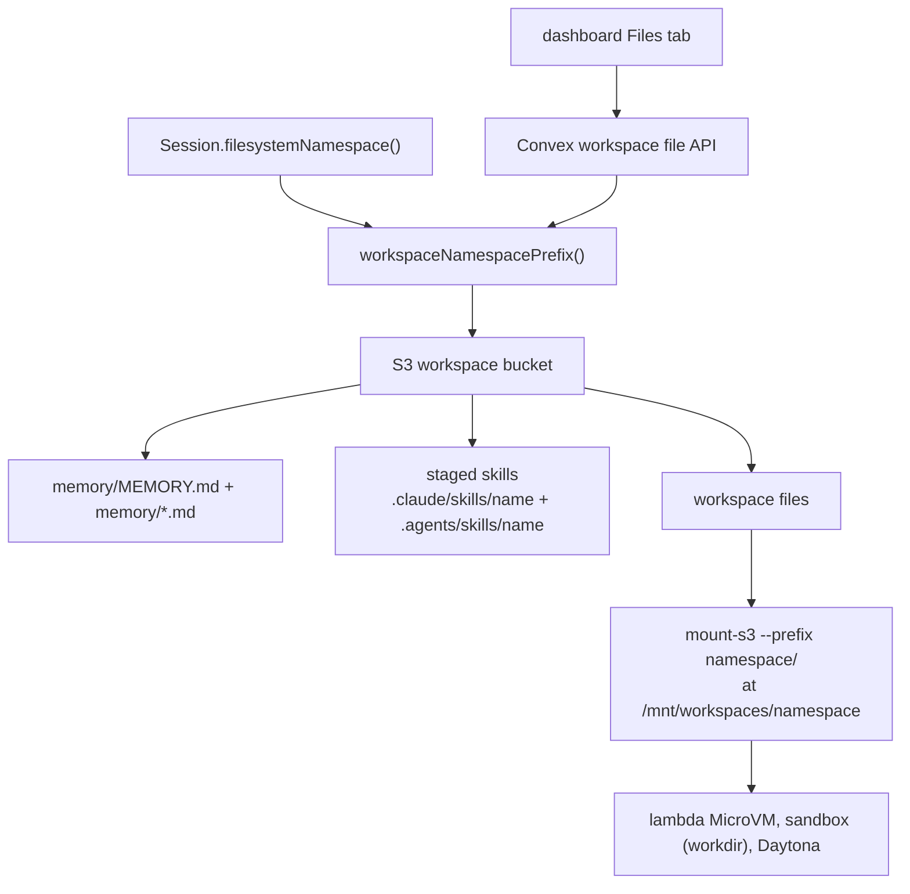
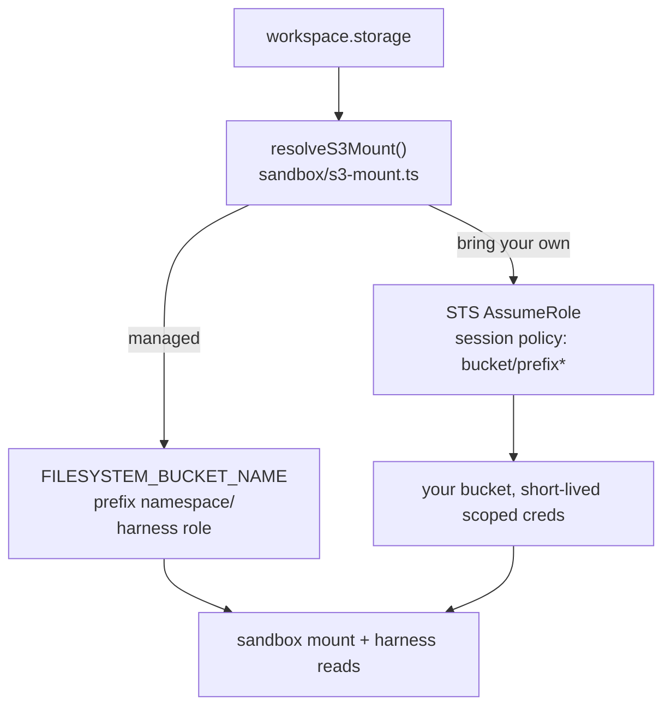
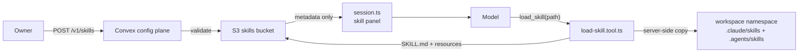

# Storage

This page covers where workspace files, memory and skills live in S3, how the harness and the sandbox mount reach the same bytes, and the consistency rules between them. The user-facing model is in [Workspaces](../guides/workspaces.md), [Memory and sessions](../guides/memory-and-sessions.md) and [Skills](../guides/skills.md). Paths are relative to `apps/core/`.

## Key layout

A workspace's files live directly under `<namespace>/` in the managed bucket (`FILESYSTEM_BUCKET_NAME`). The namespace is `fs-<40 hex>`, a hash of `accountId:workspaceId` from `normalizeFilesystemNamespace()` in `src/shared/runtime-keys.ts`. Partitioning adds child folders below it, never another bucket.

The layout is single-sourced in `workspaceNamespacePrefix()` in `src/shared/sandbox.ts`. Harness-side S3 reads and writes and the sandbox's `mount-s3` mount both go through it, so changing it there moves both together. The `<namespace>/` segment is also the tenant boundary the per-mount IAM session policy is scoped to.

Every S3-backed provider mounts the prefix with `mount-s3` (Mountpoint for S3). The MicroVM mounts from its `/run` lifecycle hook; workdir and Daytona mount per run. E2B and Vercel are not wired to S3 workspaces, and attaching one fails fast instead of silently using provider-native state. `src/harness/sandbox/s3-mount.ts` resolves the mount target and credentials the same way for every provider.

Mountpoint for S3 supports whole-file create and overwrite only. Appending (`>>`) and in-place edits fail, which is why the `write` and `edit` tools rewrite whole files.

## Two doors to the same bytes

The mount and the S3 API are not interchangeable, because the mount syncs to the bucket asymmetrically:

- Bucket to mount. An object the harness wrote with `PutObject` or `CopyObject` appears in the mount without remounting, after a short propagation delay.
- Mount to bucket. A file the agent wrote through `bash` or the file tools is visible in the mount at once, but the S3 API does not list or return it for about 1 to 2 minutes. Measured: not visible at +0 s or +45 s, visible at +120 s.

Pick the door by who last wrote the file, not by elapsed time:

| Reading                                                                                             | Last writer    | Read through                                       |
| --------------------------------------------------------------------------------------------------- | -------------- | -------------------------------------------------- |
| Agent-written files, including agent-edited `MEMORY.md`                                             | sandbox mount  | The mount: `bash`, `read`, `glob`, `grep`          |
| Harness-written files: the `.stage.json` manifest, staged skill copies, sandbox artifact write-back | harness via S3 | The S3 API (`src/shared/s3.ts`)                    |
| The account skills bucket                                                                           | harness via S3 | The S3 API. It is a separate bucket, never mounted |

The agent always reads through the mount, so it always sees its own writes. The choice only applies to harness-side reads.

Read-only workspaces read through a service-managed read-only mount by default, with the same fresh-read semantics. `sandbox: null` opts out and reads S3 directly under the same prefix: no mount, no cold start, but lagged.

Known exception: `Session.loadMemoryFile` reads `MEMORY.md` through the S3 API at the start of each turn. If the agent edited it less than about 2 minutes earlier, that read can be stale. This is accepted because memory converges across turns and a sandbox round trip every turn is costly. Route prompt-time memory reads through a sandbox-backed `read` if freshness ever becomes a hard requirement.

## Bring-your-own bucket

A workspace can set `storage.bucket`, `region`, `prefix`, optional `endpoint`, and `auth: { type: "assumeRole", roleArn, externalId }`. Platform credentials only ever reach the managed bucket, so validation refuses a BYO bucket unless:

- `auth.type` is `assumeRole`. `managed` or missing auth is valid only without a `bucket`.
- `bucket` is not one of the platform's own buckets, compared case-insensitively.
- `auth.roleArn` is an IAM role outside the platform AWS account.
- `prefix` is set. Mount credentials are scoped to `bucket/prefix/*`, a directory boundary.
- `endpoint`, when set, is a public `https` URL and appears only with `bucket`. The sandbox `options.s3Endpoint` follows the same rule. A self-hosted deployment can allow private endpoints (MinIO on the cluster network, single-label hosts like `http://minio:9000`) with `ALLOW_PRIVATE_STORAGE_ENDPOINTS=true` on both core and Convex. A public host still needs `https`.

The config API, `broods deploy` and the dashboard canvas check these on save, and core and the config plane check them again every time storage is resolved. A workspace stored before a rule existed fails with the same error instead of falling back to platform credentials.

For `assumeRole`, the harness calls STS and narrows the session with a policy scoped to `bucket/prefix*`, so the credentials handed to a sandbox can only touch that prefix. The mount and harness-side reads resolve the same target. Workdir passes the credentials per exec to `mount-s3`, Daytona injects them into the run environment, and the MicroVM receives them in its `runHookPayload`.

Workspace config is stored in plaintext, so no access keys are ever stored in it. Static access keys for non-AWS stores (R2, MinIO tokens) are not supported yet, and `assumeRole` is an AWS STS call. `provider` stays `s3` for every S3-compatible vendor; it is reserved for a different protocol such as native Azure Blob or GCS.

Under `deny-all` or `restricted` networking, a MicroVM can reach only the deployment's own managed bucket, so BYO-bucket workspaces need `allow-all`.

## Dashboard Files panel

The dashboard Files tab lists and mutates the same S3 namespace through the authenticated Convex workspace file API, so uploads, renames and deletes change the files the agent mounts. Convex file storage is used only for editable skill-node bundles.

- The last confirmed tree is cached in memory and `sessionStorage` and painted immediately, then revalidated. File contents and signed URLs are never cached.
- Uploads show as pending rows until S3 confirms. Rename and delete update optimistically, then reload; a failure restores server state.
- While visible, the panel lists S3 every 5 seconds, and again on focus, tab restore or Refresh. Overlapping lists dedup, and an older response cannot overwrite a newer optimistic change.
- The panel cannot show an agent write before the mount has exported it to S3.
- Dashboard uploads are capped at 512 KiB per file because the base64 payload crosses a Convex action. Agents can write larger files through the mount.
- On first load, legacy canvas-node files are copied from Convex storage to S3 and removed. Existing S3 paths win.

`GET /v1/workspaces/{id}/files?path=` returns a presigned URL, about 1.4 KB long and valid for 5 minutes. `POST /v1/workspaces/{id}/download-links` mints a short token under `/v1/downloads/{token}` that redirects to a fresh presigned URL, default 24 hours and at most 30 days. Tokens are stored in `workspaceDownloadTokens`, and deleting the workspace or account revokes them.

## Sessions and memory

`Session` in `src/harness/session.ts` owns the runtime path:

- `claim()` dedups an inbound event in `runtimeClaims`.
- The conversation lease serializes work per conversation, fenced by owner generation. See [queue and steer](queue-and-steer.md).
- `appendIngressEvents()` persists incoming user, assistant, tool and persisted system messages to `runtimeConversationEvents`.
- `createTurnContext()` loads history, builds system prompt parts, runs compaction when configured (`compaction.ts`) and prunes model-visible messages (`pruning.ts`).
- `resolvedWorkspaces()`, backed by `resolveAgentRuntime()` in `src/shared/workspaces.ts`, resolves workspace and sandbox records, applies per-workspace overrides and hashes namespaces.

Structured memory is one markdown file per fact under `memory/`, indexed by `memory/MEMORY.md`. `memory_save` (`tools/memory.tool.ts`) writes an entry and updates the index through the sandbox write path. The index is loaded into the system prompt when it exists.

## Skills

Skills are stored by the Convex config plane in the skills bucket under `<accountId>/<skill-name>`. The path comes from the `SKILL.md` frontmatter name, not the upload folder.

- `session.ts` lists allowed skill metadata (path, name, description) in the prompt. `load_skill` returns `SKILL.md` and any requested resources through the S3 API, which works with no workspace or sandbox.
- With a workspace attached, every `load_skill` re-stages a fresh copy into `<namespace>/.claude/skills/<name>` and mirrors it to `.agents/skills/<name>`, dropping stale files first. It uses S3 server-side copy, so bytes do not stream through core.
- Script files (`.sh`, `.bash`, `.zsh`, `.py`, `.js`, `.mjs`, `.ts`) are staged with executable POSIX metadata so shebang scripts run directly. Other text files are staged non-executable.
- Validation: lowercase letters, digits and hyphens, at most 64 characters, no `anthropic` or `claude`, no XML tags; 5 MB per file, 30 MB per bundle, text types only.

Design rules:

- Skill CRUD stays in the Convex config plane (`packages/convex/config/http.ts`, `packages/convex/model/skills.ts`).
- Shared runtime validation and S3 path rules stay in `src/shared/skills.ts`.
- The model-facing `load_skill` schema stays in `src/harness/tools/load-skill.tool.ts`.
- Editing a skill goes through an editable workspace and the normal file tools, never through `load_skill`.

## Future external storage

S3-compatible stores (R2, MinIO, Wasabi, B2) need an access-key auth type that references account env vars; `endpoint` is already in the BYO contract for them. Non-S3 providers (Google Drive, native GCS, Azure Blob) would go behind a new `storage.provider`, and must still:

- keep one logical namespace for memory, staged skills and files,
- mount or sync that namespace into the sandbox's workspace root,
- stay out of `session.ts` and the agent loop.
