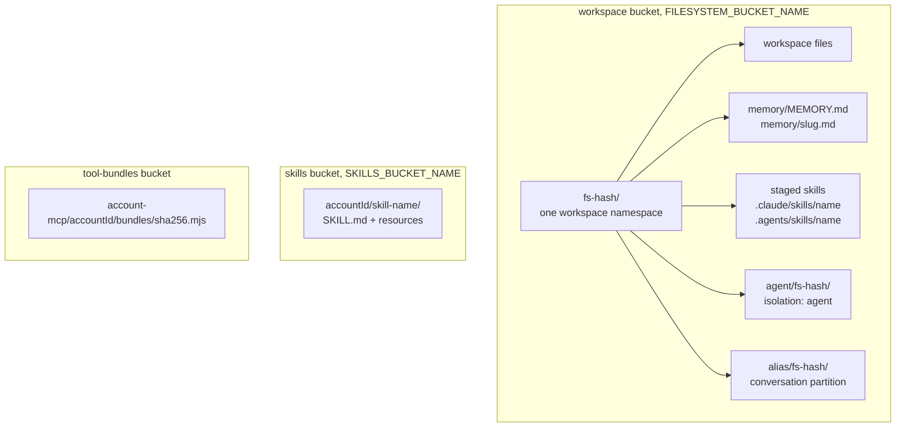
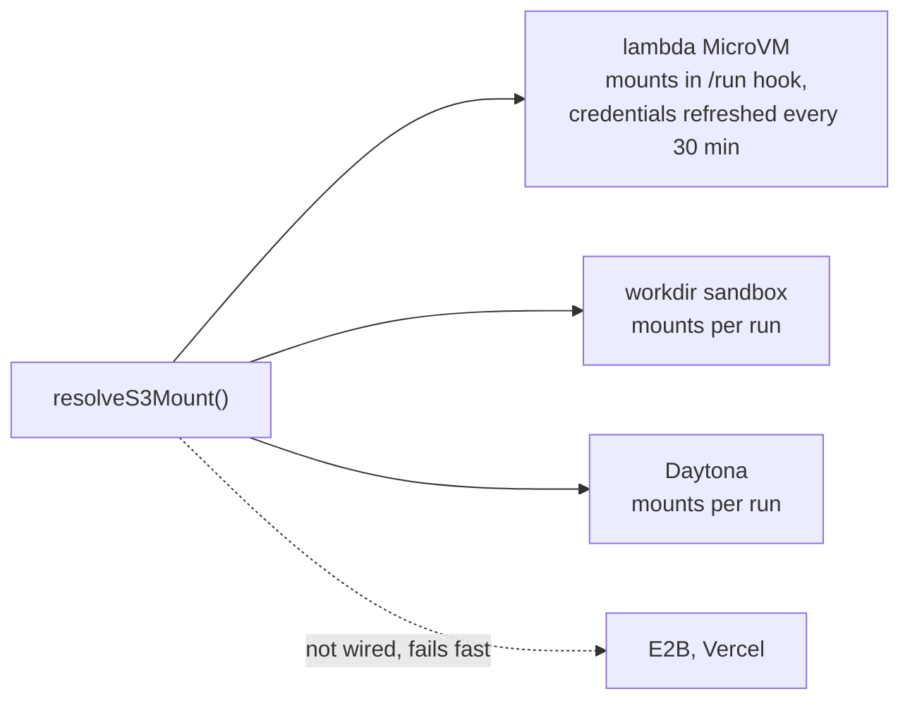
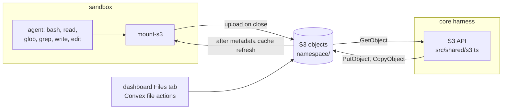
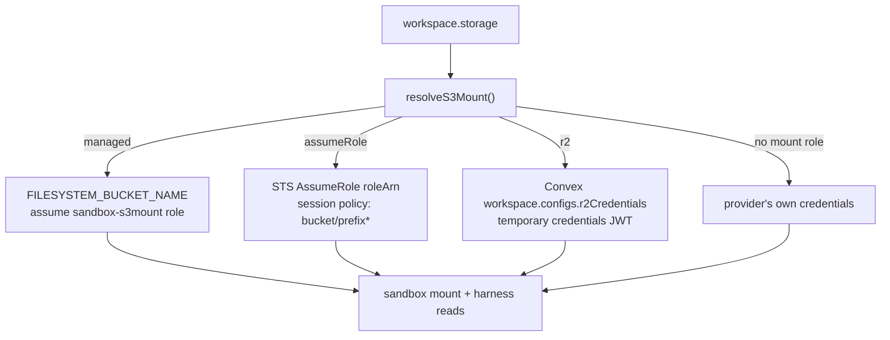
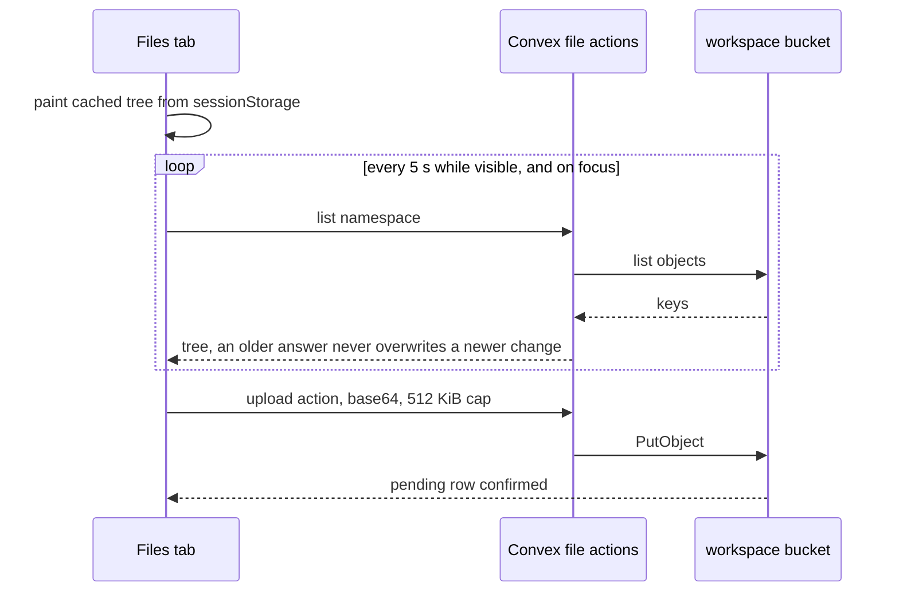
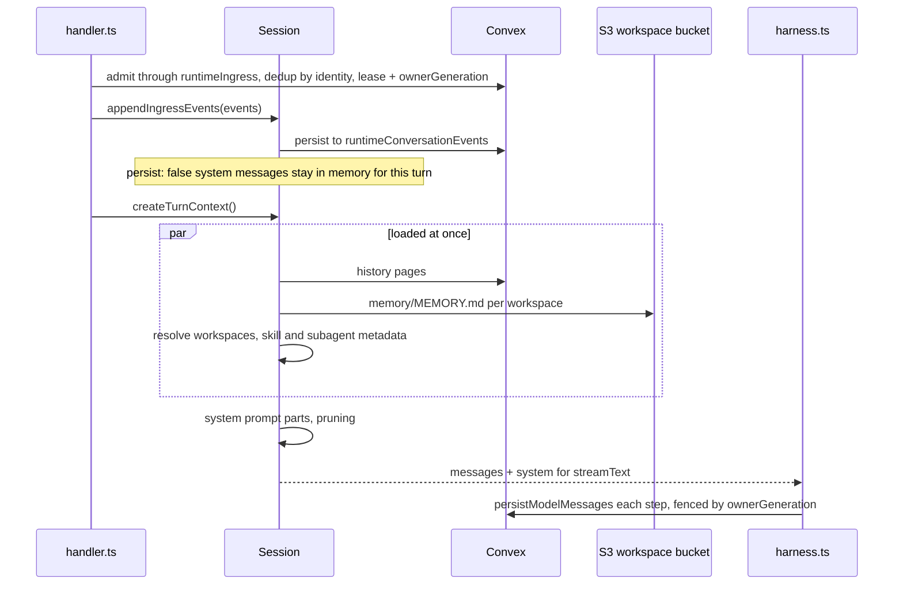
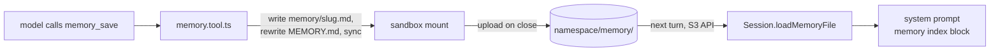
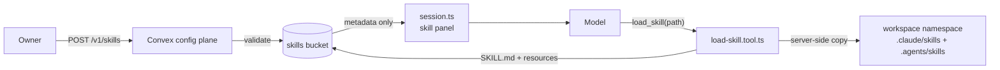

# Storage

Where workspace files, memory and skills live in S3, how the harness and the sandbox mount reach the same bytes, and what one turn reads and writes. The user-facing model is in [Workspaces](../guides/workspaces.md), [Memory and sessions](../guides/memory-and-sessions.md) and [Skills](../guides/skills.md). Paths are relative to `apps/core/`.

## Key layout

```mermaid
flowchart TD
  subgraph FS["workspace bucket, FILESYSTEM_BUCKET_NAME"]
    NS["fs-hash/<br/>one workspace namespace"]
    NS --> Files["workspace files"]
    NS --> Mem["memory/MEMORY.md<br/>memory/slug.md"]
    NS --> Sk["staged skills<br/>.claude/skills/name<br/>.agents/skills/name"]
    NS --> AgentNs["agent/fs-hash/<br/>isolation: agent"]
    NS --> ConvNs["alias/fs-hash/<br/>conversation partition"]
  end
  subgraph SK["skills bucket, SKILLS_BUCKET_NAME"]
    Skill["accountId/skill-name/<br/>SKILL.md + resources"]
  end
  subgraph TB["tool-bundles bucket"]
    Bundle["account-mcp/accountId/bundles/sha256.mjs"]
  end
```

- The namespace is `fs-` plus the first 40 hex of a scoped SHA-256 of `accountId:workspaceId` (`workspaceNamespace()` in `src/shared/workspaces.ts`, `normalizeFilesystemNamespace()` in `src/shared/runtime-keys.ts`).
- `isolatedWorkspaceNamespace()` adds child folders for agent isolation and conversation partitions, never another bucket.
- `workspaceNamespacePrefix()` in `src/shared/sandbox.ts` is the one place the prefix is built. Harness S3 calls and the sandbox mount both use it, and the per-mount IAM session policy is scoped to it.

Every S3-backed provider mounts the prefix with Mountpoint for S3 (`mount-s3`) at `/mnt/workspaces/<namespace>`. `src/harness/sandbox/s3-mount.ts` resolves target and credentials the same way for all of them.

```mermaid
flowchart LR
  Resolve["resolveS3Mount()"] --> VM["lambda MicroVM<br/>mounts in /run hook,<br/>credentials refreshed every 30 min"]
  Resolve --> Wd["workdir sandbox<br/>mounts per run"]
  Resolve --> Dt["Daytona<br/>mounts per run"]
  Resolve -.->|"not wired, fails fast"| EV["E2B, Vercel"]
```

Mountpoint supports whole-file create and overwrite only. `>>`, in-place edits and `rename()` fail with `EPERM`, so `write`, `edit` and `memory_save` rewrite whole files in one `>` pass and `sync` after writing.

## Two doors to the same bytes

```mermaid
flowchart LR
  subgraph Sandbox["sandbox"]
    Agent["agent: bash, read,<br/>glob, grep, write, edit"] --> Mount["mount-s3"]
  end
  subgraph Core["core harness"]
    Api["S3 API<br/>src/shared/s3.ts"]
  end
  Mount -->|"upload on close"| Obj[("S3 objects<br/>namespace/")]
  Obj -->|"after metadata cache refresh"| Mount
  Api -->|"PutObject, CopyObject"| Obj
  Obj -->|"GetObject"| Api
  Dash["dashboard Files tab<br/>Convex file actions"] --> Obj
```

The agent always reads through the mount, so it sees its own writes at once. Harness reads pick the door by who last wrote the file:

| Reading                                                           | Last writer    | Read through                              |
| ----------------------------------------------------------------- | -------------- | ----------------------------------------- |
| Agent-written files, including agent-edited `MEMORY.md`           | sandbox mount  | the mount: `bash`, `read`, `glob`, `grep` |
| Harness-written files: staged skills, sandbox artifact write-back | harness via S3 | the S3 API                                |
| The skills bucket                                                 | harness via S3 | the S3 API. Never mounted                 |

- A read-only workspace reads through a service-managed read-only mount. `sandbox: null` reads S3 directly instead: no cold start, but reads can lag. A read-only workspace on a bring-your-own bucket always reads S3 directly, because the mount's `deny-all` network reaches only the managed bucket.
- Known exception: `Session.loadMemoryFile` reads `memory/MEMORY.md` over the S3 API every turn, so a workspace with no sandbox still serves memory. A read before the agent's last edit reached the bucket is stale; memory converges across turns.

## Bring-your-own bucket

A workspace can set `storage.bucket`, `region`, `prefix`, optional `endpoint`, and `auth` of `{ type: "assumeRole", roleArn, externalId }` or `{ type: "r2", accessKeyId, secretAccessKey }`.

```mermaid
flowchart TD
  Storage["workspace.storage"] --> Resolve["resolveS3Mount()"]
  Resolve -->|"managed"| Managed["FILESYSTEM_BUCKET_NAME<br/>assume sandbox-s3mount role"]
  Resolve -->|"assumeRole"| STS["STS AssumeRole roleArn<br/>session policy: bucket/prefix*"]
  Resolve -->|"r2"| Mint["Convex workspace.configs.r2Credentials<br/>temporary credentials JWT"]
  Resolve -->|"no mount role"| Prov["provider's own credentials"]
  Managed --> Use["sandbox mount + harness reads"]
  STS --> Use
  Mint --> Use
  Prov --> Use
```

Validation refuses a BYO bucket unless:

- `auth.type` is `assumeRole` or `r2`. `managed` or no auth is valid only without `bucket`.
- `r2` keys are each a single `${NAME}` env ref and `endpoint` is the account's `https://<account id>.r2.cloudflarestorage.com`.
- `bucket` is not a platform bucket, and `roleArn` is outside the platform AWS account.
- `prefix` is set. Credentials are scoped to `bucket/prefix*`, and the prefix must end in `/`.
- `endpoint` is public `https`. `ALLOW_PRIVATE_STORAGE_ENDPOINTS=true` on core and Convex allows private hosts such as MinIO on a self-hosted cluster.

The config API, `broods deploy` and the canvas check on save; core and the config plane check again every time storage resolves, so an old row fails instead of falling back to platform credentials.

- Every assumed session lasts one hour and allows object reads and writes on `bucket/prefix*` and `ListBucket` under that prefix only. Naming and session tags: see [sandboxes](sandboxes.md#isolation-levels).
- R2: Convex decrypts the two env values and signs Cloudflare's temporary-credential JWT (`model/r2Credentials.ts`, HS256, `object-read-write`, one prefix, one hour). The parent secret never leaves Convex. Core finds the row through `storage.owner`, which only core stamps on its in-memory copy.
- BYO read targets are cached until 10 minutes before expiry, R2 ones for at most a minute.
- Static access keys for other stores are not supported, since they would hand the parent key to the sandbox.
- Under `deny-all` or `restricted` networking a MicroVM reaches S3 only through the gateway endpoint for the managed bucket, so BYO workspaces on `lambda` need `allow-all`.

## Dashboard Files panel

The Files tab lists and mutates the same namespace through Convex file actions (`packages/convex/workspace/filesPublic.ts`). API uploads go through a Convex upload URL instead, one `uploadGrants` row each, at most 20 open per account per hour; blobs no file references are deleted after a day.

```mermaid
sequenceDiagram
  participant D as Files tab
  participant CV as Convex file actions
  participant S3 as workspace bucket

  D->>D: paint cached tree from sessionStorage
  loop every 5 s while visible, and on focus
    D->>CV: list namespace
    CV->>S3: list objects
    S3-->>CV: keys
    CV-->>D: tree, an older answer never overwrites a newer change
  end
  D->>CV: upload action, base64, 512 KiB cap
  CV->>S3: PutObject
  S3-->>D: pending row confirmed
```

- Rename and delete update optimistically and restore server state on failure. File contents and signed URLs are never cached.
- An agent write shows only after the mount uploads it.
- `GET /v1/workspaces/:id/files?path=` returns a presigned URL valid 5 minutes. `POST /v1/workspaces/:id/download-links` mints `/v1/downloads/:token`, valid 24 hours by default and at most 30 days, stored in `workspaceDownloadTokens` and revoked with the workspace or account (`packages/convex/workspace/files.ts`, routes in `packages/convex/config/routes/workspaceFiles.ts`).

## Sessions and memory

`Session` in `src/harness/session.ts` owns the runtime path. What one turn reads and writes:

```mermaid
sequenceDiagram
  participant H as handler.ts
  participant S as Session
  participant CVX as Convex
  participant S3 as S3 workspace bucket
  participant M as harness.ts

  H->>CVX: admit through runtimeIngress, dedup by identity, lease + ownerGeneration
  H->>S: appendIngressEvents(events)
  S->>CVX: persist to runtimeConversationEvents
  Note over S: persist: false system messages stay in memory for this turn
  H->>S: createTurnContext()
  par loaded at once
    S->>CVX: history pages
    S->>S3: memory/MEMORY.md per workspace
    S->>S: resolve workspaces, skill and subagent metadata
  end
  S->>S: system prompt parts, pruning
  S-->>M: messages + system for streamText
  M->>CVX: persistModelMessages each step, fenced by ownerGeneration
```

- Admission dedups a turn by ingress identity. `claim()` in `runtimeClaims` guards only channel commands such as `/clear` and context-only messages. The lease is in [queue and steer](queue-and-steer.md).
- `compactConversation()` (`compaction.ts`) folds history into a summary on `/compact`, after a turn passes `session.autoCompaction.maxContextLength`, and after a context-length refusal. A refused summary is split in halves and merged.

Structured memory is one markdown file per fact, indexed by `memory/MEMORY.md`:

```mermaid
flowchart LR
  Model["model calls memory_save"] --> Tool["memory.tool.ts"]
  Tool -->|"write memory/slug.md,<br/>rewrite MEMORY.md, sync"| Mount["sandbox mount"]
  Mount -->|"upload on close"| S3[("namespace/memory/")]
  S3 -->|"next turn, S3 API"| Load["Session.loadMemoryFile"]
  Load --> Prompt["system prompt<br/>memory index block"]
```

## Skills

Skills live in the skills bucket under `<accountId>/<skill-name>`, named by the `SKILL.md` frontmatter, not the upload folder.

```mermaid
flowchart LR
  Owner -->|"POST /v1/skills"| Config["Convex config plane"]
  Config -->|"validate"| Store[("skills bucket")]
  Store -->|"metadata only"| Session["session.ts<br/>skill panel"]
  Session --> Model
  Model -->|"load_skill(path)"| Loader["load-skill.tool.ts"]
  Loader -->|"SKILL.md + resources"| Store
  Loader -->|"server-side copy"| Ws["workspace namespace<br/>.claude/skills + .agents/skills"]
```

- `load_skill` returns `SKILL.md` and requested resources over the S3 API, so it works with no workspace.
- With a workspace, every `load_skill` re-stages a fresh copy to `.claude/skills/<name>` and mirrors it to `.agents/skills/<name>` (`SKILL_CANONICAL_DIR`, `SKILL_MIRROR_DIRS` in `src/harness/skills.ts`), dropping stale files first. No sandbox mounts the skills bucket; the staged copy is how scripts reach one.
- Script files (`.sh`, `.bash`, `.zsh`, `.py`, `.js`, `.mjs`, `.ts`) are staged executable.
- `src/shared/skills.ts` and `packages/convex/model/skillRules.ts` validate: names of lowercase letters, digits and hyphens, at most 64 characters, no `anthropic`, `claude` or XML tags; text files only, 5 MB each, 30 MB per bundle.
- Skill CRUD is Node actions in the config plane (`packages/convex/config/http.ts`, `packages/convex/model/skills.ts`). There is no Convex skills table. Editing a skill goes through an editable workspace and the file tools, never `load_skill`.

## Future external storage

Other S3-compatible stores (MinIO, Wasabi, B2) need per-mount scoped credentials, as R2 has; `endpoint` is already in the contract. Non-S3 providers would go behind a new `storage.provider` and must keep one namespace for memory, skills and files, mount or sync it into the sandbox, and stay out of `session.ts` and the agent loop.
