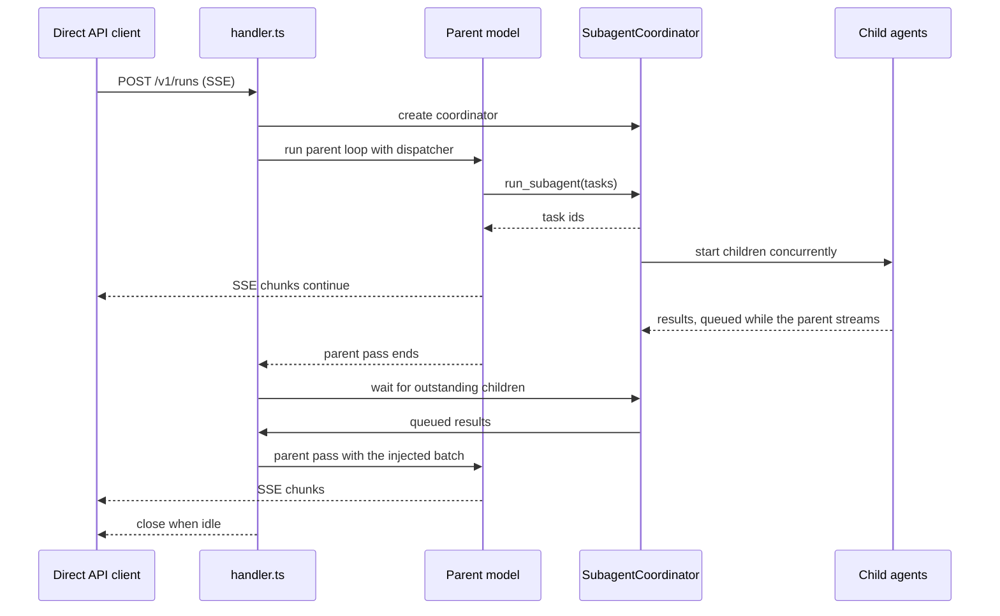
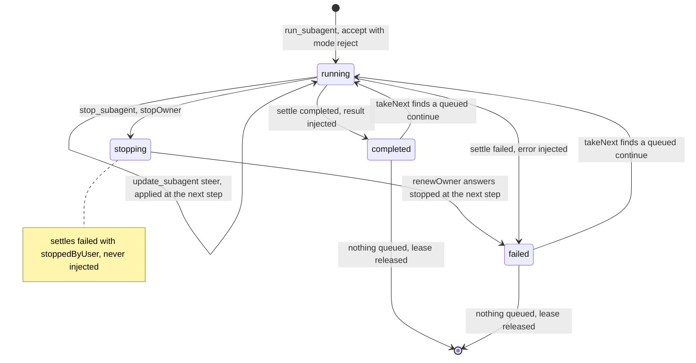
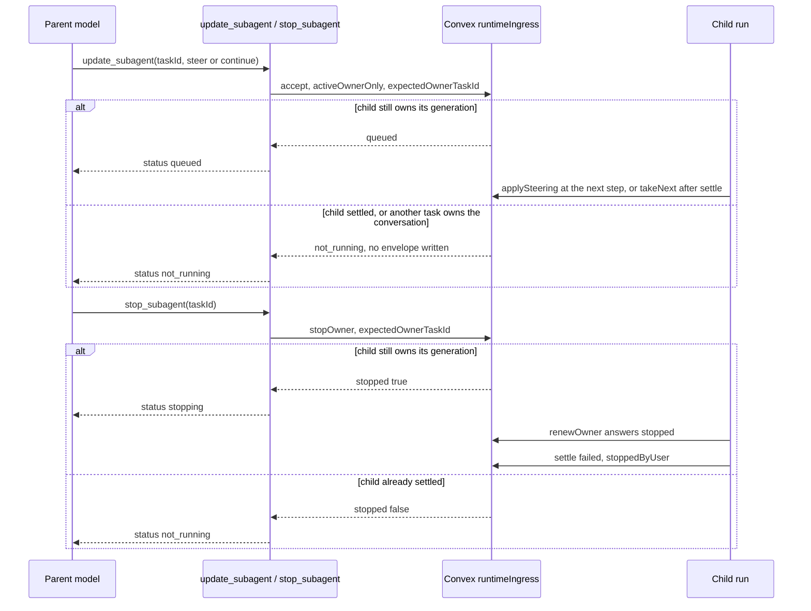
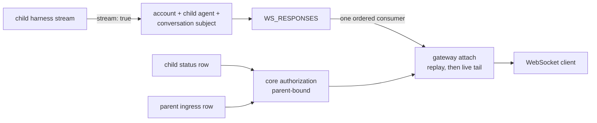

# Subagents

This page covers how subagent runs execute inside core. It explains dispatch, the parent continuation loop, control of a running child, and who may watch a child's live stream. The configuration and model-facing behavior are in the [subagents guide](../guides/subagents.md). Paths are relative to `apps/core/`.

## Execution model

`run_subagent` returns task ids at once and starts the children concurrently. Children are promises inside the same request or worker, not separate processes. The parent's model stream keeps going after the tool result, so the parent can answer, call other tools or finish its pass.

A child result that arrives while the parent model is streaming is queued in memory by the `SubagentCoordinator`. It is not injected into the live model call, because AI SDK model context cannot change mid-generation. When the parent stream ends, `runParentContinuationLoop()` waits for every outstanding child from the current batch, injects the queued results together as parent `user` events, and runs one more parent model pass.

The handoff between parent passes:

- drains queued completions at once when no children are still pending,
- returns `0` when no subagents are pending, so the response can close,
- waits for all outstanding child work when children are still running,
- emits SSE heartbeat comments during waits,
- near the request or worker deadline, injects completed results and timeout notices together so the parent can write a partial continuation.

### Sync SSE

For a sync SSE request, `handler.ts` creates one `SubagentCoordinator` per request and passes its dispatcher into `harness.ts`, which exposes it as the `run_subagent` tool.

If the parent finishes first, the same SSE response stays open. During quiet waits the runtime writes comment lines such as `: waiting for async work pending=2`. SSE clients ignore comments, but the bytes keep idle proxies from closing the stream.

### Async, WebSocket and channels

Background runs, the NATS WebSocket worker and channel requests use the same coordinator loop without SSE heartbeats. They still wait for in-process children, because children run inside the same request or worker. The parent's continuation runs before the async result, WebSocket worker or channel reply settles. `runtimeAsyncAgentResults` still records child task status for polling.

## Context and reasoning

Inherited context (`context: "inherited"`) is passed straight into the child model call and never copied into the child's stored conversation. That keeps one-shot children cheap and avoids storing fake child history.

Reasoning parts are stripped from inherited parent context before the child sees it. After a child result is injected, the next parent pass is rebuilt from persisted state with completed-turn reasoning stripped. A pending tool-approval resume is the exception. That step has not finished, so its tool call, approval request and reasoning are kept for the approval response.

## Persistent children and control

In `persistent` mode each child is admitted through the same conversation coordinator as a top-level run, under a generated key of the form `subagent-persistent-{uuid}`. That is what makes a child stoppable and steerable. There is no subagent-specific control API. Stop, steer and follow-up requests go to the child's `conversationKey` through the normal ingress endpoints, and the model-facing `get_subagent_status`, `update_subagent` and `stop_subagent` tools use the same path.

The lifecycle of one persistent child task, as `SubagentCoordinator` in `src/harness/subagents.ts` drives it:

A busy child conversation makes `accept` answer `rejected`, and `run_subagent` fails with `Subagent conversation is not available`. Past the parent's wait budget, `takeNext` is skipped and the queued turn goes to its own worker (`transferChildConversation`).

- The parent dispatches a child with mode `reject`, so dispatching into a busy child conversation surfaces the conflict instead of stalling.
- Control admission and conversation ownership are decided in one transaction. An update can enter the queue only while the child still owns an active fenced generation. If the child finishes at the same moment, the update creates no ingress envelope and returns `not_running`. A late stop follows the same current-owner rule. Both tools pass the `taskId` as `expectedOwnerTaskId`, so a control never lands on a later task that took over the conversation.

- The control tools accept only tasks created by the calling parent event, so a child cannot control a sibling and one parent cannot control another's child.
- A stopped child settles `failed` with `stoppedByUser`. Its partial progress is not injected into the parent, because it was cancelled on purpose. Genuine failures are still reported.
- A follow-up drained after the child settles runs as another turn of the same task, and its result is injected like the first answer, under the same `subagent.visibility` rules. If the parent's wait budget has already expired, there is no live parent turn to inject into. The envelope runs on its own worker, writes to the child conversation, and is not injected.

Ephemeral children hold no durable conversation and no owner generation, so there is nothing to fence a stop or steer against. That is the main reason `persistent` is the default.

## Live child streaming

With `subagent.stream: true`, every child publishes its reasoning, text, tool, error and structured-output parts through the same NATS path a WebSocket run uses. The subject is built from the authenticated account, the child `agentId` and the child's public conversation key. Publishing is best-effort with the usual 3 minute, 2,000-message retention, and drains after the child status settles. Publish failures never change the durable outcome, and enabling streaming does not change persistence, result injection, visibility, traces, usage or settlement.

A client attaches with the values `run_subagent` returned. `taskId` becomes the attach `eventId`, next to `runId`, `agentId` and `conversationKey`.

### Attach authorization

The gateway protocol is unchanged. What is specific to children is who may attach with a stage runtime key:

- `taskId` is server-issued. It embeds a base64url parent correlation, which is encoding, not encryption, and must never carry confidential data. Core persists the child event before `run_subagent` returns. Public requests cannot use the reserved `subagent~` event namespace.
- A runtime-key status or attach succeeds only when the child status row, the child agent and conversation scope, the durable parent ingress row, the active public parent, and the key's account, project, stage and endpoint all agree. The client never supplies parent scope. A private child, virtual or predefined, can be watched through its authorized public parent without becoming publicly runnable.
- The parent ingress row carries a server-derived public-deployment marker only when it entered through runtime-key HTTP, async or WebSocket ingress. Core compares every field with the authenticated deployment. Account-authenticated runs, channels, cron runs and internal continuations get no attach access from generic endpoint metadata.
- Before opening the NATS consumer, the gateway checks that the status response's conversation key equals the requested one. The event-bound cursor `ws-responses:<generation>:<sequence>:<event-hash>` stops a child cursor from resuming a different task.

Because the child row exists before dispatch and JetStream keeps the earliest frames, a client can attach as soon as it has the ids, even if the child started publishing first. An attach made before the first frame stays open, starts at the next subject sequence and polls durable status alongside. If durable completion or failure arrives without a stream `done`, the gateway waits a short NATS grace period, closes the consumer and emits one synthetic terminal frame. A `done` already received is never duplicated. The durable result at `statusPath` (`/v1/runs/{runId}`) stays the source of truth after JetStream expiry.
